# PALEE Pre-AI Issue Execution & Architecture Plan

**Document Version**: 1.0.0  
**Target Milestone**: Phase 1 Hardening $\rightarrow$ Phase 2 AI Module Gateway  
**Current Date**: 2026-08-17  

---

## Executive Summary

Before introducing the **Phase 2 AI Module** (LLM tool-calling, Socratic tutoring, Feynman assessments, gap analysis), the PALEE core engine and storage layer must be made deterministic, robust, and cleanly abstracted.

Introducing automated AI workflows onto an unstable storage model or a deadlocked dependency graph would compound technical debt and risk vault corruption. This document outlines the rationale, sequencing, and technical scope of all remaining open issues to resolve **before** proceeding with AI provider integration.

```mermaid
flowchart TD
    subgraph P0 ["Phase 0: Core Engine & Data Model Unification"]
        I75["#75: Compute Mastery & Fix Deadlock"]
        I83["#83: Unify Domain Model (loadTopics)"]
        I85["#85: Shared MASTERY_THRESHOLD"]
        I80["#80: Fix Progress Mastery Contract"]
        I84["#84: NaN Date Guards"]
    end

    subgraph P1 ["Phase 1: File-Safety & CLI Contract Hardening"]
        I76["#76: Exit Code 4 for OCC/Lock"]
        I77["#77: Safe process.exitCode Buffering"]
        I78["#78: Centralize validateVaultPath"]
        I86["#86: Lock/Atomic Storage Isolation"]
        I87["#87: Eliminate Review TOCTOU Window"]
        I89["#89: Resilient Roadmap Parsing"]
        I88["#88: Session Timing Persistence"]
        I90["#90: Storage Cache Cleanup"]
        I91["#91: Import Facade Consistency"]
    end

    subgraph P2 ["Phase 2: Graph Robustness & Chaining"]
        I79["#79: 3-Color DFS Cycle Quarantine"]
        I73["#73: Auto-Chaining & Wikilink Resolver"]
        I70["#70: Topic Recommendation Scoring"]
    end

    subgraph P3 ["Phase 3: Vault Validation Framework"]
        I25["#25: Modular Validation Rule Engine"]
        Irules["#26-#45: Critical Validation Rules"]
    end

    subgraph P4 ["Phase 4: AI Gateway & Provider Abstraction"]
        I82["#82: Secure Provider Config Store"]
        I24["#24: Multi-Backend AI Provider Abstraction"]
        I52["#52: Dynamic Difficulty & Gap Detection"]
    end

    P0 --> P1
    P1 --> P2
    P2 --> P3
    P3 --> P4
```



---

## Why These Issues Must Precede the AI Module

1. **The Recommendation Engine Deadlock (Issue #75)**:
   - *Problem*: `topic_mastery` is seeded as `0.0` and never computed. Prerequisite gates require `topic_mastery >= 0.7`. Any topic with dependencies remains locked forever.
   - *AI Impact*: When the AI tutor asks for the next topic or attempts gap analysis, the engine returns an empty list or deadlocks progression.
2. **Data-Model Split-Brain (Issue #83)**:
   - *Problem*: 9 different CLI handlers copy-paste vault traversal and raw frontmatter extraction logic.
   - *AI Impact*: AI tools need a unified, typed `loadTopics(vaultPath)` interface. Without it, every AI tool invocation duplicates file parsing and risks schema drift.
3. **Storage Concurrency & Vault Boundary Safety (Issues #76, #78, #86, #87)**:
   - *Problem*: Session deletions bypass locks, review writes have TOCTOU windows, and non-existent vault paths surface as generic runtime crashes.
   - *AI Impact*: AI multi-step agentic loops write draft checkpoints and update notes automatically. Unhardened file I/O causes race conditions with Obsidian/Git.
4. **Graph Resiliency & Multi-Cycle Quarantine (Issue #79)**:
   - *Problem*: A single circular dependency anywhere in the vault causes `detectCycle` to fail the entire graph.
   - *AI Impact*: AI cannot generate learning paths if an isolated circular link in an unrelated folder blocks the whole vault.

---

## Detailed Execution Breakdown

### Phase 0: Core Engine & Data Model Unification (P0 — Immediate Blockers)

| Issue | Title | Severity | Technical Scope |
| :--- | :--- | :--- | :--- |
| **[#75](https://github.com/Kuldeep2822k/cli/issues/75)** | **Compute topic mastery & resolve recommendation deadlock** | **Critical (P1)** | 1. Implement `computeTopicMastery(c, p, d, f)` in `src/engine/mastery.ts`.<br/>2. Allow `review` or manual rating to raise assessment pillars.<br/>3. Recompute `topic_mastery` on note update so prerequisite gates (`>= 0.7`) unlock ready topics. |
| **[#83](https://github.com/Kuldeep2822k/cli/issues/83)** | **Unify domain model & centralize `loadTopics()` boundary** | **High** | 1. Standardize on canonical flat `Topic` model matching `palee_schema: 1`.<br/>2. Create single `loadTopics(vaultPath)` in `src/storage` to eliminate copy-pasted scan loops across 9 handlers. |
| **[#85](https://github.com/Kuldeep2822k/cli/issues/85)** | **Extract shared `MASTERY_THRESHOLD` constant** | **Medium** | Define `export const MASTERY_THRESHOLD = 0.7;` in `src/engine` and replace all literal `0.7` occurrences across CLI handlers. |
| **[#80](https://github.com/Kuldeep2822k/cli/issues/80)** | **Fix `progress` mastery status & archived topic filtering** | **High** | 1. Exclude `status: archived` topics from global mean calculations.<br/>2. Emit `global_mastery: null` and `mastery_status: "no_data"` when 0 active topics exist. |
| **[#84](https://github.com/Kuldeep2822k/cli/issues/84)** | **Date parsing NaN guard hardening** | **Medium** | Add `Number.isNaN(d.getTime())` guards in `src/cli/progress.ts` before formatting dates to prevent `RangeError` exit 5 on corrupt date strings. |

---

### Phase 1: File-Safety, Concurrency & CLI Contract Hardening

| Issue | Title | Severity | Technical Scope |
| :--- | :--- | :--- | :--- |
| **[#76](https://github.com/Kuldeep2822k/cli/issues/76)** | **Emit Exit Code 4 for OCC / Lock conflicts** | **High** | Inspect error types in CLI catch handlers (`OCC conflict`, `ECONFLICT`) and set `process.exitCode = 4; return;`. |
| **[#77](https://github.com/Kuldeep2822k/cli/issues/77)** | **Replace `process.exit()` with `process.exitCode = N; return;`** | **High** | Refactor all command handlers (`config`, `dashboard`, `next`, `plan`, `progress`, `review`, `roadmap`, `migrate`) to use exit codes and natural stream flushing. |
| **[#78](https://github.com/Kuldeep2822k/cli/issues/78)** | **Route all reading handlers through `validateVaultPath`** | **High** | Ensure `adopt`, `review`, `roadmap`, and `migrate` validate vault existence and permissions early, emitting code 2 instead of crashing with exit 5. |
| **[#86](https://github.com/Kuldeep2822k/cli/issues/86)** | **Route raw FS writes in `session`/`roadmap` through Storage** | **Medium** | Wrap session file unlinks (`hot.md`, drafts) and roadmap directory creations in storage helpers with lock protection. |
| **[#87](https://github.com/Kuldeep2822k/cli/issues/87)** | **Eliminate TOCTOU window in `review.ts` writes** | **Medium** | Re-read note content and compute fresh fingerprint immediately before `atomicWrite` in `review.ts` (matching `adopt.ts`). |
| **[#89](https://github.com/Kuldeep2822k/cli/issues/89)** | **Resilient per-topic frontmatter parsing in `roadmap`** | **Medium** | Wrap per-topic parsing in `try/catch` so a single malformed note increments `failed++` and yields exit 1, rather than aborting the entire batch. |
| **[#88](https://github.com/Kuldeep2822k/cli/issues/88)** | **Persist real session timestamps in `session.ts`** | **Medium** | Record `started_at` in draft checkpoints or hot memory so `session end` calculates true duration instead of setting `started_at == ended_at`. |
| **[#90](https://github.com/Kuldeep2822k/cli/issues/90)** | **Storage cache cleanup & test leak removal** | **Low** | Clean up unused `FileCache` stub and remove `process.env.NODE_ENV` test-awareness leaks. |
| **[#91](https://github.com/Kuldeep2822k/cli/issues/91)** | **Import facade & presentation consistency** | **Low** | Standardize storage imports through `src/storage/index.ts` and unify mastery display formatting. |

---

### Phase 2: Graph Engine Robustness & Auto-Chaining

| Issue | Title | Severity | Technical Scope |
| :--- | :--- | :--- | :--- |
| **[#79](https://github.com/Kuldeep2822k/cli/issues/79)** | **3-Color DFS multi-cycle quarantine & deterministic ordering** | **High** | 1. Upgrade `detectCycle` to 3-color DFS (`WHITE`, `GRAY`, `BLACK`) returning all cycle loops.<br/>2. Quarantine cyclic subgraphs while allowing independent acyclic components to remain study-ready.<br/>3. Return `getReadyTopics` in deterministic topological/alphabetical order. |
| **[#73](https://github.com/Kuldeep2822k/cli/issues/73)** | **Hierarchical auto-chaining (`--auto-chain`) & wikilink graph resolver** | **P2 (Minor)** | 1. Add `--auto-chain` flag to `palee adopt` for sequential numerical/lexicographical dependency wiring.<br/>2. Implement Obsidian `[[Wikilink]]` extraction to auto-populate `depends_on` from note links. |
| **[#70](https://github.com/Kuldeep2822k/cli/issues/70)** | **Dependency-aware topic recommendation scoring algorithm** | **Medium** | Implement unlock potential scoring (inverse dependency graph degree) to prioritize bottleneck topics in `next` and `plan`. |

---

### Phase 3: Vault Validation Framework & Rule Backlog

| Issue | Title | Severity | Technical Scope |
| :--- | :--- | :--- | :--- |
| **[#25](https://github.com/Kuldeep2822k/cli/issues/25)** | **Modular validation rule engine & runner architecture** | **High (Major)** | Implement extensible plugin-style rule framework with severity levels (`error`, `warning`), context passing, and structured JSON output. |
| **[#26–#45](https://github.com/Kuldeep2822k/cli/issues/25)** | **Rule Backlog Implementation** | **Critical to Med** | - `#30`: `no-duplicate-topic-id` (Critical)<br/>- `#35`: `no-dependency-cycle` (Critical)<br/>- `#38`: `valid-review-fields` (Critical)<br/>- `#45`: `safe-vault-paths` (Critical)<br/>- `#34`: `no-missing-dependency`<br/>- `#28`: `valid-palee-schema`<br/>- `#41`: `valid-session-schema` |

---

### Phase 4: AI Gateway & Provider Abstraction (Phase 2 Entry)

| Issue | Title | Severity | Technical Scope |
| :--- | :--- | :--- | :--- |
| **[#82](https://github.com/Kuldeep2822k/cli/issues/82)** | **Secure provider credential store in config** | **High** | Extend `PaleeConfig` with `baseUrl`, `apiKey`, and `model` fields; ensure `config show` masks secrets. |
| **[#24](https://github.com/Kuldeep2822k/cli/issues/24)** | **Multi-backend AI provider abstraction layer** | **High** | Define `AIProvider` interface supporting OpenAI, Anthropic, Ollama, and local servers with unified tool-calling. |
| **[#52](https://github.com/Kuldeep2822k/cli/issues/52)** | **Dynamic difficulty calibration & prerequisite gap detection** | **Medium** | Implement assessment heuristic feedback loops during active study sessions. |

---

## Recommended Sequence of Work

```
Step 1: Phase 0 (Engine & Domain Unification) -> Issues #75, #83, #85, #80, #84
Step 2: Phase 1 (File Safety & Exit Contracts) -> Issues #76, #77, #78, #86, #87, #89, #88
Step 3: Phase 2 (Graph Robustness & Chaining) -> Issues #79, #73, #70
Step 4: Phase 3 (Validation Rule Engine)       -> Issues #25, #30, #35, #38, #45
Step 5: Phase 4 (AI Module Entry)              -> Issues #82, #24, #52
```

This sequence guarantees that the AI module is built upon a mathematically sound, race-free, and dependency-verified knowledge engine.
