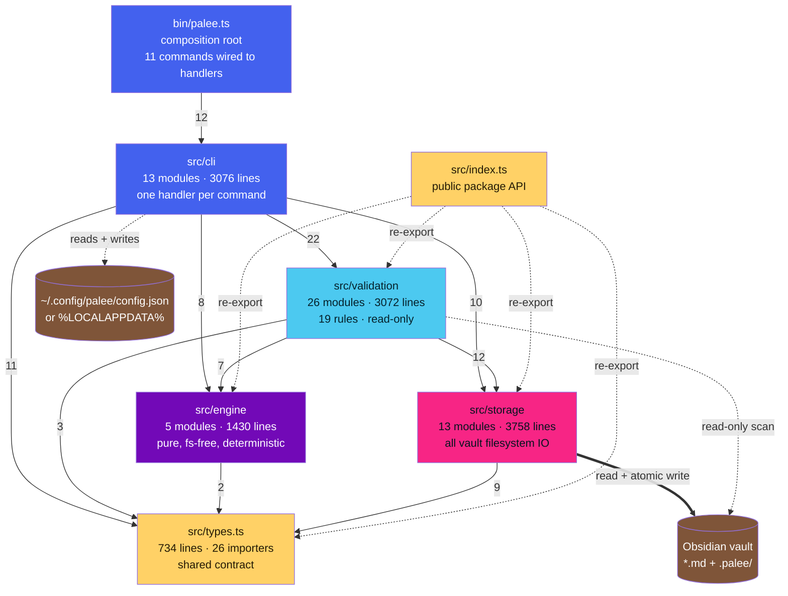
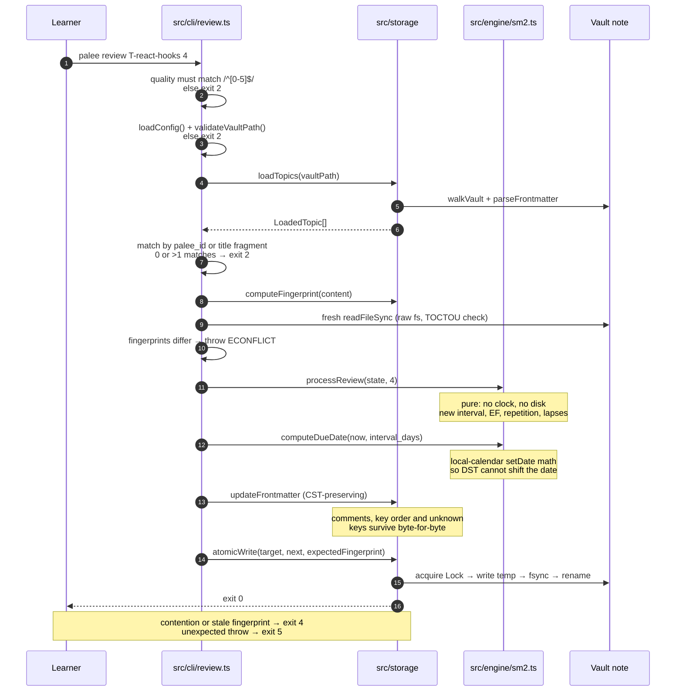

# PALEE in plain terms — an explainer for people who will change it or review it

**Route:** `architecture-visualization` → `architecture-communicator`.
**Audience:** (a) a new contributor or AI agent about to edit this repo, (b) a reviewer or coursework assessor who needs to judge the design without reading 60 TypeScript files.
**Purpose:** explain the architecture in the order the risks appear, not in the order the folders are named.
**Verified against:** the code at `d4e02a4` (v0.5.2), 2026-09-22. Companion technical views: [`01-architecture-model.md`](01-architecture-model.md), [`02-dependency-impact.md`](02-dependency-impact.md), [`03-docs-audit-findings.md`](03-docs-audit-findings.md).

The Mermaid blocks here are Markdown-native and render in the existing VitePress site (`vitepress-plugin-mermaid` is already configured), so they can be lifted straight into `docs/`.

---

## 1. What it is, in three sentences

PALEE turns an Obsidian vault into a spaced-repetition study system. Each Markdown note the learner "adopts" carries a small block of YAML frontmatter holding a topic ID, its prerequisites, a mastery score, and an SM-2 review schedule; PALEE reads that frontmatter, does the scheduling maths, and writes it back atomically. There is no database, no server, no account, and in Phase 1 no network at all — the learner's own notes are the database, and they stay readable in Obsidian between runs.

That one sentence — *the files are the database* — explains most of the design.

## 2. The two ideas the whole design rests on

**Idea 1: separate the maths from the disk.** Scheduling and graph reasoning are pure functions with no clock, no randomness, and no filesystem; everything that touches the disk lives in one layer. This is why the riskiest logic in the project is testable with 15 unit tests and no fixtures, and it is measurable: `src/engine` is 5 modules, 1430 lines, and imports nothing but `src/types.ts`.

**Idea 2: assume something else is editing the files.** Because the user, Obsidian, a sync client and a second `palee` process can all touch the same note, every write is fingerprint-checked (SHA-256 of prior content), lock-serialised (an atomic `mkdir` under `.palee/locks/`), and applied by writing a temp file and renaming it. If the file changed under you, the write aborts and the process exits `4` instead of silently overwriting.

Everything else in the codebase is a consequence of one of those two.

## 3. The shape of the code

Six groups, and the arrows are the real import edges between them (numbers = import edges; this diagram is generated from the code, not hand-drawn — see `layer-summary.dot`).

**Nothing points upward.** `engine`, `storage` and `validation` never import `cli`. There are **no circular imports** anywhere. Both facts are verified mechanically, not asserted.

## 4. What one command actually does — `palee review T-react-hooks 4`

This is the flow that carries all the risk, because it is the one that writes to the learner's notes.

Two things worth noticing in that sequence:

The **engine is asked a question and never told to remember anything** — `review.ts` owns the timestamps, the engine owns the arithmetic. That split is deliberate and is the reason the SM-2 invariants are pinned by ordinary unit tests.

And the **fingerprint is taken twice** — once when the topic was loaded, once immediately before the write — because the whole point is the gap in between, where Obsidian or a sync client might have edited the note.

## 5. The vocabulary, mapped to the code

| Domain term | Where it lives | The one thing to know |
| --- | --- | --- |
| Topic | a `*.md` note with `palee_id` in frontmatter | the note is the record; PALEE never copies it elsewhere |
| Track / difficulty | `Difficulty` in `src/types.ts:66` | `beginner`/`intermediate`/`advanced`; `normalizeDifficulty` accepts `1`–`5` and messy strings |
| Review schedule | `src/engine/sm2.ts` | SM-2: interval 1 → 6 → `round(prev × EF)`, EF floor 1.3, and **lapses only increment if the topic was previously learned** |
| Mastery | `src/engine/mastery.ts` | `round((c + p + d + 2f) / 5, 4)`; feynman is double-weighted; threshold `MASTERY_THRESHOLD = 0.7` |
| Prerequisites | `src/engine/dependency.ts` | a topic is *ready* when every prerequisite has mastery ≥ 0.7 and nothing is missing |
| Cycle | same | quarantined, not fatal: acyclic topics keep working and the exact loop path is reported |
| Session / draft | `.palee/sessions/` | `S-*.md` are canonical history; `DRAFT-S-*` are crash checkpoints |
| Hot memory | `.palee/hot.md` | a **derived**, ≤250-word "where was I" view — safe to rebuild, never a source of truth |
| Validation rule | `src/validation/rules/*` | 19 rules, 11 error-default and 8 warning-default, run in a fixed deterministic order |

## 6. What a reviewer should look at first

Five properties are the project's actual quality signal, and each is checkable rather than arguable:

1. **Zero circular imports, zero upward imports.** `node scripts/arch-import-graph.cjs`.
2. **Exit codes are a contract, not logging.** 0 success, 1 partial import failure, 2 usage/config, 3 validation, 4 OCC conflict, 5 unexpected — and CI asserts on them, so changing one is a breaking change.
3. **A hand-edited note never loses formatting.** `updateFrontmatter` mutates a YAML CST, so comments, key order and unknown plugin keys survive; malformed frontmatter throws rather than rewriting.
4. **A crash leaves the vault consistent.** Temp-file-plus-rename plus `fsync`, a lock that survives a killed process (quarantine-rename stale recovery), and zero-byte session files dropped on rebuild.
5. **Phase 1 is provably offline.** No `http`/`https`/`net`/`dns` import anywhere in `src` or `bin`; only `commander` and `yaml` at runtime, and a CI job that fails if a native module sneaks in.

## 7. Honest limitations, and where the docs mislead

The design holds up. The **documentation about the design** is where the problems are, and a reviewer should know which statements are stale before trusting them:

- The `agent.md` brief still describes `detectCycle` as a **3-color DFS**. The implementation moved to iterative Tarjan SCC + Johnson-style enumeration (issue #79); the docs pages that describe `visiting`/`pathStack` — including a pasted code block presented as `src/engine/dependency.ts` — describe code that no longer exists. `docs/02-3` is the page that got it right.
- `agent.md` claims `session end` is a Phase-1 stub. It is implemented (`duration_minutes`, `ended_at`, draft cleanup).
- `agent.md` says "no raw `fs` outside storage". Seven `src/cli` modules import `fs`; the one that actually mutates is `src/cli/config.ts`, writing the config file (not the vault). The narrow rule — all vault writes go through `atomicWrite` — does hold.
- `agent.md` enumerates "four layers" and never names `src/validation`, which is the biggest module tree in the repo; `docs/01-2` instead says "three layers" and diagrams a `SM2` class, a `DependencyGraph` class and functions (`computeNextState`, `recordReview`, `get_progress`) that do not exist in the code.
- `docs/05-0/05-1/05-2` cite `src/types.ts` symbols by line number, and those line numbers are wrong by dozens to hundreds of lines, three different ways for the same symbol.

None of these are runtime bugs. All of them are traps for the next person — especially an AI agent, which is told to read `agent.md` first. The full list with evidence and severity is in [`03-docs-audit-findings.md`](03-docs-audit-findings.md); the recommended fix is a CI check that re-verifies the claims, sketched at the end of that file.

Separately, README advertises `palee test`, `palee tutor`, an AI roadmap interview and `config set-provider` with `api_key`. Those are **intentional Phase-2 forward declarations**, documented as such in `planning/PHASE_2_GAPS.md`, and should not be counted as defects.

## 8. If you are about to make a change

| You want to… | Touch | Do not touch | Verification |
| --- | --- | --- | --- |
| change scheduling maths | `src/engine/sm2.ts` | the timestamp writes in `review.ts` | `npm run test:unit`, and re-read the frozen EF-delta formula in `agent.md:35` first |
| add a validation rule | one file in `src/validation/rules/` + the registry in `src/cli/validate.ts` + the barrel | the rule order, without meaning to change output order | `test/validation-barrel-census.test.ts` fails on a count change |
| write to the vault | call `atomicWrite` with `expectedFingerprint` | `fs.writeFileSync` | `test/storage-atomic-write.test.ts`, `test/stress-concurrency.test.ts` |
| add a CLI flag | handler in `src/cli/<name>.ts` + `.command()` block in `bin/palee.ts` + an `*Options` type | raw `fs` in the handler | `npm run test:fast` |
| change an exit code | — | this is a breaking change; README and CI both assert codes | update `README` + `agent.md:24` + `docs/02-0` in the same commit |

`npm run typecheck` is the real quality gate in this repo (strict `tsc --noEmit`); lint is mostly hygiene with one hard rule — zero `any` casts in `src/`.
