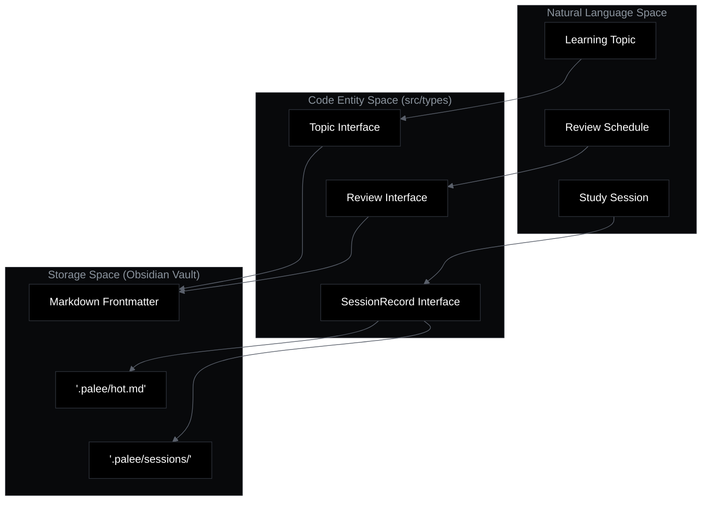
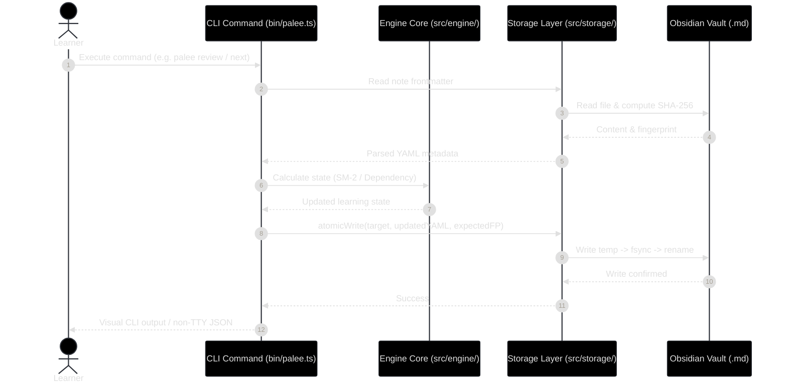

# Overview
Relevant source files

- [README.md](https://github.com/Kuldeep2822k/cli/blob/e8b70e0d/README.md?plain=1)
- [bin/palee.ts](https://github.com/Kuldeep2822k/cli/blob/e8b70e0d/bin/palee.ts)
- [package.json](https://github.com/Kuldeep2822k/cli/blob/e8b70e0d/package.json)
- [planning/palee_cli_spec.md](https://github.com/Kuldeep2822k/cli/blob/e8b70e0d/planning/palee_cli_spec.md?plain=1)
- [src/index.ts](https://github.com/Kuldeep2822k/cli/blob/e8b70e0d/src/index.ts)

The Personal Active Learning & Evaluation Engine (PALEE) is a smart, AI-powered study tracker designed to optimize learning through a deterministic core of spaced repetition and dependency-aware recommendations. It integrates natively with Obsidian vaults, treating Markdown files as the canonical source of truth for both learning content and progress metadata.

PALEE bridges the gap between static notes and active learning by providing a structured engine that calculates what you should study next, while offering an optional AI layer for interactive tutoring and Feynman-style testing.

## Core Philosophy

PALEE is built on three architectural pillars [README.md#184-189](https://github.com/Kuldeep2822k/cli/blob/e8b70e0d/README.md?plain=1#L184-L189):

1. Deterministic Core: Reliable scheduling using the SM-2 algorithm and strict dependency graph tracking.
2. AI Augmentation: Intelligent tutoring and assessment constrained to validated, read-only context tools.
3. Human Oversight: A "Human Confirm Gate" ensures that no consequential state changes (like updating mastery scores) occur without explicit user approval [planning/palee_cli_spec.md#107-112](https://github.com/Kuldeep2822k/cli/blob/e8b70e0d/planning/palee_cli_spec.md?plain=1#L107-L112)

## System Architecture

The system is organized into three distinct layers to ensure data integrity and separation of concerns [planning/palee_cli_spec.md#23-64](https://github.com/Kuldeep2822k/cli/blob/e8b70e0d/planning/palee_cli_spec.md?plain=1#L23-L64)

### 1. Storage Layer (The Vault)

The Obsidian vault is the single source of truth. PALEE stores metadata in YAML frontmatter within individual topic notes and manages session history in a hidden `.palee/` directory [README.md#164-171](https://github.com/Kuldeep2822k/cli/blob/e8b70e0d/README.md?plain=1#L164-L171)

- Topic Notes: Contain `palee_id`, mastery scores, and SM-2 state [README.md#136-158](https://github.com/Kuldeep2822k/cli/blob/e8b70e0d/README.md?plain=1#L136-L158)
- Session Memory: Includes `hot.md` (a 250-word working memory cap) and durable session logs [README.md#164-173](https://github.com/Kuldeep2822k/cli/blob/e8b70e0d/README.md?plain=1#L164-L173)

### 2. Engine Core

A pure-function library responsible for the logic of learning. It handles:

- SM-2 Algorithm: Calculating review intervals and ease factors [planning/palee_cli_spec.md#41](https://github.com/Kuldeep2822k/cli/blob/e8b70e0d/planning/palee_cli_spec.md?plain=1#L41-L41)
- Dependency Graph: Managing prerequisites and detecting cycles [planning/palee_cli_spec.md#42](https://github.com/Kuldeep2822k/cli/blob/e8b70e0d/planning/palee_cli_spec.md?plain=1#L42-L42)
- Mastery Calculation: Deriving overall mastery from conceptual, practical, debug, and Feynman scores [README.md#162](https://github.com/Kuldeep2822k/cli/blob/e8b70e0d/README.md?plain=1#L162-L162)

### 3. Interface Layer (CLI & Tools)

The command-line interface provides the primary way to interact with the engine. It includes commands for adoption, planning, reviewing, and session management [bin/palee.ts#12-22](https://github.com/Kuldeep2822k/cli/blob/e8b70e0d/bin/palee.ts#L12-L22)

### System Component Mapping

The following diagram illustrates how Natural Language concepts map to specific code entities and storage structures.

#### Entity Relationship Diagram: Logic to Code Mapping

Sources: [src/types.ts#1-100](https://github.com/Kuldeep2822k/cli/blob/e8b70e0d/src/types.ts#L1-L100)[README.md#136-173](https://github.com/Kuldeep2822k/cli/blob/e8b70e0d/README.md?plain=1#L136-L173)[planning/palee_cli_spec.md#25-37](https://github.com/Kuldeep2822k/cli/blob/e8b70e0d/planning/palee_cli_spec.md?plain=1#L25-L37)

## Navigation and Learning Paths

To explore the PALEE codebase and documentation, follow these paths:

### Setup and Usage

- [Getting Started](./01-1-getting-started.md): Learn how to install the `@kuldeep2822k/palee` package via NPM [package.json#2-3](https://github.com/Kuldeep2822k/cli/blob/e8b70e0d/package.json#L2-L3) configure your vault path using `palee config set-vault`[README.md#24](https://github.com/Kuldeep2822k/cli/blob/e8b70e0d/README.md?plain=1#L24-L24) and set up AI providers [README.md#29](https://github.com/Kuldeep2822k/cli/blob/e8b70e0d/README.md?plain=1#L29-L29)

### Technical Deep Dives

- [Architecture Overview](./01-2-architecture-overview.md): A detailed look at the three-layer architecture, the file-safety contract (atomic writes and locking), and the "Obsidian-Native" storage strategy [planning/palee_cli_spec.md#18-37](https://github.com/Kuldeep2822k/cli/blob/e8b70e0d/planning/palee_cli_spec.md?plain=1#L18-L37)
- CLI Commands: Comprehensive reference for commands like `palee next`[bin/palee.ts#48](https://github.com/Kuldeep2822k/cli/blob/e8b70e0d/bin/palee.ts#L48-L48)`palee plan`[bin/palee.ts#55](https://github.com/Kuldeep2822k/cli/blob/e8b70e0d/bin/palee.ts#L55-L55) and `palee session`[bin/palee.ts#101](https://github.com/Kuldeep2822k/cli/blob/e8b70e0d/bin/palee.ts#L101-L101)

### Implementation Details

The system's behavior is governed by specific modules:

- Scheduling: Logic residing in the SM-2 engine.
- Validation: Vault integrity checks handled by the `validate` command [bin/palee.ts#79](https://github.com/Kuldeep2822k/cli/blob/e8b70e0d/bin/palee.ts#L79-L79)
- Safety: Atomic write operations and optimistic concurrency control (OCC) [planning/palee_cli_spec.md#32-34](https://github.com/Kuldeep2822k/cli/blob/e8b70e0d/planning/palee_cli_spec.md?plain=1#L32-L34)

#### Data Flow: Command to Storage

Sources: [bin/palee.ts#69-75](https://github.com/Kuldeep2822k/cli/blob/e8b70e0d/bin/palee.ts#L69-L75)[planning/palee_cli_spec.md#50-57](https://github.com/Kuldeep2822k/cli/blob/e8b70e0d/planning/palee_cli_spec.md?plain=1#L50-L57)[README.md#190-197](https://github.com/Kuldeep2822k/cli/blob/e8b70e0d/README.md?plain=1#L190-L197)