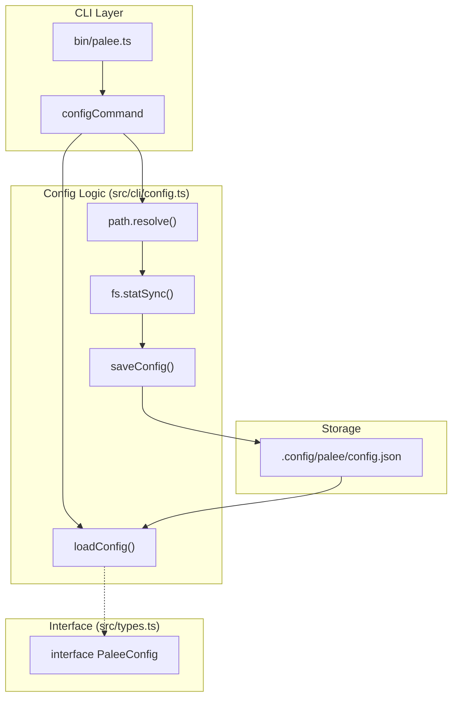
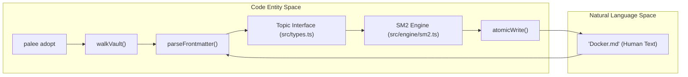

# Getting Started
Relevant source files

- [README.md](https://github.com/Kuldeep2822k/cli/blob/main/README.md?plain=1)
- [planning/example_workflows.md](https://github.com/Kuldeep2822k/cli/blob/main/planning/example_workflows.md?plain=1)
- [planning/palee_cli_spec.md](https://github.com/Kuldeep2822k/cli/blob/main/planning/palee_cli_spec.md?plain=1)
- [src/cli/config.ts](https://github.com/Kuldeep2822k/cli/blob/main/src/cli/config.ts)
- [src/cli/review.ts](https://github.com/Kuldeep2822k/cli/blob/main/src/cli/review.ts)
- [test/cli-commands.test.ts](https://github.com/Kuldeep2822k/cli/blob/main/test/cli-commands.test.ts)

This page provides a technical guide for installing and configuring PALEE (Personal Active Learning & Evaluation Engine). It covers the global installation process, vault connection, and the configuration of AI providers.

## Installation

PALEE is distributed as a global npm package. It requires Node.js ≥ 22[planning/palee_cli_spec.md#9-14](https://github.com/Kuldeep2822k/cli/blob/main/planning/palee_cli_spec.md?plain=1#L9-L14)

```
npm install -g @kuldeep2822k/palee
```

Upon installation, the `palee` binary becomes available. The CLI uses standard exit codes for scripting: `0` for success, `2` for usage errors, and `4` for optimistic concurrency conflicts [README.md#190-198](https://github.com/Kuldeep2822k/cli/blob/main/README.md?plain=1#L190-L198)

Sources:[README.md#17-20](https://github.com/Kuldeep2822k/cli/blob/main/README.md?plain=1#L17-L20)[planning/palee_cli_spec.md#9-14](https://github.com/Kuldeep2822k/cli/blob/main/planning/palee_cli_spec.md?plain=1#L9-L14)[planning/palee_cli_spec.md#83](https://github.com/Kuldeep2822k/cli/blob/main/planning/palee_cli_spec.md?plain=1#L83-L83)

---

## Initial Configuration

PALEE requires a connection to an Obsidian vault to function, as the vault serves as the canonical source of truth [planning/palee_cli_spec.md#26-27](https://github.com/Kuldeep2822k/cli/blob/main/planning/palee_cli_spec.md?plain=1#L26-L27)

### 1. Connecting a Vault

The `palee config set-vault <path>` command validates that the provided path exists and is a directory before saving it to the global configuration [src/cli/config.ts#63-84](https://github.com/Kuldeep2822k/cli/blob/main/src/cli/config.ts#L63-L84)

```
palee config set-vault ~/Documents/Obsidian/Learning
```

### 2. AI Provider Setup (Optional)

While PALEE's core engine is deterministic, advanced features like Feynman testing require an OpenAI-compatible API endpoint [README.md#27-33](https://github.com/Kuldeep2822k/cli/blob/main/README.md?plain=1#L27-L33)

```
palee config set-provider "https://opencode.ai/zen/v1"
palee config set-model "nemotron-3-ultra-free"
# API Key is prompted or set via environment variables
```

### 3. Verifying Configuration

Use `palee config show` to view the active configuration. For security, the `api_key` is never printed to the console [src/cli/config.ts#54-61](https://github.com/Kuldeep2822k/cli/blob/main/src/cli/config.ts#L54-L61)

Sources:[src/cli/config.ts#52-121](https://github.com/Kuldeep2822k/cli/blob/main/src/cli/config.ts#L52-L121)[README.md#22-33](https://github.com/Kuldeep2822k/cli/blob/main/README.md?plain=1#L22-L33)[planning/palee_cli_spec.md#77-79](https://github.com/Kuldeep2822k/cli/blob/main/planning/palee_cli_spec.md?plain=1#L77-L79)

---

## Configuration Data Flow

The configuration is managed by the `configCommand` handler and persisted in a platform-specific `config.json` file.

### Configuration Persistence Mapping

| Platform | Path |
| --- | --- |
| Windows | `%LOCALAPPDATA%\palee\config.json` |
| Unix/macOS | `~/.config/palee/config.json` |
| Override | `process.env.PALEE_CONFIG_DIR` |

Sources:[src/cli/config.ts#11-25](https://github.com/Kuldeep2822k/cli/blob/main/src/cli/config.ts#L11-L25)[README.md#199-203](https://github.com/Kuldeep2822k/cli/blob/main/README.md?plain=1#L199-L203)

### Implementation Diagram: Configuration Logic

This diagram traces how `configCommand` interacts with the `PaleeConfig` interface and the file system.



Sources:[src/cli/config.ts#52-121](https://github.com/Kuldeep2822k/cli/blob/main/src/cli/config.ts#L52-L121)[src/cli/config.ts#9](https://github.com/Kuldeep2822k/cli/blob/main/src/cli/config.ts#L9-L9)[src/types.ts#1-20](https://github.com/Kuldeep2822k/cli/blob/main/src/types.ts#L1-L20)

---

## Adopting Your First Topic

Once configured, you must "adopt" existing Markdown files into the PALEE system. This process injects the necessary YAML frontmatter without destroying existing note content [planning/palee_cli_spec.md#32-33](https://github.com/Kuldeep2822k/cli/blob/main/planning/palee_cli_spec.md?plain=1#L32-L33)

```
palee adopt "Docker Fundamentals.md" --difficulty beginner
```

### The Adoption Process

1. Path Validation: The CLI ensures the file is within the configured vault and prevents path traversal [test/cli-commands.test.ts#66-72](https://github.com/Kuldeep2822k/cli/blob/main/test/cli-commands.test.ts#L66-L72)
2. Frontmatter Injection: The `updateFrontmatter` utility adds `palee_id`, `palee_schema`, and initial SM-2 metrics (e.g., `ease_factor: 2.5`) [src/cli/review.ts#90-93](https://github.com/Kuldeep2822k/cli/blob/main/src/cli/review.ts#L90-L93)[planning/example_workflows.md#27-50](https://github.com/Kuldeep2822k/cli/blob/main/planning/example_workflows.md?plain=1#L27-L50)
3. Atomic Write: The system uses `atomicWrite` with a SHA-256 fingerprint check to prevent overwriting concurrent manual edits in Obsidian [src/cli/review.ts#91-93](https://github.com/Kuldeep2822k/cli/blob/main/src/cli/review.ts#L91-L93)

### Data Entity Relationship: CLI to Topic

This diagram shows how a CLI command transforms a standard Markdown file into a PALEE `Topic` entity.



Sources:[src/cli/review.ts#38-54](https://github.com/Kuldeep2822k/cli/blob/main/src/cli/review.ts#L38-L54)[src/cli/review.ts#80-93](https://github.com/Kuldeep2822k/cli/blob/main/src/cli/review.ts#L80-L93)[src/storage/frontmatter.ts#1-50](https://github.com/Kuldeep2822k/cli/blob/main/src/storage/frontmatter.ts#L1-L50)[src/storage/atomic-write.ts#1-30](https://github.com/Kuldeep2822k/cli/blob/main/src/storage/atomic-write.ts#L1-L30)

---

## Summary of First Commands

| Command | Technical Action | Source |
| --- | --- | --- |
| `palee next` | Calculates the highest priority topic based on SM-2 `due_at` and dependency readiness. | [README.md#100](https://github.com/Kuldeep2822k/cli/blob/main/README.md?plain=1#L100-L100) |
| `palee plan` | Aggregates a list of topics, filtering for satisfied prerequisites via `areDependenciesSatisfied`. | [README.md#101](https://github.com/Kuldeep2822k/cli/blob/main/README.md?plain=1#L101-L101) |
| `palee progress` | Scans the vault via `walkVault` and aggregates `topic_mastery` across all tracks. | [README.md#102](https://github.com/Kuldeep2822k/cli/blob/main/README.md?plain=1#L102-L102) |
| `palee dashboard` | Provides a high-level summary of vault health, including total topics and due reviews. | [test/cli-commands.test.ts#166-173](https://github.com/Kuldeep2822k/cli/blob/main/test/cli-commands.test.ts#L166-L173) |

Sources:[README.md#96-116](https://github.com/Kuldeep2822k/cli/blob/main/README.md?plain=1#L96-L116)[test/cli-commands.test.ts#166-188](https://github.com/Kuldeep2822k/cli/blob/main/test/cli-commands.test.ts#L166-L188)[src/cli/review.ts#22-113](https://github.com/Kuldeep2822k/cli/blob/main/src/cli/review.ts#L22-L113)