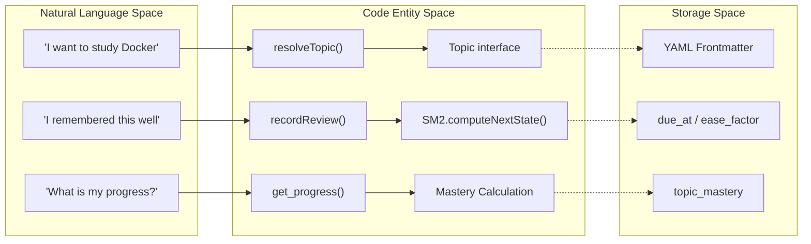
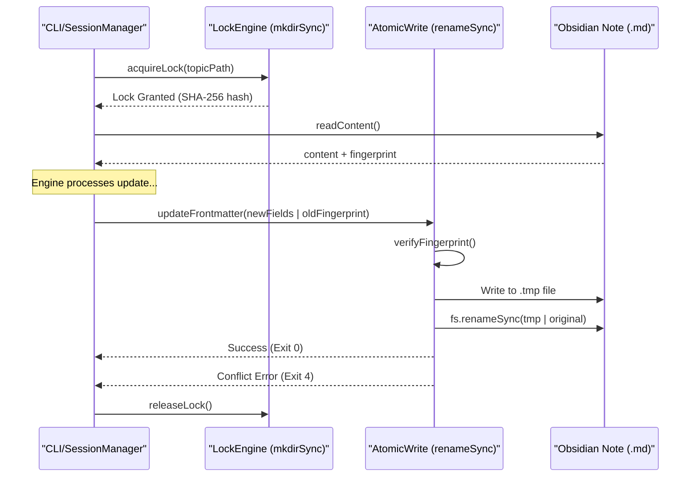

# Architecture Overview
Relevant source files

- [README.md](https://github.com/Kuldeep2822k/cli/blob/main/README.md?plain=1)
- [package.json](https://github.com/Kuldeep2822k/cli/blob/main/package.json)
- [planning/PHASE_1_ISSUES.md](https://github.com/Kuldeep2822k/cli/blob/main/planning/PHASE_1_ISSUES.md?plain=1)
- [planning/PHASE_2_GAPS.md](https://github.com/Kuldeep2822k/cli/blob/main/planning/PHASE_2_GAPS.md?plain=1)
- [planning/TRIGGER_TRACKER.md](https://github.com/Kuldeep2822k/cli/blob/main/planning/TRIGGER_TRACKER.md?plain=1)
- [planning/VALIDATION_FRAMEWORK_VERDICT.md](https://github.com/Kuldeep2822k/cli/blob/main/planning/VALIDATION_FRAMEWORK_VERDICT.md?plain=1)
- [planning/palee_cli_spec.md](https://github.com/Kuldeep2822k/cli/blob/main/planning/palee_cli_spec.md?plain=1)

PALEE (Personal Active Learning & Evaluation Engine) is structured as a three-layer system designed to bridge deterministic learning algorithms with flexible AI-powered tutoring. The architecture prioritizes the Obsidian vault as the single source of truth, ensuring that all learning data remains human-readable, versionable, and portable [planning/palee_cli_spec.md#20-31](https://github.com/Kuldeep2822k/cli/blob/main/planning/palee_cli_spec.md?plain=1#L20-L31)

## System Layers

The codebase is organized into three distinct layers with a strict downward dependency flow.

### 1. Storage Layer

The storage layer manages all interactions with the filesystem. It treats the Obsidian vault as the authoritative database, using Markdown frontmatter to store topic metadata [src/storage/frontmatter.ts#1-10](https://github.com/Kuldeep2822k/cli/blob/main/src/storage/frontmatter.ts#L1-L10)

- Atomic Writes: Ensures file integrity by writing to temporary files before renaming [src/storage/atomic-write.ts#1-15](https://github.com/Kuldeep2822k/cli/blob/main/src/storage/atomic-write.ts#L1-L15)
- File Locking: Prevents concurrent modification conflicts using a heartbeat-based locking mechanism [src/storage/lock.ts#1-20](https://github.com/Kuldeep2822k/cli/blob/main/src/storage/lock.ts#L1-L20)
- Vault Walker: Discovers and indexes topics while respecting boundary constraints (e.g., ignoring `.git`, `node_modules`) [src/storage/vault-walker.ts#10-35](https://github.com/Kuldeep2822k/cli/blob/main/src/storage/vault-walker.ts#L10-L35)

### 2. Engine Core

A pure-function library that contains the business logic for learning. It is decoupled from I/O to ensure testability and determinism [planning/palee_cli_spec.md#39-49](https://github.com/Kuldeep2822k/cli/blob/main/planning/palee_cli_spec.md?plain=1#L39-L49)

- SM-2 Algorithm: Calculates next review dates and ease factors based on recall quality [src/engine/sm2.ts#1-10](https://github.com/Kuldeep2822k/cli/blob/main/src/engine/sm2.ts#L1-L10)
- Dependency Graph: Manages a Directed Acyclic Graph (DAG) of topics, ensuring prerequisites are mastered before recommending advanced topics [src/engine/dependency.ts#1-15](https://github.com/Kuldeep2822k/cli/blob/main/src/engine/dependency.ts#L1-L15)
- Mastery Logic: Derives overall topic mastery from conceptual, practical, debug, and feynman scores [src/types.ts#20-30](https://github.com/Kuldeep2822k/cli/blob/main/src/types.ts#L20-L30)

### 3. Tool Interface & CLI

The entry point for users and external agents. It coordinates between the Storage and Engine layers.

- CLI Interface: Commands like `palee next`, `palee plan`, and `palee review`[bin/palee.ts#1-50](https://github.com/Kuldeep2822k/cli/blob/main/bin/palee.ts#L1-L50)
- Session Manager: Handles the lifecycle of a study session, including "hot memory" persistence in `.palee/hot.md`[src/storage/memory.ts#1-25](https://github.com/Kuldeep2822k/cli/blob/main/src/storage/memory.ts#L1-L25)
- AI Module (Optional): Provides Feynman testing and tutoring, constrained by a "Human-in-the-loop" contract where the user must confirm any state changes [planning/palee_cli_spec.md#107-112](https://github.com/Kuldeep2822k/cli/blob/main/planning/palee_cli_spec.md?plain=1#L107-L112)

---

## Data Flow: Natural Language to Code Entities

The following diagram illustrates how high-level user actions translate into specific code entities and data structures within the PALEE ecosystem.

Diagram: Entity Mapping

Sources:[src/types.ts#5-60](https://github.com/Kuldeep2822k/cli/blob/main/src/types.ts#L5-L60)[src/engine/sm2.ts#1-40](https://github.com/Kuldeep2822k/cli/blob/main/src/engine/sm2.ts#L1-L40)[planning/palee_cli_spec.md#50-64](https://github.com/Kuldeep2822k/cli/blob/main/planning/palee_cli_spec.md?plain=1#L50-L64)[planning/TRIGGER_TRACKER.md#43-45](https://github.com/Kuldeep2822k/cli/blob/main/planning/TRIGGER_TRACKER.md?plain=1#L43-L45)

---

## The File-Safety Contract

PALEE implements a strict file-safety contract to ensure that automated updates never corrupt user notes. The system uses a Concrete Syntax Tree (CST) parser to modify only specific `palee_*` keys while preserving all other Markdown content, comments, and formatting [planning/palee_cli_spec.md#32-37](https://github.com/Kuldeep2822k/cli/blob/main/planning/palee_cli_spec.md?plain=1#L32-L37)

Diagram: Atomic Write & OCC Flow

Sources:[src/storage/atomic-write.ts#5-40](https://github.com/Kuldeep2822k/cli/blob/main/src/storage/atomic-write.ts#L5-L40)[src/storage/lock.ts#10-60](https://github.com/Kuldeep2822k/cli/blob/main/src/storage/lock.ts#L10-L60)[planning/palee_cli_spec.md#83-84](https://github.com/Kuldeep2822k/cli/blob/main/planning/palee_cli_spec.md?plain=1#L83-L84)[README.md#190-198](https://github.com/Kuldeep2822k/cli/blob/main/README.md?plain=1#L190-L198)

---

## Key Design Principles

| Principle | Implementation in Code |
| --- | --- |
| Deterministic Core | The `SM2` and `DependencyGraph` classes are side-effect free and operate on plain objects [src/engine/sm2.ts#5-15](https://github.com/Kuldeep2822k/cli/blob/main/src/engine/sm2.ts#L5-L15)[src/engine/dependency.ts#10-25](https://github.com/Kuldeep2822k/cli/blob/main/src/engine/dependency.ts#L10-L25) |
| Separation of Concerns | CLI commands in `src/cli/` never call `fs` directly; they use `src/storage/` abstractions [bin/palee.ts#10-100](https://github.com/Kuldeep2822k/cli/blob/main/bin/palee.ts#L10-L100) |
| Vault as Source of Truth | No external database is required. The `FileCache` is strictly for performance and can be deleted at any time [src/storage/cache.ts#1-20](https://github.com/Kuldeep2822k/cli/blob/main/src/storage/cache.ts#L1-L20) |
| Human Oversight | AI-proposed scores must be confirmed by the user before `record_assessment` is invoked [planning/palee_cli_spec.md#107-112](https://github.com/Kuldeep2822k/cli/blob/main/planning/palee_cli_spec.md?plain=1#L107-L112) |

Sources:[planning/palee_cli_spec.md#20-23](https://github.com/Kuldeep2822k/cli/blob/main/planning/palee_cli_spec.md?plain=1#L20-L23)[README.md#183-189](https://github.com/Kuldeep2822k/cli/blob/main/README.md?plain=1#L183-L189)[planning/invariants.md#1-20](https://github.com/Kuldeep2822k/cli/blob/main/planning/invariants.md?plain=1#L1-L20)