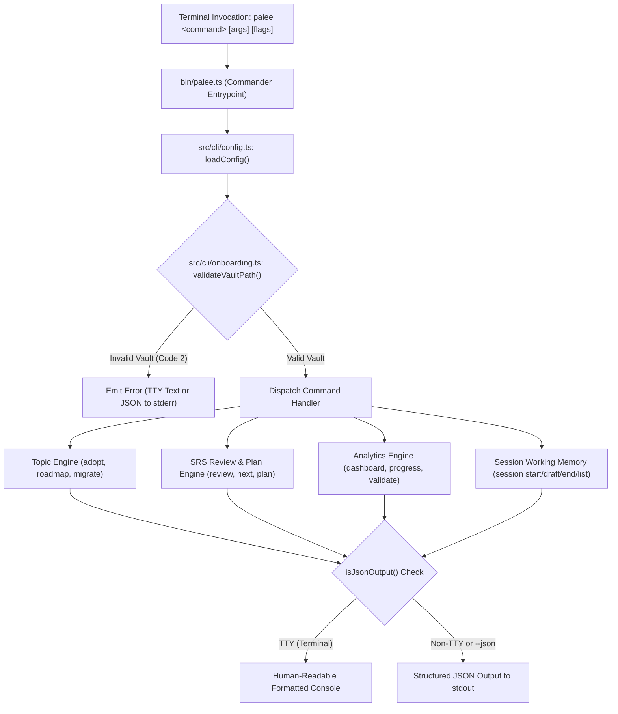

# CLI Commands

<details>
<summary><b>Relevant Source Files</b></summary>

- [bin/palee.ts](https://github.com/Kuldeep2822k/cli/blob/main/bin/palee.ts)
- [src/cli/config.ts](https://github.com/Kuldeep2822k/cli/blob/main/src/cli/config.ts)
- [src/cli/onboarding.ts](https://github.com/Kuldeep2822k/cli/blob/main/src/cli/onboarding.ts)
- [src/cli/adopt.ts](https://github.com/Kuldeep2822k/cli/blob/main/src/cli/adopt.ts)
- [src/cli/review.ts](https://github.com/Kuldeep2822k/cli/blob/main/src/cli/review.ts)
- [src/cli/next.ts](https://github.com/Kuldeep2822k/cli/blob/main/src/cli/next.ts)
- [src/cli/plan.ts](https://github.com/Kuldeep2822k/cli/blob/main/src/cli/plan.ts)
- [src/cli/dashboard.ts](https://github.com/Kuldeep2822k/cli/blob/main/src/cli/dashboard.ts)
- [src/cli/progress.ts](https://github.com/Kuldeep2822k/cli/blob/main/src/cli/progress.ts)
- [src/cli/validate.ts](https://github.com/Kuldeep2822k/cli/blob/main/src/cli/validate.ts)
- [src/cli/roadmap.ts](https://github.com/Kuldeep2822k/cli/blob/main/src/cli/roadmap.ts)
- [src/cli/migrate.ts](https://github.com/Kuldeep2822k/cli/blob/main/src/cli/migrate.ts)
- [src/cli/session.ts](https://github.com/Kuldeep2822k/cli/blob/main/src/cli/session.ts)
- [test/cli-commands.test.ts](https://github.com/Kuldeep2822k/cli/blob/main/test/cli-commands.test.ts)
- [test/cli-exit-codes.test.ts](https://github.com/Kuldeep2822k/cli/blob/main/test/cli-exit-codes.test.ts)
- [test/cli-json-output.test.ts](https://github.com/Kuldeep2822k/cli/blob/main/test/cli-json-output.test.ts)

</details>

The `palee` CLI is the primary developer interface for interacting with the PALEE learning engine. It provides a comprehensive suite of terminal commands for managing learning topics, scheduling spaced repetition reviews via SuperMemo SM-2, tracking mastery and difficulty analytics, ingesting curriculum roadmaps, and executing focused study sessions with working memory synchronization.

All commands are registered and dispatched through the central CLI entry point at [bin/palee.ts#1-134](https://github.com/Kuldeep2822k/cli/blob/main/bin/palee.ts#L1-L134).

---

## Command Architecture

The CLI is implemented on top of the `commander` framework. Every command follows a deterministic, four-stage lifecycle:

1. **Configuration Resolution**: Commands load persistent configuration (`PaleeConfig`) from the OS-specific config directory via `loadConfig()` [src/cli/config.ts#38-49](https://github.com/Kuldeep2822k/cli/blob/main/src/cli/config.ts#L38-L49).
2. **Vault Preflight Validation**: Commands verify that the configured vault path exists, is a readable directory, and contains accessible Markdown files using `validateVaultPath()` [src/cli/onboarding.ts#26-67](https://github.com/Kuldeep2822k/cli/blob/main/src/cli/onboarding.ts#L26-L67).
3. **Domain Engine Delegation**: Core domain logic is dispatched to dedicated command handlers (e.g., `adoptCommand`, `reviewCommand`, `planCommand`, `sessionCommand`), which interface directly with storage layers, the SM-2 engine, and the DAG dependency solver.
4. **Format & Channel Resolution**: Output is rendered to the terminal in human-readable styled text, or emitted as structured JSON when `--json` is specified or when `stdout` is redirected in a non-TTY environment [src/cli/onboarding.ts#17-19](https://github.com/Kuldeep2822k/cli/blob/main/src/cli/onboarding.ts#L17-L19).



---

## Exit Code Contract (0 to 5)

PALEE adheres to a strict, standardized exit code contract across all 11 commands. Automated CI/CD pipelines, shell scripts, and editor plugins can rely deterministically on these exit codes:

| Exit Code | Classification | Description | Typical Triggers |
| :---: | :--- | :--- | :--- |
| **0** | **Success / Clean Exit** | Command completed successfully, help text was printed, dry-run simulation finished, or the user gracefully cancelled an interactive prompt. | Successful review, complete roadmap import, `palee validate` passed with 0 errors, `palee adopt --dry-run`. |
| **1** | **Partial Import Failure** | The operation completed partially, but one or more sub-items failed (e.g. corrupt note files or I/O failure during batch import). | `palee roadmap` where some notes in the curriculum failed atomic write or directory creation (`failed > 0`). |
| **2** | **Argument / Configuration Error** | CLI parameters are invalid, required arguments are missing, target path is outside the vault, or the vault path is unconfigured / inaccessible. | Non-integer quality rating for `review`, missing `--from` in `roadmap`, unconfigured vault path, non-interactive stdin without `-y`. |
| **3** | **Validation / Schema / Cycle Error** | Domain validation rules were violated, such as duplicate IDs, missing prerequisites, dependency cycles, or unrecognized metadata schema versions. | `palee validate` found cycles or missing IDs, `palee roadmap` contained duplicate IDs or cycles, `palee migrate` found unsupported schema. |
| **4** | **OCC Concurrency Conflict** | Optimistic Concurrency Control detected a mid-air collision (`ECONFLICT` / `isConflictError`). A note's SHA-256 fingerprint changed between reading and writing, or an active file lock is held. | Concurrent edits by Obsidian or external scripts during `review` (TOCTOU pre-write verification), `adopt`, `roadmap`, or `session`. |
| **5** | **Unexpected Runtime / I/O Error** | An unhandled exception occurred, such as file system permission denial, corrupted config JSON syntax, or hardware I/O error. | Unparseable `config.json`, disk full during atomic write rollback, missing OS environment variables. |

### Per-Command Exit Code Matrix

The following matrix documents the exact behavior of every command under each exit code:

| Command | Exit Code 0 | Exit Code 1 | Exit Code 2 | Exit Code 3 | Exit Code 4 | Exit Code 5 |
| :--- | :--- | :--- | :--- | :--- | :--- | :--- |
| `palee config` | Successfully printed or updated configuration. | N/A | Missing value for `set-*`, unknown action, or non-existent vault directory. | N/A | N/A | Missing `LOCALAPPDATA` on Windows or corrupted `config.json`. |
| `palee adopt` | Single note or batch adopted, dry-run rendered, or user declined confirmation (`N`). | N/A | Missing/unconfigured vault, target note path escapes vault, note already adopted, invalid `--difficulty`, invalid glob pattern, missing path without `--all`, or non-interactive stdin without `-y`. | N/A | OCC conflict during atomic note write (`isConflictError`). | Uncaught file system exception or atomic batch rollback failure. |
| `palee next` | Successfully displayed next due topic, all due topics (`--all`), or empty vault onboarding. | N/A | Unconfigured or non-existent vault path. | N/A | N/A | Unexpected runtime exception or file read failure. |
| `palee plan` | Successfully rendered topological daily study plan or empty vault onboarding. | N/A | Unconfigured or non-existent vault path. | N/A | N/A | Unexpected runtime exception or graph calculation failure. |
| `palee progress` | Successfully displayed vault progress metrics, topic detail (`--topic`), or empty vault state. | N/A | Unconfigured vault, or topic ID/title query not found for `--topic`. | N/A | N/A | Unexpected runtime exception or file read failure. |
| `palee review` | Successfully updated SM-2 interval, ease factor, repetition count, and `due_at`. | N/A | Quality rating not an integer `0..5`, unconfigured vault, topic not found, or ambiguous query (multiple matches). | N/A | Target note modified concurrently between prompt and write submission (`isConflictError`). | Atomic write failure or unexpected file system error. |
| `palee validate` | Vault validation passed with 0 structural errors. | N/A | Unconfigured or non-existent vault path. | Validation errors found (duplicate `palee_id`, missing `depends_on` target, or dependency cycle). | N/A | Unexpected runtime exception or directory walk failure. |
| `palee roadmap` | Curriculum parsed, validated, and all topics created/updated on disk. | Partial batch import failure (`failed > 0` topic notes failed due to corrupt files/write errors). | Missing `--from` argument, roadmap file not found, malformed structure (missing `topics`), or non-interactive stdin without `-y`. | Roadmap validation failed (missing ID/title/path, duplicate ID/path, invalid difficulty/order, missing dependency, cycle detected). | OCC conflict during atomic note write (`isConflictError`). | Unexpected runtime / I/O exception. |
| `palee migrate` | All notes verified to be on current schema (`palee_schema: 1`). | N/A | Unconfigured or non-existent vault path. | Unrecognized schema version found (`palee_schema` missing or $\ne 1$). | N/A | Unexpected runtime exception or YAML parse failure. |
| `palee session` | Session lifecycle action (`start`, `draft`, `end`, `list`) completed successfully. | N/A | Unconfigured vault, missing `--topic` for `draft`/`end` when no active topic exists, unconfirmed drafts blocking non-interactive `session start`, or unknown action. | N/A | OCC conflict during session note write or `hot.md` update (`isConflictError`). | Unexpected runtime exception or storage directory error. |
| `palee dashboard` | Successfully rendered high-level dashboard metrics or empty vault onboarding. | N/A | Unconfigured or non-existent vault path. | N/A | N/A | Unexpected runtime exception or calculation failure. |

---

## Machine-Readable Output & Non-TTY Auto-JSON Detection

PALEE is built for seamless integration into developer pipelines, shell scripts, cron jobs, and editor extensions. It implements an automatic JSON streaming detection contract via `isJsonOutput()` [src/cli/onboarding.ts#17-19](https://github.com/Kuldeep2822k/cli/blob/main/src/cli/onboarding.ts#L17-L19):

```typescript
export function isJsonOutput(options?: { json?: boolean }): boolean {
  return Boolean(options?.json || (process.stdout && process.stdout.isTTY === false));
}
```

### Automatic Non-TTY Detection Rules

1. **Explicit Flag (`--json`)**: When `--json` is supplied, PALEE always outputs structured JSON to `stdout`.
2. **Implicit Non-TTY Streaming**: When `stdout` is redirected to a file (`palee dashboard > metrics.json`) or piped to another process (`palee next | jq .`), Node.js sets `process.stdout.isTTY === false`. PALEE automatically suppresses all ANSI color codes, decorative ASCII tables, and interactive prompts, outputting pure JSON directly.
3. **Structured Error Emission on `stderr`**: When JSON mode is active (either via `--json` or non-TTY detection) and a configuration/argument error occurs, PALEE formats the error message as a JSON payload on `stderr` and exits with code `2`:
   ```bash
   $ palee validate --json
   # If vault is unconfigured:
   # stderr: {"error":"Vault path not configured. Run: palee config set-vault <path>"}
   # exit code: 2
   ```
4. **Deterministic Empty States**: For empty vaults (0 topics), JSON commands return valid zeroed JSON structures instead of throwing errors or exiting non-zero.

### JSON Output Schema Mapping

| Command | JSON Root Key(s) | Description | Key Fields |
| :--- | :--- | :--- | :--- |
| `palee next` | `next`, `due_count`, `total_topics` (single)<br>`due_topics[]`, `next`, `total_topics` (`--all`) | Single next topic or array of all overdue topics. | `id`, `title`, `path`, `due_at`, `mastery`, `repetition` |
| `palee plan` | `reviews_due[]`, `ready_to_learn[]`, `counts`, `total_topics` | Topological daily study plan. | `counts: { due, ready, mastered, learning, new }` |
| `palee progress` | `active_topic_count`, `archived_topic_count`, `global_mastery`, `mastery_status`, `by_difficulty`, `total_reviews`, `total_lapses` | Vault-wide learning mastery and SRS metrics. | `global_mastery: 0.0..1.0`, `by_difficulty: { beginner, intermediate, advanced }` |
| `palee progress --topic <id>` | `id`, `title`, `path`, `mastery`, `difficulty`, `repetition`, `lapses`, `assessed_at`, `last_reviewed_at` | Detailed progress breakdown for a single topic. | `mastery: 0.0..1.0`, `repetition: number`, `lapses: number` |
| `palee dashboard` | `total_topics`, `mastered`, `learning`, `new`, `mastered_pct`, `reviews_due`, `by_difficulty`, `next_review` | High-level vault dashboard metrics. | `mastered_pct: number`, `next_review: { id, title, mastery, due_at }` |
| `palee validate` | `valid`, `topic_count`, `file_count`, `error_count`, `errors[]` | Vault graph integrity and schema validation report. | `valid: boolean`, `errors: [{ type, id, topic, missing, path }]` |
| `palee session list` | `total_confirmed`, `total_drafts`, `confirmed[]`, `drafts[]` | List of confirmed session notes and unconfirmed draft checkpoints. | `confirmed: string[]`, `drafts: string[]` |

---

## Daily Study & Review Developer Workflows

The PALEE CLI is optimized for fast, terminal-centric study routines. Below are 4 complete, copy-pasteable daily developer workflows.

### Workflow 1: Morning Discovery & Planning Loop

Start your day by evaluating your vault health and generating a topologically ordered study queue.

```bash
# 1. Check high-level vault status and mastery breakdown
palee dashboard

# 2. Inspect today's structured learning plan
palee plan

# 3. (Optional) Pipe the plan into jq to extract only ready-to-learn topics
palee plan | jq '.ready_to_learn[] | {id: .id, title: .title, difficulty: .difficulty}'

# 4. Extract total count of reviews due today for terminal prompt/status bar
DUE_COUNT=$(palee plan | jq '.counts.due')
echo "Reviews due today: ${DUE_COUNT}"
```

### Workflow 2: Spaced Repetition Review Loop

Work through overdue topics one at a time using SuperMemo SM-2 quality ratings.

```bash
# 1. Fetch the single highest-priority overdue topic
palee next

# 2. Open the note in your editor or Obsidian (using jq to extract path)
NOTE_PATH=$(palee next | jq -r '.next.path')
code "$NOTE_PATH"

# 3. Review the material and self-assess recall quality (0 to 5):
#    0 = Complete blackout, 1 = Incorrect (familiar), 2 = Incorrect (easy mistake)
#    3 = Correct with serious difficulty, 4 = Correct with hesitation, 5 = Perfect recall
TOPIC_ID=$(palee next | jq -r '.next.id')
palee review "$TOPIC_ID" 4

# 4. View all remaining due topics in the queue
palee next --all
```

### Workflow 3: Focused Learning Session with Working Memory & Drafts

Execute a deep-work study session on a complex topic with draft recovery and working memory synchronization (`hot.md`).

```bash
# 1. Start an interactive session (recovers any orphaned drafts and prints working memory)
palee session start --interactive

# 2. While taking notes in Obsidian, capture periodic draft checkpoints
palee session draft --topic "T-20260814T120000-abcd"

# 3. Check active drafts and past sessions
palee session list

# 4. Conclude the study session (creates confirmed note, removes drafts, regenerates hot.md & index.md)
palee session end --topic "T-20260814T120000-abcd"
```

### Workflow 4: Vault Ingestion, Curriculum Import & Validation

Onboard new notes, import external structured curricula, and verify vault integrity.

```bash
# 1. Adopt an individual note with explicit difficulty and prerequisite dependencies
palee adopt "DSA/Dynamic-Programming.md" --difficulty advanced --depends-on "T-recursion,T-memoization"

# 2. Preview a batch adoption across a module directory with glob and tag filters
palee adopt "MODULES/03-kubernetes" --include "lab-*,concept-*" --tag "devops/k8s" --dry-run --verbose

# 3. Execute the batch adoption non-interactively with rollback protection
palee adopt "MODULES/03-kubernetes" --include "lab-*,concept-*" --tag "devops/k8s" -y

# 4. Import a complete structured curriculum roadmap from YAML
palee roadmap --from "curricula/cloud-architect.yaml" -y

# 5. Run vault integrity verification to confirm 0 cycles or broken dependencies
palee validate
```

---

## Command Groups Overview

The PALEE CLI is divided into four focused command domains:

### 1. Topic Management Commands
Handles the ingestion, metadata injection, curriculum parsing, and schema migration for Markdown notes in the vault.
- Commands: `palee adopt`, `palee roadmap`, `palee migrate`
- See [Topic Management Commands](./02-1-topic-management-commands.md) for full flag tables, two-phase atomic batch write engines, and YAML roadmap syntax.

### 2. Review and Scheduling Commands
Drives the active recall and spaced repetition loops, utilizing the SM-2 algorithm and DAG dependency engine to calculate intervals and prerequisites.
- Commands: `palee review`, `palee next`, `palee plan`
- See [Review and Scheduling Commands](./02-2-review-and-scheduling-commands.md) for SM-2 interval formulas, readiness rules, and argument constraints.

### 3. Reporting and Validation Commands
Provides comprehensive analytics, difficulty breakdowns, mastery metrics, and structural graph validation.
- Commands: `palee dashboard`, `palee progress`, `palee validate`
- See [Reporting Commands](./02-3-reporting-commands.md) for 4-pillar mastery reporting, difficulty distributions, and cycle validation.

### 4. Session Management Commands
Manages the lifecycle of focused study sessions, synchronizing working memory (`hot.md`) and session history (`.palee/sessions/`).
- Commands: `palee session start`, `palee session draft`, `palee session end`, `palee session list`
- See [Session Management Command](./02-4-session-management-command.md) for draft recovery protocols and working memory truncation rules.