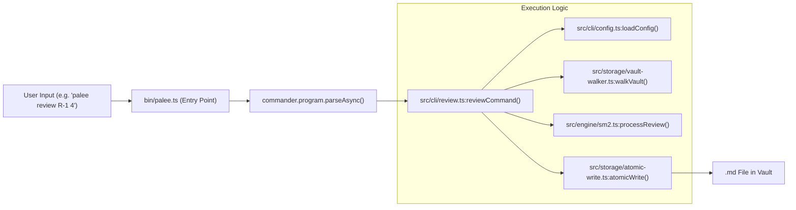
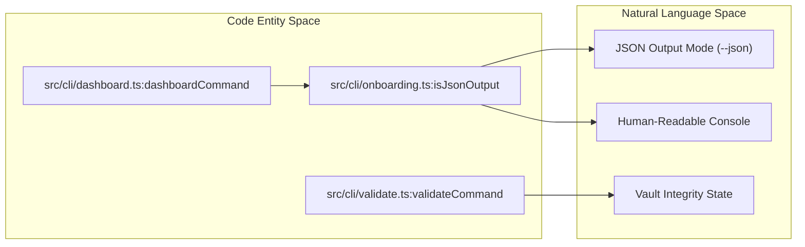

# CLI Commands
Relevant source files

- [bin/palee.ts](https://github.com/Kuldeep2822k/cli/blob/main/bin/palee.ts)
- [src/cli/config.ts](https://github.com/Kuldeep2822k/cli/blob/main/src/cli/config.ts)
- [src/cli/onboarding.ts](https://github.com/Kuldeep2822k/cli/blob/main/src/cli/onboarding.ts)
- [src/cli/review.ts](https://github.com/Kuldeep2822k/cli/blob/main/src/cli/review.ts)
- [test/cli-commands.test.ts](https://github.com/Kuldeep2822k/cli/blob/main/test/cli-commands.test.ts)
- [test/cli-json-output.test.ts](https://github.com/Kuldeep2822k/cli/blob/main/test/cli-json-output.test.ts)

The `palee` CLI is the primary interface for interacting with the PALEE engine. It provides a suite of commands for managing learning topics, scheduling reviews using the SM-2 algorithm, tracking progress, and managing active learning sessions. All commands are wired through the entry point at [bin/palee.ts#1-127](https://github.com/Kuldeep2822k/cli/blob/main/bin/palee.ts#L1-L127)

## Command Architecture

The CLI is built using the `commander` library. Each command follows a consistent pattern:

1. Configuration Loading: Commands load the `PaleeConfig` (vault path, AI settings) via `loadConfig`[src/cli/config.ts#27-39](https://github.com/Kuldeep2822k/cli/blob/main/src/cli/config.ts#L27-L39)
2. Vault Validation: Commands verify the vault's existence and readability using `validateVaultPath`[src/cli/onboarding.ts#26-67](https://github.com/Kuldeep2822k/cli/blob/main/src/cli/onboarding.ts#L26-L67)
3. Execution: Logic is delegated to specific command handlers (e.g., `reviewCommand`, `planCommand`).
4. Output: Results are printed to `stdout`. Many commands support a `--json` flag for machine-readable output [src/cli/onboarding.ts#17-19](https://github.com/Kuldeep2822k/cli/blob/main/src/cli/onboarding.ts#L17-L19)

### Common Patterns and Exit Codes

PALEE uses standardized exit codes to indicate the result of command execution:

- `0`: Success.
- `1`: General failure (e.g., roadmap import failures) [test/cli-commands.test.ts#102](https://github.com/Kuldeep2822k/cli/blob/main/test/cli-commands.test.ts#L102-L102)
- `2`: Configuration or Argument error (e.g., invalid vault path, invalid quality rating) [src/cli/onboarding.ts#33](https://github.com/Kuldeep2822k/cli/blob/main/src/cli/onboarding.ts#L33-L33)[src/cli/review.ts#26](https://github.com/Kuldeep2822k/cli/blob/main/src/cli/review.ts#L26-L26)
- `5`: Runtime / Storage error (e.g., file system permissions, atomic write failures) [src/cli/review.ts#111](https://github.com/Kuldeep2822k/cli/blob/main/src/cli/review.ts#L111-L111)

Sources:[bin/palee.ts#24-127](https://github.com/Kuldeep2822k/cli/blob/main/bin/palee.ts#L24-L127)[src/cli/onboarding.ts#26-67](https://github.com/Kuldeep2822k/cli/blob/main/src/cli/onboarding.ts#L26-L67)[src/cli/review.ts#22-113](https://github.com/Kuldeep2822k/cli/blob/main/src/cli/review.ts#L22-L113)

## Command Groups

The CLI functionality is divided into four main logical groups.

### Topic Management

These commands handle the ingestion and lifecycle of Markdown notes as PALEE topics. `palee adopt` initializes a single note with required frontmatter, while `palee roadmap` allows for bulk imports from YAML definitions.

- Key Files: `src/cli/adopt.ts`, `src/cli/roadmap.ts`, `src/cli/migrate.ts`.
- Details: For frontmatter injection, ID generation, and schema migration, see [Topic Management Commands](./02-1-topic-management-commands.md).

### Review and Scheduling

These commands drive the Spaced Repetition System (SRS). `palee review` records manual quality ratings (0-5) and updates the SM-2 state, while `palee next` and `palee plan` help the user decide what to study next based on due dates and dependency readiness.

- Key Files: `src/cli/review.ts`, `src/cli/next.ts`, `src/cli/plan.ts`.
- Details: For SM-2 state updates and dependency-aware filtering, see [Review and Scheduling Commands](./02-2-review-and-scheduling-commands.md).

### Reporting and Validation

These commands provide visibility into the learning vault. `palee dashboard` and `palee progress` aggregate data into human-readable statistics. `palee validate` ensures the vault remains consistent (no broken dependencies or duplicate IDs).

- Key Files: `src/cli/dashboard.ts`, `src/cli/progress.ts`, `src/cli/validate.ts`.
- Details: For mastery statistics and vault integrity checks, see [Reporting Commands](./02-3-reporting-commands.md).

### Session Management

The `palee session` suite manages the lifecycle of a focused study session. It handles the synchronization of "working memory" in `hot.md`, manages draft recovery, and persists session notes.

- Key Files: `src/cli/session.ts`.
- Details: For session lifecycle and `hot.md` synchronization, see [Session Management Command](./02-4-session-management-command.md).

Sources:[bin/palee.ts#29-114](https://github.com/Kuldeep2822k/cli/blob/main/bin/palee.ts#L29-L114)

## System Mapping Diagrams

### Command Execution Flow

This diagram maps the natural language command request to the specific code entities responsible for processing it.

Sources:[bin/palee.ts#71-75](https://github.com/Kuldeep2822k/cli/blob/main/bin/palee.ts#L71-L75)[src/cli/review.ts#22-93](https://github.com/Kuldeep2822k/cli/blob/main/src/cli/review.ts#L22-L93)

### Data Output and Validation

This diagram shows how the system bridges vault data to different output formats and validation states.

Sources:[src/cli/onboarding.ts#17-19](https://github.com/Kuldeep2822k/cli/blob/main/src/cli/onboarding.ts#L17-L19)[test/cli-json-output.test.ts#14-147](https://github.com/Kuldeep2822k/cli/blob/main/test/cli-json-output.test.ts#L14-L147)

## Machine-Readable Output (JSON Mode)

PALEE supports a structured JSON output for integration with other tools or scripts. This mode is triggered by the `--json` flag or automatically when `stdout` is not a TTY [src/cli/onboarding.ts#17-19](https://github.com/Kuldeep2822k/cli/blob/main/src/cli/onboarding.ts#L17-L19)

| Command | JSON Structure Key | Description |
| --- | --- | --- |
| `next` | `next` | The single most urgent topic due [test/cli-json-output.test.ts#196-198](https://github.com/Kuldeep2822k/cli/blob/main/test/cli-json-output.test.ts#L196-L198) |
| `plan` | `ready_to_learn` | List of topics where dependencies are satisfied [test/cli-json-output.test.ts#108](https://github.com/Kuldeep2822k/cli/blob/main/test/cli-json-output.test.ts#L108-L108) |
| `progress` | `by_difficulty` | Breakdown of mastery by difficulty levels [test/cli-json-output.test.ts#118](https://github.com/Kuldeep2822k/cli/blob/main/test/cli-json-output.test.ts#L118-L118) |
| `validate` | `errors` | List of integrity violations (cycles, missing IDs) [test/cli-json-output.test.ts#136](https://github.com/Kuldeep2822k/cli/blob/main/test/cli-json-output.test.ts#L136-L136) |

Sources:[src/cli/onboarding.ts#17-19](https://github.com/Kuldeep2822k/cli/blob/main/src/cli/onboarding.ts#L17-L19)[test/cli-json-output.test.ts#87-147](https://github.com/Kuldeep2822k/cli/blob/main/test/cli-json-output.test.ts#L87-L147)