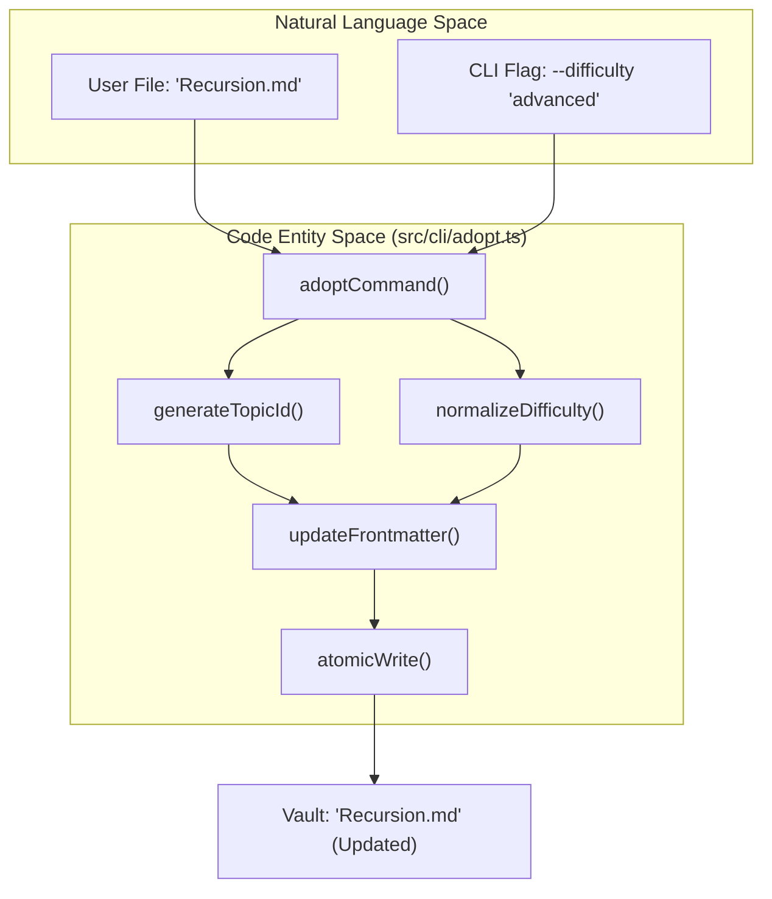
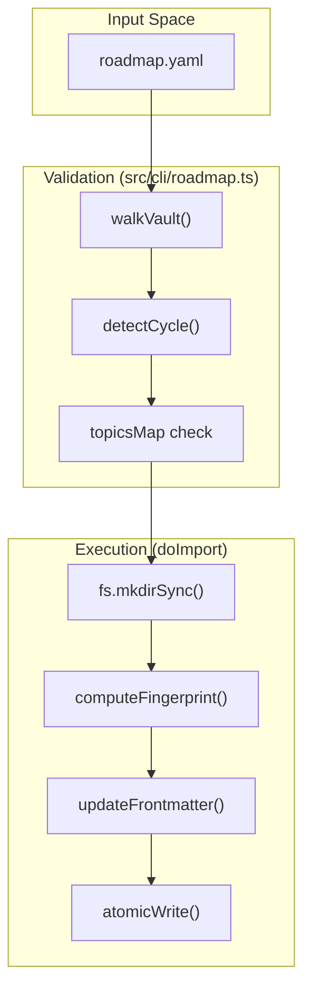

# Topic Management Commands
Relevant source files

- [src/cli/adopt.ts](https://github.com/Kuldeep2822k/cli/blob/main/src/cli/adopt.ts)
- [src/cli/config.ts](https://github.com/Kuldeep2822k/cli/blob/main/src/cli/config.ts)
- [src/cli/migrate.ts](https://github.com/Kuldeep2822k/cli/blob/main/src/cli/migrate.ts)
- [src/cli/review.ts](https://github.com/Kuldeep2822k/cli/blob/main/src/cli/review.ts)
- [src/cli/roadmap.ts](https://github.com/Kuldeep2822k/cli/blob/main/src/cli/roadmap.ts)
- [src/types.ts](https://github.com/Kuldeep2822k/cli/blob/main/src/types.ts)
- [test/cli-commands.test.ts](https://github.com/Kuldeep2822k/cli/blob/main/test/cli-commands.test.ts)
- [test/types-difficulty.test.ts](https://github.com/Kuldeep2822k/cli/blob/main/test/types-difficulty.test.ts)

Topic management commands facilitate the lifecycle of educational content within a PALEE vault. This includes adopting existing Markdown notes as tracked topics, bulk-importing structured curricula via YAML roadmaps, and ensuring schema consistency across the vault.

## Topic Adoption (`palee adopt`)

The `adopt` command transforms a standard Markdown file into a PALEE topic by injecting the required metadata into its YAML frontmatter. This process is non-destructive to the existing body content.

### Implementation Details

When `adoptCommand` is invoked, it performs several safety and normalization steps:

1. Vault Validation: Ensures the target file exists and does not escape the configured `vaultPath` using `fs.realpathSync` to resolve symlinks [src/cli/adopt.ts#30-43](https://github.com/Kuldeep2822k/cli/blob/main/src/cli/adopt.ts#L30-L43)
2. Duplicate Prevention: Checks if the note already contains a `palee_id` to prevent double-adoption [src/cli/adopt.ts#48-51](https://github.com/Kuldeep2822k/cli/blob/main/src/cli/adopt.ts#L48-L51)
3. Difficulty Normalization: Converts raw input (e.g., "1", "Beginner", "advanced") into a canonical `Difficulty` enum ('beginner', 'intermediate', 'advanced') using `normalizeDifficulty`[src/types.ts#29-47](https://github.com/Kuldeep2822k/cli/blob/main/src/types.ts#L29-L47)[src/cli/adopt.ts#53-62](https://github.com/Kuldeep2822k/cli/blob/main/src/cli/adopt.ts#L53-L62)
4. ID Generation: Creates a unique `palee_id` using the format `T-YYYYMMDDTHHMMSS-xxxx`[src/cli/adopt.ts#13-18](https://github.com/Kuldeep2822k/cli/blob/main/src/cli/adopt.ts#L13-L18)
5. Metadata Injection: Initializes the topic with default SM-2 values (Ease Factor: 2.5, Interval: 1 day) and a four-pillar assessment structure [src/cli/adopt.ts#68-86](https://github.com/Kuldeep2822k/cli/blob/main/src/cli/adopt.ts#L68-L86)

### Data Flow: Adopting a Note

The following diagram illustrates the transition from a raw Markdown file to a PALEE-managed topic.

Note Adoption Logic

Sources: [src/cli/adopt.ts#20-107](https://github.com/Kuldeep2822k/cli/blob/main/src/cli/adopt.ts#L20-L107)[src/types.ts#29-47](https://github.com/Kuldeep2822k/cli/blob/main/src/types.ts#L29-L47)[src/storage/atomic-write.ts#1-20](https://github.com/Kuldeep2822k/cli/blob/main/src/storage/atomic-write.ts#L1-L20)

---

## Roadmap Import (`palee roadmap`)

The `roadmap` command allows for the bulk creation or update of topics based on an external YAML definition. This is used for importing structured learning paths while maintaining idempotency for existing vault data.

### Validation Engine

Before any file system changes occur, the `roadmapCommand` performs a rigorous validation pass:

- Schema Check: Validates the YAML structure against the `RoadmapFile` interface [src/cli/roadmap.ts#41-53](https://github.com/Kuldeep2822k/cli/blob/main/src/cli/roadmap.ts#L41-L53)
- Path Safety: Rejects any topic paths that resolve outside the vault or utilize symlinks to escape the vault boundary [src/cli/roadmap.ts#171-191](https://github.com/Kuldeep2822k/cli/blob/main/src/cli/roadmap.ts#L171-L191)
- Dependency Integrity: Verifies that all `depends_on` IDs exist either within the roadmap itself or within the existing vault [src/cli/roadmap.ts#106-113](https://github.com/Kuldeep2822k/cli/blob/main/src/cli/roadmap.ts#L106-L113)
- Cycle Detection: Utilizes `detectCycle` from the dependency engine to ensure the curriculum is a Directed Acyclic Graph (DAG) [src/cli/roadmap.ts#115-118](https://github.com/Kuldeep2822k/cli/blob/main/src/cli/roadmap.ts#L115-L118)

### Idempotency and State Preservation

A key feature of the roadmap import is that it preserves existing user progress. If a roadmap topic matches an existing file (by path or ID), the command updates descriptive fields (like `title`) but retains the user's current SM-2 state (e.g., `topic_mastery`, `repetition`, `ease_factor`) [test/cli-commands.test.ts#136-142](https://github.com/Kuldeep2822k/cli/blob/main/test/cli-commands.test.ts#L136-L142)

Roadmap Import Flow

Sources: [src/cli/roadmap.ts#17-160](https://github.com/Kuldeep2822k/cli/blob/main/src/cli/roadmap.ts#L17-L160)[src/engine/dependency.ts#1-20](https://github.com/Kuldeep2822k/cli/blob/main/src/engine/dependency.ts#L1-L20)[test/cli-commands.test.ts#74-142](https://github.com/Kuldeep2822k/cli/blob/main/test/cli-commands.test.ts#L74-L142)

---

## Schema Migration (`palee migrate`)

The `migrate` command is responsible for upgrading topic metadata when the PALEE internal schema changes. In Phase 1, this command acts primarily as a validator to ensure all notes adhere to `palee_schema: 1`.

### Migration Logic

1. Vault Scan: Recursively walks the vault using `walkVault` to identify all files containing a `palee_id`[src/cli/migrate.ts#22-34](https://github.com/Kuldeep2822k/cli/blob/main/src/cli/migrate.ts#L22-L34)
2. Version Detection: Inspects the `palee_schema` field in the frontmatter [src/cli/migrate.ts#36](https://github.com/Kuldeep2822k/cli/blob/main/src/cli/migrate.ts#L36-L36)
3. Reporting:

- If a note is missing a schema version or has an unsupported version, it is flagged as "Unrecognized" [src/cli/migrate.ts#40-45](https://github.com/Kuldeep2822k/cli/blob/main/src/cli/migrate.ts#L40-L45)
- If all notes are at the current version, the command exits successfully [src/cli/migrate.ts#62-63](https://github.com/Kuldeep2822k/cli/blob/main/src/cli/migrate.ts#L62-L63)

Sources: [src/cli/migrate.ts#11-72](https://github.com/Kuldeep2822k/cli/blob/main/src/cli/migrate.ts#L11-L72)[src/types.ts#49-59](https://github.com/Kuldeep2822k/cli/blob/main/src/types.ts#L49-L59)

---

## Summary of Commands

| Command | Key Function | Primary Goal |
| --- | --- | --- |
| `palee adopt <path>` | `adoptCommand` | Convert a single Markdown file into a PALEE topic. |
| `palee roadmap --from <file>` | `roadmapCommand` | Bulk-import topics and dependencies from YAML. |
| `palee migrate` | `migrateCommand` | Ensure all vault topics use the latest metadata schema. |

### Technical Constants

- Default Ease Factor: `2.5`[src/cli/adopt.ts#79](https://github.com/Kuldeep2822k/cli/blob/main/src/cli/adopt.ts#L79-L79)
- Initial Interval: `1` day [src/cli/adopt.ts#80](https://github.com/Kuldeep2822k/cli/blob/main/src/cli/adopt.ts#L80-L80)
- Mastery Threshold: `0.7` (used by dependency engine to unlock children) [src/engine/dependency.ts](https://github.com/Kuldeep2822k/cli/blob/main/src/engine/dependency.ts)
- Topic ID Prefix: `T-`[src/cli/adopt.ts#17](https://github.com/Kuldeep2822k/cli/blob/main/src/cli/adopt.ts#L17-L17)

Sources: [src/cli/adopt.ts#68-86](https://github.com/Kuldeep2822k/cli/blob/main/src/cli/adopt.ts#L68-L86)[src/types.ts#209-220](https://github.com/Kuldeep2822k/cli/blob/main/src/types.ts#L209-L220)