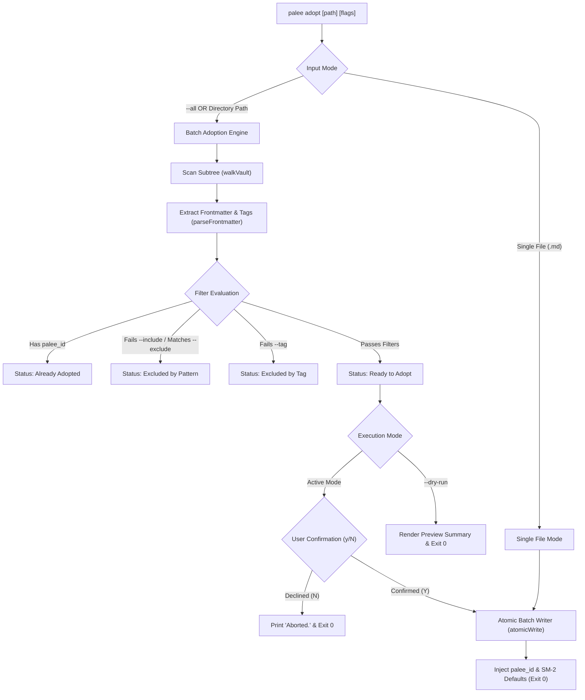
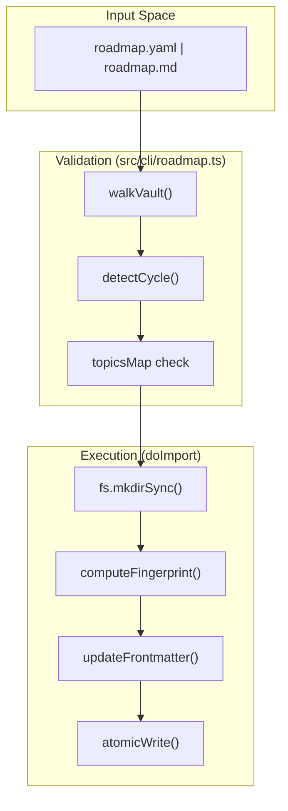

# Topic Management Commands
Relevant source files

- [src/cli/adopt.ts](https://github.com/Kuldeep2822k/cli/blob/main/src/cli/adopt.ts)
- [src/cli/config.ts](https://github.com/Kuldeep2822k/cli/blob/main/src/cli/config.ts)
- [src/cli/migrate.ts](https://github.com/Kuldeep2822k/cli/blob/main/src/cli/migrate.ts)
- [src/cli/review.ts](https://github.com/Kuldeep2822k/cli/blob/main/src/cli/review.ts)
- [src/cli/roadmap.ts](https://github.com/Kuldeep2822k/cli/blob/main/src/cli/roadmap.ts)
- [src/types.ts](https://github.com/Kuldeep2822k/cli/blob/main/src/types.ts)
- [test/cli-commands.test.ts](https://github.com/Kuldeep2822k/cli/blob/main/test/cli-commands.test.ts)
- [test/types-difficulty.test.ts](https://github.com/Kuldeep2822k/cli/blob/main/test/types-difficulty.test.ts)

Topic management commands facilitate the lifecycle of educational content within a PALEE vault. This includes adopting existing Markdown notes as tracked topics, bulk-importing structured curricula via YAML roadmaps, and ensuring schema consistency across the vault.

## Topic Adoption (`palee adopt`)

The `adopt` command transforms standard Markdown files into PALEE topics by injecting required metadata into their YAML frontmatter. This process is non-destructive to existing note bodies and preserves unknown frontmatter fields.

`palee adopt` supports both single-file adoption and flexible batch adoption across directories or the entire vault.

### Modes of Adoption

#### 1. Single File Adoption
Adopts an individual note and optionally specifies dependencies:
```bash
palee adopt "Data-Structures/Recursion.md" --difficulty advanced --depends-on "T-01-basics"
```

#### 2. Scoped Directory Adoption
Adopts all Markdown notes located within a specific directory subtree:
```bash
palee adopt "MODULES/05-containers" --difficulty intermediate -y
```

#### 3. Vault-Wide Adoption
Adopts all untracked Markdown notes across the entire configured vault:
```bash
palee adopt --all -y
```

### Filtering and Safety Options

PALEE provides granular filtering and preview capabilities to prevent adopting unwanted files (such as templates or rubrics):

| Option | Description | Example |
| :--- | :--- | :--- |
| `--include <patterns>` | Comma-separated glob patterns to include | `--include "0[1-4]-*,deep-dive*,lab-*"` |
| `--exclude <patterns>` | Comma-separated glob patterns to skip | `--exclude "*template*,*rubric*,*checklist*"` |
| `--tag <tags>` | Comma-separated Obsidian frontmatter tags | `--tag "type/concept,type/lab"` |
| `--dry-run` | Simulates adoption and prints summary | `--dry-run` |
| `--verbose` | Prints detailed file-by-file inspection list | `--verbose` |
| `-y, --yes` | Skips interactive confirmation prompt | `-y` |

### Implementation Details

When `adoptCommand` is invoked, it performs several safety and normalization steps:

1. **Vault Validation**: Ensures the target file or directory exists and does not escape the configured `vaultPath` using `fs.realpathSync` to resolve symlinks [src/cli/adopt.ts#40-45](https://github.com/Kuldeep2822k/cli/blob/main/src/cli/adopt.ts#L40-L45)
2. **Idempotent Handling**: In batch mode, notes that already contain a `palee_id` are safely counted as "Already Adopted" and skipped without errors [src/cli/adopt.ts#175-180](https://github.com/Kuldeep2822k/cli/blob/main/src/cli/adopt.ts#L175-L180)
3. **Pattern & Tag Matching**: Evaluates note paths against `--include`/`--exclude` glob rules and frontmatter `tags` arrays using zero-dependency matching utilities [src/storage/pattern-matcher.ts#48-112](https://github.com/Kuldeep2822k/cli/blob/main/src/storage/pattern-matcher.ts#L48-L112)
4. **Difficulty Normalization**: Converts raw input (e.g., "1", "Beginner", "advanced") into a canonical `Difficulty` enum ('beginner', 'intermediate', 'advanced') using `normalizeDifficulty` [src/types.ts#29-47](https://github.com/Kuldeep2822k/cli/blob/main/src/types.ts#L29-L47)
5. **Atomic Frontmatter Injection**: Injects `palee_id` (`T-YYYYMMDDTHHMMSS-xxxx`), difficulty, and initial SM-2 defaults (Ease Factor: 2.5, Interval: 1 day) using `atomicWrite` [src/storage/atomic-write.ts#1-20](https://github.com/Kuldeep2822k/cli/blob/main/src/storage/atomic-write.ts#L1-L20)

### Data Flow: Batch and Single Note Adoption



Sources: [src/cli/adopt.ts#1-250](https://github.com/Kuldeep2822k/cli/blob/main/src/cli/adopt.ts#L1-L250)[src/storage/pattern-matcher.ts#1-112](https://github.com/Kuldeep2822k/cli/blob/main/src/storage/pattern-matcher.ts#L1-L112)[src/types.ts#165-178](https://github.com/Kuldeep2822k/cli/blob/main/src/types.ts#L165-L178)

---

## Roadmap Import (`palee roadmap`)

The `roadmap` command allows for the bulk creation or update of topics based on an external Markdown (`.md`) or YAML (`.yaml`) definition. This is used for importing structured learning paths while maintaining idempotency for existing vault data.

### Supported File Formats

PALEE automatically detects and parses curriculum definitions from three formats:

1. **Markdown Frontmatter (`.md`)**:
   ```markdown
   ---
   title: 30-Day DevOps Crash Course
   topics:
     - id: T-linux-basics
       title: Linux Process Management
       path: MODULES/02-linux/01-processes.md
       difficulty: beginner
   ---

   # Overview
   Curriculum overview notes...
   ```

2. **Embedded YAML Code Blocks (`.md`)**:
   ````markdown
   # Kubernetes Study Roadmap

   ```yaml
   topics:
     - id: T-docker-basics
       title: Docker Fundamentals
       path: DevOps/Docker.md
       difficulty: beginner
     - id: T-k8s-basics
       title: Kubernetes Architecture
       path: DevOps/K8s.md
       difficulty: intermediate
       depends_on: [T-docker-basics]
   ```
   ````

3. **Pure Raw YAML (`.yaml` / `.yml`)**:
   ```yaml
   topics:
     - id: T-docker-basics
       title: Docker Fundamentals
       path: DevOps/Docker.md
       difficulty: beginner
   ```

### Validation Engine

Before any file system changes occur, the `roadmapCommand` performs a rigorous validation pass:

- Schema Check: Validates the extracted structure against the `RoadmapFile` interface [src/cli/roadmap.ts#41-53](https://github.com/Kuldeep2822k/cli/blob/main/src/cli/roadmap.ts#L41-L53)
- Path Safety: Rejects any topic paths that resolve outside the vault or utilize symlinks to escape the vault boundary [src/cli/roadmap.ts#171-191](https://github.com/Kuldeep2822k/cli/blob/main/src/cli/roadmap.ts#L171-L191)
- Dependency Integrity: Verifies that all `depends_on` IDs exist either within the roadmap itself or within the existing vault [src/cli/roadmap.ts#106-113](https://github.com/Kuldeep2822k/cli/blob/main/src/cli/roadmap.ts#L106-L113)
- Cycle Detection: Utilizes `detectCycle` from the dependency engine to ensure the curriculum is a Directed Acyclic Graph (DAG) [src/cli/roadmap.ts#115-118](https://github.com/Kuldeep2822k/cli/blob/main/src/cli/roadmap.ts#L115-L118)

### Idempotency and State Preservation

A key feature of the roadmap import is that it preserves existing user progress. If a roadmap topic matches an existing file (by path or ID), the command updates descriptive fields (like `title`) but retains the user's current SM-2 state (e.g., `topic_mastery`, `repetition`, `ease_factor`) [test/cli-commands.test.ts#136-142](https://github.com/Kuldeep2822k/cli/blob/main/test/cli-commands.test.ts#L136-L142)

Roadmap Import Flow



Sources: [src/cli/roadmap.ts#17-160](https://github.com/Kuldeep2822k/cli/blob/main/src/cli/roadmap.ts#L17-L160)[src/storage/roadmap-parser.ts#1-80](https://github.com/Kuldeep2822k/cli/blob/main/src/storage/roadmap-parser.ts#L1-L80)[src/engine/dependency.ts#1-20](https://github.com/Kuldeep2822k/cli/blob/main/src/engine/dependency.ts#L1-L20)[test/cli-commands.test.ts#74-142](https://github.com/Kuldeep2822k/cli/blob/main/test/cli-commands.test.ts#L74-L142)

---

## Schema Migration (`palee migrate`)

The `migrate` command is responsible for upgrading topic metadata when the PALEE internal schema changes. In Phase 1, this command acts primarily as a validator to ensure all notes adhere to `palee_schema: 1`.

### Migration Logic

1. Vault Scan: Recursively walks the vault using `walkVault` to identify all files containing a `palee_id`[src/cli/migrate.ts#22-34](https://github.com/Kuldeep2822k/cli/blob/main/src/cli/migrate.ts#L22-L34)
2. Version Detection: Inspects the `palee_schema` field in the frontmatter [src/cli/migrate.ts#36](https://github.com/Kuldeep2822k/cli/blob/main/src/cli/migrate.ts#L36-L36)
3. Reporting:
   - Migrated: Files where the schema was upgraded (none in Phase 1 as all notes are `schema: 1`).
   - Skipped: Files already at the target schema version (`schema: 1`).
   - Failed: Files where YAML parsing failed.

Sources: [src/cli/migrate.ts#14-63](https://github.com/Kuldeep2822k/cli/blob/main/src/cli/migrate.ts#L14-L63)[src/types.ts#1-10](https://github.com/Kuldeep2822k/cli/blob/main/src/types.ts#L1-L10)

---

## Command Reference Summary

| Command | Handler | Description |
| :--- | :--- | :--- |
| `palee adopt <path>` | `adoptCommand` | Onboard an existing note with PALEE tracking metadata. |
| `palee roadmap --from <file>` | `roadmapCommand` | Bulk-import topics and dependencies from Markdown (`.md`) or YAML (`.yaml`). |
| `palee migrate` | `migrateCommand` | Upgrade all notes in the vault to the latest metadata schema. |

### Technical Constants

- Default Ease Factor: `2.5`[src/cli/adopt.ts#79](https://github.com/Kuldeep2822k/cli/blob/main/src/cli/adopt.ts#L79-L79)
- Initial Interval: `1` day [src/cli/adopt.ts#80](https://github.com/Kuldeep2822k/cli/blob/main/src/cli/adopt.ts#L80-L80)
- Mastery Threshold: `0.7` (used by dependency engine to unlock children) [src/engine/dependency.ts](https://github.com/Kuldeep2822k/cli/blob/main/src/engine/dependency.ts)
- Topic ID Prefix: `T-`[src/cli/adopt.ts#17](https://github.com/Kuldeep2822k/cli/blob/main/src/cli/adopt.ts#L17-L17)

Sources: [src/cli/adopt.ts#68-86](https://github.com/Kuldeep2822k/cli/blob/main/src/cli/adopt.ts#L68-L86)[src/types.ts#209-220](https://github.com/Kuldeep2822k/cli/blob/main/src/types.ts#L209-L220)