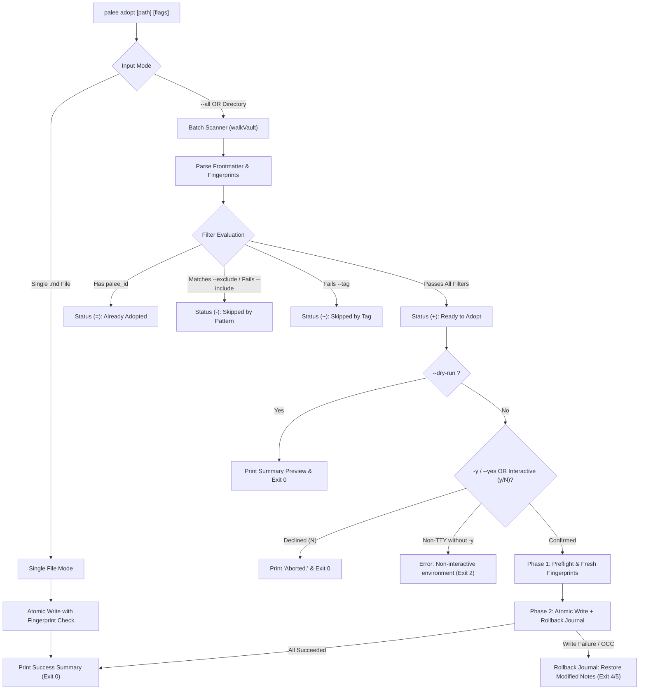
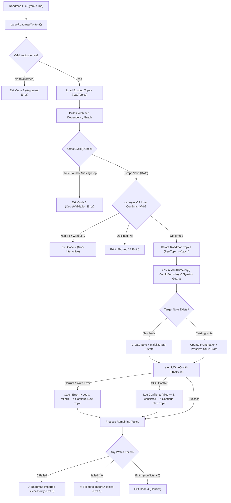

# Topic Management Commands

<details>
<summary><b>Relevant Source Files</b></summary>

- [src/cli/adopt.ts](https://github.com/Kuldeep2822k/cli/blob/main/src/cli/adopt.ts)
- [src/cli/roadmap.ts](https://github.com/Kuldeep2822k/cli/blob/main/src/cli/roadmap.ts)
- [src/cli/migrate.ts](https://github.com/Kuldeep2822k/cli/blob/main/src/cli/migrate.ts)
- [src/storage/frontmatter.ts](https://github.com/Kuldeep2822k/cli/blob/main/src/storage/frontmatter.ts)
- [src/storage/pattern-matcher.ts](https://github.com/Kuldeep2822k/cli/blob/main/src/storage/pattern-matcher.ts)
- [src/storage/roadmap-parser.ts](https://github.com/Kuldeep2822k/cli/blob/main/src/storage/roadmap-parser.ts)
- [src/engine/dependency.ts](https://github.com/Kuldeep2822k/cli/blob/main/src/engine/dependency.ts)
- [src/types.ts](https://github.com/Kuldeep2822k/cli/blob/main/src/types.ts)
- [test/cli-adopt-batch.test.ts](https://github.com/Kuldeep2822k/cli/blob/main/test/cli-adopt-batch.test.ts)
- [test/cli-commands.test.ts](https://github.com/Kuldeep2822k/cli/blob/main/test/cli-commands.test.ts)
- [test/storage-pattern-matcher.test.ts](https://github.com/Kuldeep2822k/cli/blob/main/test/storage-pattern-matcher.test.ts)
- [test/types-difficulty.test.ts](https://github.com/Kuldeep2822k/cli/blob/main/test/types-difficulty.test.ts)

</details>

Topic management commands handle the ingestion, configuration, and structural lifecycle of learning material within an Obsidian vault. These commands allow you to adopt existing Markdown notes as tracked PALEE topics, batch-import structured curricula via YAML roadmaps, and verify metadata schema consistency across your vault.

---

## 1. Topic Adoption (`palee adopt`)

The `palee adopt` command inspects Markdown notes, resolves display titles, and injects required PALEE tracking frontmatter (`palee_id`, `palee_schema`, `difficulty`, `depends_on`, and initial SM-2 defaults). Adoption is strictly non-destructive: all existing note bodies, Obsidian tags, and custom YAML frontmatter properties are preserved.

### Adoption Modes

`palee adopt` operates in three distinct modes based on CLI arguments:

#### Mode 1: Single File Adoption
Adopts an individual Markdown file, allowing manual assignment of difficulty and prerequisite dependencies:
```bash
# Adopt a single note with custom difficulty and prerequisite dependency
palee adopt "Data-Structures/Recursion.md" --difficulty advanced --depends-on "T-01-basics"
```

#### Mode 2: Scoped Directory Batch Adoption
Recursively scans and adopts all untracked Markdown notes located within a specific directory subtree:
```bash
# Adopt all notes under MODULES/02-linux with intermediate difficulty
palee adopt "MODULES/02-linux" --difficulty intermediate -y
```

#### Mode 3: Vault-Wide Batch Adoption
Scans the entire configured vault for untracked Markdown files:
```bash
# Adopt all untracked notes across the entire vault
palee adopt --all -y
```

---

### Options Reference for `palee adopt`

The following table lists every supported option for `palee adopt` [src/types.ts#396-415](https://github.com/Kuldeep2822k/cli/blob/main/src/types.ts#L396-L415):

| Flag / Argument | Type | Default | Description | Example |
| :--- | :--- | :--- | :--- | :--- |
| `[path]` | `string` | `undefined` | Path to a single `.md` file or directory relative to the vault root. | `palee adopt "DSA/Trees.md"` |
| `--all` | `boolean` | `false` | Scan and adopt all untracked Markdown files across the entire vault. | `palee adopt --all` |
| `--difficulty <level>` | `string` | `intermediate` | Set difficulty tier: `beginner`, `intermediate`, `advanced`, or numeric `1`..`5` (`1-2` $\to$ beginner, `3` $\to$ intermediate, `4-5` $\to$ advanced). | `--difficulty advanced` |
| `--depends-on <ids>` | `string` | `""` | Comma-separated list of prerequisite topic IDs (available in single-file mode only). | `--depends-on "T-01-basics,T-02-memory"` |
| `--include <patterns>` | `string` | `undefined` | Comma-separated inclusion glob patterns. Files matching at least one pattern are included. | `--include "0[1-4]-*,lab-*,deep-dive*"` |
| `--exclude <patterns>` | `string` | `undefined` | Comma-separated exclusion glob patterns. Files matching any pattern are skipped. | `--exclude "*template*,*rubric*,*draft*"` |
| `--tag <tags>` | `string` | `undefined` | Comma-separated Obsidian frontmatter tags to filter. Supports hierarchical matching. | `--tag "type/concept,status/ready"` |
| `--dry-run` | `boolean` | `false` | Simulate adoption, print summary preview, and exit with code 0 without modifying any files. | `palee adopt --all --dry-run` |
| `--verbose` | `boolean` | `false` | Output detailed file-by-file status list with indicator prefixes (`+`, `=`, `-`, `~`). | `palee adopt "MODULES" --verbose` |
| `-y, --yes` | `boolean` | `false` | Automatically confirm adoption prompt without interactive terminal confirmation. | `palee adopt --all -y` |

---

### Implementation & Safety Architecture

The adoption engine [src/cli/adopt.ts](https://github.com/Kuldeep2822k/cli/blob/main/src/cli/adopt.ts) executes several safety checks and validation algorithms:

#### 1. Vault Boundary & Symlink Defense
Resolves the canonical path of target files and directories using `fs.realpathSync`. If a path or symlink targets a location outside the configured `vaultPath`, execution is halted immediately with exit code `2`.

#### 2. Three-Tier Title Resolution Algorithm
When adopting a note, PALEE resolves a human-readable title via `resolveNoteTitle()` [src/cli/adopt.ts#36-91](https://github.com/Kuldeep2822k/cli/blob/main/src/cli/adopt.ts#L36-L91):
1. **Tier 1: Frontmatter `title`**: Uses existing YAML `title` property if non-empty.
2. **Tier 2: First Level-1 Heading (`# Title`)**: Scans Markdown body for the first H1 heading, ignoring HTML comments (`<!-- ... -->`) and fenced code blocks (```` ``` ```` and `~~~`).
3. **Tier 3: Filename Basename**: Falls back to the filename without the `.md` extension.

#### 3. Pattern Matching & Hierarchical Tag Filtering
- **Glob Matching**: The pattern engine [src/storage/pattern-matcher.ts](https://github.com/Kuldeep2822k/cli/blob/main/src/storage/pattern-matcher.ts) supports prefix wildcards, infix wildcards (`0[1-4]-*`), and recursive subtree traversal (`**/*.md`).
- **3-Tier Tag Hierarchy**: Matches nested Obsidian tags. Filtering by `--tag "devops"` matches `#devops`, `#devops/k8s`, and `#devops/k8s/networking`. Both `#tag` and `tag` syntax are normalized automatically.

#### 4. Two-Phase Atomic Batch Writer & Rollback Journal
In batch mode, adoption executes in two strict phases:
- **Phase 1 (Preflight)**: Re-reads every note to capture fresh SHA-256 content fingerprints and computes updated frontmatter structures in memory.
- **Phase 2 (Execution & Rollback)**: Writes notes sequentially via atomic write operations (`.tmp` + rename). If any write fails (e.g. disk error or OCC conflict), the system executes a reverse rollback journal, restoring previously modified files to their original state before exiting.



---

## 2. Roadmap Import (`palee roadmap`)

The `palee roadmap` command enables automated, bulk creation and updates of learning topics from a structured curriculum definition file. It validates the entire curriculum graph before writing a single file to disk.

### Supported File Formats

`palee roadmap` automatically identifies and parses three curriculum formats [src/storage/roadmap-parser.ts](https://github.com/Kuldeep2822k/cli/blob/main/src/storage/roadmap-parser.ts):

#### 1. Pure YAML (`.yaml` / `.yml`)
```yaml
title: Cloud Architect Curriculum
topics:
  - id: T-networking-basics
    title: TCP/IP and OSI Model
    path: Cloud/01-networking.md
    difficulty: beginner
  - id: T-vpc-peering
    title: VPC Architecture and Peering
    path: Cloud/02-vpc-peering.md
    difficulty: intermediate
    depends_on:
      - T-networking-basics
```

#### 2. Markdown with Frontmatter YAML (`.md`)
```markdown
---
title: Full-Stack Web Development Roadmap
topics:
  - id: T-html-css
    title: HTML5 and Semantic CSS
    path: Web/01-html-css.md
    difficulty: beginner
  - id: T-js-async
    title: Asynchronous JavaScript and Promises
    path: Web/02-async-js.md
    difficulty: intermediate
    depends_on: [T-html-css]
---

# Curriculum Notes
Additional study notes and learning recommendations for the roadmap...
```

#### 3. Markdown with Embedded YAML Code Blocks (`.md`)
````markdown
# Kubernetes Study Guide

```yaml
topics:
  - id: T-docker-containers
    title: Containerization with Docker
    path: DevOps/Docker.md
    difficulty: beginner
  - id: T-k8s-pods
    title: Kubernetes Pods and Deployments
    path: DevOps/K8s-Pods.md
    difficulty: intermediate
    depends_on: [T-docker-containers]
```
````

---

### Options Reference for `palee roadmap`

The following table lists all options for `palee roadmap` [src/types.ts#476-484](https://github.com/Kuldeep2822k/cli/blob/main/src/types.ts#L476-L484):

| Flag | Type | Required | Description | Example |
| :--- | :--- | :---: | :--- | :--- |
| `--from <file>` | `string` | **Yes** | Path to the roadmap definition file (`.yaml`, `.yml`, or `.md`). | `palee roadmap --from "curricula/devops.yaml"` |
| `-y, --yes` | `boolean` | No | Automatically confirm creation/update of notes without interactive prompt. | `palee roadmap --from "curricula/devops.yaml" -y` |

---

### Curriculum Validation & Graph Integrity Engine

Before performing file creation or modification, `roadmapCommand` executes a comprehensive preflight validation pass [src/cli/roadmap.ts#59-132](https://github.com/Kuldeep2822k/cli/blob/main/src/cli/roadmap.ts#L59-L132):

1. **Schema Structure**: Confirms the roadmap contains a valid `topics` list with non-empty `id`, `title`, and `path` fields.
2. **Duplicate Detection**: Verifies there are no duplicate `id` values or duplicate target `path` locations.
3. **Vault Boundary & Symlink Checks**: Ensures all target topic paths reside within the vault boundary and do not escape via symlinked parent directories.
4. **Dependency Resolution**: Checks that every prerequisite ID in `depends_on` exists either in the roadmap or within existing vault notes.
5. **3-Color DFS Cycle Detection**: Runs cycle detection (`detectCycle`) to guarantee that the prerequisite graph forms a strict Directed Acyclic Graph (DAG). If a circular dependency exists (e.g. $A \to B \to C \to A$), the command rejects the import and exits with code `3`.

### Idempotent Updates, Safe Directory Management & Batch Resilience

Roadmap imports are designed for maximum resilience and idempotency:

1. **Lock-Synchronized Safe Directory Creation**: Target directory paths are created via `ensureVaultDirectory(vaultPath, topic.path)` [src/storage/vault-walker.ts](https://github.com/Kuldeep2822k/cli/blob/main/src/storage/vault-walker.ts). This utility validates path boundaries, prevents symlink escapes outside the vault root, and eliminates unhandled raw `fs.mkdirSync` failures.
2. **Per-Topic Try/Catch Isolation**: The note-reading, parsing, and atomic write operations for each roadmap topic execute within an isolated per-topic `try/catch` block inside `doImport()`. If a single target file contains corrupted frontmatter or suffers a localized I/O error:
   - The failure is captured and logged with the failing topic ID and target path (`- Failed <topic-id> (<path>): <error>`).
   - The failure counter is incremented (`failed++`).
   - The batch processor **continues uninterrupted**, successfully importing all remaining valid topics.
3. **Deterministic Batch Exit Codes**:
   - **Exit Code 0**: All topics created/updated successfully (`failed === 0`).
   - **Exit Code 1**: Partial batch failure (`failed > 0`), reporting exact counts of created, updated, and failed notes.
   - **Exit Code 4**: Optimistic Concurrency Control (OCC) collision during write (`isConflictError(err)`).
4. **Learning State Preservation**:
   - **New Topics**: Generates a stub Markdown note and initializes SM-2 tracking metadata with ease factor `2.5` and interval `1` day.
   - **Existing Topics**: Updates curriculum metadata (such as `title`, `difficulty`, `depends_on`), while **strictly preserving all existing user learning state** (`topic_mastery`, `conceptual`, `practical`, `debug`, `feynman`, `ease_factor`, `interval_days`, `repetition`, `lapses`, `last_reviewed_at`, `due_at`).



---

## 3. Schema Migration (`palee migrate`)

The `palee migrate` command scans the vault and validates that all tracked topics adhere to the current schema specification (`palee_schema: 1`) [src/cli/migrate.ts](https://github.com/Kuldeep2822k/cli/blob/main/src/cli/migrate.ts).

### Execution Flow
1. Recursively discovers all Markdown files in the vault using `walkVault`.
2. Inspects the `palee_schema` field in note frontmatter.
3. Reports statistics:
   - **Schema v1**: Notes adhering to current specification.
   - **Unrecognized Schema**: Notes with missing or unsupported schema versions.
4. If all notes are valid schema v1, exits with code `0`. If unrecognized schemas are detected, exits with code `3`.

```bash
$ palee migrate
Scanning vault for PALEE schema versions...

Schema v1: 42 notes

✓ All notes are schema v1 - no migration needed
```

---

## 4. Topic Management Exit Codes

Topic management commands follow the standardized PALEE exit code contract:

| Command | Exit Code 0 | Exit Code 1 | Exit Code 2 | Exit Code 3 | Exit Code 4 | Exit Code 5 |
| :--- | :--- | :--- | :--- | :--- | :--- | :--- |
| `palee adopt` | Note(s) adopted, dry-run rendered, or user declined confirmation (`N`). | N/A | Missing vault, note already adopted, path escapes vault, invalid `--difficulty`, invalid glob pattern, missing path without `--all`, or non-interactive stdin without `-y`. | N/A | OCC conflict during atomic write (`isConflictError`). | Batch rollback error or unhandled file system exception. |
| `palee roadmap` | All roadmap topics created/updated successfully (`failed === 0`). | Partial batch import failure (`failed > 0` topic notes failed due to corrupt files/write errors). | Missing `--from`, file not found, malformed structure, path escapes vault, or non-interactive stdin without `-y`. | Roadmap validation error (missing ID/title/path, duplicate ID/path, invalid difficulty, missing dependency, cycle detected). | OCC conflict during atomic note write (`isConflictError`). | Unexpected runtime / I/O exception. |
| `palee migrate` | All notes verified to be schema v1. | N/A | Unconfigured or non-existent vault path. | Unrecognized schema version found (`palee_schema` missing or $\ne 1$). | N/A | Unexpected runtime exception or YAML parsing error. |

---

## 5. Technical Constants Reference

| Parameter | Value | Definition | Code Reference |
| :--- | :---: | :--- | :--- |
| **Topic ID Prefix** | `T-` | ISO-8601 timestamp + 8-character hex entropy: `T-YYYYMMDDTHHMMSS-<hex>` | [src/cli/adopt.ts#23-28](https://github.com/Kuldeep2822k/cli/blob/main/src/cli/adopt.ts#L23-L28) |
| **Default Ease Factor** | `2.5` | Initial SuperMemo SM-2 difficulty multiplier. | [src/cli/adopt.ts#447](https://github.com/Kuldeep2822k/cli/blob/main/src/cli/adopt.ts#L447) |
| **Initial Interval** | `1` day | Spaced repetition review interval after initial adoption. | [src/cli/adopt.ts#448](https://github.com/Kuldeep2822k/cli/blob/main/src/cli/adopt.ts#L448) |
| **Default Difficulty** | `intermediate` | Baseline topic complexity level. | [src/cli/adopt.ts#144](https://github.com/Kuldeep2822k/cli/blob/main/src/cli/adopt.ts#L144) |
| **Mastery Threshold** | `0.70` | Required mastery score to unlock dependent child topics. | [src/engine/dependency.ts](https://github.com/Kuldeep2822k/cli/blob/main/src/engine/dependency.ts) |
| **Schema Version** | `1` | Current PALEE metadata schema version. | [src/cli/adopt.ts#437](https://github.com/Kuldeep2822k/cli/blob/main/src/cli/adopt.ts#L437) |