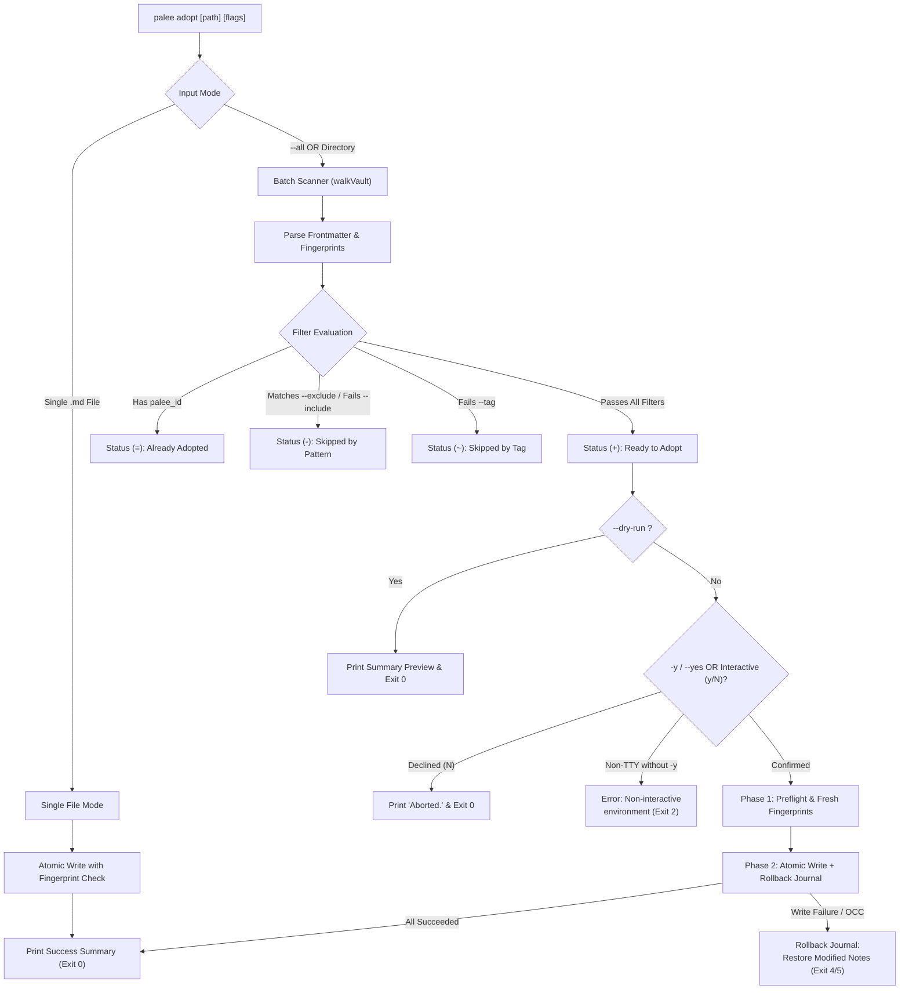
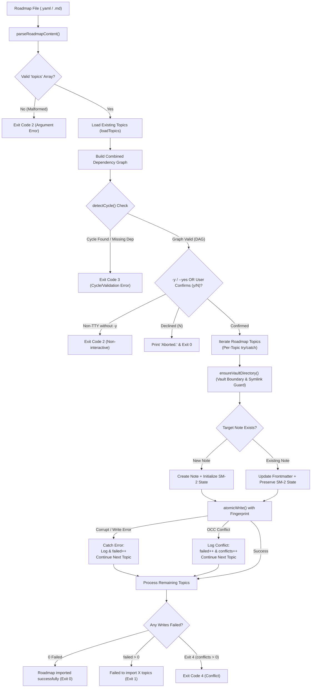

# Topic Management Commands

<details>
<summary><b>Relevant Source Files</b></summary>

- [src/cli/adopt.ts](https://github.com/Kuldeep2822k/cli/blob/main/src/cli/adopt.ts)
- [src/cli/roadmap.ts](https://github.com/Kuldeep2822k/cli/blob/main/src/cli/roadmap.ts)
- [src/cli/migrate.ts](https://github.com/Kuldeep2822k/cli/blob/main/src/cli/migrate.ts)
- [src/storage/frontmatter.ts](https://github.com/Kuldeep2822k/cli/blob/main/src/storage/frontmatter.ts)
- [src/storage/pattern-matcher.ts](https://github.com/Kuldeep2822k/cli/blob/main/src/storage/pattern-matcher.ts)
- [src/storage/roadmap-parser.ts](https://github.com/Kuldeep2822k/cli/blob/main/src/storage/roadmap-parser.ts)
- [src/engine/dependency.ts](https://github.com/Kuldeep2822k/cli/blob/main/src/engine/dependency.ts)
- [src/types.ts](https://github.com/Kuldeep2822k/cli/blob/main/src/types.ts)
- [test/cli-adopt-batch.test.ts](https://github.com/Kuldeep2822k/cli/blob/main/test/cli-adopt-batch.test.ts)
- [test/cli-commands.test.ts](https://github.com/Kuldeep2822k/cli/blob/main/test/cli-commands.test.ts)
- [test/storage-pattern-matcher.test.ts](https://github.com/Kuldeep2822k/cli/blob/main/test/storage-pattern-matcher.test.ts)
- [test/types-difficulty.test.ts](https://github.com/Kuldeep2822k/cli/blob/main/test/types-difficulty.test.ts)

</details>

Topic management commands handle the ingestion, configuration, and structural lifecycle of learning material within an Obsidian vault. These commands allow you to adopt existing Markdown notes as tracked PALEE topics, batch-import structured curricula via YAML roadmaps, and verify metadata schema consistency across your vault.

---

## 1. Topic Adoption (`palee adopt`)

The `palee adopt` command inspects Markdown notes, resolves display titles, and injects required PALEE tracking frontmatter (`palee_id`, `palee_schema`, `difficulty`, `depends_on`, and initial SM-2 defaults). Adoption is strictly non-destructive: all existing note bodies, Obsidian tags, and custom YAML frontmatter properties are preserved. A `difficulty` the note already declares is kept, and is overridden only by `--difficulty`. An assessment pillar the note does not carry is left out of the frontmatter rather than written as `0`: a note adopted with `topic_mastery: 0.68` and no pillars stays consistent, instead of reporting mastery drift that `validate --fix` has no repairer for. In batch mode, a note whose frontmatter will not parse is named on stderr and skipped — the rest of the batch adopts (INV-11).

### Adoption Modes

`palee adopt` operates in three distinct modes based on CLI arguments:

#### Mode 1: Single File Adoption
Adopts an individual Markdown file, allowing manual assignment of difficulty and prerequisite dependencies:
```bash
# Adopt a single note with custom difficulty and prerequisite dependency
palee adopt "Data-Structures/Recursion.md" --difficulty advanced --depends-on "T-01-basics"
```

#### Mode 2: Scoped Directory Batch Adoption
Recursively scans and adopts all untracked Markdown notes located within a specific directory subtree:
```bash
# Adopt all notes under MODULES/02-linux with intermediate difficulty
palee adopt "MODULES/02-linux" --difficulty intermediate -y
```

#### Mode 3: Vault-Wide Batch Adoption
Scans the entire configured vault for untracked Markdown files:
```bash
# Adopt all untracked notes across the entire vault
palee adopt --all -y
```

---

### Options Reference for `palee adopt`

The following table lists every supported option for `palee adopt` [src/types.ts `AdoptOptions`](https://github.com/Kuldeep2822k/cli/blob/main/src/types.ts):

| Flag / Argument | Type | Default | Description | Example |
| :--- | :--- | :--- | :--- | :--- |
| `[path]` | `string` | `undefined` | Path to a single `.md` file or directory relative to the vault root. | `palee adopt "DSA/Trees.md"` |
| `--all` | `boolean` | `false` | Scan and adopt all untracked Markdown files across the entire vault. | `palee adopt --all` |
| `--difficulty <level>` | `string` | the note's own `difficulty`, else `intermediate` | Set difficulty tier: `beginner`, `intermediate`, `advanced`, or numeric `1`..`5` (`1` $\to$ beginner, `2-3` $\to$ intermediate, `4-5` $\to$ advanced). Absent, a hand-authored `difficulty` on the note is preserved. | `--difficulty advanced` |
| `--depends-on <ids>` | `string` | `""` | Comma-separated list of prerequisite topic IDs (available in single-file mode only). | `--depends-on "T-01-basics,T-02-memory"` |
| `--include <patterns>` | `string` | `undefined` | Comma-separated inclusion glob patterns. Files matching at least one pattern are included. | `--include "0[1-4]-*,lab-*,deep-dive*"` |
| `--exclude <patterns>` | `string` | `undefined` | Comma-separated exclusion glob patterns. Files matching any pattern are skipped. | `--exclude "*template*,*rubric*,*draft*"` |
| `--tag <tags>` | `string` | `undefined` | Comma-separated Obsidian frontmatter tags to filter. Supports hierarchical matching. | `--tag "type/concept,status/ready"` |
| `--auto-chain` | `boolean` | `false` | Batch-only: derive each note's `depends_on` from the numbered tree and, when `--chain-tier toc|full` is asked for, the repo's README/SUMMARY enumeration (see §4). Takes no value, so the adoption path may follow it. Conflicts with `--depends-on` and single-file mode. | `palee adopt "MODULES" --auto-chain -y` |
| `--chain-tier <tier>` | `string` | unset (⇒ `strict`) | Which order signal `--auto-chain` may consume: `strict`, `toc`, or `full`. An unknown value exits `2`, and using it without `--auto-chain` exits `2`. | `palee adopt "MODULES" --auto-chain --chain-tier strict -y` |
| `--dry-run` | `boolean` | `false` | Simulate adoption, print summary preview, and exit with code 0 without modifying any files. | `palee adopt --all --dry-run` |
| `--verbose` | `boolean` | `false` | Output detailed file-by-file status list with indicator prefixes (`+`, `=`, `-`, `~`, `!` for Tier-0 hygiene skips). | `palee adopt "MODULES" --verbose` |
| `-y, --yes` | `boolean` | `false` | Automatically confirm adoption prompt without interactive terminal confirmation. | `palee adopt --all -y` |

---

### Implementation & Safety Architecture

The adoption engine [src/cli/adopt.ts](https://github.com/Kuldeep2822k/cli/blob/main/src/cli/adopt.ts) executes several safety checks and validation algorithms:

#### 1. Vault Boundary & Symlink Defense
Resolves the canonical path of target files and directories using `fs.realpathSync`. If a path or symlink targets a location outside the configured `vaultPath`, execution is halted immediately with exit code `2`.

#### 2. Three-Tier Title Resolution Algorithm
When adopting a note, PALEE resolves a human-readable title via `resolveNoteTitle()` [src/storage/note-title.ts](https://github.com/Kuldeep2822k/cli/blob/main/src/storage/note-title.ts):
1. **Tier 1: Frontmatter `title`**: Uses existing YAML `title` property if non-empty.
2. **Tier 2: First Level-1 Heading (`# Title`)**: Scans Markdown body for the first H1 heading, ignoring HTML comments (`<!-- ... -->`) and fenced code blocks (```` ``` ```` and `~~~`).
3. **Tier 3: Filename Basename**: Falls back to the filename without the `.md` extension.

#### 3. Pattern Matching & Hierarchical Tag Filtering
- **Glob Matching**: The pattern engine [src/storage/pattern-matcher.ts](https://github.com/Kuldeep2822k/cli/blob/main/src/storage/pattern-matcher.ts) supports prefix wildcards, infix wildcards (`0[1-4]-*`), and recursive subtree traversal (`**/*.md`).
- **3-Tier Tag Hierarchy**: Matches nested Obsidian tags. Filtering by `--tag "devops"` matches `#devops`, `#devops/k8s`, and `#devops/k8s/networking`. Both `#tag` and `tag` syntax are normalized automatically.

#### 4. Dependency Auto-Chaining (`--auto-chain`)

Batch-only flag that wires `depends_on` automatically from the vault's directory structure [src/engine/auto-chain.ts](https://github.com/Kuldeep2822k/cli/blob/main/src/engine/auto-chain.ts):

1. **Tier-0 hygiene filters**: before anything is ordered, each note is classified `backbone`, `leaf`, or `excluded` by the fs-free predicates in [src/engine/tier0-hygiene.ts](https://github.com/Kuldeep2822k/cli/blob/main/src/engine/tier0-hygiene.ts) (INV-46). Repo-meta names (`LICENSE`, `CONTRIBUTING`, `CHANGELOG`, `CODE_OF_CONDUCT`, `SECURITY`, …), translation copies of them (a `translations/` path segment, or a locale suffix on a *generic* doc name such as `README.ko-KR.md`, `README-zh-Hans.md`, `README.cn.md`), and template notes are excluded: they are neither adopted nor chained, so `LICENSE.md` can never become a prerequisite of lesson 1. Templates match as a whole name token and a numbered name is exempt, so `note-template.md` and everything under `templates/` are excluded while `03-cpp/02-templates.md` and a `04-jinja-templates/` directory stay lessons. Everything under a phase directory (`solution/`, `solutions/`, `your-work/`, `start/`, `sketch/`, `answers/`) collapses to leaves, as does a locale suffix on a name that is not generic — `assignment.es.md` may be a genuine Spanish assignment, so the suffix demotes it rather than dropping it — and within a directory only content docs — README-class, numeric-prefixed, or `deep-dive|lab|exam|assignment|quiz|solution`-prefixed — join the backbone, so ad-hoc siblings like `for-teachers.md` hang off the chain rather than gating it. A `leaf` may keep a predecessor but nothing chains after it in the numbered tier; the backbone bridges over it (see item 4 for the TOC tier's different rule). The failure direction is always demote-to-leaf, never chain-as-a-lesson, which is why `01-os.md` and `01-x/02-guide-js.md` stay lessons and a bare `guide-js.md` is a leaf rather than an excluded translation: the `js` token is never read as Japanese, and a stem that parses as a number is exempt from the locale arm entirely (`02-es.md` is lesson 2, Elasticsearch). A `palee_id` that is truthy but not a usable string (e.g. `palee_id: 12345`) is skipped with a counted reason instead of becoming an unsatisfiable predecessor that blocks the rest of the chain; its frontmatter is never rewritten.
2. **Ordering**: Notes are grouped by immediate parent directory. Inside the hygiene planner a directory leads with its README-class doc, then sorts by numeric filename prefix, then `deep-dive` → `lab` → `exam`, then remaining docs, with homework (`assignment`/`quiz`/`solution`) deliberately LAST so it never gates the lessons that follow (PAL-205-C1, landed jointly with the PAL-205-B rework); an alphabetical transition between unnumbered sibling directories no longer gates at all — each such directory opens its own chain — while numbered cross-module bridges are kept. The public `compareLessonOrder` shipped with Work Order A is intentionally unchanged. Directory groups sort by numeric prefix; unnumbered names sort alphabetically after numbered ones at the same segment level. The alphabetical warning reports two separate conditions and prints neither when both are absent: the notes whose position came from their name (`planAutoChainWithHygiene.alphabeticalNotes` — no numeric prefix, no phase keyword, not README-class, not homework), counted with up to three example paths; and, as its own clause, directories that carry no numeric prefix at a segment level where two directories differ (`directoryOrderAlphabetical`). A README-class or homework note is never counted, so a fully numbered curriculum that carries module READMEs produces no warning, and a lone shared container like `MODULES/` still does not trigger one on its own. Three further rules keep the warning honest about decisions that were not alphabetical: the vault-root group never contributes to the directory clause, because the hygiene plan hoists it to the front on purpose (PAL-205-G2), and after the TOC tier runs both claims are recomputed over the paths the enumeration did not cover — notes your own README sequenced are never reported as ordered by name, and are never offered as `--exclude` candidates. The directory clause also consults only the first segment at which a pair differs, mirroring how `compareDirs` settles their order there and stops: `01-a/deep-dive` beside `02-b/lab` is decided by `01`/`02`, so the unnumbered deeper names are not a fallback, while `01-a/deep-dive` beside `01-a/lab` genuinely is one and still reports. A numeric prefix must be followed by a separator (`-`, `_`, `.`, space) or end the name, and is at most three digits: `01-intro.md` and `7.md` are lessons 1 and 7, while `3d-printing.md`, `01foundations.md` and `2024-recap.md` are not lesson numbers and chain as unnumbered notes.
3. **Chaining**: Each note depends on its predecessor in the ordered list; the first note of a module depends on the last note of the previous module only when the cross-directory transition is justified by structure — a numbered module bridge, a nesting relation, or the owner-ruled vault-root bridge (the root README gates into the first numbered module at any depth, so `MODULES/01-foundations/…` qualifies exactly as `01-foundations/…` does, PAL-205-G2; a root note reaching a directory that states no lesson number at any level still refuses) (item 2). Alphabetical order between unnumbered sibling directories never bridges: each such directory opens its own chain. Excluded or already-adopted notes are bridged over, never rewritten.
4. **TOC tier (PAL-205-C, `--chain-tier toc|full`)**: Notes the numbered tree does not cover are chained from the repo's own enumeration — `README.md`/`SUMMARY.md` documents at the vault root and inside visible, non-phase directories [src/storage/toc.ts](https://github.com/Kuldeep2822k/cli/blob/main/src/storage/toc.ts). Markdown links become the chain in the author's document order, which the same-directory resort reshapes only where a stated order outranks position (README-class, numeric prefixes, `deep-dive` → `lab` → `exam`, homework last; equal ranks keep document order). Folder links → `<dir>/README.md`, trailing slashes deduped, anchors stripped, `%20` decoded with no raw fallback, `<angle bracket paths>` parsed, balanced parentheses retained inside a bare destination so `notes/intro(v2).md` resolves rather than truncating, `isWithinVault` rejects `..` escapes, ambiguous/missing/out-of-scope targets skipped fail-closed and counted, backslashes literal, and links inside a fenced code example excluded — a README documenting link syntax is not enumerating the curriculum. This is the deliberate exception to the leaf rule in item 1: an ordinary leaf may be a TOC predecessor, because the enumeration states that order rather than inferring it, while notes hygiene excludes and phase-subtree and translation demotions are never TOC candidates. Numbering dominance: where both endpoints live in the numbered tree, numbering wins even if a README enumerates otherwise. Every written edge points strictly backward in its tier's own order, and the merged plan is asserted acyclic in code before any write — including the case where a TOC head would keep a numbered edge that loops back through a note the enumeration never mentioned. Edges record their author in the additive optional `depends_on_source` frontmatter field. The domain is `numbered`, `toc`, `declared` or `tie`, and the field decides gating: `toc` and `tie` are advisory, so such an edge still ranks a note and still takes part in cycle detection without ever holding it off the ready list, while an absent or unrecognized label gates fail-closed. Old builds parse the field without rejecting it.
5. **Tiers and honest refusal**: `--auto-chain` is a batch-only boolean and `--chain-tier` selects how far it reaches: `strict` chains only the numbered tree (TOC is never consumed), the default is `strict`, and a value outside the three — or `--chain-tier` without `--auto-chain` — exits `2`. The tier is not an optional value on the flag itself, because an optional-value flag takes the following token and would read the adoption path in `palee adopt --auto-chain MODULES` as a tier; a directory named `toc`, `strict` or `full` would likewise be indistinguishable from a tier. `toc` and `full` currently produce identical plans — both chain the unnumbered remainder from the repo's own enumeration — and only `strict` differs. When the scope has no numbered layout, its scoped README/SUMMARY enumeration resolves no TOC link at all, and the plan writes zero edges, the CLI prints `0 edges (no numbered layout, no chainable order signal) — consider palee roadmap` and exits `0` rather than fabricating prerequisites; a README that does enumerate its notes keeps their justified numbered edges (PAL-205-C rework), so the refusal never fires on a real enumeration. `strict` declining a TOC that does exist is a configuration choice and says so with its own wording instead - `0 edges (no numbered layout; --chain-tier strict does not read a README enumeration) - try --chain-tier toc` - so the two ways a plan can chain nothing never read as each other.
6. **Pre-write validation**: Topic IDs are minted before planning, and the planned edges — merged with already-adopted vault topics — are checked with the existing cycle detector. On a cycle the command exits `3` and writes nothing (INV-46), reporting each cycle by vault-relative path (`coursepages/a/README.md (T-…) → coursepages/b/README.md (T-…)`) with `palee validate` named as the way to locate the offending edges. Because a chain edge always points backward in the plan's total order onto an id that nothing pre-existing can name, a cycle reported here is never one the chain created.
7. **Conflicts**: `--auto-chain` conflicts with `--depends-on` and with single-file mode (both exit `2`). `--dry-run` prints exactly the edges the commit will write — notes already adopted in scope are listed separately as bridged predecessors, never as edges — and writes nothing. Both the dry-run and the confirmation screen print the Tier-0 hygiene block: backbone count, leaf count, skipped-by-rule counts (meta / translations / template), phase-subtree collapses, the invalid-`palee_id` count when non-zero, and the excluded total; when filtering leaves nothing at all to adopt, the block closes with a pointer to direct adoption (a scope whose survivors are all demoted leaves still produces a plan, and does not get that pointer). Auto-chain reporting spans two lines. Before the gate, the `Auto-chain:` line names the selected tier and the edges the run will write, split by authoring tier — `Auto-chain:       enabled (full tier - 4 edge(s) written: 2 numbered, 1 toc, 1 tie (advisory))` - the tie bucket appears only when a tie was written, and a run that read any note's own `## Prerequisites` prints a separate `Declared:         N edge(s) from the notes' own prerequisite text` line, carrying `(M name(s) resolved to no single note)` when some matched nothing or matched two. A plan that opens chains prints a third line, `Unchained:         N note(s) the chain gave no predecessor, so their `depends_on` stays empty and nothing gates them`, so a chain head is counted on its own line rather than being implied by the edge total, and a bridged already-adopted note is never rewritten and is listed separately; a refusal prints `Auto-chain:       0 edges (…)` here instead (item 5). After a successful commit, a separate `Auto-chained:` line reports what landed — `Auto-chained: 4 dependency edges wired across 6 notes.` — where the edge count is the same number the plan promised and the note count is every file written, heads included. `--dry-run` prints the first line only, never the second. TOC resolution records each link that reaches path resolution with its reason (`escaped-vault` / `missing` / `ambiguous` / `outside-scope`) in `TocEnumeration.skipped` [src/storage/toc.ts](https://github.com/Kuldeep2822k/cli/blob/main/src/storage/toc.ts); a link rejected earlier, while its destination is being parsed (`external`, `self-anchor`, `malformed`, `empty`), never becomes a path candidate and is not recorded. These counts are currently plan-data only and are printed on no CLI screen, so "skipped fail-closed and counted" (item 4) is verifiable in the API but not yet visible to the learner; surfacing them in `--verbose` is an open follow-up.

**Known issues (documented, non-blocking):**
- *Cosmetic warning seam (PAL-205-B6)*: the "…have no number or phase in their name and chain in alphabetical order" warning is computed from the plan and still prints immediately above a true-refusal `0 edges` line — a scope holding a single unnumbered note does exactly this, since the note is alphabetically ordered yet yields no edge. Display-order only; the edge plan and exit code are unaffected.

```bash
# Preview the exact depends_on edges before committing
palee adopt "MODULES" --auto-chain --dry-run
```

#### 5. Two-Phase Atomic Batch Writer & Rollback Journal
In batch mode, adoption executes in two strict phases:
- **Phase 1 (Preflight)**: Re-reads every note to capture fresh SHA-256 content fingerprints and computes updated frontmatter structures in memory.
- **Phase 2 (Execution & Rollback)**: Writes notes sequentially via atomic write operations (`.tmp` + rename). If any write fails (e.g. disk error or OCC conflict), the system executes a reverse rollback journal, restoring previously modified files to their original state before exiting.


```mermaid
flowchart TD
    Start["palee adopt [path] [flags]"] --> CheckMode{"Input Mode"}
    
    CheckMode -->|"Single .md File"| SingleFlow["Single File Mode"]
    CheckMode -->|"--all OR Directory"| BatchFlow["Batch Scanner (walkVault)"]
    
    BatchFlow --> ParseLoop["Parse Frontmatter & Fingerprints"]
    ParseLoop --> FilterCheck{"Filter Evaluation"}
    
    FilterCheck -->|"Has palee_id"| SkipAdopted["Status (=): Already Adopted"]
    FilterCheck -->|"Matches --exclude / Fails --include"| SkipPattern["Status (-): Skipped by Pattern"]
    FilterCheck -->|"Fails --tag"| SkipTag["Status (~): Skipped by Tag"]
    FilterCheck -->|"Passes All Filters"| Staged["Status (+): Ready to Adopt"]
    
    Staged --> DryCheck{"--dry-run ?"}
    DryCheck -->|"Yes"| PrintDry["Print Summary Preview & Exit 0"]
    DryCheck -->|"No"| ConfirmCheck{"-y / --yes OR Interactive (y/N)?"}
    
    ConfirmCheck -->|"Declined (N)"| Abort["Print 'Aborted.' & Exit 0"]
    ConfirmCheck -->|"Non-TTY without -y"| ErrTTY["Error: Non-interactive<br/>environment (Exit 2)"]
    ConfirmCheck -->|"Confirmed"| Phase1["Phase 1: Preflight & Fresh Fingerprints"]
    
    Phase1 --> Phase2["Phase 2: Atomic Write + Rollback Journal"]
    Phase2 -->|"All Succeeded"| Done["Print Success Summary (Exit 0)"]
    Phase2 -->|"Write Failure / OCC"| Rollback["Rollback Journal:<br/>Restore Modified Notes (Exit 4/5)"]
    SingleFlow --> AtomicSingle["Atomic Write with Fingerprint Check"]
    AtomicSingle --> Done
```

---

## 2. Roadmap Import (`palee roadmap`)

The `palee roadmap` command enables automated, bulk creation and updates of learning topics from a structured curriculum definition file. It validates the entire curriculum graph before writing a single file to disk.

### Supported File Formats

`palee roadmap` automatically identifies and parses four curriculum formats [src/storage/roadmap-parser.ts](https://github.com/Kuldeep2822k/cli/blob/main/src/storage/roadmap-parser.ts):

#### 1. Pure YAML (`.yaml` / `.yml`)
```yaml
title: Cloud Architect Curriculum
topics:
  - id: T-networking-basics
    title: TCP/IP and OSI Model
    path: Cloud/01-networking.md
    difficulty: beginner
    order: 1
  - id: T-vpc-peering
    title: VPC Architecture and Peering
    path: Cloud/02-vpc-peering.md
    difficulty: intermediate
    order: 2
    depends_on:
      - T-networking-basics
```

The optional `order` field is the input `palee roadmap --auto-chain` chains on (INV-47): topics are visited in ascending `order`, topics without one keep their file order and are appended after the ordered ones, each chained topic gets the previous topic's ID in `depends_on` (the first gets `[]`), and a topic that already declares a non-empty `depends_on` — or arrives pre-chained from the wikilink format — is left alone. An edge that would close a cycle against an authored dependency is dropped instead, warned about as `chain edge X -> Y skipped: would close a cycle`, and the topic starts a new chain there, so the rest of the roadmap still imports. The `Auto-chain: N chain edge(s) synthesized across M roadmap topics.` summary is printed only after graph validation passes, counting only edges actually synthesized (PAL-205-A6; INV-47).

#### 2. Markdown with Frontmatter YAML (`.md`)
```markdown
---
title: Full-Stack Web Development Roadmap
topics:
  - id: T-html-css
    title: HTML5 and Semantic CSS
    path: Web/01-html-css.md
    difficulty: beginner
  - id: T-js-async
    title: Asynchronous JavaScript and Promises
    path: Web/02-async-js.md
    difficulty: intermediate
    depends_on: [T-html-css]
---

# Curriculum Notes
Additional study notes and learning recommendations for the roadmap...
```

#### 3. Markdown with Embedded YAML Code Blocks (`.md`)
````markdown
# Kubernetes Study Guide

```yaml
topics:
  - id: T-docker-containers
    title: Containerization with Docker
    path: DevOps/Docker.md
    difficulty: beginner
  - id: T-k8s-pods
    title: Kubernetes Pods and Deployments
    path: DevOps/K8s-Pods.md
    difficulty: intermediate
    depends_on: [T-docker-containers]
```
````

#### 4. Wikilink Roadmap (`.md`)

A Markdown document marked `palee_roadmap: true` whose headings and bullet/numbered lists contain Obsidian wikilinks — one note per link, in list order. Each `##` heading starts a new chain section; deeper levels (`###` and below) do not — their bullets keep extending the enclosing `##` chain. Each link resolves to a vault note and depends on the previous link in its section [src/storage/wikilink.ts](https://github.com/Kuldeep2822k/cli/blob/main/src/storage/wikilink.ts):

````markdown
---
palee_roadmap: true
---

# DevOps Roadmap

## Foundations

- [[DevOps/Docker]]
- [[Kubernetes Basics|K8s Intro]]
- [[networking#osi-model]]

## Advanced

1. [[k8s-pods]]
````

The `palee_roadmap: true` marker is required (INV-48) and must be the YAML boolean, not the string `'true'`. Any other `.md` passed to `--from` — including an ordinary note with a heading and `[[links]]` — is rejected with exit `2` and zero writes, so pointing the command at a regular note can never rewrite `depends_on` across the notes it links to. Deeper heading levels are excluded for the same reason: every `##` section head is written with `depends_on: []`, which clears the prerequisites a note already has.

Resolution is fail-closed (INV-48): exact vault-relative paths resolve first, then unique basenames folded for case and Unicode (exact-case wins ties; `café` composed matches a note stored decomposed); ambiguous links error listing every candidate, unresolvable links error, `#heading`/`#^block` anchors are stripped, and a note listed twice is rejected. Already-adopted notes keep their `palee_id` and SM-2 state; unadopted notes get minted IDs. A link whose target declares a `palee_id` the loader cannot use (a numeric id), or whose frontmatter will not parse, is an error naming that note rather than a minted ID: the identity the learner wrote is never replaced by an invented one. The wikilink chain replaces hand-written `depends_on` on adopted notes.

`--auto-chain` does not apply to this format (INV-47): each `##` section arrives already chained from its list order, so re-chaining the resolved topics would fuse independent tracks into a single chain.

---

### Options Reference for `palee roadmap`

The following table lists all options for `palee roadmap` [src/types.ts `RoadmapOptions`](https://github.com/Kuldeep2822k/cli/blob/main/src/types.ts):

| Flag | Type | Required | Description | Example |
| :--- | :--- | :---: | :--- | :--- |
| `--from <file>` | `string` | **Yes** | Path to the roadmap definition file (`.yaml`, `.yml`, or `.md`). | `palee roadmap --from "curricula/devops.yaml"` |
| `--auto-chain` | `boolean` | No | Chain YAML/frontmatter/codeblock topics by their `order` field (unordered topics keep file order, appended after ordered ones). Explicit non-empty `depends_on` wins. | `palee roadmap --from "curricula/devops.yaml" --auto-chain -y` |
| `-y, --yes` | `boolean` | No | Automatically confirm creation/update of notes without interactive prompt. | `palee roadmap --from "curricula/devops.yaml" -y` |

---

### Curriculum Validation & Graph Integrity Engine

Before performing file creation or modification, `roadmapCommand` executes a comprehensive preflight validation pass [src/cli/roadmap.ts#59-132](https://github.com/Kuldeep2822k/cli/blob/main/src/cli/roadmap.ts#L59-L132):

1. **Schema Structure**: Confirms the roadmap contains a valid `topics` list with non-empty `id`, `title`, and `path` fields.
2. **Duplicate Detection**: Verifies there are no duplicate `id` values or duplicate target `path` locations.
3. **Vault Boundary & Path Visibility**: Ensures all target topic paths reside within the vault boundary and do not escape via symlinked parent directories, and that each declared path is a note the rest of the CLI can see. A path with a dot-named segment, or one with no name before its extension, is rejected here: `path: .md` makes `path.extname('.md')` empty, so the writer creates a directory named `.md`, drops a note inside it, reports "Created: 1 notes" and exits `0` — while `walkVault` never lists anything under a dot-named segment, so no other command ever loads the note it promised to create.
4. **Identity Preservation**: A topic entry may not name a different `palee_id` for a note the vault already adopted. Writing a new id over that path retires the id every existing edge names, and a dependent note whose prerequisite resolves to nothing stays out of `palee plan` for good while `palee validate` counts a missing dependency only as a warning and exits `0`. Such an entry is rejected here with both ids and the note path named, and nothing is written; re-importing a roadmap under the ids its notes already carry is unaffected.
5. **Dependency Resolution**: Checks that every prerequisite ID in `depends_on` exists either in the roadmap or within existing vault notes.
6. **3-Color DFS Cycle Detection**: Runs cycle detection (`detectCycle`) to guarantee that the prerequisite graph forms a strict Directed Acyclic Graph (DAG). If a circular dependency exists (e.g. $A \to B \to C \to A$), the command rejects the import and exits with code `3`.

### Idempotent Updates, Safe Directory Management & Batch Resilience

Roadmap imports are designed for maximum resilience and idempotency:

1. **Lock-Synchronized Safe Directory Creation**: Target directory paths are created via `ensureVaultDirectory(vaultPath, topic.path)` [src/storage/vault-walker.ts](https://github.com/Kuldeep2822k/cli/blob/main/src/storage/vault-walker.ts). This utility validates path boundaries, prevents symlink escapes outside the vault root, and eliminates unhandled raw `fs.mkdirSync` failures.
2. **Per-Topic Try/Catch Isolation**: The note-reading, parsing, and atomic write operations for each roadmap topic execute within an isolated per-topic `try/catch` block inside `doImport()`. If a single target file contains corrupted frontmatter or suffers a localized I/O error:
   - The failure is captured and logged with the failing topic ID and target path (`- Failed <topic-id> (<path>): <error>`).
   - The failure counter is incremented (`failed++`).
   - The batch processor **continues uninterrupted**, successfully importing all remaining valid topics.
3. **Deterministic Batch Exit Codes**:
   - **Exit Code 0**: All topics created/updated successfully (`failed === 0`).
   - **Exit Code 1**: Partial batch failure (`failed > 0`), reporting exact counts of created, updated, and failed notes.
   - **Exit Code 4**: Optimistic Concurrency Control (OCC) collision during write (`isConflictError(err)`).
4. **Learning State Preservation**:
   - **New Topics**: Generates a stub Markdown note and initializes SM-2 tracking metadata with ease factor `2.5` and interval `1` day.
   - **Existing Topics**: Updates curriculum metadata (such as `title`, `difficulty`, `depends_on`), while **strictly preserving all existing user learning state** (`topic_mastery`, `conceptual`, `practical`, `debug`, `feynman`, `ease_factor`, `interval_days`, `repetition`, `lapses`, `last_reviewed_at`, `due_at`).


```mermaid
flowchart TD
    RoadmapFile["Roadmap File (.yaml / .md)"] --> Parser["parseRoadmapContent()"]
    Parser --> ValidStruct{"Valid 'topics' Array?"}
    
    ValidStruct -->|"No (Malformed)"| ErrStruct["Exit Code 2 (Argument Error)"]
    ValidStruct -->|"Yes"| LoadExisting["Load Existing Topics (loadTopics)"]
    
    LoadExisting --> GraphBuild["Build Combined Dependency Graph"]
    GraphBuild --> CycleCheck{"detectCycle() Check"}
    
    CycleCheck -->|"Cycle Found / Missing Dep"| ErrCycle["Exit Code 3 (Cycle/Validation Error)"]
    CycleCheck -->|"Graph Valid (DAG)"| PromptCheck{"-y / --yes OR User Confirms (y/N)?"}
    
    PromptCheck -->|"Non-TTY without -y"| ErrTTY["Exit Code 2 (Non-interactive)"]
    PromptCheck -->|"Declined (N)"| Abort["Print 'Aborted.' & Exit 0"]
    PromptCheck -->|"Confirmed"| ImportLoop["Iterate Roadmap Topics<br/>(Per-Topic try/catch)"]
    
    ImportLoop --> DirCheck["ensureVaultDirectory() (Vault Boundary & Symlink Guard)"]
    DirCheck --> PathCheck{"Target Note Exists?"}
    PathCheck -->|"New Note"| CreateNote["Create Note + Initialize SM-2 State"]
    PathCheck -->|"Existing Note"| UpdateNote["Update Frontmatter + Preserve SM-2 State"]
    
    CreateNote & UpdateNote --> AtomicOp["atomicWrite() with Fingerprint"]
    AtomicOp -->|"Corrupt / Write Error"| CatchErr["Catch Error:<br/>Log & failed++<br/>Continue Next Topic"]
    AtomicOp -->|"OCC Conflict"| CatchOCC["Log Conflict:<br/>failed++ & conflicts++<br/>Continue Next Topic"]
    CatchErr --> NextTopic["Process Remaining Topics"]
    CatchOCC --> NextTopic
    AtomicOp -->|"Success"| NextTopic
    NextTopic --> FinalResult{"Any Writes Failed?"}
    
    FinalResult -->|"0 Failed"| Success["Roadmap imported successfully (Exit 0)"]
    FinalResult -->|"failed > 0"| PartialFail["Failed to import X topics (Exit 1)"]
    FinalResult -->|"Exit 4 (conflicts > 0)"| ConflictExit["Exit Code 4 (Conflict)"]
```

---

## 3. Schema Migration and Label Repair (`palee migrate`)

The `palee migrate` command scans the vault and validates that all tracked topics adhere to the current schema specification (`palee_schema: 1`) [src/cli/migrate.ts](https://github.com/Kuldeep2822k/cli/blob/main/src/cli/migrate.ts). It also repairs one specific historical wrong: prerequisite edges that were stored as gating when the numbering never decided them. The label audit runs first, over the same scan, before the schema report.

### Execution Flow
1. Recursively discovers all Markdown files in the vault using `walkVault`.
2. Inspects the `palee_schema` field in note frontmatter.
3. Reports statistics:
   - **Schema v1**: Notes adhering to current specification.
   - **Unrecognized Schema**: Notes with missing or unsupported schema versions.
4. If all notes are valid schema v1, exits with code `0`. If unrecognized schemas are detected, exits with code `3`.

```bash
$ palee migrate
Scanning vault for PALEE schema versions...

Schema v1: 42 notes

[OK] All notes are schema v1 - no migration needed
```

### Relabelling stored ties (`--relabel-ties`)

`palee adopt --auto-chain` used to record an alphabetical tiebreak — two same-rank siblings such as `02-a.md` and `02-b.md`, where the numbering decided nothing and the filenames did — as `depends_on_source: numbered`, and `numbered` **gates**. Since #234 that edge is written as `tie`, which is advisory: it ranks a note and takes part in cycle detection but never holds it off `palee plan` (INV-46). A vault adopted before #234 still stores the old label, and `adopt` deliberately never rewrites an adopted note, so a learner can stay locked behind an edge no plan ever authored (#237).

`--relabel-ties` recomputes only the *provenance* of already-stored edges. It writes one key and nothing else.

| Flag | Behaviour |
| :--- | :--- |
| `--relabel-ties` | Rewrite a demotable `numbered` label to `tie`. `depends_on` is never added to, dropped from, or reordered, and no other frontmatter is touched. |
| `--include-unlabeled-ties` | Also reach notes carrying **no** `depends_on_source` key at all — the shape notes adopted before that label existed were left in. Opt-in because such a note is byte-identical whether the chain or a person wrote its list, so this writes a key that was never there rather than correcting one. |
| `--dry-run` | With `--relabel-ties`, print every note it would touch and write nothing. Unlike the audit preview, a dry run is never truncated to five. |

A note is demoted only when the numbered plan really could have produced its edge:

1. exactly **one** stored prerequisite, pointing **backward** in filename order;
2. that predecessor is a same-rank sibling in the **same directory** (`tiedByName` in `src/engine/auto-chain.ts`) — a cross-directory pair is not a claim the numbering made;
3. **no same-rank sibling still on disk sits strictly between them**: such a skipping edge the chain never wrote, so it keeps gating (#251). Deleting the middle note is what makes the edge adjacent again, and then it demotes;
4. the label is `numbered`, or absent with `--include-unlabeled-ties`. A label that is present but unrecognized (`depends_on_source: numbering`) is left alone — somebody edited it, and overwriting a typo is not this pass's call (#266).

The pass re-reads each note and its predecessor immediately before writing, so a vault that moves underneath it is refused rather than rewritten from a stale decision. Running it twice finds nothing the second time.

### What the report says

The audit (bare `palee migrate`, or with `--relabel-ties`) separates three populations, and says which one each note is in:

- **Demotable ties** — `Prerequisite labels: N note(s) gate behind a same-directory sibling`, with up to five paths (a dry run lists them all) and the tip naming the flag that actually reaches them, including `--include-unlabeled-ties` when unlabeled notes are present.
- **Unresolvable predecessors** — notes whose stored `numbered` edge names an id the vault no longer contains. There is no pair left to rank, so nothing is guessed at; the count is reported and `palee validate` is named as the report that owns the missing id.
- **Declined** — notes carrying a `numbered` label whose edge the numbered plan cannot produce: one storing more than one prerequisite, one pointing at the sibling the numbering puts *after* it, or one stepping over a sibling still in the directory. They stay gated, their labels stay exactly as stored, and they are **counted out loud** (#237) — a pass that declined and said nothing reads as a vault with nothing wrong in it.

After a write: `✓ Relabelled N of M notes to depends_on_source: tie`, annotated with any notes skipped because they changed while the pass held them, refused by a lock or conflict (re-run to retry), no longer present, or failed to write.

### Exit codes

| Code | Meaning for `migrate` |
| :--- | :--- |
| 0 | Nothing to repair, or every candidate relabelled. |
| 2 | Unconfigured or non-existent vault path. |
| 3 | Unrecognized schema version found (`palee_schema` missing or not `1`). |
| 4 | A write under `--fix` or `--relabel-ties` hit an OCC conflict or an active lock, or a note or its predecessor changed while the pass held it — re-run to retry. |
| 5 | A relabel or migration write failed for another reason (permissions, disk), so a caller never sees success on a migration that did not finish. |


---

## 4. Topic Management Exit Codes

Topic management commands follow the standardized PALEE exit code contract:

| Command | Exit Code 0 | Exit Code 1 | Exit Code 2 | Exit Code 3 | Exit Code 4 | Exit Code 5 |
| :--- | :--- | :--- | :--- | :--- | :--- | :--- |
| `palee adopt` | Note(s) adopted, dry-run rendered, or user declined confirmation (`N`). | N/A | Missing vault, note already adopted, path escapes vault, invalid `--difficulty`, invalid glob pattern, missing path without `--all`, or non-interactive stdin without `-y`. | `--auto-chain` planned dependency graph contains a cycle (or enumeration truncated) — exits before any write. | OCC conflict during atomic write (`isConflictError`). | Batch rollback error or unhandled file system exception. |
| `palee roadmap` | All roadmap topics created/updated successfully (`failed === 0`). | Partial batch import failure (`failed > 0` topic notes failed due to corrupt files/write errors). | Missing `--from`, file not found, malformed structure, path escapes vault, or non-interactive stdin without `-y`. | Roadmap validation error (missing ID/title/path, duplicate ID/path, invalid difficulty, a declared path no other command can see, missing dependency, an entry whose target note is already adopted under a different ID, cycle detected). | OCC conflict during atomic note write (`isConflictError`). | Unexpected runtime / I/O exception. |
| `palee migrate` | All notes verified to be schema v1. | N/A | Unconfigured or non-existent vault path. | Unrecognized schema version found (`palee_schema` missing or $\ne 1$). | A note update under `--fix` hit an OCC conflict or an active lock, or a note or its predecessor changed while a relabel pass held it — both are "re-run to retry". | Unexpected runtime exception or YAML parsing error. |

---

## 5. Technical Constants Reference

| Parameter | Value | Definition | Code Reference |
| :--- | :---: | :--- | :--- |
| **Topic ID Prefix** | `T-` | UTC date and time + 8-character hex entropy (32 bits): `T-YYYYMMDD-HHMMSS-<hex>`, e.g. `T-20260830-120000-a1b2c3d4`. The pre-#29 form `T-YYYYMMDDTHHMMSS-<hex>` stays valid for ids already minted in it. | [src/engine/topic-id.ts](https://github.com/Kuldeep2822k/cli/blob/main/src/engine/topic-id.ts) |
| **Default Ease Factor** | `2.5` | Initial SuperMemo SM-2 difficulty multiplier. | [src/cli/adopt.ts](https://github.com/Kuldeep2822k/cli/blob/main/src/cli/adopt.ts) |
| **Initial Interval** | `1` day | Spaced repetition review interval after initial adoption. | [src/cli/adopt.ts](https://github.com/Kuldeep2822k/cli/blob/main/src/cli/adopt.ts) |
| **Default Difficulty** | `intermediate` | Baseline topic complexity level. | [src/cli/adopt.ts#144](https://github.com/Kuldeep2822k/cli/blob/main/src/cli/adopt.ts#L144) |
| **Mastery Threshold** | `0.70` | Required mastery score to unlock dependent child topics. | [src/engine/dependency.ts](https://github.com/Kuldeep2822k/cli/blob/main/src/engine/dependency.ts) |
| **Schema Version** | `1` | Current PALEE metadata schema version. | [src/cli/adopt.ts](https://github.com/Kuldeep2822k/cli/blob/main/src/cli/adopt.ts) |