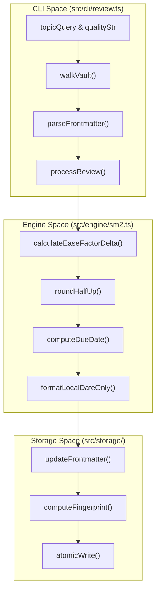

# Review and Scheduling Commands
Relevant source files

- [src/cli/config.ts](https://github.com/Kuldeep2822k/cli/blob/e8b70e0d/src/cli/config.ts)
- [src/cli/next.ts](https://github.com/Kuldeep2822k/cli/blob/e8b70e0d/src/cli/next.ts)
- [src/cli/plan.ts](https://github.com/Kuldeep2822k/cli/blob/e8b70e0d/src/cli/plan.ts)
- [src/cli/review.ts](https://github.com/Kuldeep2822k/cli/blob/e8b70e0d/src/cli/review.ts)
- [src/engine/dependency.ts](https://github.com/Kuldeep2822k/cli/blob/e8b70e0d/src/engine/dependency.ts)
- [src/engine/sm2.ts](https://github.com/Kuldeep2822k/cli/blob/e8b70e0d/src/engine/sm2.ts)
- [test/cli-commands.test.ts](https://github.com/Kuldeep2822k/cli/blob/e8b70e0d/test/cli-commands.test.ts)

This section covers the commands responsible for the active learning loop in PALEE: recording manual reviews, identifying due topics, and generating a structured learning plan. These commands interact with the SM-2 Spaced Repetition Engine and the Dependency Graph Engine to provide a deterministic, data-driven learning experience.

## Manual Review Recording (`palee review`)

The `palee review` command allows users to record the result of a manual study session for a specific topic. It updates the topic's Spaced Repetition System (SRS) state based on a quality rating (0–5).

### Implementation and Data Flow

When a review is initiated, the system performs a fuzzy search for the topic ID or title within the vault [src/cli/review.ts#38-54](https://github.com/Kuldeep2822k/cli/blob/e8b70e0d/src/cli/review.ts#L38-L54) If a single match is found, the current SRS state (ease factor, interval, repetitions, lapses) is extracted from the Markdown frontmatter [src/cli/review.ts#73-78](https://github.com/Kuldeep2822k/cli/blob/e8b70e0d/src/cli/review.ts#L73-L78)

The state transition is handled by the `processReview` function, which implements the SM-2 algorithm logic [src/engine/sm2.ts#36-101](https://github.com/Kuldeep2822k/cli/blob/e8b70e0d/src/engine/sm2.ts#L36-L101)

1. Algorithm Update: The new ease factor and interval are calculated. If the quality is $< 3$, the interval is reset to 1 day and the lapse count is incremented [src/engine/sm2.ts#65-72](https://github.com/Kuldeep2822k/cli/blob/e8b70e0d/src/engine/sm2.ts#L65-L72)
2. Date Calculation: The `due_at` date is computed by adding the new interval (in calendar days) to the current local time [src/engine/sm2.ts#121-126](https://github.com/Kuldeep2822k/cli/blob/e8b70e0d/src/engine/sm2.ts#L121-L126)
3. Atomic Write: The updated frontmatter is written back to the file using an atomic write process that includes a SHA-256 fingerprint check to prevent overwriting concurrent manual edits [src/cli/review.ts#91-93](https://github.com/Kuldeep2822k/cli/blob/e8b70e0d/src/cli/review.ts#L91-L93)

### Review State Logic association

The following diagram maps the CLI review flow to the underlying engine functions.

Diagram: Review Command Logic Flow

Sources:[src/cli/review.ts#22-113](https://github.com/Kuldeep2822k/cli/blob/e8b70e0d/src/cli/review.ts#L22-L113)[src/engine/sm2.ts#36-101](https://github.com/Kuldeep2822k/cli/blob/e8b70e0d/src/engine/sm2.ts#L36-L101)[src/storage/atomic-write.ts#1-20](https://github.com/Kuldeep2822k/cli/blob/e8b70e0d/src/storage/atomic-write.ts#L1-L20)

---

## Due Topic Selection (`palee next`)

The `palee next` command identifies topics that are currently due for review. It acts as a quick entry point for the user to know "what to study right now."

### Selection Logic

1. Discovery: The vault is walked, and all files with a `palee_id` are parsed [src/cli/next.ts#35-40](https://github.com/Kuldeep2822k/cli/blob/e8b70e0d/src/cli/next.ts#L35-L40)
2. Due Check: A topic is considered due if its `due_at` date is in the past or if it has never been reviewed (`due_at` is null/invalid) [src/cli/next.ts#42-57](https://github.com/Kuldeep2822k/cli/blob/e8b70e0d/src/cli/next.ts#L42-L57)
3. Prioritization: Topics are sorted such that those never reviewed appear first, followed by the most overdue topics (oldest `due_at` first) [src/cli/next.ts#87-92](https://github.com/Kuldeep2822k/cli/blob/e8b70e0d/src/cli/next.ts#L87-L92)

The command supports an `--all` flag to list every due topic or a default mode that displays only the single most urgent topic [src/cli/next.ts#120-145](https://github.com/Kuldeep2822k/cli/blob/e8b70e0d/src/cli/next.ts#L120-L145)

Sources:[src/cli/next.ts#23-154](https://github.com/Kuldeep2822k/cli/blob/e8b70e0d/src/cli/next.ts#L23-L154)

---

## Daily Learning Plan (`palee plan`)

The `palee plan` command generates a comprehensive overview of the user's learning state, categorized into reviews due and new topics ready to be learned.

### Dependency-Aware Readiness

Unlike `palee next`, which only looks at SRS metadata, `palee plan` utilizes the Dependency Graph Engine to filter new topics. It uses `getReadyTopics` to identify topics that the user is prepared to study [src/cli/plan.ts#87](https://github.com/Kuldeep2822k/cli/blob/e8b70e0d/src/cli/plan.ts#L87-L87)

A topic is "Ready to Learn" only if:

1. Its current mastery is below the threshold (default 0.7) [src/engine/dependency.ts#74](https://github.com/Kuldeep2822k/cli/blob/e8b70e0d/src/engine/dependency.ts#L74-L74)
2. All topics listed in its `depends_on` frontmatter field have reached the mastery threshold [src/engine/dependency.ts#49-65](https://github.com/Kuldeep2822k/cli/blob/e8b70e0d/src/engine/dependency.ts#L49-L65)

### Plan Organization

The plan is presented in three sections:

- Reviews Due: Sorted by due date [src/cli/plan.ts#90-95](https://github.com/Kuldeep2822k/cli/blob/e8b70e0d/src/cli/plan.ts#L90-L95)
- Ready to Learn: Sorted by difficulty (Beginner → Intermediate → Advanced) [src/cli/plan.ts#96-98](https://github.com/Kuldeep2822k/cli/blob/e8b70e0d/src/cli/plan.ts#L96-L98)
- Progress Summary: Aggregate counts of Mastered, Learning, and New topics [src/cli/plan.ts#167-171](https://github.com/Kuldeep2822k/cli/blob/e8b70e0d/src/cli/plan.ts#L167-L171)

Diagram: Scheduling Data Relationships

Sources:[src/cli/plan.ts#15-182](https://github.com/Kuldeep2822k/cli/blob/e8b70e0d/src/cli/plan.ts#L15-L182)[src/engine/dependency.ts#67-83](https://github.com/Kuldeep2822k/cli/blob/e8b70e0d/src/engine/dependency.ts#L67-L83)[src/types.ts#10-35](https://github.com/Kuldeep2822k/cli/blob/e8b70e0d/src/types.ts#L10-L35)

---

## Command Reference Summary

| Command | Primary Function | Key Engine Interaction |
| --- | --- | --- |
| `palee review <id> <0-5>` | Records a review result | `processReview` (SM-2) |
| `palee next [--all]` | Shows next overdue topic | Date comparison logic |
| `palee plan` | Generates daily schedule | `getReadyTopics` (DAG) |

### Error Handling

All scheduling commands exit with specific codes:

- Code 2: Invalid user input (e.g., quality rating not 0-5, vault path not set) [src/cli/review.ts#26-34](https://github.com/Kuldeep2822k/cli/blob/e8b70e0d/src/cli/review.ts#L26-L34)
- Code 5: Internal execution error or file system failure [src/cli/plan.ts#178](https://github.com/Kuldeep2822k/cli/blob/e8b70e0d/src/cli/plan.ts#L178-L178)

Sources:[src/cli/review.ts#1-116](https://github.com/Kuldeep2822k/cli/blob/e8b70e0d/src/cli/review.ts#L1-L116)[src/cli/next.ts#1-158](https://github.com/Kuldeep2822k/cli/blob/e8b70e0d/src/cli/next.ts#L1-L158)[src/cli/plan.ts#1-184](https://github.com/Kuldeep2822k/cli/blob/e8b70e0d/src/cli/plan.ts#L1-L184)