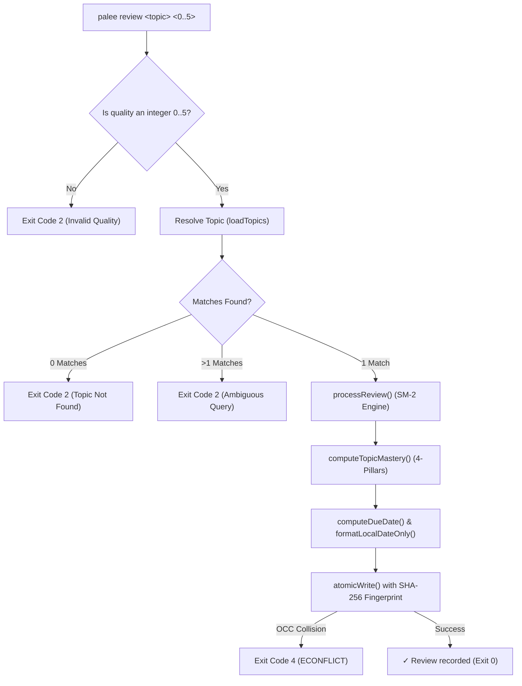

# Review and Scheduling Commands

<details>
<summary><b>Relevant Source Files</b></summary>

- [src/cli/review.ts](https://github.com/Kuldeep2822k/cli/blob/main/src/cli/review.ts)
- [src/cli/next.ts](https://github.com/Kuldeep2822k/cli/blob/main/src/cli/next.ts)
- [src/cli/plan.ts](https://github.com/Kuldeep2822k/cli/blob/main/src/cli/plan.ts)
- [src/engine/sm2.ts](https://github.com/Kuldeep2822k/cli/blob/main/src/engine/sm2.ts)
- [src/engine/dependency.ts](https://github.com/Kuldeep2822k/cli/blob/main/src/engine/dependency.ts)
- [src/engine/mastery.ts](https://github.com/Kuldeep2822k/cli/blob/main/src/engine/mastery.ts)
- [src/storage/atomic-write.ts](https://github.com/Kuldeep2822k/cli/blob/main/src/storage/atomic-write.ts)
- [test/cli-commands.test.ts](https://github.com/Kuldeep2822k/cli/blob/main/test/cli-commands.test.ts)
- [test/cli-json-output.test.ts](https://github.com/Kuldeep2822k/cli/blob/main/test/cli-json-output.test.ts)

</details>

The review and scheduling commands drive PALEE's active learning loop. They orchestrate spaced repetition calculations via the SuperMemo SM-2 algorithm, identify overdue topics, and build daily study schedules using the DAG Dependency Graph Engine.

---

## 1. Manual Review Recording (`palee review`)

The `palee review` command records active recall test results for a topic note, updating its Spaced Repetition System (SRS) state and computing the next review date (`due_at`).

### Command Syntax

```bash
palee review <topic> <quality>
```

### Arguments

| Argument | Type | Valid Values | Description | Example |
| :--- | :--- | :--- | :--- | :--- |
| `<topic>` | `string` | Non-empty string | Topic ID (e.g. `T-20260814T120000-abcd`) or unique case-insensitive title query substring. | `"Recursion"` |
| `<quality>` | `integer` | `0`, `1`, `2`, `3`, `4`, `5` | SuperMemo recall quality rating representing recall accuracy and effort. | `4` |

---

### SuperMemo SM-2 Quality Scale

PALEE implements the standard 6-point SuperMemo recall grading scale [src/cli/review.ts#20-25](https://github.com/Kuldeep2822k/cli/blob/main/src/cli/review.ts#L20-L25):

| Quality (`q`) | Recall Classification | Effect on SM-2 Interval | Effect on Ease Factor (`EF`) |
| :---: | :--- | :--- | :--- |
| **0** | **Complete Blackout** | Resets interval to `1` day, increments `lapses`. | Decreases `EF` substantially (-0.80). |
| **1** | **Incorrect (Familiar)** | Resets interval to `1` day, increments `lapses`. | Decreases `EF` (-0.54). |
| **2** | **Incorrect (Easily Recalled)** | Resets interval to `1` day, increments `lapses`. | Decreases `EF` slightly (-0.32). |
| **3** | **Correct (Serious Difficulty)** | Advances repetition count; interval multiplied by `EF`. | Decreases `EF` moderately (-0.14). |
| **4** | **Correct (Hesitation)** | Advances repetition count; interval multiplied by `EF`. | Keeps `EF` approximately stable (0.00). |
| **5** | **Perfect Recall** | Advances repetition count; interval multiplied by `EF`. | Increases `EF` by `+0.10`. |

---

### Review State Transition Logic

When `palee review` executes [src/cli/review.ts#58-115](https://github.com/Kuldeep2822k/cli/blob/main/src/cli/review.ts#L58-L115):

1. **Fuzzy Topic Resolution**: Discovers candidate notes by checking exact ID matches, ID substring matches, and case-insensitive title substring matches. If multiple notes match, it lists all candidates and exits with code `2` to prevent ambiguous writes.
2. **SM-2 State Calculation**:
   - **Ease Factor Delta**:
     ```text
     ΔEF = 0.1 - (5 - q) * (0.08 + (5 - q) * 0.02)
     EF_new = Math.max(1.30, roundHalfUp(EF_prev + ΔEF, 4))
     ```
   - **Interval Progression**:
     - Repetition 1: `I(1) = 1` day
     - Repetition 2: `I(2) = 6` days
     - Repetition `n >= 3`: `I(n) = Math.max(1, Math.round(I(n-1) * EF))`
   - If `q < 3` (failed recall): resets interval to `1` day and increments `lapses`.
3. **Mastery & Pillar Score Sync**: Normalizes conceptual, practical, debug, and Feynman pillar scores, recomputing `topic_mastery` via the 4-pillar mastery formula.
4. **Local Date Calculation**: Computes `due_at` by adding `interval_days` calendar days to current local date (`YYYY-MM-DD`).
5. **OCC-Protected Atomic Write**: Re-checks the note's SHA-256 fingerprint before writing to guarantee atomic consistency [src/storage/atomic-write.ts](https://github.com/Kuldeep2822k/cli/blob/main/src/storage/atomic-write.ts).



---

## 2. Overdue Topic Selection (`palee next`)

The `palee next` command surfaces topics currently due for review. It acts as the primary "what should I study right now?" entrypoint.

### Syntax & Options

```bash
palee next [flags]
```

| Flag | Type | Default | Description | Example |
| :--- | :--- | :--- | :--- | :--- |
| `--all` | `boolean` | `false` | Display all overdue topics in the queue instead of only the single highest-priority topic. | `palee next --all` |
| `--json` | `boolean` | `false` | Output results in structured JSON format (auto-activated in non-TTY environments). | `palee next --json` |

---

### Prioritization & Urgency Ranking

`palee next` walks the vault, parses topic frontmatter, and sorts candidates using a strict priority order [src/cli/next.ts#89-95](https://github.com/Kuldeep2822k/cli/blob/main/src/cli/next.ts#L89-L95):

1. **Unreviewed Topics**: Notes with `due_at: null` or invalid dates are ranked first (highest urgency).
2. **Overdue Topics**: Topics with `due_at <= now` are sorted chronologically by oldest `due_at` date first.
3. **Future Topics**: Topics whose review date is in the future are excluded from the queue.

### Example Outputs

#### Default Human-Readable Output (Single Next Topic)
```bash
$ palee next
Next topic due for review:

  Introduction to Rust
  ID: T-20260814T120000-abcd
  Due: Never reviewed
  Mastery: 0.00
  Repetitions: 0
  Path: Rust/01-intro.md
```

#### Queue Human-Readable Output (`--all`)
```bash
$ palee next --all
2 topic(s) due for review:

  T-20260814T120000-abcd - Introduction to Rust
    Due: Never reviewed | Mastery: 0.00 | Reps: 0
    Path: Rust/01-intro.md

  T-20260814T120100-efgh - Memory Ownership
    Due: 2026-08-20 | Mastery: 0.45 | Reps: 2
    Path: Rust/02-ownership.md
```

#### Piped JSON Output (Automatic Non-TTY Detection)
```bash
$ palee next | jq .
{
  "next": {
    "id": "T-20260814T120000-abcd",
    "title": "Introduction to Rust",
    "path": "Rust/01-intro.md",
    "due_at": null,
    "mastery": 0.0,
    "repetition": 0
  },
  "due_count": 2,
  "total_topics": 15
}
```

---

## 3. Daily Learning Plan (`palee plan`)

The `palee plan` command generates a comprehensive daily learning schedule, combining due reviews with new topics that have met prerequisite mastery requirements.

### Syntax & Options

```bash
palee plan [flags]
```

| Flag | Type | Default | Description | Example |
| :--- | :--- | :--- | :--- | :--- |
| `--json` | `boolean` | `false` | Output complete topological learning plan as JSON (auto-activated in non-TTY environments). | `palee plan --json` |

---

### Dependency-Aware Readiness Engine

Unlike `palee next` (which checks SRS review timestamps), `palee plan` leverages the DAG Dependency Graph Engine via `getReadyTopics()` [src/engine/dependency.ts#67-83](https://github.com/Kuldeep2822k/cli/blob/main/src/engine/dependency.ts#L67-L83).

A topic is categorized as **"Ready to Learn"** if and only if:
1. **Unmastered**: The topic's current `topic_mastery` is strictly below the mastery threshold (`< 0.70`).
2. **Prerequisites Satisfied**: Every topic listed in its `depends_on` frontmatter array exists in the vault and has achieved `mastery >= 0.70`.

### 3-Tier Plan Structure

The plan is organized into three distinct sections:
- **Reviews Due**: Topics requiring immediate spaced repetition recall, sorted chronologically by oldest `due_at`.
- **Ready to Learn**: New or developing topics whose prerequisites are fully satisfied, sorted by difficulty: `beginner` $\to$ `intermediate` $\to$ `advanced`.
- **Progress Summary**: Aggregate counts of Mastered ($\ge 0.70$), Learning ($0 < M < 0.70$), and New ($M = 0$) topics.

### Example Human-Readable Output

```bash
$ palee plan
=== Today's Learning Plan ===

Reviews Due: 1
  • Memory Ownership (T-20260814T120100-efgh) - Due: 2026-08-20

Ready to Learn: 2
  • Borrowing and Lifetimes (T-20260814T120200-ijkl) - intermediate
  • Smart Pointers (T-20260814T120300-mnop) - advanced

Progress Summary:
  Total Topics: 12
  Mastered (≥70%): 4
  Learning: 5
  New: 3
```

---

## 4. Exit Codes for Review & Scheduling Commands

| Command | Exit Code 0 | Exit Code 1 | Exit Code 2 | Exit Code 3 | Exit Code 4 | Exit Code 5 |
| :--- | :--- | :--- | :--- | :--- | :--- | :--- |
| `palee review` | Successfully recorded SM-2 review and calculated next interval and due date. | N/A | Quality rating not an integer `0..5`, unconfigured vault, topic not found, or ambiguous query. | N/A | OCC conflict during atomic write (`isConflictError`). | File write error or unexpected runtime exception. |
| `palee next` | Successfully displayed next due topic, all due topics (`--all`), or empty vault state. | N/A | Unconfigured or non-existent vault path. | N/A | N/A | Unexpected runtime exception or file read failure. |
| `palee plan` | Successfully displayed topological study plan or empty vault state. | N/A | Unconfigured or non-existent vault path. | N/A | N/A | Unexpected runtime exception or graph calculation failure. |