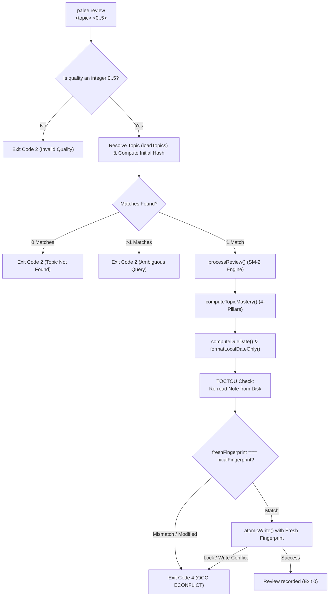

# Review and Scheduling Commands

<details>
<summary><b>Relevant Source Files</b></summary>

- [src/cli/review.ts](https://github.com/Kuldeep2822k/cli/blob/main/src/cli/review.ts)
- [src/cli/next.ts](https://github.com/Kuldeep2822k/cli/blob/main/src/cli/next.ts)
- [src/cli/plan.ts](https://github.com/Kuldeep2822k/cli/blob/main/src/cli/plan.ts)
- [src/engine/sm2.ts](https://github.com/Kuldeep2822k/cli/blob/main/src/engine/sm2.ts)
- [src/engine/dependency.ts](https://github.com/Kuldeep2822k/cli/blob/main/src/engine/dependency.ts)
- [src/engine/mastery.ts](https://github.com/Kuldeep2822k/cli/blob/main/src/engine/mastery.ts)
- [src/storage/atomic-write.ts](https://github.com/Kuldeep2822k/cli/blob/main/src/storage/atomic-write.ts)
- [test/cli-commands.test.ts](https://github.com/Kuldeep2822k/cli/blob/main/test/cli-commands.test.ts)
- [test/cli-json-output.test.ts](https://github.com/Kuldeep2822k/cli/blob/main/test/cli-json-output.test.ts)

</details>

The review and scheduling commands drive PALEE's active learning loop. They orchestrate spaced repetition calculations via the SuperMemo SM-2 algorithm, identify overdue topics, and build daily study schedules using the DAG Dependency Graph Engine.

---

## 1. Manual Review Recording (`palee review`)

The `palee review` command records active recall test results for a topic note, updating its Spaced Repetition System (SRS) state and computing the next review date (`due_at`).

### Command Syntax

```bash
palee review <topic> <quality>
```

### Arguments

| Argument | Type | Valid Values | Description | Example |
| :--- | :--- | :--- | :--- | :--- |
| `<topic>` | `string` | Non-empty string | Topic ID (e.g. `T-20260814T120000-abcd`), a unique case-insensitive title query substring, or the exact vault path the tool displayed for the note (e.g. `w/one.md`). | `"Recursion"` |
| `<quality>` | `integer` | `0`, `1`, `2`, `3`, `4`, `5` | SuperMemo recall quality rating representing recall accuracy and effort. | `4` |

---

### SuperMemo SM-2 Quality Scale

PALEE implements the standard 6-point SuperMemo recall grading scale [src/cli/review.ts#20-25](https://github.com/Kuldeep2822k/cli/blob/main/src/cli/review.ts#L20-L25):

| Quality (`q`) | Recall Classification | Effect on SM-2 Interval | Effect on Ease Factor (`EF`) |
| :---: | :--- | :--- | :--- |
| **0** | **Complete Blackout** | Resets interval to `1` day, increments `lapses`. | Decreases `EF` substantially (-0.80). |
| **1** | **Incorrect (Familiar)** | Resets interval to `1` day, increments `lapses`. | Decreases `EF` (-0.54). |
| **2** | **Incorrect (Easily Recalled)** | Resets interval to `1` day, increments `lapses`. | Decreases `EF` slightly (-0.32). |
| **3** | **Correct (Serious Difficulty)** | Advances repetition count; interval multiplied by `EF`. | Decreases `EF` moderately (-0.14). |
| **4** | **Correct (Hesitation)** | Advances repetition count; interval multiplied by `EF`. | Keeps `EF` approximately stable (0.00). |
| **5** | **Perfect Recall** | Advances repetition count; interval multiplied by `EF`. | Increases `EF` by `+0.10`. |

---

### Review State Transition Logic

When `palee review` executes [src/cli/review.ts#58-115](https://github.com/Kuldeep2822k/cli/blob/main/src/cli/review.ts#L58-L115):

1. **Topic Resolution**: Discovers candidate notes by checking exact ID matches, ID substring matches, and case-insensitive title substring matches. If multiple notes match, it lists all candidates and exits with code `2` to prevent ambiguous writes. If *nothing* matched, the query is compared once against each note's vault-relative path — `next` and `plan` print that path, so feeding the displayed identifier back is a valid lookup, not a refusal. The path comparison is exact after folding `\` to `/` (and case on Windows, where the filesystem does the same); because an ID or title hit is settled first, the path reading can never dislodge a match the learner already had (#313).
2. **SM-2 State Calculation**:
   - **Ease Factor Delta**:

     ```text
     ΔEF = 0.1 - (5 - q) * (0.08 + (5 - q) * 0.02)
     EF_new = Math.max(1.30, roundHalfUp(EF_prev + ΔEF, 4))
     ```

   - **Interval Progression**:
     - Repetition 1: `I(1) = 1` day
     - Repetition 2: `I(2) = 6` days
     - Repetition `n >= 3`: `I(n) = Math.max(1, Math.round(I(n-1) * EF))`
   - If `q < 3` (failed recall): resets interval to `1` day and increments `lapses`.
3. **Mastery & Pillar Score Sync**: Normalizes conceptual, practical, debug, and Feynman pillar scores, recomputing `topic_mastery` via the 4-pillar mastery formula.
4. **Local Date Calculation**: Computes `due_at` by adding `interval_days` calendar days to current local date (`YYYY-MM-DD`).
5. **OCC TOCTOU Race Elimination**: To eliminate Time-of-Check to Time-of-Use (TOCTOU) race windows between when the topic was initially loaded into memory and when the user finishes entering the review rating, `reviewCommand` re-reads the topic note from disk immediately prior to write:
   - Validates existence on disk.
   - Computes a fresh SHA-256 fingerprint from the newly read content.
   - Confirms `initialFingerprint === freshFingerprint`. If the note was modified on disk concurrently while awaiting user input, an `ECONFLICT` error is thrown immediately.
   - Passes the verified fresh fingerprint into `atomicWrite()`.
   - Cleanly catches concurrency errors using `isConflictError(e)` and exits with code `4`.


```mermaid
flowchart TD
    ReviewInput["palee review<br/>&lt;topic&gt; &lt;0..5&gt;"] --> ValRating{"Is quality an integer 0..5?"}
    ValRating -->|"No"| ErrRating["Exit Code 2 (Invalid Quality)"]
    ValRating -->|"Yes"| FindTopic["Resolve Topic (loadTopics) & Compute Initial Hash"]
    
    FindTopic --> MatchCheck{"Matches Found?"}
    MatchCheck -->|"0 Matches"| ErrNotFound["Exit Code 2 (Topic Not Found)"]
    MatchCheck -->|"&gt;1 Matches"| ErrAmbiguous["Exit Code 2 (Ambiguous Query)"]
    MatchCheck -->|"1 Match"| SM2Calc["processReview() (SM-2 Engine)"]
    
    SM2Calc --> MastSync["computeTopicMastery() (4-Pillars)"]
    MastSync --> DateCalc["computeDueDate() & formatLocalDateOnly()"]
    DateCalc --> PreWriteRead["TOCTOU Check:<br/>Re-read Note from Disk"]
    PreWriteRead --> HashMatch{"freshFingerprint === initialFingerprint?"}
    HashMatch -->|"Mismatch / Modified"| ErrOCC["Exit Code 4 (OCC ECONFLICT)"]
    HashMatch -->|"Match"| AtomicCommit["atomicWrite() with Fresh Fingerprint"]
    
    AtomicCommit -->|"Lock / Write Conflict"| ErrOCC
    AtomicCommit -->|"Success"| SuccessReview["Review recorded (Exit 0)"]
```

---

## 2. Overdue Topic Selection (`palee next`)

The `palee next` command surfaces topics currently due for review. It acts as the primary "what should I study right now?" entrypoint.

### Syntax & Options

```bash
palee next [flags]
```

| Flag | Type | Default | Description | Example |
| :--- | :--- | :--- | :--- | :--- |
| `--all` | `boolean` | `false` | Display all overdue topics in the queue instead of only the single highest-priority topic. | `palee next --all` |
| `--json` | `boolean` | `false` | Output results in structured JSON format (auto-activated in non-TTY environments). | `palee next --json` |

---

### Prioritization & Urgency Ranking

`palee next` walks the vault, parses topic frontmatter, and sorts candidates using a strict priority order [src/cli/next.ts#89-95](https://github.com/Kuldeep2822k/cli/blob/main/src/cli/next.ts#L89-L95):

1. **Unreviewed Topics**: Notes with `due_at: null` or invalid dates are ranked first (highest urgency).
2. **Overdue Topics**: Topics with `due_at <= now` are sorted chronologically by oldest `due_at` date first.
3. **Future Topics**: Topics whose review date is in the future are excluded from the queue.

### Example Outputs

#### Default Human-Readable Output (Single Next Topic)
```bash
$ palee next
Next topic due for review:

  Introduction to Rust
  ID: T-20260814T120000-abcd
  Due: Never reviewed
  Mastery: 0.0%
  Repetitions: 0
  Path: Rust/01-intro.md
```

#### Queue Human-Readable Output (`--all`)
```bash
$ palee next --all
2 topic(s) due for review:

  T-20260814T120000-abcd - Introduction to Rust
    Due: Never reviewed | Mastery: 0.0% | Reps: 0
    Path: Rust/01-intro.md

  T-20260814T120100-efgh - Memory Ownership
    Due: 2026-08-20 | Mastery: 45.0% | Reps: 2
    Path: Rust/02-ownership.md
```

#### Piped JSON Output (Automatic Non-TTY Detection)
```bash
$ palee next | jq .
{
  "next": {
    "id": "T-20260814T120000-abcd",
    "title": "Introduction to Rust",
    "path": "Rust/01-intro.md",
    "due_at": null,
    "mastery": 0.0,
    "repetition": 0
  },
  "due_count": 2,
  "total_topics": 15
}
```

---

## 3. Daily Learning Plan (`palee plan`)

The `palee plan` command generates a comprehensive daily learning schedule, combining due reviews with new topics that have met prerequisite mastery requirements.

### Syntax & Options

```bash
palee plan [flags]
```

| Flag | Type | Default | Description | Example |
| :--- | :--- | :--- | :--- | :--- |
| `--json` | `boolean` | `false` | Output complete topological learning plan as JSON (auto-activated in non-TTY environments). | `palee plan --json` |

---

### Dependency-Aware Readiness Engine

Unlike `palee next` (which checks SRS review timestamps), `palee plan` leverages the DAG Dependency Graph Engine via `getReadyTopics()` [src/engine/dependency.ts#67-83](https://github.com/Kuldeep2822k/cli/blob/main/src/engine/dependency.ts#L67-L83).

A topic is categorized as **"Ready to Learn"** if and only if:
1. **Unmastered**: The topic's current `topic_mastery` is strictly below the mastery threshold (`< 0.70`).
2. **Prerequisites Satisfied**: Every topic listed in its `depends_on` frontmatter array exists in the vault and has achieved `mastery >= 0.70` - unless the list is advisory, which `depends_on_source: toc` or `tie` marks: an edge that came from a README enumeration or from an equal-rank filename tie orders the plan and takes part in cycle detection, but never holds the topic out of this category.

### 3-Tier Plan Structure

The plan is organized into three distinct sections:
- **Reviews Due**: Topics requiring immediate spaced repetition recall, sorted chronologically by oldest `due_at`.
- **Ready to Learn**: New or developing topics whose prerequisites are fully satisfied, sorted by difficulty: `beginner` $\to$ `intermediate` $\to$ `advanced`.
- **Progress Summary**: Aggregate counts of Mastered ($\ge 0.70$), Learning ($0 < M < 0.70$), and New ($M = 0$) topics.

### Example Human-Readable Output

```bash
$ palee plan
=== Today's Learning Plan ===

Reviews Due: 1
  • Memory Ownership (T-20260814T120100-efgh) - Due: 2026-08-20

Ready to Learn: 2
  • Borrowing and Lifetimes (T-20260814T120200-ijkl) - intermediate
  • Smart Pointers (T-20260814T120300-mnop) - advanced

Progress Summary:
  Total Topics: 12
  Mastered (≥70%): 4
  Learning: 5
  New: 3
```

---

## 4. Four-Pillar Assessment (`palee assess`)

`palee review` records recall quality; `palee assess` records competence. It writes pillar scores on a topic note, recomputes `topic_mastery`, and reports what that recompute did to the notes gated behind it. Because mastery is what opens a prerequisite gate, and `assess` is the only command that moves it (INV-37), it is also the only remedy a learner has for a gate they believe is wrong.

### Command Syntax

```bash
palee assess <topic> [--conceptual N] [--practical N] [--debug N] [--feynman N]
```

### Arguments and Options

| Argument / Option | Type | Valid Values | Description | Example |
| :--- | :--- | :--- | :--- | :--- |
| `<topic>` | `string` | an exact `palee_id`, or a substring of one, or a case-insensitive fragment of a title, or the note's exact vault path | The topic being assessed. An exact ID wins outright, so a note called `T-math-2` cannot turn `T-math` into an ambiguity error; the path is consulted only when nothing matched by ID or title. | `"Recursion"` |
| `--conceptual <N>` | `number` | `0`..`1` | Understanding of the idea itself. | `0.8` |
| `--practical <N>` | `number` | `0`..`1` | Ability to apply it. | `0.7` |
| `--debug <N>` | `number` | `0`..`1` | Troubleshooting a broken case. | `0.6` |
| `--feynman <N>` | `number` | `0`..`1` | Explaining it from memory, in your own words. Double-weighted; see the formula below. | `0.9` |

At least one pillar option is required: `assess` with none exits `2` and prints the usage line rather than recomputing mastery from zeros. Each score must be a finite number in `0..1`; anything else exits `2`, naming the flag and the value received [src/cli/assess.ts#parsePillar](https://github.com/Kuldeep2822k/cli/blob/main/src/cli/assess.ts).

### Mastery Weighting and the `0.70` Gate

```
topic_mastery = (conceptual + practical + debug + 2 * feynman) / 5
```

rounded to four decimals [src/engine/mastery.ts#computeTopicMastery](https://github.com/Kuldeep2822k/cli/blob/main/src/engine/mastery.ts), against `MASTERY_THRESHOLD = 0.7`.

Feynman is the only double-weighted pillar, so the other three max out at `(1 + 1 + 1 + 0) / 5 = 0.60` and **cannot** reach the gate on their own. An assessment below the threshold that leaves `feynman` at `0` therefore prints the arithmetic and names `--feynman`, instead of reading as "your score was too low" (#260). The ceiling is read from the engine, not restated in the CLI, so the hint stops printing on its own if the weighting ever changes.

### Pillars You Do Not Name

A pillar you do not pass is **read, never rewritten**. Its stored value is taken as it stands, and an unusable stored score (a `feynman: 2`, say) is reported as an error and exits `2` rather than being clamped to `1` — a silent clamp would feed a mastery contribution nobody entered, which can open a gate [src/cli/assess.ts#readScoreRange](https://github.com/Kuldeep2822k/cli/blob/main/src/cli/assess.ts). Only the pillars you pass, plus `topic_mastery` and `assessed_at` (an ISO timestamp), are written to the frontmatter. The summary marks each pillar it did not touch with `(unchanged)`.

### What the Report Says About Other Notes

Raising or lowering one note's mastery changes which of its dependents are ready, so the command reports the difference in availability — counting every other topic, never the note being assessed (dropping off the ready list on being mastered is the point of the call, not a lockout):

```
✓ Assessment recorded for Recursion (T-20260814T120000-abcd)
  conceptual  0.8
  practical   0.7 (unchanged)
  debug       0.6
  feynman     0.9
  mastery     0.42 → 0.76
  Mastered (≥ 0.70).
  2 topic(s) newly offered by palee plan: T-trees, T-graphs
```

Lowering a score prints `N topic(s) are no longer offered by palee plan.`; when nothing crosses the boundary the line is `No topic changes availability; a dependent may gate on something else.`

### Concurrency

The note is re-read immediately before the write and its fingerprint compared. A note modified, moved or deleted in that window is an `ECONFLICT` — exit `4`, nothing written, re-run to retry — rather than a merge of two assessments.

---

## 5. Exit Codes for Review & Scheduling Commands

| Command | Exit Code 0 | Exit Code 1 | Exit Code 2 | Exit Code 3 | Exit Code 4 | Exit Code 5 |
| :--- | :--- | :--- | :--- | :--- | :--- | :--- |
| `palee review` | Successfully recorded SM-2 review and calculated next interval and due date. | N/A | Quality rating not an integer `0..5`, unconfigured vault, topic not found, or ambiguous query. | N/A | OCC conflict during atomic write (`isConflictError`). | File write error or unexpected runtime exception. |
| `palee assess` | Assessment recorded, `topic_mastery` recomputed, and the availability change reported. | N/A | No pillar score given, a score outside `0..1`, a stored pillar score that is unusable, topic not found, or an ambiguous query (every match is listed). | N/A | The note was modified, moved or deleted between the read and the write (`ECONFLICT`); re-run to retry. | Unexpected runtime exception. |
| `palee next` | Successfully displayed next due topic, all due topics (`--all`), or empty vault state. | N/A | Unconfigured or non-existent vault path. | N/A | N/A | Unexpected runtime exception or file read failure. |
| `palee plan` | Successfully displayed topological study plan or empty vault state. | N/A | Unconfigured or non-existent vault path. | N/A | N/A | Unexpected runtime exception or graph calculation failure. |