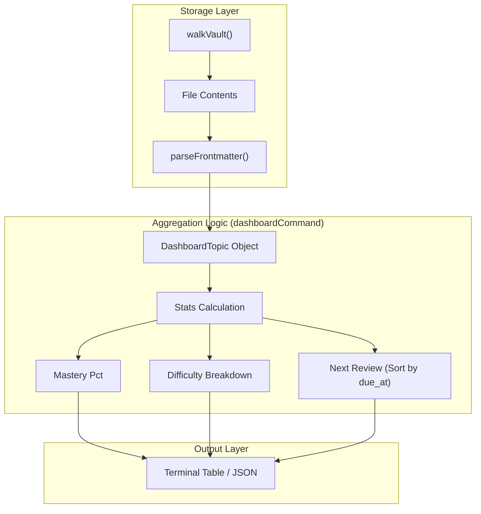
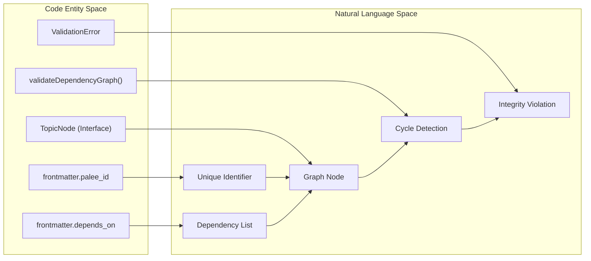

# Reporting Commands
Relevant source files

- [src/cli/dashboard.ts](https://github.com/Kuldeep2822k/cli/blob/main/src/cli/dashboard.ts)
- [src/cli/progress.ts](https://github.com/Kuldeep2822k/cli/blob/main/src/cli/progress.ts)
- [src/cli/validate.ts](https://github.com/Kuldeep2822k/cli/blob/main/src/cli/validate.ts)
- [test/cli-json-output.test.ts](https://github.com/Kuldeep2822k/cli/blob/main/test/cli-json-output.test.ts)

Reporting commands provide visibility into the state of the learning vault. They aggregate data from Markdown frontmatter to generate mastery statistics, difficulty breakdowns, and identify structural integrity issues within the dependency graph.

## Dashboard Command (`palee dashboard`)

The `dashboard` command provides a high-level summary of the vault's learning state. It calculates mastery percentages and identifies the next due item in the SRS (Spaced Repetition System) queue.

### Data Aggregation

The command performs a sequential scan of the vault using `walkVault`[src/cli/dashboard.ts#31](https://github.com/Kuldeep2822k/cli/blob/main/src/cli/dashboard.ts#L31-L31) It filters for files containing a `palee_id` in their frontmatter [src/cli/dashboard.ts#41](https://github.com/Kuldeep2822k/cli/blob/main/src/cli/dashboard.ts#L41-L41)

Key statistics are calculated based on the `topic_mastery` field:

- Mastered: Topics with mastery $\ge 0.7$ [src/cli/dashboard.ts#90](https://github.com/Kuldeep2822k/cli/blob/main/src/cli/dashboard.ts#L90-L90)
- Learning: Topics with $0 < \text{mastery} < 0.7$ [src/cli/dashboard.ts#91](https://github.com/Kuldeep2822k/cli/blob/main/src/cli/dashboard.ts#L91-L91)
- New: Topics with mastery exactly $0$ [src/cli/dashboard.ts#92](https://github.com/Kuldeep2822k/cli/blob/main/src/cli/dashboard.ts#L92-L92)

### Implementation Detail: Next Review Selection

The dashboard identifies the "Next Review" by filtering topics where `due_at` is less than or equal to the current system time [src/cli/dashboard.ts#93](https://github.com/Kuldeep2822k/cli/blob/main/src/cli/dashboard.ts#L93-L93) These are sorted by date to surface the most overdue topic [src/cli/dashboard.ts#108-113](https://github.com/Kuldeep2822k/cli/blob/main/src/cli/dashboard.ts#L108-L113)

### Dashboard Logic Flow

The following diagram illustrates how raw file data is transformed into dashboard metrics.

Dashboard Data Transformation

Sources: [src/cli/dashboard.ts#24-58](https://github.com/Kuldeep2822k/cli/blob/main/src/cli/dashboard.ts#L24-L58)[src/cli/dashboard.ts#89-114](https://github.com/Kuldeep2822k/cli/blob/main/src/cli/dashboard.ts#L89-L114)

---

## Progress Command (`palee progress`)

The `progress` command offers a more granular view of learning history compared to the dashboard. It supports both vault-wide summaries and specific topic lookups.

### Topic-Specific Reporting

When invoked with the `--topic` flag, the command searches for a match by ID or title [src/cli/progress.ts#79-82](https://github.com/Kuldeep2822k/cli/blob/main/src/cli/progress.ts#L79-L82) It displays detailed metadata including:

- `repetition` and `lapses` counts [src/cli/progress.ts#115-116](https://github.com/Kuldeep2822k/cli/blob/main/src/cli/progress.ts#L115-L116)
- `assessed_at` and `last_reviewed_at` timestamps [src/cli/progress.ts#117-122](https://github.com/Kuldeep2822k/cli/blob/main/src/cli/progress.ts#L117-L122)

### Average Mastery Calculation

Unlike the dashboard which counts topics by status, `progress` calculates the `avgMastery` across the entire vault or specific difficulty tiers [src/cli/progress.ts#131-133](https://github.com/Kuldeep2822k/cli/blob/main/src/cli/progress.ts#L131-L133)

Sources: [src/cli/progress.ts#26-53](https://github.com/Kuldeep2822k/cli/blob/main/src/cli/progress.ts#L26-L53)[src/cli/progress.ts#78-122](https://github.com/Kuldeep2822k/cli/blob/main/src/cli/progress.ts#L78-L122)

---

## Validate Command (`palee validate`)

The `validate` command ensures the structural integrity of the Obsidian vault. It checks for three primary error types:

1. Duplicate IDs: Multiple files sharing the same `palee_id`[src/cli/validate.ts#42-53](https://github.com/Kuldeep2822k/cli/blob/main/src/cli/validate.ts#L42-L53)
2. Missing Dependencies: A topic referencing a `palee_id` that does not exist in the vault [src/cli/validate.ts#94-95](https://github.com/Kuldeep2822k/cli/blob/main/src/cli/validate.ts#L94-L95)
3. Dependency Cycles: Circular references (e.g., A depends on B, B depends on A) which would break the scheduling engine [src/cli/validate.ts#96-97](https://github.com/Kuldeep2822k/cli/blob/main/src/cli/validate.ts#L96-L97)

### Validation Implementation

The command maps every valid topic into a `TopicNode`[src/cli/validate.ts#55-61](https://github.com/Kuldeep2822k/cli/blob/main/src/cli/validate.ts#L55-L61) This map is then passed to the `validateDependencyGraph` function in the engine core [src/cli/validate.ts#64](https://github.com/Kuldeep2822k/cli/blob/main/src/cli/validate.ts#L64-L64)

Validation Entity Mapping

Sources: [src/cli/validate.ts#28-65](https://github.com/Kuldeep2822k/cli/blob/main/src/cli/validate.ts#L28-L65)[src/engine/dependency.ts#12](https://github.com/Kuldeep2822k/cli/blob/main/src/engine/dependency.ts#L12-L12)

---

## Machine-Readable Output (--json)

All reporting commands support a `--json` flag for integration with external tools or IDE plugins.

### Standardized Error Handling

In JSON mode, errors (such as an unconfigured vault) are emitted as structured JSON to `stderr` with a specific exit code [test/cli-json-output.test.ts#68-75](https://github.com/Kuldeep2822k/cli/blob/main/test/cli-json-output.test.ts#L68-L75)

### JSON Schema Patterns

The output structure is designed to be deterministic. For example, `palee validate --json` returns an object containing `valid` (boolean), `topic_count`, and an `errors` array [src/cli/validate.ts#68-74](https://github.com/Kuldeep2822k/cli/blob/main/src/cli/validate.ts#L68-L74) If the vault is empty, the commands return a valid JSON object with zeroed fields rather than an error [test/cli-json-output.test.ts#87-128](https://github.com/Kuldeep2822k/cli/blob/main/test/cli-json-output.test.ts#L87-L128)

| Command | Key JSON Fields | Exit Code (Error) |
| --- | --- | --- |
| `dashboard` | `total_topics`, `mastered_pct`, `next_review` | 5 (Runtime) |
| `progress` | `avg_mastery`, `total_reviews`, `by_difficulty` | 2 (Not Found) |
| `validate` | `valid`, `error_count`, `errors[]` | 3 (Validation Fail) |

Sources: [src/cli/dashboard.ts#117-147](https://github.com/Kuldeep2822k/cli/blob/main/src/cli/dashboard.ts#L117-L147)[src/cli/progress.ts#142-171](https://github.com/Kuldeep2822k/cli/blob/main/src/cli/progress.ts#L142-L171)[src/cli/validate.ts#67-79](https://github.com/Kuldeep2822k/cli/blob/main/src/cli/validate.ts#L67-L79)[test/cli-json-output.test.ts#14-40](https://github.com/Kuldeep2822k/cli/blob/main/test/cli-json-output.test.ts#L14-L40)