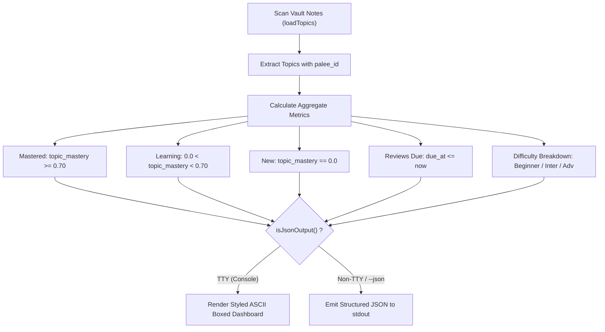
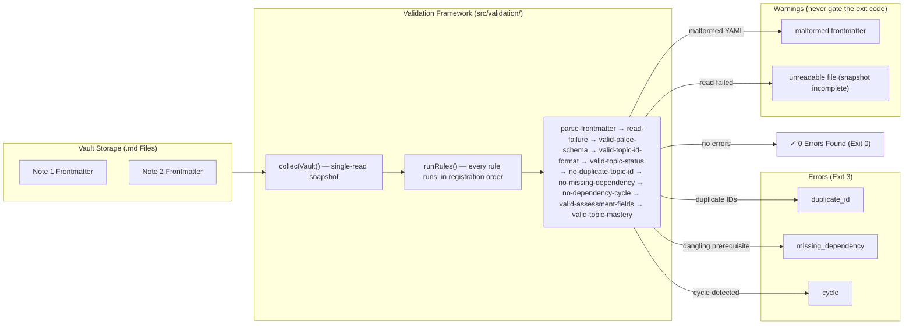

# Reporting Commands

<details>
<summary><b>Relevant Source Files</b></summary>

- [src/cli/dashboard.ts](https://github.com/Kuldeep2822k/cli/blob/main/src/cli/dashboard.ts)
- [src/cli/progress.ts](https://github.com/Kuldeep2822k/cli/blob/main/src/cli/progress.ts)
- [src/cli/validate.ts](https://github.com/Kuldeep2822k/cli/blob/main/src/cli/validate.ts)
- [src/storage/loader.ts](https://github.com/Kuldeep2822k/cli/blob/main/src/storage/loader.ts)
- [src/engine/dependency.ts](https://github.com/Kuldeep2822k/cli/blob/main/src/engine/dependency.ts)
- [src/engine/mastery.ts](https://github.com/Kuldeep2822k/cli/blob/main/src/engine/mastery.ts)
- [test/cli-json-output.test.ts](https://github.com/Kuldeep2822k/cli/blob/main/test/cli-json-output.test.ts)
- [test/cli-commands.test.ts](https://github.com/Kuldeep2822k/cli/blob/main/test/cli-commands.test.ts)

</details>

Reporting commands provide deep visibility into the educational health of your Obsidian vault. They scan topic frontmatter to calculate global mastery metrics, report difficulty distributions, track spaced repetition statistics, and detect structural integrity violations across the prerequisite graph.

---

## 1. Dashboard Command (`palee dashboard`)

The `palee dashboard` command provides a high-level executive summary of your vault's learning state. It aggregates overall topic mastery percentages, tallies review queues, breaks down progress by difficulty tiers, and surfaces the single most urgent upcoming review.

### Syntax & Options

```bash
palee dashboard [flags]
```

| Flag | Type | Default | Description | Example |
| :--- | :--- | :--- | :--- | :--- |
| `--json` | `boolean` | `false` | Output dashboard metrics as structured JSON (auto-activated in non-TTY environments). | `palee dashboard --json` |

---

### Data Aggregation & Metric Calculations

`dashboardCommand` scans all topic files in the vault and classifies notes using the 4-pillar mastery threshold ($M = 0.70$) [src/cli/dashboard.ts#88-114](https://github.com/Kuldeep2822k/cli/blob/main/src/cli/dashboard.ts#L88-L114):

- **Mastered**: Topics with `topic_mastery >= 0.70`.
- **Learning**: Topics actively in progress (`0.0 < topic_mastery < 0.70`).
- **New**: Unreviewed topics with `topic_mastery === 0.0`.
- **Reviews Due**: Topics where `due_at` is in the past or equal to the current system time.
- **Difficulty Tiers**: Aggregated counts and mastered subtotals across `beginner`, `intermediate`, and `advanced` tiers.



### Example Human-Readable Output

```bash
$ palee dashboard
╔════════════════════════════════════════════════════════════╗
║              PALEE Learning Dashboard                     ║
╚════════════════════════════════════════════════════════════╝

Total Topics:      15
Mastered (≥70%):   6 (40.0%)
Learning:          7 (46.7%)
New:               2 (13.3%)
Due for Review:    3

By Difficulty:
  beginner       : 5 topics (4 mastered)
  intermediate   : 7 topics (2 mastered)
  advanced       : 3 topics (0 mastered)

Next Review:
  Memory Ownership (T-20260814T120100-efgh)
  Mastery: 45.0% | Reps: 2

─────────────────────────────────────────────────────────────
Run "palee next" to start reviewing
Run "palee plan" to see today's learning plan
```

---

## 2. Progress Command (`palee progress`)

The `palee progress` command offers granular analytics into learning retention, historical repetitions, lapse counts, and topic-specific mastery scores.

### Syntax & Options

```bash
palee progress [flags]
```

| Flag | Type | Default | Description | Example |
| :--- | :--- | :--- | :--- | :--- |
| `--topic <id>` | `string` | `undefined` | Inspect a specific topic by ID (e.g. `T-20260814T120000-abcd`) or unique title substring. | `palee progress --topic "Recursion"` |
| `--json` | `boolean` | `false` | Output progress metrics as structured JSON (auto-activated in non-TTY environments). | `palee progress --json` |

---

### Vault-Wide vs Topic-Specific Modes

#### 1. Vault-Wide Mode (Default)
Aggregates all active topics across the vault [src/cli/progress.ts#140-233](https://github.com/Kuldeep2822k/cli/blob/main/src/cli/progress.ts#L140-L233):
- **Archived Topic Exclusion**: Notes with `status: archived` in frontmatter are tracked separately and excluded from `global_mastery` and `active_topic_count`.
- **Global Average Mastery**: Calculates the true mathematical mean of mastery across all active topics:

  ```text
  global_mastery = sum(active_topics.mastery) / active_topic_count
  ```

- **Mastery Status**: Classifies vault overall state as `'no_data'` (`active_count === 0`), `'learning'` (`< 0.70`), or `'mastered'` (`>= 0.70`).
- **Total Repetitions & Lapses**: Aggregates lifetime review repetitions and memory lapses across all active topics.

#### 2. Topic-Specific Mode (`--topic <id>`)
Surfaces comprehensive SRS metadata for an individual topic note:
- `topic_mastery` percentage
- `difficulty` tier
- `repetition` count and `lapses` count
- `assessed_at` and `last_reviewed_at` timestamps

### Example Outputs

#### Vault-Wide Human-Readable Summary
```bash
$ palee progress
=== Learning Progress ===

Active Topics: 14 (1 archived)
  Mastered (≥70%): 6 (42.9%)
  Learning: 6 (42.9%)
  New: 2 (14.3%)

Average Mastery: 54.3% (learning)
Total Reviews: 28
Total Lapses: 3

By Difficulty:
  beginner: 5 topics, avg mastery 78.0%
  intermediate: 6 topics, avg mastery 48.3%
  advanced: 3 topics, avg mastery 26.7%
```

#### Topic Lookup
```bash
$ palee progress --topic "Recursion"
Progress for: Recursion and Backtracking
ID: T-20260814T120000-abcd
Path: DSA/Recursion.md

Mastery: 80.0%
Difficulty: advanced
Repetitions: 5
Lapses: 0
Last Assessed: 2026-08-25
Last Reviewed: 2026-08-25
```

---

## 3. Validate Command (`palee validate`)

The `palee validate` command performs static analysis on the entire Obsidian vault to verify data model integrity and prerequisite graph acyclicity.

### Syntax & Options

```bash
palee validate [flags]
```

| Flag | Type | Default | Description | Example |
| :--- | :--- | :--- | :--- | :--- |
| `--fix` | `boolean` | `false` | Attempt automated repairs for detected validation errors (Phase 1 diagnostic flag). | `palee validate --fix` |
| `--json` | `boolean` | `false` | Output validation diagnostics as structured JSON (auto-activated in non-TTY environments). | `palee validate --json` |
| `--strict` | `boolean` | `false` | Escalate warnings to a non-zero exit code: a warnings-only vault exits `3` like an errors vault (default: warnings never gate the exit code). | `palee validate --strict` |

---

### Vault Structural Integrity Rules

`palee validate` runs a ten-rule validation framework (rules live under [src/validation/rules/](https://github.com/Kuldeep2822k/cli/blob/main/src/validation/rules/), registered in `src/cli/validate.ts`, exported through the [src/validation/](https://github.com/Kuldeep2822k/cli/blob/main/src/validation/index.ts) barrel): three error-severity graph integrity rules ported from the dependency engine, five error-severity schema, identity, and assessment rules, plus two warning-severity rules — snapshot rules that explain gaps in the collected topic set, and the mastery-drift rule that keeps stored derived data honest.

1. **Malformed Frontmatter (`parse-frontmatter`, warning)**: A note whose YAML frontmatter cannot be parsed (including unclosed `---` fences whose body reads like YAML). The scan always continues — one bad note is a finding, never a dead validation.
2. **Read Failures (`read-failure`, warning)**: A file that could not be read at all (locked or deleted mid-scan). Validation ran on an incomplete snapshot; the warning appears alongside any graph findings so transient conditions are visible without downgrading them.
3. **Schema Version (`valid-palee-schema`, error)**: Every PALEE-managed note must declare `palee_schema: 1`; missing, non-integer, and unsupported versions are errors so mutations can refuse to guess at unknown data. Non-managed user notes are never reported.
4. **Topic ID Format (`valid-topic-id-format`, error)**: Topic IDs must match the centralized policy in `src/engine/topic-id.ts` — `T-` plus lowercase kebab-case segments; the exact legacy adopt-generated format stays valid.
5. **Topic Status (`valid-topic-status`, error)**: Status must be one of `not_started` | `learning` | `paused` | `archived`; missing status is tolerated as the adopt default.
6. **Duplicate Topic IDs (`no-duplicate-topic-id`, error)**: Multiple Markdown notes sharing the same `palee_id` in their frontmatter.
7. **Missing Dependencies (`no-missing-dependency`, error)**: A topic referencing a prerequisite ID in `depends_on` that does not exist anywhere in the vault. Always an error — findings never depend on unrelated vault state; if a dependency target was itself unreadable, the `read-failure` warning appears alongside explaining the transient condition, and re-running settles it.
8. **Dependency Cycles (`no-dependency-cycle`, error)**: Circular dependency chains (e.g. $A \to B \to C \to A$) detected using 3-color DFS graph traversal in the dependency engine [src/engine/dependency.ts](https://github.com/Kuldeep2822k/cli/blob/main/src/engine/dependency.ts).
9. **Assessment Fields (`valid-assessment-fields`, error)**: Assessment scores (`conceptual`, `practical`, `debug`, `feynman`) must be finite numbers within `[0.0, 1.0]` as stored on disk, and `assessed_at` must be `null` or a parseable date. The rule reads raw frontmatter values — the loader clamps and coerces during normalization, so this rule exposes real vault corruption instead of silently blessing it. Missing assessment fields follow the documented default policy (they are the newly-adopted state) and pass.
10. **Topic Mastery Drift (`valid-topic-mastery`, warning)**: When a topic's assessment fields are shape-valid, stored `topic_mastery` must equal the engine formula `round((conceptual + practical + debug + 2*feynman) / 5, 4)` — recomputed with `computeTopicMastery` from [src/engine/mastery.ts](https://github.com/Kuldeep2822k/cli/blob/main/src/engine/mastery.ts). Drift reports a warning with `details.actual` (stored) and `details.expected` (computed). Topics whose assessment fields fail rule 9 are skipped (no double-reporting), missing assessment data never crashes the rule, and archived topics are still checked — internal consistency matters for any stored topic. A warning only, so `--strict` gates it.



### Example Human-Readable Output (Failures Detected)

```bash
$ palee validate
Validating vault: /Users/dev/ObsidianVault

Found 18 PALEE topics in 24 files

✗ Found 2 validation error(s):

  • Topic T-cloud-native depends on missing topic T-docker-missing
    Rule: no-missing-dependency

  • Dependency cycle detected: T-topic-a -> T-topic-b -> T-topic-a
    Rule: no-dependency-cycle
```

---

### Assessment-Review Independence (enforced by regression tests, #40)

Assessment fields (`conceptual`, `practical`, `debug`, `feynman`, `assessed_at`, `topic_mastery`) and SM-2 review fields (`last_quality`, `last_reviewed_at`, `due_at`, `ease_factor`, `interval_days`, `repetition`, `lapses`) are independent state. Per the #40 design, independence is **not** a static vault rule — command-level mutation tests are the enforcement mechanism, because independence is about what commands write, not what the vault looks like. `test/e2e/assessment-review-independence.test.ts` pins the contract: `palee review` updates only SM-2 fields and preserves assessment data (including non-zero `topic_mastery`) byte-for-byte; future assessment/test flows must preserve review state unless an explicit confirmed review mutation is added.

---

## 4. Machine-Readable Output & Non-TTY Detection

All reporting commands support the PALEE automated JSON streaming contract (`isJsonOutput()`):

```bash
# Direct JSON piping to jq for CI/CD checks
$ palee validate | jq .valid
true

# Extract total reviews due from dashboard
$ palee dashboard | jq .reviews_due
3
```

### Structured Error Handling

When an error occurs (such as an unconfigured vault or a missing topic query in `--topic`), PALEE emits a structured error JSON object on `stderr` and exits with code `2`:

```json
{"error": "Topic not found: NonExistentTopic"}
```

---

## 5. Exit Codes for Reporting Commands

| Command | Exit Code 0 | Exit Code 1 | Exit Code 2 | Exit Code 3 | Exit Code 4 | Exit Code 5 |
| :--- | :--- | :--- | :--- | :--- | :--- | :--- |
| `palee dashboard` | Successfully displayed dashboard metrics or empty vault onboarding. | N/A | Vault path not configured or directory does not exist. | N/A | N/A | Unexpected runtime exception or calculation failure. |
| `palee progress` | Successfully displayed vault progress summary, topic detail (`--topic`), or empty vault state. | N/A | Vault path unconfigured, or topic query not found for `--topic`. | N/A | N/A | Unexpected runtime exception or file read failure. |
| `palee validate` | Vault validation passed with 0 structural errors. | N/A | Vault path not configured or invalid directory. | Validation errors found (duplicate `palee_id`, missing dependency, or cycle). | N/A | Unexpected runtime exception or directory walk failure. |