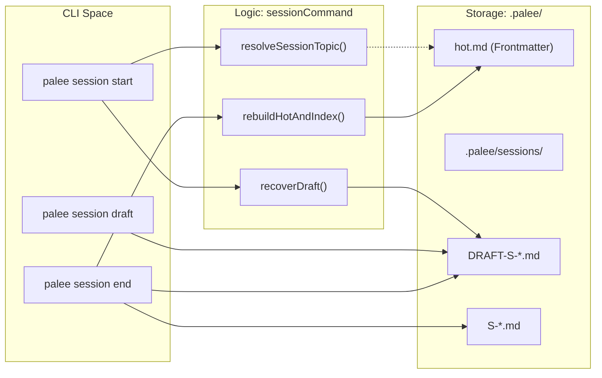

# Session Management Command
Relevant source files

- [src/cli/config.ts](https://github.com/Kuldeep2822k/cli/blob/main/src/cli/config.ts)
- [src/cli/review.ts](https://github.com/Kuldeep2822k/cli/blob/main/src/cli/review.ts)
- [src/cli/session.ts](https://github.com/Kuldeep2822k/cli/blob/main/src/cli/session.ts)
- [test/cli-commands.test.ts](https://github.com/Kuldeep2822k/cli/blob/main/test/cli-commands.test.ts)
- [test/session-cli.test.ts](https://github.com/Kuldeep2822k/cli/blob/main/test/session-cli.test.ts)

The `palee session` command suite manages the active learning state and persistence of session notes. It bridges the gap between the static vault content and the user's current learning focus, utilizing a "working memory" file (`hot.md`) and a structured session history in `.palee/sessions/`.

## Session Lifecycle

A session represents a focused period of learning on a specific topic. The lifecycle involves transitioning from a draft state (unconfirmed) to a confirmed session record.

### 1. Topic Resolution

When starting or ending a session, the system must identify the `active_topic`. The resolution follows a strict hierarchy:

1. CLI Flag: Explicitly provided via `--topic <id>`[src/cli/session.ts#24-30](https://github.com/Kuldeep2822k/cli/blob/main/src/cli/session.ts#L24-L30)
2. Working Memory: The `active_topic` field in the frontmatter of `.palee/hot.md`[src/cli/session.ts#33-46](https://github.com/Kuldeep2822k/cli/blob/main/src/cli/session.ts#L33-L46)
3. Fallback: If neither is found or the value is `(none)`, the command fails for actions requiring a topic [src/cli/session.ts#52-53](https://github.com/Kuldeep2822k/cli/blob/main/src/cli/session.ts#L52-L53)

### 2. Working Memory (`hot.md`)

The `hot.md` file serves as the system's "working memory." It is automatically rebuilt or updated during session operations to reflect the current state of the vault and the active topic [src/cli/session.ts#98-115](https://github.com/Kuldeep2822k/cli/blob/main/src/cli/session.ts#L98-L115)

### 3. Draft Recovery

If the CLI detects unconfirmed files (prefixed with `DRAFT-S-`) in the session directory, it triggers a recovery flow [src/cli/session.ts#63-95](https://github.com/Kuldeep2822k/cli/blob/main/src/cli/session.ts#L63-L95) In interactive mode, users can:

- Resume: Continue the session.
- Save: Convert the draft into a confirmed session note.
- Discard: Delete the draft file.
- Ignore: Leave the draft as-is.

Session Data Flow

Sources:[src/cli/session.ts#23-189](https://github.com/Kuldeep2822k/cli/blob/main/src/cli/session.ts#L23-L189)[src/storage/memory.ts#1-50](https://github.com/Kuldeep2822k/cli/blob/main/src/storage/memory.ts#L1-L50)

---

## Command Details

### `palee session start`

Initializes the learning environment.

- Draft Check: Scans `.palee/sessions/` for `DRAFT-S-` files [src/cli/session.ts#63-67](https://github.com/Kuldeep2822k/cli/blob/main/src/cli/session.ts#L63-L67)
- Memory Validation: Validates `hot.md`. If corrupt (missing `palee_schema`), it triggers a full rebuild using `rebuildHotAndIndex`[src/cli/session.ts#107-115](https://github.com/Kuldeep2822k/cli/blob/main/src/cli/session.ts#L107-L115)
- Display: Prints the current `active_topic`, `last_session` timestamp, and the body content of `hot.md`[src/cli/session.ts#121-131](https://github.com/Kuldeep2822k/cli/blob/main/src/cli/session.ts#L121-L131)

### `palee session draft`

Captures an intermediate state without ending the session.

- ID Generation: Creates a unique ID using `generateDraftId()`[src/cli/session.ts#143](https://github.com/Kuldeep2822k/cli/blob/main/src/cli/session.ts#L143-L143)
- Persistence: Writes a Markdown file with `topic_id` and `started_at` in the frontmatter via `writeDraftCheckpoint()`[src/cli/session.ts#144-147](https://github.com/Kuldeep2822k/cli/blob/main/src/cli/session.ts#L144-L147)

### `palee session end`

Finalizes the learning period.

- Record Creation: Generates a confirmed session ID (e.g., `S-20231027T103000-abcd`) and writes the final note [src/cli/session.ts#162-169](https://github.com/Kuldeep2822k/cli/blob/main/src/cli/session.ts#L162-L169)
- Cleanup: Automatically deletes any `DRAFT-S-` files associated with the current `topic_id`[src/cli/session.ts#172-180](https://github.com/Kuldeep2822k/cli/blob/main/src/cli/session.ts#L172-L180)
- Index Update: Triggers `rebuildHotAndIndex()` to ensure `index.md` and `hot.md` reflect the newly completed session [src/cli/session.ts#183](https://github.com/Kuldeep2822k/cli/blob/main/src/cli/session.ts#L183-L183)

### `palee session list`

Provides a summary of session history.

- JSON Mode: If `--json` is passed, returns a structured object containing lists of `confirmed` and `draft` sessions [src/cli/session.ts#194-202](https://github.com/Kuldeep2822k/cli/blob/main/src/cli/session.ts#L194-L202)
- Human Readable: Lists confirmed sessions and highlights pending drafts [src/cli/session.ts#204-219](https://github.com/Kuldeep2822k/cli/blob/main/src/cli/session.ts#L204-L219)

Sources:[src/cli/session.ts#55-220](https://github.com/Kuldeep2822k/cli/blob/main/src/cli/session.ts#L55-L220)[src/storage/memory.ts#55-120](https://github.com/Kuldeep2822k/cli/blob/main/src/storage/memory.ts#L55-L120)

---

## Implementation and Data Synchronization

The session management relies on the `src/storage/memory.ts` module to handle the physical file layout within the `.palee/` directory.

- Confirmed: `S-<TIMESTAMP>-<RANDOM_HEX>.md` [src/storage/memory.ts#31-36](https://github.com/Kuldeep2822k/cli/blob/main/src/storage/memory.ts#L31-L36)
- Draft: `DRAFT-S-<RANDOM_HEX>.md` [src/storage/memory.ts#38-41](https://github.com/Kuldeep2822k/cli/blob/main/src/storage/memory.ts#L38-L41)

### Memory Synchronization Logic

The function `rebuildHotAndIndex` is the core synchronization mechanism. It performs a "Join" between the Topic files and the Session records.

Logic: rebuildHotAndIndex

1. Walk Vault: Finds all Markdown files with a `palee_id`[src/storage/vault-walker.ts#38-43](https://github.com/Kuldeep2822k/cli/blob/main/src/storage/vault-walker.ts#L38-L43)
2. Collect Sessions: Reads all `.md` files in `.palee/sessions/`[src/cli/session.ts#192-200](https://github.com/Kuldeep2822k/cli/blob/main/src/cli/session.ts#L192-L200)
3. Determine Active: Looks for the most recent session or draft to set the `active_topic`[src/cli/session.ts#32-46](https://github.com/Kuldeep2822k/cli/blob/main/src/cli/session.ts#L32-L46)
4. Update hot.md: Writes the frontmatter and truncates the body of the active topic to a 250-word "Working Memory" snippet [src/storage/memory.ts#230-250](https://github.com/Kuldeep2822k/cli/blob/main/src/storage/memory.ts#L230-L250)

Code Entity Bridge: Storage to Memory

| Concept | Code Entity | File Reference |
| --- | --- | --- |
| Draft Recovery | `recoverDraft()` | [src/storage/memory.ts#19-20](https://github.com/Kuldeep2822k/cli/blob/main/src/storage/memory.ts#L19-L20) |
| Hot Memory Update | `updateHotMemory()` | [src/storage/memory.ts#13-15](https://github.com/Kuldeep2822k/cli/blob/main/src/storage/memory.ts#L13-L15) |
| Session Writing | `writeSessionNote()` | [src/storage/memory.ts#14-16](https://github.com/Kuldeep2822k/cli/blob/main/src/storage/memory.ts#L14-L16) |
| Frontmatter Parsing | `parseFrontmatter()` | [src/storage/frontmatter.ts#18-20](https://github.com/Kuldeep2822k/cli/blob/main/src/storage/frontmatter.ts#L18-L20) |
| Topic Resolution | `resolveSessionTopic()` | [src/cli/session.ts#23-53](https://github.com/Kuldeep2822k/cli/blob/main/src/cli/session.ts#L23-L53) |

Sources:[src/cli/session.ts#23-53](https://github.com/Kuldeep2822k/cli/blob/main/src/cli/session.ts#L23-L53)[src/storage/memory.ts#1-250](https://github.com/Kuldeep2822k/cli/blob/main/src/storage/memory.ts#L1-L250)[src/storage/frontmatter.ts#10-50](https://github.com/Kuldeep2822k/cli/blob/main/src/storage/frontmatter.ts#L10-L50)