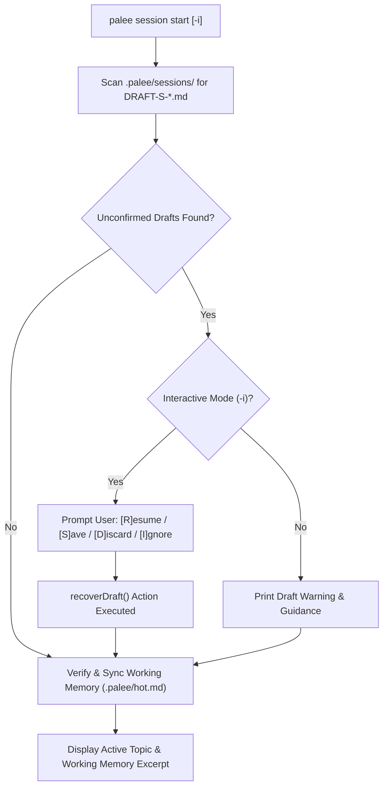

# Session Management Command

Relevant source files:

- [src/cli/session.ts](https://github.com/Kuldeep2822k/cli/blob/main/src/cli/session.ts)
- [src/storage/memory.ts](https://github.com/Kuldeep2822k/cli/blob/main/src/storage/memory.ts)
- [src/storage/frontmatter.ts](https://github.com/Kuldeep2822k/cli/blob/main/src/storage/frontmatter.ts)
- [src/storage/vault-walker.ts](https://github.com/Kuldeep2822k/cli/blob/main/src/storage/vault-walker.ts)
- [src/types.ts](https://github.com/Kuldeep2822k/cli/blob/main/src/types.ts)
- [test/session-cli.test.ts](https://github.com/Kuldeep2822k/cli/blob/main/test/session-cli.test.ts)
- [test/cli-commands.test.ts](https://github.com/Kuldeep2822k/cli/blob/main/test/cli-commands.test.ts)
- [test/cli-json-output.test.ts](https://github.com/Kuldeep2822k/cli/blob/main/test/cli-json-output.test.ts)

The `palee session` command suite manages the real-time learning lifecycle, active focus tracking, and persistence of study session records. It maintains a short-term "working memory" file (`.palee/hot.md`), a chronological session index (`.palee/index.md`), and durable session notes in `.palee/sessions/`.

---

## 1. Session Lifecycle & Architecture

A session represents an active period of study focused on a single PALEE topic. The lifecycle encompasses topic resolution, working memory synchronization, interim draft checkpoints, and final session confirmation.

### Topic Resolution Hierarchy

When running commands that require an active study target (`draft`, `end`), PALEE resolves the target topic using a strict three-tier hierarchy via `resolveSessionTopic()` [src/cli/session.ts#24-54](https://github.com/Kuldeep2822k/cli/blob/main/src/cli/session.ts#L24-L54):

1. **CLI Flag Override**: Explicitly specified via `--topic <id>` (e.g. `--topic "T-rust-ownership"`).
2. **Working Memory Inspection**: Extracted from the `active_topic` frontmatter property of `.palee/hot.md`.
3. **Missing Topic Error**: If neither is present or the value is `(none)`, the command terminates with exit code `2`.

---

### Working Memory (`hot.md`) & Index (`index.md`)

- **`.palee/hot.md` (Working Memory)**: Automatically generated and refreshed by `rebuildHotAndIndex()` [src/storage/memory.ts](https://github.com/Kuldeep2822k/cli/blob/main/src/storage/memory.ts). Contains metadata on the current active topic, timestamp of last update, and a truncated 250-word working memory excerpt of the note body for quick context recovery.
- **`.palee/index.md` (Session Index)**: Chronological index of completed learning sessions, cross-referenced with topic IDs.

---

### Draft Recovery Protocol

If an unexpected interruption occurs (such as terminal closure or system reboot), PALEE leaves an unconfirmed draft note (`DRAFT-S-<hex>.md`) in `.palee/sessions/`.

When `palee session start` is executed:
- **Non-Interactive Mode**: Alerts the user that unconfirmed drafts exist and suggests running `palee session start --interactive`.
- **Interactive Mode (`-i, --interactive`)**: Prompts the user with four recovery options for each orphaned draft [src/cli/session.ts#83-95](https://github.com/Kuldeep2822k/cli/blob/main/src/cli/session.ts#L83-L95):
  - `[R]esume`: Continues the previous session, retaining the draft.
  - `[S]ave`: Immediately finalizes and converts the draft into a confirmed session note (`S-*.md`).
  - `[D]iscard`: Permanently deletes the orphaned draft checkpoint.
  - `[I]gnore`: Leaves the draft file untouched on disk.



---

## 2. Command Subactions

The `palee session` command accepts four distinct action arguments:

### 1. `palee session start`
Initializes the study environment:
- Scans `.palee/sessions/` for unconfirmed draft checkpoints.
- Rebuilds `hot.md` if missing or corrupted (schema invalid).
- Prints the active topic ID, last session timestamp, and the working memory body excerpt from `hot.md`.

```bash
# Start study session in interactive recovery mode
palee session start --interactive
```

### 2. `palee session draft`
Captures an interim checkpoint during an ongoing study session without closing the session:
- Generates a unique draft identifier (`DRAFT-S-<random_hex>`).
- Persists a draft markdown file in `.palee/sessions/` containing `topic_id` and `started_at` in frontmatter.

```bash
# Capture a checkpoint for the active topic
palee session draft

# Capture a checkpoint for an explicit topic
palee session draft --topic "T-20260814T120000-abcd"
```

### 3. `palee session end`
Concludes the study period and formalizes the session:
- Resolves the target topic ID (via `--topic` or `hot.md`).
- Generates a confirmed session ID (`S-YYYYMMDDTHHMMSS-<hex>.md`) and writes the permanent session note.
- Automatically cleans up any pending `DRAFT-S-` files associated with the topic.
- Executes `rebuildHotAndIndex()` to refresh `hot.md` and `index.md`.

```bash
# Finalize the current study session
palee session end --topic "T-20260814T120000-abcd"
```

### 4. `palee session list`
Displays session history and pending drafts:
- Lists the most recent 10 confirmed sessions in chronological order.
- Lists all active draft checkpoints awaiting resolution.
- Supports `--json` for machine-readable integrations.

```bash
# List sessions in terminal
palee session list

# Output structured session JSON
palee session list --json
```

---

## 3. Options Reference for `palee session`

The following table lists all supported arguments and options for `palee session` [src/types.ts#464-474](https://github.com/Kuldeep2822k/cli/blob/main/src/types.ts#L464-L474):

| Parameter / Flag | Type | Default | Description | Example |
| :--- | :--- | :--- | :--- | :--- |
| `<action>` | `string` | **Required** | Session action to perform: `start`, `draft`, `end`, or `list`. | `palee session start` |
| `-i, --interactive` | `boolean` | `false` | Enable interactive prompt mode for draft recovery during `palee session start`. | `palee session start -i` |
| `--topic <id>` | `string` | `undefined` | Target topic ID. Overrides the `active_topic` defined in `.palee/hot.md`. | `palee session end --topic "T-01"` |
| `--json` | `boolean` | `false` | Output results as structured JSON (supported for `palee session list`). | `palee session list --json` |

---

## 4. Physical Storage Layout

All session metadata is isolated within the `.palee/` directory at the vault root:

```
<vaultPath>/
├── .palee/
│   ├── hot.md                     # Active working memory & topic context
│   ├── index.md                   # Chronological session index
│   └── sessions/
│       ├── S-20260814T120000-abcd.md       # Confirmed session record
│       ├── S-20260814T153000-efgh.md       # Confirmed session record
│       └── DRAFT-S-98765432.md             # Unconfirmed draft checkpoint
└── Topics/
    └── Topic-Note.md
```

### File Naming Specifications

| File Type | Path Pattern | Frontmatter Key Fields |
| :--- | :--- | :--- |
| **Working Memory** | `.palee/hot.md` | `palee_schema: 1`, `active_topic: string`, `last_session: string`, `updated_at: string` |
| **Confirmed Session** | `.palee/sessions/S-<TIMESTAMP>-<HEX>.md` | `session_id: string`, `topic_id: string`, `started_at: string`, `ended_at: string` |
| **Draft Checkpoint** | `.palee/sessions/DRAFT-S-<HEX>.md` | `topic_id: string`, `started_at: string` |

---

## 5. Exit Codes for Session Management

| Command | Exit Code 0 | Exit Code 1 | Exit Code 2 | Exit Code 3 | Exit Code 4 | Exit Code 5 |
| :--- | :--- | :--- | :--- | :--- | :--- | :--- |
| `palee session` | Session action (`start`, `draft`, `end`, `list`) completed successfully. | N/A | Vault path not configured, missing `--topic` for `draft`/`end` when no active topic exists, or unknown action specified. | N/A | OCC conflict during session note write or `hot.md` update (`isConflictError`). | Unexpected runtime exception or file system write failure. |