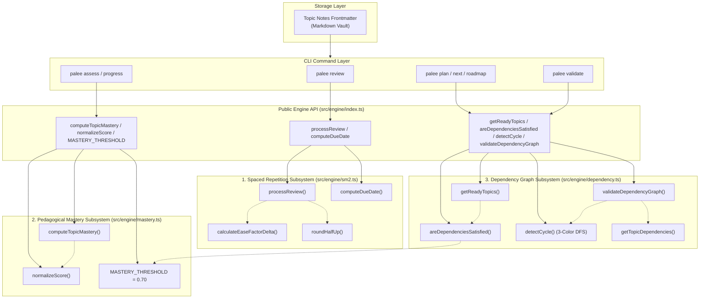
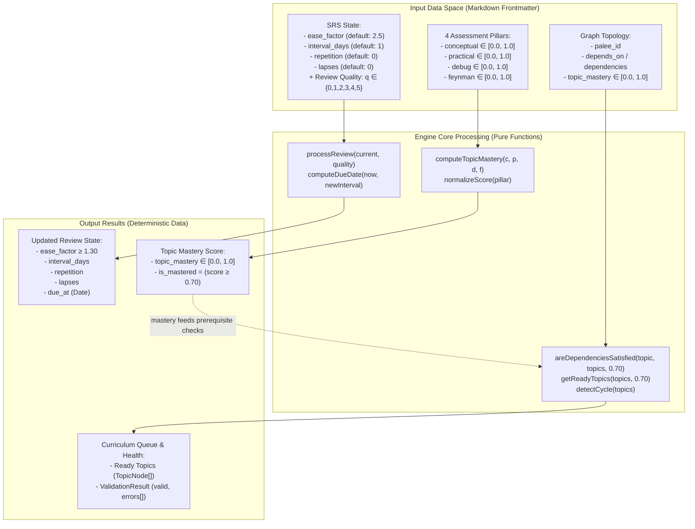

# Engine Core
Relevant source files

- [src/engine/dependency.ts](https://github.com/Kuldeep2822k/cli/blob/main/src/engine/dependency.ts)
- [src/engine/index.ts](https://github.com/Kuldeep2822k/cli/blob/main/src/engine/index.ts)
- [src/engine/mastery.ts](https://github.com/Kuldeep2822k/cli/blob/main/src/engine/mastery.ts)
- [src/engine/sm2.ts](https://github.com/Kuldeep2822k/cli/blob/main/src/engine/sm2.ts)
- [test/engine-dependency.test.ts](https://github.com/Kuldeep2822k/cli/blob/main/test/engine-dependency.test.ts)
- [test/engine-mastery.test.ts](https://github.com/Kuldeep2822k/cli/blob/main/test/engine-mastery.test.ts)
- [test/engine-sm2.test.ts](https://github.com/Kuldeep2822k/cli/blob/main/test/engine-sm2.test.ts)

The Engine Core is a pure-function, side-effect-free layer responsible for the mathematical and logical algorithms that power PALEE's spaced repetition scheduling, pedagogical mastery evaluation, and curriculum dependency sequencing. Operating without file system I/O or CLI dependencies, every engine calculation is deterministic: identical inputs (review quality, assessment pillar scores, topic graph topology) always yield identical outputs (next review due date, weighted mastery score, ready topic queue).

The engine is structured into three dedicated subsystems:

1. **SM-2 Spaced Repetition Engine** (`src/engine/sm2.ts`): Schedules individual topic review intervals, computes Ease Factor deltas, tracks retention lapses, and executes DST-safe calendar date math.
2. **4-Pillar Pedagogical Mastery Engine** (`src/engine/mastery.ts`): Evaluates holistic learner competency across Conceptual, Practical, Debugging, and Feynman dimensions with double-weighted communication scoring and score clamping.
3. **Dependency Graph Engine** (`src/engine/dependency.ts`): Manages prerequisite graphs as a Directed Acyclic Graph (DAG), validates graph integrity, detects circular references via 3-color Depth-First Search (DFS), and calculates prerequisite readiness against the `0.70` mastery threshold.

---

### Engine Architecture

The engine functions as the computational core between the Storage Layer (which provides persisted Markdown frontmatter and cached topic maps) and the CLI Layer (which handles user command execution and terminal rendering).

#### Code Entity Mapping



---

### Subsystem Overview

#### 1. SM-2 Spaced Repetition Engine

The scheduling engine implements a mathematically formal SuperMemo-2 (SM-2) algorithm adapted for local Markdown vault persistence. Given a topic's current `Review` state and a learner's recall quality rating ($0 \le q \le 5$), `processReview` computes the next scheduling state:

- **Ease Factor (EF) Adjustment**: $\Delta EF = 0.1 - (5 - q) \times (0.08 + (5 - q) \times 0.02)$, floored at $EF \ge 1.30$ and rounded half-up to 4 decimal places.
- **Interval Expansion**:
  - Repetition 1: $I_1 = 1\text{ day}$
  - Repetition 2: $I_2 = 6\text{ days}$
  - Repetition $n \ge 3$: $I_n = \text{round}(I_{n-1} \times EF)$
- **Lapse Handling**: If quality $q < 3$, `repetition` resets to `0`, `interval_days` resets to `1`, and `lapses` increments by `1` (if the topic was previously learned).
- **DST-Safe Scheduling**: `computeDueDate` uses local calendar arithmetic (`Date.setDate`) to avoid 23/25-hour Daylight Saving Time drift bugs.

For detailed formulas and state machine rules, see [SM-2 Spaced Repetition Algorithm](./03-1-sm2-spaced-repetition-algorithm.md).

#### 2. 4-Pillar Pedagogical Mastery Engine

Rather than reducing topic comprehension to a single 1-dimensional recall score, PALEE implements a multi-dimensional assessment model inspired by Bloom's Revised Taxonomy and the Feynman Technique. Topic mastery is evaluated across four core pillars:

1. **Conceptual Understanding ($c$, 20%)**: Theoretical comprehension of underlying principles.
2. **Practical Application ($p$, 20%)**: Hands-on ability to build, code, or apply the concept.
3. **Debugging & Troubleshooting ($d$, 20%)**: Diagnosing failure modes, tracing edge cases, and resolving errors.
4. **Feynman Technique Articulation ($f$, 40%)**: Ability to explain the concept simply in plain language without jargon (double-weighted).

- **Canonical Formula**:
  ```text
  topic_mastery = round((c + p + d + 2 * f) / 5, 4)
  ```
- **Score Normalization**: Inputs are sanitized via `normalizeScore`, clamping values to `[0.0, 1.0]` and rounding to 4 decimal places.
- **Mastery Threshold**: Standardized constant `MASTERY_THRESHOLD = 0.70` (70%). Topics meeting or exceeding `0.70` are designated as mastered and unblock downstream prerequisites.
- **Archive Exclusion**: Aggregate vault metrics in `palee progress` strictly exclude archived topics (`status === 'archived'`) from active mastery averages and readiness queues.

#### 3. Dependency Graph Engine

The Dependency Graph Engine models curriculum relationships as a Directed Acyclic Graph (DAG), ensuring learners tackle foundational prerequisites before advanced concepts.

- **3-Color DFS Cycle Detection**: Traverses prerequisites using White (unvisited), Gray (visiting / recursion stack), and Black (visited / fully settled) node states. Re-encountering a Gray node detects a cyclic back-edge, returning the exact cycle path slice from `pathStack`.
- **Prerequisite Readiness**: `areDependenciesSatisfied(topic, topics, threshold = 0.70)` verifies that all prerequisites referenced in `depends_on` or `dependencies` exist in the vault and possess `topic_mastery >= 0.70`.
- **Ready Topic Queuing**: `getReadyTopics` scans the vault, filtering for unmastered topics (`topic_mastery < 0.70`) whose prerequisites are fully satisfied.
- **Topological Integrity Validation**: `validateDependencyGraph` inspects the entire graph, detecting dangling prerequisites (`missing_dependency`) and circular loops (`cycle`).

For detailed graph traversal rules and cycle slice reconstruction, see [Dependency Graph Engine](./03-2-dependency-graph-engine.md).

---

### Core Data Flow

The following diagram illustrates how raw topic inputs flow through the three engine subsystems to generate scheduling, mastery, and curriculum progression outputs.

#### Logic Flow: Data Space to Engine Outputs



---

### Validation Rules and Invariants

The engine enforces strict mathematical and architectural invariants across all three subsystems:

| Subsystem | Invariant | Rule / Implementation |
|---|---|---|
| **SM-2** | Ease Factor Floor | `ease_factor` $\ge 1.30$ (`Math.max(1.3, newEaseFactor)`) |
| **SM-2** | Quality Bounds | Quality rating must be an integer $q \in \{0, 1, 2, 3, 4, 5\}$ |
| **SM-2** | Minimum Interval | `interval_days` $\ge 1$ (`Math.max(1, newInterval)`) |
| **SM-2** | Repetition Reset | If $q < 3$, `repetition` = 0 and `interval_days` = 1 |
| **SM-2** | Half-Up Rounding | EF and intervals rounded half-up with epsilon `+ 1e-10` to avoid floating-point drift |
| **Mastery** | Score Clamping | All pillar scores clamped to $[0.0, 1.0]$ via `normalizeScore` |
| **Mastery** | 4-Decimal Precision | Mastery calculations rounded via `Math.round(raw * 10000) / 10000` |
| **Mastery** | Mastery Threshold | Prerequisite satisfaction requires `topic_mastery` $\ge 0.70$ |
| **Mastery** | Archive Exclusion | Archived topics (`status === 'archived'`) excluded from active averages and ready queues |
| **Dependency** | Directed Acyclic Graph | Vault prerequisite graph must be acyclic (`detectCycle === null`) |
| **Dependency** | Alias Support | Dependencies normalized from both `depends_on` and `dependencies` arrays |

Sources:
- SM-2 Engine: [src/engine/sm2.ts](https://github.com/Kuldeep2822k/cli/blob/main/src/engine/sm2.ts)
- Mastery Engine: [src/engine/mastery.ts](https://github.com/Kuldeep2822k/cli/blob/main/src/engine/mastery.ts)
- Dependency Graph Engine: [src/engine/dependency.ts](https://github.com/Kuldeep2822k/cli/blob/main/src/engine/dependency.ts)
- Engine API: [src/engine/index.ts](https://github.com/Kuldeep2822k/cli/blob/main/src/engine/index.ts)
- Progress Analytics: [src/cli/progress.ts](https://github.com/Kuldeep2822k/cli/blob/main/src/cli/progress.ts)