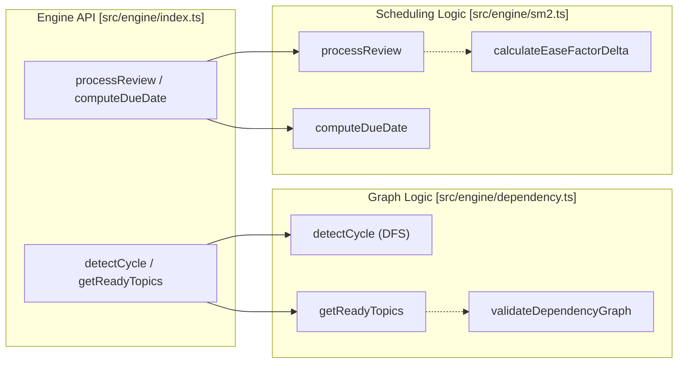
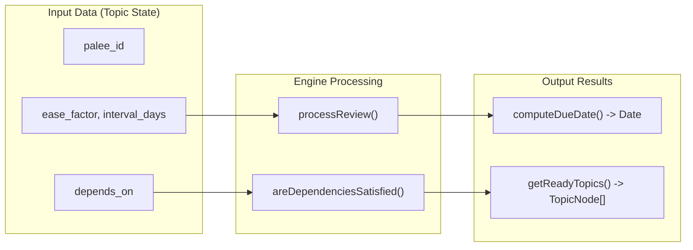

# Engine Core
Relevant source files

- [src/engine/dependency.ts](https://github.com/Kuldeep2822k/cli/blob/e8b70e0d/src/engine/dependency.ts)
- [src/engine/index.ts](https://github.com/Kuldeep2822k/cli/blob/e8b70e0d/src/engine/index.ts)
- [src/engine/sm2.ts](https://github.com/Kuldeep2822k/cli/blob/e8b70e0d/src/engine/sm2.ts)
- [test/engine-dependency.test.ts](https://github.com/Kuldeep2822k/cli/blob/e8b70e0d/test/engine-dependency.test.ts)
- [test/engine-sm2.test.ts](https://github.com/Kuldeep2822k/cli/blob/e8b70e0d/test/engine-sm2.test.ts)

The Engine Core is a pure-function layer responsible for the mathematical and logical operations that drive PALEE's scheduling and curriculum management. It is designed to be deterministic and decoupled from the file system or CLI state, ensuring that the same inputs (topic state and review quality) always yield the same outputs (next due date and dependency readiness).

The core is divided into two primary subsystems: the SM-2 Spaced Repetition Algorithm for individual topic scheduling and the Dependency Graph Engine for curriculum sequencing.

### Engine Architecture

The engine acts as the "brain" between the Storage Layer (which provides raw data) and the CLI Layer (which handles user interaction).

#### Code Entity Mapping

Sources:[src/engine/index.ts#1-16](https://github.com/Kuldeep2822k/cli/blob/e8b70e0d/src/engine/index.ts#L1-L16)[src/engine/sm2.ts#1-134](https://github.com/Kuldeep2822k/cli/blob/e8b70e0d/src/engine/sm2.ts#L1-L134)[src/engine/dependency.ts#1-123](https://github.com/Kuldeep2822k/cli/blob/e8b70e0d/src/engine/dependency.ts#L1-L123)

---

### SM-2 Spaced Repetition Algorithm

The scheduling engine implements a modified version of the SM-2 algorithm to calculate optimal review intervals. It processes a `Review` state and a user-provided quality rating (0–5) to produce an updated state containing a new `ease_factor`, `interval_days`, and `repetition` count.

Key characteristics include:

- Deterministic State Transitions: The `processReview` function is a pure transformation of the `Review` interface [src/engine/sm2.ts#36-101](https://github.com/Kuldeep2822k/cli/blob/e8b70e0d/src/engine/sm2.ts#L36-L101)
- Interval Progression: Successful reviews follow a specific sequence: 1 day for the first repetition, 6 days for the second, and `round(previous_interval * ease_factor)` for subsequent reviews [src/engine/sm2.ts#76-81](https://github.com/Kuldeep2822k/cli/blob/e8b70e0d/src/engine/sm2.ts#L76-L81)
- Lapse Handling: Ratings below 3 trigger a lapse, resetting the interval to 1 day and the repetition count to 0 [src/engine/sm2.ts#65-71](https://github.com/Kuldeep2822k/cli/blob/e8b70e0d/src/engine/sm2.ts#L65-L71)
- DST-Safe Scheduling: Date arithmetic is performed using calendar days via `computeDueDate` to avoid bugs related to Daylight Savings Time shifts [src/engine/sm2.ts#121-126](https://github.com/Kuldeep2822k/cli/blob/e8b70e0d/src/engine/sm2.ts#L121-L126)

For a deep dive into the math and rounding rules, see [SM-2 Spaced Repetition Algorithm](./03-1-sm2-spaced-repetition-algorithm.md).

Sources:[src/engine/sm2.ts#12-17](https://github.com/Kuldeep2822k/cli/blob/e8b70e0d/src/engine/sm2.ts#L12-L17)[src/engine/sm2.ts#36-101](https://github.com/Kuldeep2822k/cli/blob/e8b70e0d/src/engine/sm2.ts#L36-L101)[src/engine/sm2.ts#121-126](https://github.com/Kuldeep2822k/cli/blob/e8b70e0d/src/engine/sm2.ts#L121-L126)

---

### Dependency Graph Engine

The Dependency Graph Engine manages the relationships between topics, ensuring that users learn foundational concepts before advanced ones. It treats the vault as a Directed Acyclic Graph (DAG) where nodes are `TopicNode` entities.

The engine provides three critical capabilities:

1. Cycle Detection: Uses a Depth-First Search (DFS) with a recursion stack to identify circular dependencies that would prevent curriculum progression [src/engine/dependency.ts#10-47](https://github.com/Kuldeep2822k/cli/blob/e8b70e0d/src/engine/dependency.ts#L10-L47)
2. Mastery Filtering: The `getReadyTopics` function filters the vault to find topics that are not yet mastered but whose dependencies have met the mastery threshold (default 0.7) [src/engine/dependency.ts#67-83](https://github.com/Kuldeep2822k/cli/blob/e8b70e0d/src/engine/dependency.ts#L67-L83)
3. Integrity Validation: The `validateDependencyGraph` function checks for both logical cycles and "dangling" dependencies (references to IDs that do not exist in the vault) [src/engine/dependency.ts#85-117](https://github.com/Kuldeep2822k/cli/blob/e8b70e0d/src/engine/dependency.ts#L85-L117)

For details on the graph traversal and threshold logic, see [Dependency Graph Engine](./03-2-dependency-graph-engine.md).

Sources:[src/engine/dependency.ts#10-47](https://github.com/Kuldeep2822k/cli/blob/e8b70e0d/src/engine/dependency.ts#L10-L47)[src/engine/dependency.ts#49-65](https://github.com/Kuldeep2822k/cli/blob/e8b70e0d/src/engine/dependency.ts#L49-L65)[src/engine/dependency.ts#85-117](https://github.com/Kuldeep2822k/cli/blob/e8b70e0d/src/engine/dependency.ts#L85-L117)

---

### Core Data Flow

The following diagram illustrates how the engine transforms raw topic data into actionable scheduling and readiness information.

#### Logic Flow: Data Space to Code Space

Sources:[src/engine/index.ts#9-15](https://github.com/Kuldeep2822k/cli/blob/e8b70e0d/src/engine/index.ts#L9-L15)[src/engine/sm2.ts#36-46](https://github.com/Kuldeep2822k/cli/blob/e8b70e0d/src/engine/sm2.ts#L36-L46)[src/engine/dependency.ts#49-65](https://github.com/Kuldeep2822k/cli/blob/e8b70e0d/src/engine/dependency.ts#L49-L65)

### Validation and Constraints

The engine enforces strict invariants to maintain the integrity of the learning system:

- Ease Factor Floor: The `ease_factor` is never allowed to drop below 1.3 [src/engine/sm2.ts#91](https://github.com/Kuldeep2822k/cli/blob/e8b70e0d/src/engine/sm2.ts#L91-L91)
- Quality Bounds: Quality ratings must be integers between 0 and 5 [src/engine/sm2.ts#13-15](https://github.com/Kuldeep2822k/cli/blob/e8b70e0d/src/engine/sm2.ts#L13-L15)
- Rounding Consistency: Ease factors are rounded to 4 decimal places using a half-up method to ensure cross-platform consistency [src/engine/sm2.ts#25-28](https://github.com/Kuldeep2822k/cli/blob/e8b70e0d/src/engine/sm2.ts#L25-L28)[src/engine/sm2.ts#92](https://github.com/Kuldeep2822k/cli/blob/e8b70e0d/src/engine/sm2.ts#L92-L92)

Sources:[src/engine/sm2.ts#13-17](https://github.com/Kuldeep2822k/cli/blob/e8b70e0d/src/engine/sm2.ts#L13-L17)[src/engine/sm2.ts#91-92](https://github.com/Kuldeep2822k/cli/blob/e8b70e0d/src/engine/sm2.ts#L91-L92)[test/engine-sm2.test.ts#6-19](https://github.com/Kuldeep2822k/cli/blob/e8b70e0d/test/engine-sm2.test.ts#L6-L19)