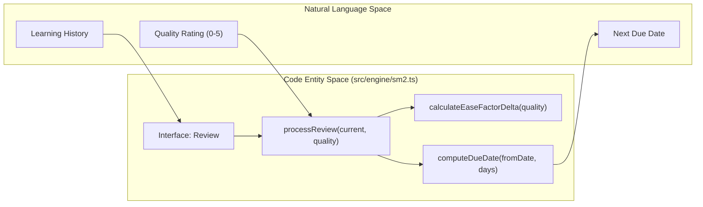

# SM-2 Spaced Repetition Algorithm
Relevant source files

- [planning/invariants.md](https://github.com/Kuldeep2822k/cli/blob/main/planning/invariants.md?plain=1)
- [src/engine/dependency.ts](https://github.com/Kuldeep2822k/cli/blob/main/src/engine/dependency.ts)
- [src/engine/index.ts](https://github.com/Kuldeep2822k/cli/blob/main/src/engine/index.ts)
- [src/engine/sm2.ts](https://github.com/Kuldeep2822k/cli/blob/main/src/engine/sm2.ts)
- [test/engine-dependency.test.ts](https://github.com/Kuldeep2822k/cli/blob/main/test/engine-dependency.test.ts)
- [test/engine-sm2.test.ts](https://github.com/Kuldeep2822k/cli/blob/main/test/engine-sm2.test.ts)

The SM-2 algorithm is the core scheduling engine of PALEE, responsible for determining when a learner should next review a specific topic. It implements a deterministic version of the SuperMemo-2 algorithm, adapted for Markdown-based storage with specific constraints on ease factor floors and interval progression.

The implementation resides in `src/engine/sm2.ts` and operates as a pure function that transforms the current `Review` state into a new state based on a user-provided quality rating.

## Quality Rating Scale

PALEE utilizes a standard 0–5 integer scale to represent the quality of a review session. This rating is the primary input for calculating both the next review interval and the adjustment to the topic's Ease Factor (EF).

| Rating | Meaning | Effect on Scheduling |
| --- | --- | --- |
| 5 | Perfect response; no hesitation. | Maximum EF increase; Interval grows. |
| 4 | Correct response after a hesitation. | EF stays constant; Interval grows. |
| 3 | Correct response recalled with serious difficulty. | EF decreases; Interval grows. |
| 2 | Incorrect response; where the correct one seemed easy to recall. | Lapse: EF decreases; Repetition resets; Interval = 1. |
| 1 | Incorrect response; the correct one remembered. | Lapse: EF decreases; Repetition resets; Interval = 1. |
| 0 | Complete blackout. | Lapse: EF decreases; Repetition resets; Interval = 1. |

Sources:

- `quality` validation: [src/engine/sm2.ts#13-15](https://github.com/Kuldeep2822k/cli/blob/main/src/engine/sm2.ts#L13-L15)
- Reset logic for `quality < 3`: [src/engine/sm2.ts#65-71](https://github.com/Kuldeep2822k/cli/blob/main/src/engine/sm2.ts#L65-L71)

## Algorithm Logic and Formulas

The algorithm is encapsulated in the `processReview` function [src/engine/sm2.ts#36-101](https://github.com/Kuldeep2822k/cli/blob/main/src/engine/sm2.ts#L36-L101) It follows a strict state machine to update the `Review` object.

### 1. Ease Factor (EF) Calculation

The Ease Factor represents how "easy" a topic is. It starts at a default of `2.5`[src/engine/sm2.ts#43](https://github.com/Kuldeep2822k/cli/blob/main/src/engine/sm2.ts#L43-L43) After every review, a delta is calculated and added to the EF.

Delta Formula:
The delta is calculated using the following formula:
`0.1 - (5 - quality) * (0.08 + (5 - quality) * 0.02)`[src/engine/sm2.ts#16](https://github.com/Kuldeep2822k/cli/blob/main/src/engine/sm2.ts#L16-L16)

Constraints:

- Minimum EF: The Ease Factor can never drop below `1.3`[src/engine/sm2.ts#91](https://github.com/Kuldeep2822k/cli/blob/main/src/engine/sm2.ts#L91-L91)
- Rounding: The new EF is rounded to 4 decimal places using a "half-up" method [src/engine/sm2.ts#92](https://github.com/Kuldeep2822k/cli/blob/main/src/engine/sm2.ts#L92-L92)

### 2. Interval Progression Rules

The `interval_days` (time until next review) depends on the `repetition` count:

- Repetition 1: If the topic is successfully reviewed for the first time (`quality >= 3`), the interval is set to 1 day[src/engine/sm2.ts#76-77](https://github.com/Kuldeep2822k/cli/blob/main/src/engine/sm2.ts#L76-L77)
- Repetition 2: The second successful review sets the interval to 6 days[src/engine/sm2.ts#78-79](https://github.com/Kuldeep2822k/cli/blob/main/src/engine/sm2.ts#L78-L79)
- Repetition 3+: Subsequent successful reviews calculate the interval as: `round(previous_interval * ease_factor)`[src/engine/sm2.ts#81](https://github.com/Kuldeep2822k/cli/blob/main/src/engine/sm2.ts#L81-L81)

### 3. Lapse Handling

A lapse occurs when a user provides a `quality` score less than 3 for a topic that was previously learned (`repetition > 0`).

- The `lapses` counter increments by 1 [src/engine/sm2.ts#67-69](https://github.com/Kuldeep2822k/cli/blob/main/src/engine/sm2.ts#L67-L69)
- `repetition` is reset to 0 [src/engine/sm2.ts#70](https://github.com/Kuldeep2822k/cli/blob/main/src/engine/sm2.ts#L70-L70)
- `interval_days` is reset to 1 [src/engine/sm2.ts#71](https://github.com/Kuldeep2822k/cli/blob/main/src/engine/sm2.ts#L71-L71)

Sources:

- `calculateEaseFactorDelta`: [src/engine/sm2.ts#12-17](https://github.com/Kuldeep2822k/cli/blob/main/src/engine/sm2.ts#L12-L17)
- `processReview` state transitions: [src/engine/sm2.ts#64-86](https://github.com/Kuldeep2822k/cli/blob/main/src/engine/sm2.ts#L64-L86)
- `roundHalfUp`: [src/engine/sm2.ts#25-28](https://github.com/Kuldeep2822k/cli/blob/main/src/engine/sm2.ts#L25-L28)

## Data Flow: Review to State

The following diagram bridges the natural language concepts of a "Review Session" to the specific code entities in `src/engine/sm2.ts`.

### Logic to Code Mapping



Sources:

- `processReview` signature: [src/engine/sm2.ts#36](https://github.com/Kuldeep2822k/cli/blob/main/src/engine/sm2.ts#L36-L36)
- `computeDueDate` signature: [src/engine/sm2.ts#121](https://github.com/Kuldeep2822k/cli/blob/main/src/engine/sm2.ts#L121-L121)
- `Review` interface usage: [src/engine/sm2.ts#5](https://github.com/Kuldeep2822k/cli/blob/main/src/engine/sm2.ts#L5-L5)

## Date Arithmetic and DST Safety

Scheduling requires adding days to a timestamp. To avoid bugs related to Daylight Savings Time (DST) shifts (where adding 24 hours might result in the same calendar day or skip one), PALEE uses local calendar arithmetic.

The `computeDueDate` function [src/engine/sm2.ts#121-126](https://github.com/Kuldeep2822k/cli/blob/main/src/engine/sm2.ts#L121-L126) manipulates the `Date` object's day field directly:

```
due.setDate(due.getDate() + days);
```

This ensures that adding 1 day to "2024-03-09" always results in "2024-03-10", regardless of whether a DST transition occurred at 2:00 AM.

The `formatLocalDateOnly` utility [src/engine/sm2.ts#108-113](https://github.com/Kuldeep2822k/cli/blob/main/src/engine/sm2.ts#L108-L113) is used to generate `YYYY-MM-DD` strings for storage in Markdown frontmatter, ensuring the vault remains human-readable and timezone-agnostic.

Sources:

- `computeDueDate` implementation: [src/engine/sm2.ts#121-126](https://github.com/Kuldeep2822k/cli/blob/main/src/engine/sm2.ts#L121-L126)
- `formatLocalDateOnly` implementation: [src/engine/sm2.ts#108-113](https://github.com/Kuldeep2822k/cli/blob/main/src/engine/sm2.ts#L108-L113)

## Summary of Invariants

The engine maintains several strict invariants to ensure scheduling stability:

| Invariant | Implementation |
| --- | --- |
| EF Floor | `newEaseFactor = Math.max(1.3, newEaseFactor)`[src/engine/sm2.ts#91](https://github.com/Kuldeep2822k/cli/blob/main/src/engine/sm2.ts#L91-L91) |
| Min Interval | `newInterval = Math.max(1, newInterval)`[src/engine/sm2.ts#85](https://github.com/Kuldeep2822k/cli/blob/main/src/engine/sm2.ts#L85-L85) |
| Integer Quality | `if (!Number.isInteger(quality) ... ) throw Error`[src/engine/sm2.ts#38-40](https://github.com/Kuldeep2822k/cli/blob/main/src/engine/sm2.ts#L38-L40) |
| Repetition Reset | `if (quality < 3) { newRepetition = 0; ... }`[src/engine/sm2.ts#65-70](https://github.com/Kuldeep2822k/cli/blob/main/src/engine/sm2.ts#L65-L70) |

### SM-2 State Transition Diagram

```mermaid
stateDiagram-v2
```

Sources:

- Lapse logic: [src/engine/sm2.ts#67-69](https://github.com/Kuldeep2822k/cli/blob/main/src/engine/sm2.ts#L67-L69)
- Interval progression: [src/engine/sm2.ts#76-82](https://github.com/Kuldeep2822k/cli/blob/main/src/engine/sm2.ts#L76-L82)
- Repetition reset: [src/engine/sm2.ts#70](https://github.com/Kuldeep2822k/cli/blob/main/src/engine/sm2.ts#L70-L70)