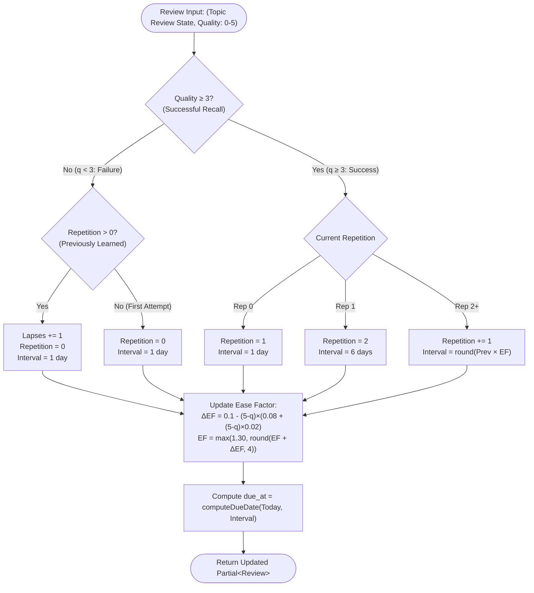
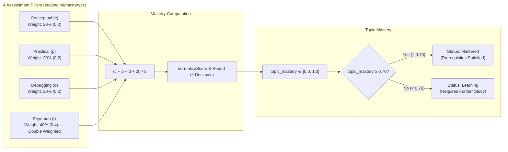

# SM-2 Spaced Repetition and 4-Pillar Mastery Engine
Relevant source files

- [src/engine/mastery.ts](https://github.com/Kuldeep2822k/cli/blob/main/src/engine/mastery.ts)
- [src/engine/sm2.ts](https://github.com/Kuldeep2822k/cli/blob/main/src/engine/sm2.ts)
- [src/engine/index.ts](https://github.com/Kuldeep2822k/cli/blob/main/src/engine/index.ts)
- [src/cli/progress.ts](https://github.com/Kuldeep2822k/cli/blob/main/src/cli/progress.ts)
- [test/engine-mastery.test.ts](https://github.com/Kuldeep2822k/cli/blob/main/test/engine-mastery.test.ts)
- [test/engine-sm2.test.ts](https://github.com/Kuldeep2822k/cli/blob/main/test/engine-sm2.test.ts)
- [docs/adr/0001-supermemo-sm2-algorithm.md](https://github.com/Kuldeep2822k/cli/blob/main/docs/adr/0001-supermemo-sm2-algorithm.md)
- [docs/adr/0004-four-pillar-pedagogical-mastery.md](https://github.com/Kuldeep2822k/cli/blob/main/docs/adr/0004-four-pillar-pedagogical-mastery.md)

PALEE combines two complementary learning engines to power personalized, adaptive knowledge acquisition:

1. **SM-2 Spaced Repetition Engine** (`src/engine/sm2.ts`): Manages retention over time by dynamically expanding review intervals and adjusting topic difficulty factors based on recall performance.
2. **4-Pillar Pedagogical Mastery Engine** (`src/engine/mastery.ts`): Evaluates comprehensive technical mastery across conceptual, practical, troubleshooting, and articulation dimensions.

Both engines operate as deterministic, pure functions decoupled from file system I/O, ensuring reproducible scheduling and evaluation across all platforms.

---

## 1. SM-2 Spaced Repetition Engine

The spaced repetition engine implements the SuperMemo-2 (SM-2) algorithm adapted for Markdown-based storage with specific constraints on ease factor floors and interval progression.

### Quality Rating Scale

PALEE uses a standard 0–5 integer scale to evaluate recall quality during review sessions (`palee review`). This rating determines both the interval expansion and the adjustment delta ($\Delta EF$) to the topic's Ease Factor.

| Rating ($q$) | Qualitative Meaning | Effect on Scheduling | $\Delta EF$ Impact |
|:---:|---|---|:---:|
| **5** | Perfect response; instant, effortless recall. | Maximum interval growth; Ease Factor increases. | $+0.10$ |
| **4** | Correct response after minor hesitation. | Standard interval growth; Ease Factor remains constant. | $+0.00$ |
| **3** | Correct response recalled with serious difficulty. | Minimum interval growth; Ease Factor decreases. | $-0.14$ |
| **2** | Incorrect response; correct answer seemed easy to recall upon reveal. | **Lapse**: Repetition resets to 0; interval resets to 1 day; Ease Factor decreases. | $-0.32$ |
| **1** | Incorrect response; familiar with the topic but unable to recall. | **Lapse**: Repetition resets to 0; interval resets to 1 day; Ease Factor decreases. | $-0.54$ |
| **0** | Complete blackout; total failure to recall. | **Lapse**: Repetition resets to 0; interval resets to 1 day; Ease Factor decreases. | $-0.80$ |

Sources:
- Quality validation: [src/engine/sm2.ts](https://github.com/Kuldeep2822k/cli/blob/main/src/engine/sm2.ts)
- Quality constants and delta logic: [src/engine/sm2.ts](https://github.com/Kuldeep2822k/cli/blob/main/src/engine/sm2.ts)

---

### Algorithm Logic and Formulas

The core transformation is encapsulated in `processReview(current, quality)`:

#### 1. Ease Factor Adjustment

The Ease Factor (`EF`) reflects topic difficulty (default: `2.50`). After every review with rating `q` (0 to 5), the engine computes:

```text
ΔEF = 0.1 - (5 - q) * (0.08 + (5 - q) * 0.02)
EF_new = Math.max(1.30, roundHalfUp(EF_prev + ΔEF, 4))
```

- **EF Floor**: The Ease Factor is strictly bounded by a minimum floor of `1.30` to prevent exponential scheduling collapse on difficult topics.
- **Precision**: The resulting `EF` is rounded to 4 decimal places using half-up positive rounding (`roundHalfUp(val, 4)`).

#### 2. Interval Progression Rules

For successful reviews (`q >= 3`), the next interval (`I`, in calendar days) scales with the repetition count:

```text
Repetition 1: I(1) = 1 day
Repetition 2: I(2) = 6 days
Repetition n >= 3: I(n) = Math.max(1, Math.round(I(n-1) * EF))
```

Every calculated interval is enforced to be at least 1 day (`Math.max(1, newInterval)`).

#### 3. Lapse Handling

When a learner fails a review ($q < 3$):
- **Repetition Reset**: `repetition` resets to `0`.
- **Interval Reset**: `interval_days` resets to `1` day.
- **Lapse Counter**: `lapses` increments by `1` (only if the topic had prior repetitions, i.e., `repetition > 0`).
- **Ease Factor Degradation**: $EF$ decreases according to the $\Delta EF$ formula (e.g., $-0.80$ for $q=0$).

#### 4. DST-Safe Date Scheduling

Scheduling advances review dates using local calendar arithmetic (`due.setDate(due.getDate() + days)`). This prevents 23-hour or 25-hour Daylight Saving Time (DST) clock shifts from corrupting calendar due dates. Dates are serialized as `YYYY-MM-DD` strings via `formatLocalDateOnly`.

---

### SM-2 Execution Pipeline



---

## 2. 4-Pillar Pedagogical Mastery Engine

While SM-2 measures retention and recall latency over time, the 4-Pillar Mastery Engine evaluates multi-dimensional competence. In technical and engineering disciplines, true mastery requires more than fact retrieval; it demands deep comprehension, hands-on construction, troubleshooting capability, and lucid communication.

### The 4 Cognitive Pillars



The four assessment pillars are:

1. **Conceptual Understanding ($c$, 20% weight)**:
   - Evaluates theoretical grasp of fundamental principles, definitions, and mental models.
   - Example: Understanding the theoretical mechanics of the Virtual DOM and reconciliation.
2. **Practical Application ($p$, 20% weight)**:
   - Evaluates direct implementation ability, coding proficiency, and applied execution.
   - Example: Writing idiomatic React components, custom hooks, and state management logic.
3. **Debugging & Troubleshooting ($d$, 20% weight)**:
   - Evaluates competency in diagnosing errors, isolating root causes, reading stack traces, and handling boundary conditions.
   - Example: Identifying and fixing infinite re-render loops or memory leaks.
4. **Feynman Technique Articulation ($f$, 40% weight — Double Weighted)**:
   - Evaluates the ability to explain complex concepts in clear, simple language without relying on jargon.
   - Double-weighted ($2 \times$) because teaching and lucid articulation represent the highest tier of cognitive understanding (Bloom's Taxonomy).
   - Example: Explaining React's reconciliation engine to a junior developer using intuitive analogies.

---

### Mathematical Formulation

The canonical formula for topic mastery is:

```text
topic_mastery = round((c + p + d + 2 * f) / 5, 4)
```

Where:
- `c = normalizeScore(conceptual)` (20% weight)
- `p = normalizeScore(practical)` (20% weight)
- `d = normalizeScore(debug)` (20% weight)
- `f = normalizeScore(feynman)` (40% weight — double weighted)

#### Weight Distribution

- **Conceptual ($c$)**: 20% ($1/5$)
- **Practical ($p$)**: 20% ($1/5$)
- **Debug ($d$)**: 20% ($1/5$)
- **Feynman ($f$)**: 40% ($2/5$)
- **Total**: 100%

For example, with perfect scores across all pillars ($c=1.0, p=1.0, d=1.0, f=1.0$):
```text
topic_mastery = (1.0 + 1.0 + 1.0 + 2 * 1.0) / 5 = 5.0 / 5 = 1.0000
```

---

### Score Normalization and Clamping

The `normalizeScore(val: unknown): number` function enforces strict data hygiene:

- **Clamping**: Every score is clamped to the closed interval $[0.0, 1.0]$ via `Math.max(0, Math.min(1, val))`.
- **String Coercion**: Trims and parses finite numeric string inputs (e.g., `'  0.85  '` $\to 0.85$).
- **Precision**: Rounded to 4 decimal places (`Math.round(clamped * 10000) / 10000`).
- **Safe Fallback**: Non-numeric inputs, `NaN`, `Infinity`, `null`, `undefined`, or unparseable strings return `0.0`.

```typescript
// Example normalization behavior
normalizeScore(0.85432);  // => 0.8543
normalizeScore('0.9');     // => 0.9
normalizeScore(-0.5);      // => 0.0 (clamped)
normalizeScore(1.5);       // => 1.0 (clamped)
normalizeScore('invalid'); // => 0.0 (safe fallback)
normalizeScore(undefined); // => 0.0 (safe fallback)
```

---

### Mastery Threshold (`MASTERY_THRESHOLD = 0.70`)

PALEE defines a canonical mastery threshold constant:

```typescript
// src/engine/mastery.ts
export const MASTERY_THRESHOLD = 0.7; // 70%
```

#### Status Classification

Topics are categorized based on their computed `topic_mastery`:

- **Mastered (`mastered`)**: `topic_mastery >= 0.70`. The topic is considered fully understood.
- **Learning (`learning`)**: `0.0 < topic_mastery < 0.70`. Active study in progress.
- **New (`new`)**: `topic_mastery === 0.0`. Unassessed topic.

#### Downstream Prerequisite Unblocking

The `MASTERY_THRESHOLD` serves as the gatekeeper for curriculum progression. In `areDependenciesSatisfied()`, a topic only unblocks dependent child topics if **all** of its prerequisites have `topic_mastery >= 0.70`. A score of `0.6999` keeps downstream topics locked.

---

### Archive Exclusion in Vault Analytics

When computing vault-wide analytics in `palee progress` (`src/cli/progress.ts`), archived topics (`status === 'archived'`) are strictly partitioned from active learning metrics:

```typescript
// src/cli/progress.ts
const activeTopics = topics.filter(t => t.status !== 'archived');
const archivedTopics = topics.filter(t => t.status === 'archived');
```

#### Analytics Invariants:

1. **Active Topic Count**: `active_topic_count = activeTopics.length`.
2. **Archived Topic Count**: `archived_topic_count = archivedTopics.length` is tracked separately.
3. **Global Mastery Average**: Computed strictly across active topics:
   ```text
   global_mastery = active_topic_count > 0 
     ? round(sum(activeTopics.map(t => t.mastery)) / active_topic_count, 4) 
     : null
   ```
4. **Mastery Status**: If `global_mastery === null`, status is `'no_data'`. Otherwise `'mastered'` (`>= 0.70`) or `'learning'` (`< 0.70`).
5. **Difficulty Breakdowns**: Beginner, Intermediate, and Advanced averages strictly evaluate `activeTopics`.

---

## 3. Data Model & TypeScript Interfaces

```typescript
// src/engine/mastery.ts
export interface AssessmentPillars {
  /** Conceptual understanding score (0.0 - 1.0) */
  conceptual?: number | null;
  /** Practical implementation score (0.0 - 1.0) */
  practical?: number | null;
  /** Debugging competency score (0.0 - 1.0) */
  debug?: number | null;
  /** Feynman articulation score (0.0 - 1.0) */
  feynman?: number | null;
}

// src/types.ts
export interface Review {
  ease_factor: number;    // >= 1.30 (default: 2.50)
  interval_days: number;  // >= 1 (default: 1)
  repetition: number;     // >= 0 (default: 0)
  lapses: number;         // >= 0 (default: 0)
  last_quality?: number;  // 0 - 5
  last_reviewed_at?: string; // ISO 8601 string
  due_at?: string;        // ISO 8601 string
}
```

---

## 4. Invariants and Architectural Guarantees

| Invariant | Value / Formula | Architectural Rationale |
|---|---|---|
| **Ease Factor Floor** | $EF \ge 1.30$ | Prevents scheduling death spirals on difficult topics. |
| **Minimum Interval** | $I \ge 1\text{ day}$ | Ensures reviews are scheduled at minimum for the following day. |
| **Score Clamping** | $[0.0, 1.0]$ | Bounds all assessment dimensions to normalized unit intervals. |
| **Feynman Double Weight** | $40\%$ weight ($2\times$) | Prioritizes deep conceptual articulation over shallow memorization. |
| **Mastery Threshold** | `0.70` (70%) | Establishes a rigorous, standardized bar for curriculum readiness. |
| **Archive Segregation** | `status !== 'archived'` | Prevents stale or retired topics from distorting learning progress metrics. |
| **Deterministic Rounding** | 4 decimal places | Ensures bit-for-bit identical outputs across environments. |

Sources:
- SM-2 Algorithm: [src/engine/sm2.ts](https://github.com/Kuldeep2822k/cli/blob/main/src/engine/sm2.ts)
- Mastery Model: [src/engine/mastery.ts](https://github.com/Kuldeep2822k/cli/blob/main/src/engine/mastery.ts)
- Analytics Integration: [src/cli/progress.ts](https://github.com/Kuldeep2822k/cli/blob/main/src/cli/progress.ts)
- Engine Tests: [test/engine-sm2.test.ts](https://github.com/Kuldeep2822k/cli/blob/main/test/engine-sm2.test.ts), [test/engine-mastery.test.ts](https://github.com/Kuldeep2822k/cli/blob/main/test/engine-mastery.test.ts)