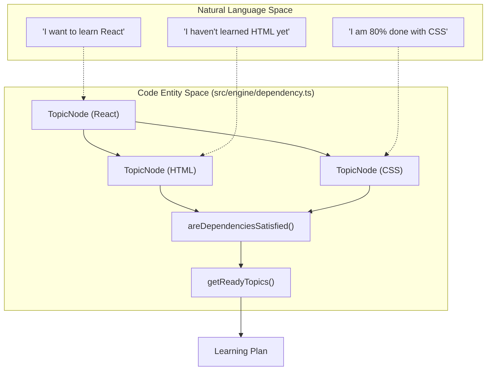
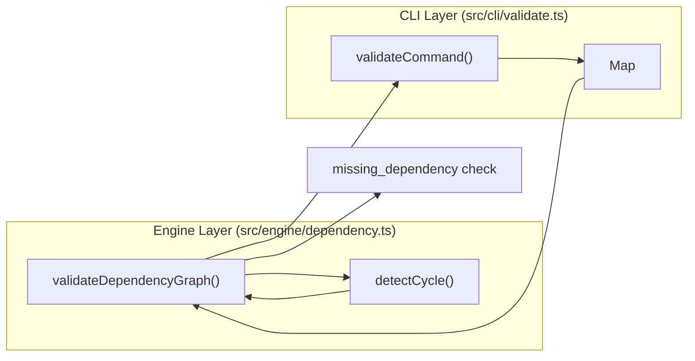

# Dependency Graph Engine
Relevant source files

- [src/cli/validate.ts](https://github.com/Kuldeep2822k/cli/blob/main/src/cli/validate.ts)
- [src/engine/dependency.ts](https://github.com/Kuldeep2822k/cli/blob/main/src/engine/dependency.ts)
- [src/engine/index.ts](https://github.com/Kuldeep2822k/cli/blob/main/src/engine/index.ts)
- [src/engine/sm2.ts](https://github.com/Kuldeep2822k/cli/blob/main/src/engine/sm2.ts)
- [test/engine-dependency.test.ts](https://github.com/Kuldeep2822k/cli/blob/main/test/engine-dependency.test.ts)
- [test/engine-sm2.test.ts](https://github.com/Kuldeep2822k/cli/blob/main/test/engine-sm2.test.ts)

The Dependency Graph Engine is a core component of the PALEE engine layer responsible for modeling and validating the relationships between learning topics. It treats the curriculum as a Directed Acyclic Graph (DAG) where nodes represent topics and edges represent prerequisite requirements.

## TopicNode Model

The engine represents the vault's structure using the `TopicNode` interface. This model abstracts the file system details into a pure data structure suitable for graph traversal and logic application.

| Property | Type | Description |
| --- | --- | --- |
| `palee_id` | `string` | Unique identifier for the topic. |
| `depends_on` | `string[]` | List of `palee_id`s that must be mastered before this topic. |
| `topic_mastery` | `number` | A value from 0.0 to 1.0 representing current knowledge level. |

Sources:

- `TopicNode` definition: [src/types.ts](https://github.com/Kuldeep2822k/cli/blob/main/src/types.ts) (referenced in [src/engine/dependency.ts#6](https://github.com/Kuldeep2822k/cli/blob/main/src/engine/dependency.ts#L6-L6))
- Usage in graph: [src/engine/dependency.ts#10](https://github.com/Kuldeep2822k/cli/blob/main/src/engine/dependency.ts#L10-L10)

---

## Mastery Threshold and Readiness

The engine uses a Mastery Threshold (defaulting to `0.7` or 70%) to determine if a prerequisite is satisfied. A topic is considered "Ready" for learning only if all its dependencies meet or exceed this threshold.

### `areDependenciesSatisfied`

This function evaluates a specific `TopicNode` against the global map of topics. It returns `false` if:

1. A dependency ID is missing from the graph (broken link) [src/engine/dependency.ts#54-56](https://github.com/Kuldeep2822k/cli/blob/main/src/engine/dependency.ts#L54-L56)
2. A dependency's `topic_mastery` is below the `threshold`[src/engine/dependency.ts#58-61](https://github.com/Kuldeep2822k/cli/blob/main/src/engine/dependency.ts#L58-L61)

### `getReadyTopics`

This function filters the entire vault to find topics suitable for the next learning session. It excludes topics that are already mastered (>= threshold) and those with unsatisfied dependencies [src/engine/dependency.ts#67-83](https://github.com/Kuldeep2822k/cli/blob/main/src/engine/dependency.ts#L67-L83)

### Data Flow: Natural Language to Code Entities

The following diagram illustrates how user concepts like "Prerequisites" and "Ready to Learn" map to the internal engine functions and data structures.

"Natural Language to Code Space: Readiness"

Sources:

- Logic implementation: [src/engine/dependency.ts#49-83](https://github.com/Kuldeep2822k/cli/blob/main/src/engine/dependency.ts#L49-L83)

---

## Cycle Detection and Validation

To maintain a valid Directed Acyclic Graph (DAG), the engine must ensure there are no circular dependencies (e.g., A depends on B, and B depends on A).

### DFS-based Cycle Detection

The `detectCycle` function implements a Depth-First Search (DFS) algorithm using three distinct states to track traversal:

1. `visiting` Set: Tracks nodes in the current recursion stack. If a node already in this set is encountered, a cycle exists [src/engine/dependency.ts#16-20](https://github.com/Kuldeep2822k/cli/blob/main/src/engine/dependency.ts#L16-L20)
2. `visited` Set: Tracks nodes that have been fully processed to avoid redundant work [src/engine/dependency.ts#21](https://github.com/Kuldeep2822k/cli/blob/main/src/engine/dependency.ts#L21-L21)
3. `pathStack`: An array used to reconstruct the exact path of the cycle for error reporting [src/engine/dependency.ts#13](https://github.com/Kuldeep2822k/cli/blob/main/src/engine/dependency.ts#L13-L13)

### `validateDependencyGraph`

This is the primary entry point for vault integrity checks. It aggregates two types of `ValidationError`:

- `missing_dependency`: Triggered when a `palee_id` listed in `depends_on` does not exist in the vault [src/engine/dependency.ts#92-101](https://github.com/Kuldeep2822k/cli/blob/main/src/engine/dependency.ts#L92-L101)
- `cycle`: Triggered if `detectCycle` returns a non-null path [src/engine/dependency.ts#104-111](https://github.com/Kuldeep2822k/cli/blob/main/src/engine/dependency.ts#L104-L111)

### Data Flow: Validation Pipeline

This diagram shows how the `validate` command interacts with the engine to produce error reports.

"Code Entity Space: Validation Pipeline"

Sources:

- Cycle detection logic: [src/engine/dependency.ts#10-47](https://github.com/Kuldeep2822k/cli/blob/main/src/engine/dependency.ts#L10-L47)
- Validation logic: [src/engine/dependency.ts#85-117](https://github.com/Kuldeep2822k/cli/blob/main/src/engine/dependency.ts#L85-L117)
- CLI integration: [src/cli/validate.ts#64-65](https://github.com/Kuldeep2822k/cli/blob/main/src/cli/validate.ts#L64-L65)

---

## Error Reporting

When the engine detects issues, it returns a `ValidationResult` containing `ValidationError` objects. The CLI formats these for the user:

| Error Type | Key Data Provided | CLI Output Example |
| --- | --- | --- |
| `duplicate_id` | `id`, `files[]` | `Duplicate ID: T-123. Files: path/a.md, path/b.md` |
| `missing_dependency` | `topic`, `missing` | `Missing dependency: Topic A depends on Topic B` |
| `cycle` | `path[]` | `Dependency cycle: A → B → C → A` |

Sources:

- Error types: [src/types.ts](https://github.com/Kuldeep2822k/cli/blob/main/src/types.ts) (referenced in [src/engine/dependency.ts#6](https://github.com/Kuldeep2822k/cli/blob/main/src/engine/dependency.ts#L6-L6))
- CLI formatting: [src/cli/validate.ts#90-100](https://github.com/Kuldeep2822k/cli/blob/main/src/cli/validate.ts#L90-L100)