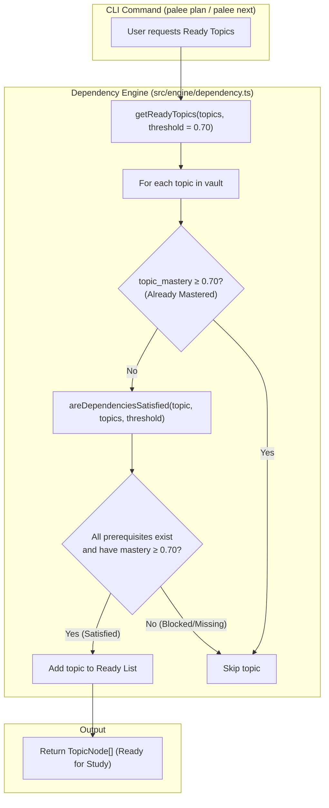
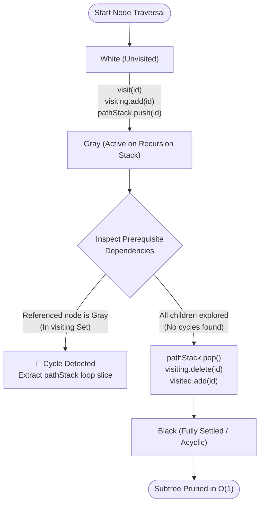
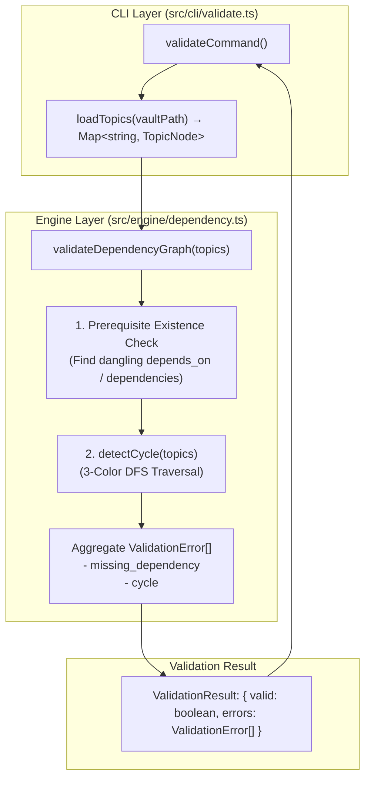

# Dependency Graph Engine
Relevant source files

- [src/cli/validate.ts](https://github.com/Kuldeep2822k/cli/blob/main/src/cli/validate.ts)
- [src/engine/dependency.ts](https://github.com/Kuldeep2822k/cli/blob/main/src/engine/dependency.ts)
- [src/engine/index.ts](https://github.com/Kuldeep2822k/cli/blob/main/src/engine/index.ts)
- [src/engine/mastery.ts](https://github.com/Kuldeep2822k/cli/blob/main/src/engine/mastery.ts)
- [src/types.ts](https://github.com/Kuldeep2822k/cli/blob/main/src/types.ts)
- [test/engine-dependency.test.ts](https://github.com/Kuldeep2822k/cli/blob/main/test/engine-dependency.test.ts)

The Dependency Graph Engine models curriculum relationships as a Directed Acyclic Graph (DAG), ensuring learners tackle foundational prerequisites before advanced concepts. It provides cycle detection using a formal 3-color Depth-First Search (DFS), prerequisite satisfaction evaluation against the `0.70` mastery threshold, and graph integrity validation.

---

## TopicNode Model & Dependency Extraction

The graph engine abstracts Markdown vault notes into `TopicNode` entities:

| Property | Type | Description |
|---|---|---|
| `palee_id` | `string` | Unique immutable identifier for the topic note. |
| `title` | `string` (optional) | Human-readable topic title. |
| `path` | `string` (optional) | Relative file path within the Obsidian vault. |
| `depends_on` | `string[]` (optional) | List of prerequisite `palee_id` references that must be mastered first. |
| `dependencies` | `string[]` (optional) | Alias array for `depends_on`, providing backward compatibility. |
| `topic_mastery` | `number` (optional) | Floating-point mastery score in the interval $[0.0, 1.0]$. |

### Prerequisite Alias Normalization

To ensure robust interoperability across legacy frontmatter and third-party note formats, `getTopicDependencies` normalizes prerequisite declarations across both `depends_on` and `dependencies` fields:

```typescript
// src/engine/dependency.ts
function getTopicDependencies(topic: TopicNode): string[] {
  const fromDependsOn = Array.isArray(topic.depends_on) ? topic.depends_on : [];
  const fromDependencies = Array.isArray(topic.dependencies) ? topic.dependencies : [];
  const combined = [...fromDependsOn, ...fromDependencies];
  return Array.from(new Set(combined.map((d) => String(d).trim()).filter(Boolean)));
}
```

---

## Mastery Threshold and Readiness Evaluation

PALEE enforces a standard threshold (`MASTERY_THRESHOLD = 0.70` or 70%) to evaluate whether prerequisites are satisfied. A topic is considered ready for immediate study only when every prerequisite topic in its dependency chain meets or exceeds this threshold.

### `areDependenciesSatisfied(topic, topics, threshold = 0.70)`

Evaluates whether all prerequisite dependencies for a given topic are satisfied:

1. **Extracts Prerequisite IDs**: Resolves unique IDs using `getTopicDependencies(topic)`.
2. **Missing Prerequisite Check**: If any referenced `depId` does not exist in `topics`, returns `false`.
3. **Mastery Threshold Verification**: For each prerequisite `depTopic`, if `depTopic.topic_mastery < threshold`, returns `false`.
4. Returns `true` if and only if all prerequisites exist and have `topic_mastery >= threshold`.

### `getReadyTopics(topics, threshold = 0.70)`

Determines the queue of unmastered topics whose prerequisites are fully satisfied:

1. Iterates over all topics in `topics.values()`.
2. **Mastery Check**: If `topic.topic_mastery >= threshold`, skips the topic (already mastered).
3. **Dependency Check**: Calls `areDependenciesSatisfied(topic, topics, threshold)`.
4. If satisfied, appends `topic` to the ready list.

### Readiness Evaluation Flowchart



---

## 3-Color DFS Cycle Detection Algorithm

A learning curriculum cannot be sequenced if circular dependencies exist (e.g., $A \to B \to C \to A$). PALEE detects circular dependencies using a formal **3-color Depth-First Search (DFS)** algorithm:

### 3-Color Visiting States



1. **White (Unvisited)**:
   - The node has not yet been encountered during traversal.
   - Identified by: `!visiting.has(id) && !visited.has(id)`.
2. **Gray (Visiting / Active Recursion Stack)**:
   - The node is currently on the active DFS recursion stack. Its descendant prerequisite subtrees are actively being explored.
   - Maintained in: `visiting = new Set<string>()` and `pathStack = string[]`.
   - **Cycle Invariant**: If DFS encounters an edge pointing to a node already in `visiting`, a **cyclic back-edge** is discovered.
3. **Black (Visited / Settled)**:
   - The node and all of its prerequisite descendant subtrees have been fully explored with no cyclic back-edges.
   - Maintained in: `visited = new Set<string>()`.
   - The node is popped from `pathStack` and deleted from `visiting`.
   - Any subsequent traversal reaching a Black node returns `null` immediately, pruning redundant work in $O(1)$ time.

### Cyclic Back-Edge Extraction via `pathStack`

When a back-edge to an active Gray node is detected, `detectCycle` extracts the exact loop path slice from `pathStack`:

```typescript
// src/engine/dependency.ts
function detectCycle(topics: Map<string, TopicNode>): string[] | null {
  const visiting = new Set<string>();
  const visited = new Set<string>();
  const pathStack: string[] = [];

  function visit(id: string): string[] | null {
    if (visiting.has(id)) {
      // Found back-edge to active ancestor (Gray node)
      const cycleStart = pathStack.indexOf(id);
      return pathStack.slice(cycleStart).concat(id);
    }
    if (visited.has(id)) return null;

    const topic = topics.get(id);
    if (!topic) return null;

    visiting.add(id);
    pathStack.push(id);

    const deps = getTopicDependencies(topic);
    for (const depId of deps) {
      const cycle = visit(depId);
      if (cycle) return cycle;
    }

    pathStack.pop();
    visiting.delete(id);
    visited.add(id);
    return null;
  }

  for (const id of topics.keys()) {
    const cycle = visit(id);
    if (cycle) return cycle;
  }

  return null;
}
```

For example, if `pathStack` contains `['T-intro', 'T-react', 'T-hooks']` and `T-hooks` depends on `T-react`, `cycleStart = pathStack.indexOf('T-react')` (index 1), producing the exact cycle array:
`['T-react', 'T-hooks', 'T-react']`.

---

## Graph Integrity Validation

The `validateDependencyGraph` function is the primary entry point for curriculum integrity audits (`palee validate`).

### Validation Pipeline Diagram



### Validation Error Catalog

| Error Type | Fields | Trigger Condition | Exit Code | Example Error Message |
|---|---|---|:---:|---|
| `missing_dependency` | `topic`, `missing` | A prerequisite ID listed in `depends_on` does not exist in the vault. | `3` | `Topic T-react depends on missing topic T-html` |
| `cycle` | `path` | Circular prerequisite reference detected by 3-color DFS. | `3` | `Circular dependency detected: T-a -> T-b -> T-c -> T-a` |

---

## Invariants and Guarantees

| Invariant | Implementation Guarantee |
|---|---|
| **Acyclicity** | Curriculum must form a strict Directed Acyclic Graph (DAG). `detectCycle` returns `null`. |
| **Prerequisite Gating** | Downstream topics are locked until all direct prerequisites achieve $\ge 0.70$ mastery. |
| **Alias Equivalence** | `depends_on` and `dependencies` are treated identically with deduplicated IDs. |
| **Deterministic Traversal** | 3-color DFS guarantees linear time $O(V + E)$ cycle detection without infinite recursion. |

Sources:
- Dependency Graph Engine: [src/engine/dependency.ts](https://github.com/Kuldeep2822k/cli/blob/main/src/engine/dependency.ts)
- Validation CLI Command: [src/cli/validate.ts](https://github.com/Kuldeep2822k/cli/blob/main/src/cli/validate.ts)
- Domain Types: [src/types.ts](https://github.com/Kuldeep2822k/cli/blob/main/src/types.ts)
- Graph Test Suite: [test/engine-dependency.test.ts](https://github.com/Kuldeep2822k/cli/blob/main/test/engine-dependency.test.ts)