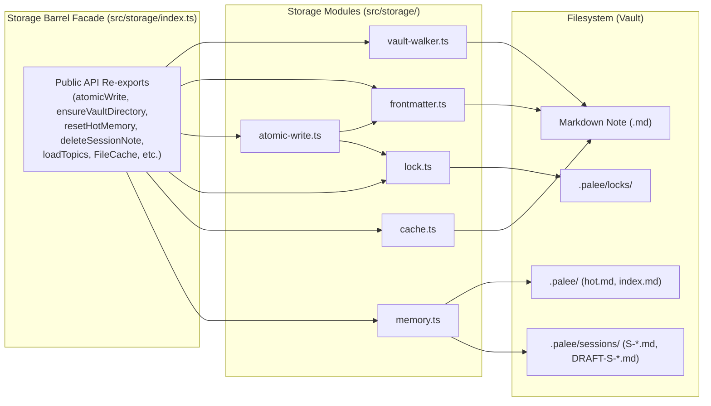
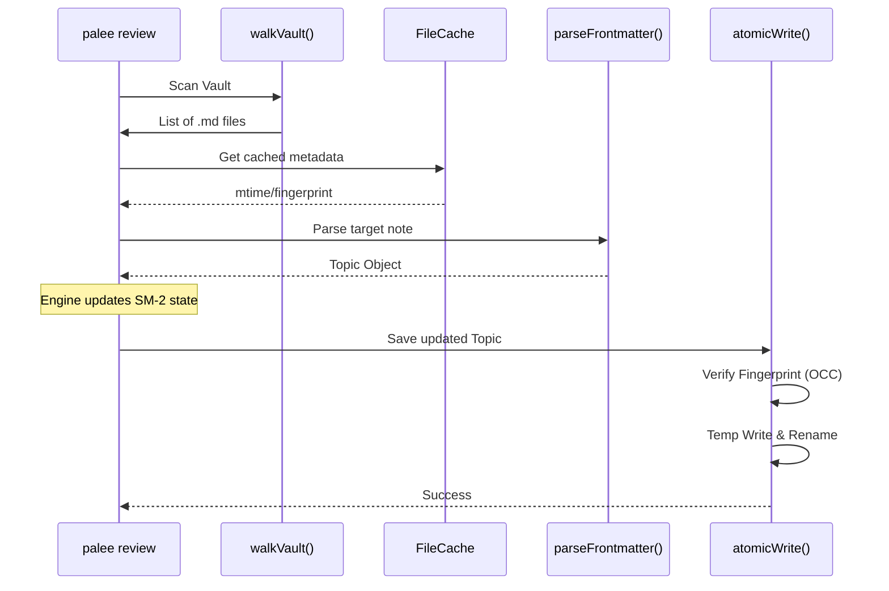

# Storage Layer

<b>Relevant Source Files</b>

- [planning/storage_design.md](https://github.com/Kuldeep2822k/cli/blob/main/planning/storage_design.md?plain=1)
- [src/storage/atomic-write.ts](https://github.com/Kuldeep2822k/cli/blob/main/src/storage/atomic-write.ts)
- [src/storage/cache.ts](https://github.com/Kuldeep2822k/cli/blob/main/src/storage/cache.ts)
- [src/storage/frontmatter.ts](https://github.com/Kuldeep2822k/cli/blob/main/src/storage/frontmatter.ts)
- [src/storage/memory.ts](https://github.com/Kuldeep2822k/cli/blob/main/src/storage/memory.ts)
- [src/storage/pattern-matcher.ts](https://github.com/Kuldeep2822k/cli/blob/main/src/storage/pattern-matcher.ts)
- [src/storage/vault-walker.ts](https://github.com/Kuldeep2822k/cli/blob/main/src/storage/vault-walker.ts)
- [test/storage-pattern-matcher.test.ts](https://github.com/Kuldeep2822k/cli/blob/main/test/storage-pattern-matcher.test.ts)
- [test/storage-walker.test.ts](https://github.com/Kuldeep2822k/cli/blob/main/test/storage-walker.test.ts)

The Storage Layer is responsible for managing the Obsidian vault as the canonical source of truth[planning/storage_design.md#3-5](https://github.com/Kuldeep2822k/cli/blob/main/planning/storage_design.md?plain=1#L3-L5) It ensures that all modifications to Markdown notes are safe, non-destructive, and conflict-aware. By treating the vault as a filesystem-based database, PALEE allows users to use their own editors (like Obsidian) while providing a robust interface for the engine core.

### The File-Safety Contract & Storage Isolation Layer

PALEE operates under a strict file-safety and storage isolation contract to prevent data loss or corruption in a multi-process environment:

1. **Storage Isolation Boundary & Unified Facade**: All persistence operations across PALEE are encapsulated behind `src/storage/index.ts`. CLI command handlers are strictly forbidden from performing raw filesystem mutations (`fs.unlinkSync`, `fs.mkdirSync`, `fs.rmSync`). Instead, all mutations route through dedicated storage helper functions (`ensureVaultDirectory`, `resetHotMemory`, `deleteTopicDrafts`, `deleteSessionNote`, `writeSessionNote`, `atomicWrite`).
2. **CST-Preserving Updates**: Modifications only touch PALEE-owned frontmatter keys, preserving user comments, ordering, and unknown plugin metadata byte-for-byte [planning/storage_design.md#7-19](https://github.com/Kuldeep2822k/cli/blob/main/planning/storage_design.md?plain=1#L7-L19).
3. **Optimistic Concurrency Control (OCC)**: Before modifying a note, PALEE validates the SHA-256 content fingerprint against disk state (`computeFingerprint(currentContent)`). Any mismatch aborts the write with `ECONFLICT` (mapped to CLI exit code `4`), preventing the overwriting of external changes made in Obsidian or sync daemons [src/storage/atomic-write.ts#81-117](https://github.com/Kuldeep2822k/cli/blob/main/src/storage/atomic-write.ts#L81-L117).
4. **Atomic Replacement**: Files are written to an isolated temporary file (`<target>.tmp.<pid>.<entropy>`), flushed to non-volatile media with `fsyncSync`, and atomically renamed over the target path to prevent torn or partial writes [src/storage/atomic-write.ts#119-152](https://github.com/Kuldeep2822k/cli/blob/main/src/storage/atomic-write.ts#L119-L152).
5. **Exclusive Locking**: A directory-based mutex locking mechanism (`.palee/locks/<hash>.lockdir`) prevents PALEE-to-PALEE race conditions across POSIX and Windows [src/storage/lock.ts#8-50](https://github.com/Kuldeep2822k/cli/blob/main/src/storage/lock.ts#L8-L50).
6. **Deterministic FileCache**: `FileCache` in `src/storage/cache.ts` operates deterministically with zero environment leaks (e.g. no `NODE_ENV !== 'test'` bypasses), strictly enforcing the 2,000 ms unsettled horizon and SHA-256 fallback across all runtimes.

### Code Entity Space Mapping

The following diagram maps the high-level storage concepts to their respective implementations in the codebase.

Storage System Architecture

Sources:[src/storage/vault-walker.ts#6-8](https://github.com/Kuldeep2822k/cli/blob/main/src/storage/vault-walker.ts#L6-L8)[src/storage/frontmatter.ts#6-7](https://github.com/Kuldeep2822k/cli/blob/main/src/storage/frontmatter.ts#L6-L7)[src/storage/atomic-write.ts#14-17](https://github.com/Kuldeep2822k/cli/blob/main/src/storage/atomic-write.ts#L14-L17)[src/storage/lock.ts#8](https://github.com/Kuldeep2822k/cli/blob/main/src/storage/lock.ts#L8-L8)[src/storage/cache.ts#11-13](https://github.com/Kuldeep2822k/cli/blob/main/src/storage/cache.ts#L11-L13)

---

### 4.1 Frontmatter Parser and Atomic Writes

This component handles the low-level manipulation of Markdown files. It uses a YAML Concrete Syntax Tree (CST) parser to ensure that updating learning statistics doesn't destroy user formatting or third-party plugin data. The atomic write process includes an OCC fingerprint verification check (raising `ECONFLICT` on mismatch, mapped to exit code 4) and a specialized retry loop for Windows to handle `EPERM` or `EBUSY` errors common in synced folders (e.g., Dropbox, iCloud).

For details, see [Frontmatter Parser and Atomic Writes](./04-1-frontmatter-parser-and-atomic-writes.md).

Sources:[src/storage/frontmatter.ts#10-61](https://github.com/Kuldeep2822k/cli/blob/main/src/storage/frontmatter.ts#L10-L61)[src/storage/atomic-write.ts#47-159](https://github.com/Kuldeep2822k/cli/blob/main/src/storage/atomic-write.ts#L47-L159)

### 4.2 File Locking

PALEE implements a cooperative locking mechanism using directory creation (`mkdirSync`), which is atomic across all major operating systems. Locks are stored in `.palee/locks/` and include heartbeats to allow for the recovery of stale locks if a process crashes.

For details, see [File Locking](./04-2-file-locking.md).

Sources:[src/storage/lock.ts#8-50](https://github.com/Kuldeep2822k/cli/blob/main/src/storage/lock.ts#L8-L50)[planning/storage_design.md#56-71](https://github.com/Kuldeep2822k/cli/blob/main/planning/storage_design.md?plain=1#L56-L71)

### 4.3 Vault Walker and File Cache

The `walkVault` function recursively discovers Markdown files while strictly ignoring internal directories like `.git`, `node_modules`, and Obsidian's internal `.obsidian` folder. To optimize performance, a `FileCache` tracks file metadata, utilizing a 2-second unsettled horizon (`UNSETTLED_HORIZON = 2000`) to force SHA-256 fingerprint re-validation of recently modified files, and a SHA-256 fallback mechanism to preserve cache entries when `mtime` shifts without content changes.

For details, see [Vault Walker and File Cache](./04-3-vault-walker-and-file-cache.md).

Sources:[src/storage/vault-walker.ts#14-93](https://github.com/Kuldeep2822k/cli/blob/main/src/storage/vault-walker.ts#L14-L93)[src/storage/cache.ts#16-107](https://github.com/Kuldeep2822k/cli/blob/main/src/storage/cache.ts#L16-L107)

### 4.4 Session Memory Storage

The `.palee/` directory acts as the engine's working memory. It stores canonical session records, derived views for the CLI (`hot.md`, `index.md`), and temporary session drafts. This sub-system manages the lifecycle of a learning session from an active draft to a completed note.

For details, see [Session Memory Storage](./04-4-session-memory-storage.md).

Sources:[src/storage/memory.ts#15-30](https://github.com/Kuldeep2822k/cli/blob/main/src/storage/memory.ts#L15-L30)[src/storage/memory.ts#108-143](https://github.com/Kuldeep2822k/cli/blob/main/src/storage/memory.ts#L108-L143)[src/storage/memory.ts#148-214](https://github.com/Kuldeep2822k/cli/blob/main/src/storage/memory.ts#L148-L214)

---

### Storage Interaction Flow

The following diagram illustrates how a command like `palee review` interacts with the storage layer entities.

Review Command Data Flow

Sources:[src/storage/vault-walker.ts#14-93](https://github.com/Kuldeep2822k/cli/blob/main/src/storage/vault-walker.ts#L14-L93)[src/storage/cache.ts#47-107](https://github.com/Kuldeep2822k/cli/blob/main/src/storage/cache.ts#L47-L107)[src/storage/frontmatter.ts#10-61](https://github.com/Kuldeep2822k/cli/blob/main/src/storage/frontmatter.ts#L10-L61)[src/storage/atomic-write.ts#47-159](https://github.com/Kuldeep2822k/cli/blob/main/src/storage/atomic-write.ts#L47-L159)