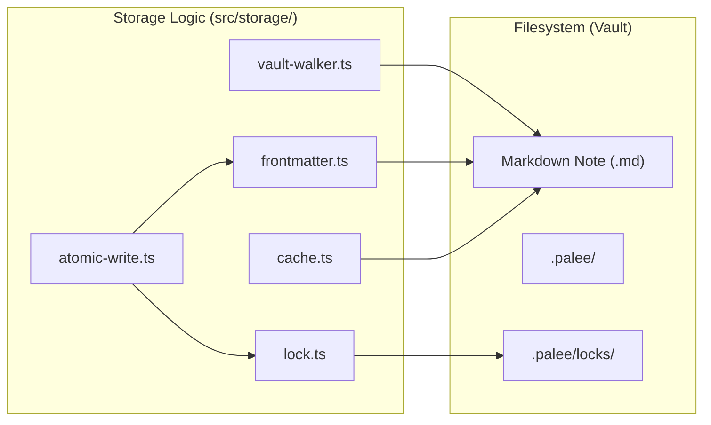
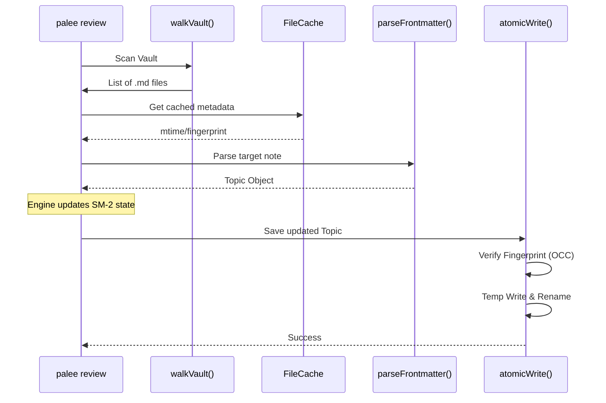

# Storage Layer
Relevant source files

- [planning/storage_design.md](https://github.com/Kuldeep2822k/cli/blob/e8b70e0d/planning/storage_design.md?plain=1)
- [src/storage/atomic-write.ts](https://github.com/Kuldeep2822k/cli/blob/e8b70e0d/src/storage/atomic-write.ts)
- [src/storage/cache.ts](https://github.com/Kuldeep2822k/cli/blob/e8b70e0d/src/storage/cache.ts)
- [src/storage/frontmatter.ts](https://github.com/Kuldeep2822k/cli/blob/e8b70e0d/src/storage/frontmatter.ts)
- [src/storage/memory.ts](https://github.com/Kuldeep2822k/cli/blob/e8b70e0d/src/storage/memory.ts)
- [src/storage/vault-walker.ts](https://github.com/Kuldeep2822k/cli/blob/e8b70e0d/src/storage/vault-walker.ts)
- [test/storage-walker.test.ts](https://github.com/Kuldeep2822k/cli/blob/e8b70e0d/test/storage-walker.test.ts)

The Storage Layer is responsible for managing the Obsidian vault as the canonical source of truth[planning/storage_design.md#3-5](https://github.com/Kuldeep2822k/cli/blob/e8b70e0d/planning/storage_design.md?plain=1#L3-L5) It ensures that all modifications to Markdown notes are safe, non-destructive, and conflict-aware. By treating the vault as a filesystem-based database, PALEE allows users to use their own editors (like Obsidian) while providing a robust interface for the engine core.

### The File-Safety Contract

PALEE operates under a strict file-safety contract to prevent data loss or corruption in a multi-process environment:

1. CST-Preserving Updates: Modifications only touch PALEE-owned frontmatter keys, preserving user comments, ordering, and unknown plugin metadata [planning/storage_design.md#7-19](https://github.com/Kuldeep2822k/cli/blob/e8b70e0d/planning/storage_design.md?plain=1#L7-L19)
2. Optimistic Concurrency Control (OCC): Before writing, PALEE verifies a SHA-256 fingerprint of the file to ensure it hasn't changed since it was last read [src/storage/atomic-write.ts#31-38](https://github.com/Kuldeep2822k/cli/blob/e8b70e0d/src/storage/atomic-write.ts#L31-L38)
3. Atomic Replacement: Files are written to a temporary location and then renamed to the target path to prevent partial writes [src/storage/atomic-write.ts#40-56](https://github.com/Kuldeep2822k/cli/blob/e8b70e0d/src/storage/atomic-write.ts#L40-L56)
4. Exclusive Locking: A directory-based locking mechanism prevents PALEE-to-PALEE race conditions [src/storage/atomic-write.ts#23-28](https://github.com/Kuldeep2822k/cli/blob/e8b70e0d/src/storage/atomic-write.ts#L23-L28)

### Code Entity Space Mapping

The following diagram maps the high-level storage concepts to their respective implementations in the codebase.

Storage System Architecture

Sources:[src/storage/vault-walker.ts#6-8](https://github.com/Kuldeep2822k/cli/blob/e8b70e0d/src/storage/vault-walker.ts#L6-L8)[src/storage/frontmatter.ts#6-7](https://github.com/Kuldeep2822k/cli/blob/e8b70e0d/src/storage/frontmatter.ts#L6-L7)[src/storage/atomic-write.ts#7-23](https://github.com/Kuldeep2822k/cli/blob/e8b70e0d/src/storage/atomic-write.ts#L7-L23)[src/storage/lock.ts#3](https://github.com/Kuldeep2822k/cli/blob/e8b70e0d/src/storage/lock.ts#L3-L3)[src/storage/cache.ts#6-8](https://github.com/Kuldeep2822k/cli/blob/e8b70e0d/src/storage/cache.ts#L6-L8)

---

### 4.1 Frontmatter Parser and Atomic Writes

This component handles the low-level manipulation of Markdown files. It uses a YAML Concrete Syntax Tree (CST) parser to ensure that updating learning statistics doesn't destroy user formatting or third-party plugin data. The atomic write process includes a specialized retry loop for Windows to handle `EPERM` or `EBUSY` errors common in synced folders (e.g., Dropbox, iCloud).

For details, see [Frontmatter Parser and Atomic Writes](./04-1-frontmatter-parser-and-atomic-writes.md).

Sources:[src/storage/frontmatter.ts#10-57](https://github.com/Kuldeep2822k/cli/blob/e8b70e0d/src/storage/frontmatter.ts#L10-L57)[src/storage/atomic-write.ts#42-73](https://github.com/Kuldeep2822k/cli/blob/e8b70e0d/src/storage/atomic-write.ts#L42-L73)

### 4.2 File Locking

PALEE implements a cooperative locking mechanism using directory creation (`mkdirSync`), which is atomic across all major operating systems. Locks are stored in `.palee/locks/` and include heartbeats to allow for the recovery of stale locks if a process crashes.

For details, see [File Locking](./04-2-file-locking.md).

Sources:[src/storage/lock.ts#23-27](https://github.com/Kuldeep2822k/cli/blob/e8b70e0d/src/storage/lock.ts#L23-L27)[planning/storage_design.md#56-71](https://github.com/Kuldeep2822k/cli/blob/e8b70e0d/planning/storage_design.md?plain=1#L56-L71)

### 4.3 Vault Walker and File Cache

The `walkVault` function recursively discovers Markdown files while strictly ignoring internal directories like `.git`, `node_modules`, and Obsidian's internal `.obsidian` folder. To improve performance, a `FileCache` tracks file metadata, utilizing a "2-second unsettled horizon" to force re-validation of files that were modified very recently.

For details, see [Vault Walker and File Cache](./04-3-vault-walker-and-file-cache.md).

Sources:[src/storage/vault-walker.ts#10-12](https://github.com/Kuldeep2822k/cli/blob/e8b70e0d/src/storage/vault-walker.ts#L10-L12)[src/storage/vault-walker.ts#73-85](https://github.com/Kuldeep2822k/cli/blob/e8b70e0d/src/storage/vault-walker.ts#L73-L85)[src/storage/cache.ts#10-13](https://github.com/Kuldeep2822k/cli/blob/e8b70e0d/src/storage/cache.ts#L10-L13)[src/storage/cache.ts#36-53](https://github.com/Kuldeep2822k/cli/blob/e8b70e0d/src/storage/cache.ts#L36-L53)

### 4.4 Session Memory Storage

The `.palee/` directory acts as the engine's working memory. It stores canonical session records, derived views for the CLI (`hot.md`, `index.md`), and temporary session drafts. This sub-system manages the lifecycle of a learning session from an active draft to a completed note.

For details, see [Session Memory Storage](./04-4-session-memory-storage.md).

Sources:[src/storage/memory.ts#15-30](https://github.com/Kuldeep2822k/cli/blob/e8b70e0d/src/storage/memory.ts#L15-L30)[src/storage/memory.ts#108-143](https://github.com/Kuldeep2822k/cli/blob/e8b70e0d/src/storage/memory.ts#L108-L143)[src/storage/memory.ts#148-214](https://github.com/Kuldeep2822k/cli/blob/e8b70e0d/src/storage/memory.ts#L148-L214)

---

### Storage Interaction Flow

The following diagram illustrates how a command like `palee review` interacts with the storage layer entities.

Review Command Data Flow

Sources:[src/storage/vault-walker.ts#14-93](https://github.com/Kuldeep2822k/cli/blob/e8b70e0d/src/storage/vault-walker.ts#L14-L93)[src/storage/cache.ts#20-80](https://github.com/Kuldeep2822k/cli/blob/e8b70e0d/src/storage/cache.ts#L20-L80)[src/storage/frontmatter.ts#10-31](https://github.com/Kuldeep2822k/cli/blob/e8b70e0d/src/storage/frontmatter.ts#L10-L31)[src/storage/atomic-write.ts#22-82](https://github.com/Kuldeep2822k/cli/blob/e8b70e0d/src/storage/atomic-write.ts#L22-L82)