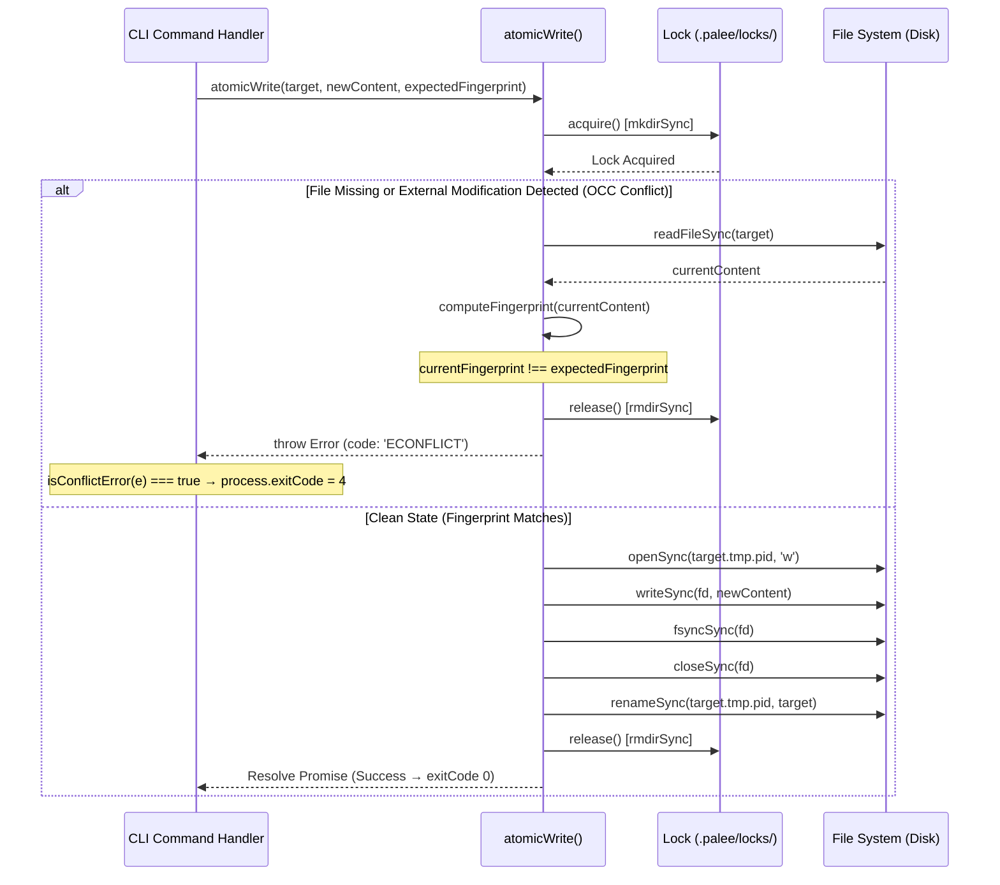
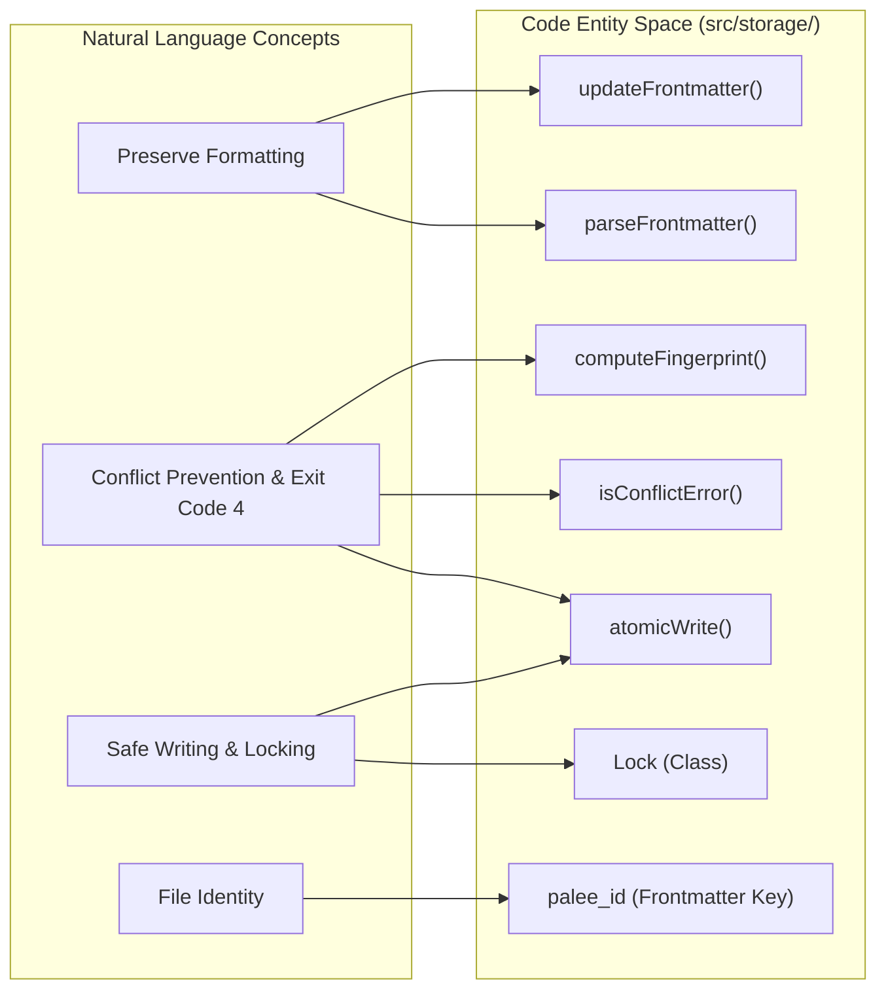

# Frontmatter Parser and Atomic Writes
<details>
<summary><b>Relevant Source Files</b></summary>

- [planning/storage_design.md](https://github.com/Kuldeep2822k/cli/blob/main/planning/storage_design.md?plain=1)
- [src/storage/atomic-write.ts](https://github.com/Kuldeep2822k/cli/blob/main/src/storage/atomic-write.ts)
- [src/storage/frontmatter.ts](https://github.com/Kuldeep2822k/cli/blob/main/src/storage/frontmatter.ts)
- [src/storage/index.ts](https://github.com/Kuldeep2822k/cli/blob/main/src/storage/index.ts)
- [test/storage-atomic-write.test.ts](https://github.com/Kuldeep2822k/cli/blob/main/test/storage-atomic-write.test.ts)
- [test/storage-cache.test.ts](https://github.com/Kuldeep2822k/cli/blob/main/test/storage-cache.test.ts)
- [test/storage-frontmatter.test.ts](https://github.com/Kuldeep2822k/cli/blob/main/test/storage-frontmatter.test.ts)

</details>

The Storage Layer of PALEE is designed with a "Source of Truth" philosophy where the Obsidian Markdown files are canonical [planning/storage_design.md#3-5](https://github.com/Kuldeep2822k/cli/blob/main/planning/storage_design.md?plain=1#L3-L5) This page details the technical implementation of how PALEE reads, modifies, and writes these files while ensuring data integrity, preserving user formatting, and handling concurrent access.

## Frontmatter Parser

The frontmatter parser in `src/storage/frontmatter.ts` is responsible for extracting and updating YAML metadata located at the top of Markdown files. Unlike standard YAML parsers that convert data into plain JavaScript objects (losing comments and formatting), PALEE uses a Concrete Syntax Tree (CST) preserving approach [src/storage/frontmatter.ts#5-8](https://github.com/Kuldeep2822k/cli/blob/main/src/storage/frontmatter.ts#L5-L8)

### Parsing Logic

The `parseFrontmatter` function uses a regular expression to separate the YAML block from the Markdown body [src/storage/frontmatter.ts#10-18](https://github.com/Kuldeep2822k/cli/blob/main/src/storage/frontmatter.ts#L10-L18) It then utilizes the `yaml` library's `parseDocument` to generate a document object that maintains the original file's structure [src/storage/frontmatter.ts#21-26](https://github.com/Kuldeep2822k/cli/blob/main/src/storage/frontmatter.ts#L21-L26)

### Preservation-Aware Updates

The `updateFrontmatter` function ensures that only PALEE-owned keys are modified while leaving user-defined keys (like `tags` or `cssclasses`) and comments untouched [src/storage/frontmatter.ts#33-57](https://github.com/Kuldeep2822k/cli/blob/main/src/storage/frontmatter.ts#L33-L57)

| Feature | Implementation Detail | Source |
| --- | --- | --- |
| Body Integrity | The Markdown body is preserved byte-for-byte during updates. | [src/storage/frontmatter.ts#56](https://github.com/Kuldeep2822k/cli/blob/main/src/storage/frontmatter.ts#L56-L56)[test/storage-frontmatter.test.ts#45-56](https://github.com/Kuldeep2822k/cli/blob/main/test/storage-frontmatter.test.ts#L45-L56) |
| Key Preservation | Unknown keys and reordering are prevented by mutating the CST `doc` directly. | [src/storage/frontmatter.ts#50-53](https://github.com/Kuldeep2822k/cli/blob/main/src/storage/frontmatter.ts#L50-L53)[test/storage-frontmatter.test.ts#58-74](https://github.com/Kuldeep2822k/cli/blob/main/test/storage-frontmatter.test.ts#L58-L74) |
| Comment Safety | YAML comments are retained in the raw output. | [test/storage-frontmatter.test.ts#76-90](https://github.com/Kuldeep2822k/cli/blob/main/test/storage-frontmatter.test.ts#L76-L90) |
| Validation | Rejects malformed frontmatter to prevent note corruption. | [src/storage/frontmatter.ts#35-37](https://github.com/Kuldeep2822k/cli/blob/main/src/storage/frontmatter.ts#L35-L37) |

### Fingerprinting

To support Optimistic Concurrency Control (OCC), PALEE generates a SHA-256 fingerprint of the entire file content using the `computeFingerprint` utility [src/storage/frontmatter.ts#59-61](https://github.com/Kuldeep2822k/cli/blob/main/src/storage/frontmatter.ts#L59-L61)

Sources: [src/storage/frontmatter.ts#1-67](https://github.com/Kuldeep2822k/cli/blob/main/src/storage/frontmatter.ts#L1-L67)[test/storage-frontmatter.test.ts#1-151](https://github.com/Kuldeep2822k/cli/blob/main/test/storage-frontmatter.test.ts#L1-L151)[planning/storage_design.md#7-36](https://github.com/Kuldeep2822k/cli/blob/main/planning/storage_design.md?plain=1#L7-L36)

---

## Atomic Write Protocol

The `atomicWrite` function in `src/storage/atomic-write.ts` provides a high-integrity write mechanism that prevents partial file writes, detects external modifications, and serializes concurrent operations across processes.

### Conflict Detection (Optimistic Concurrency Control)

PALEE implements an Optimistic Concurrency Control (OCC) protocol to guard against lost updates when files are edited concurrently by the user in the Obsidian GUI, background sync daemons (e.g., iCloud, Obsidian Sync, Dropbox), or parallel CLI instances.

1. **Fingerprint Verification**: When `expectedFingerprint` is supplied (calculated via `computeFingerprint` during the read phase), `atomicWrite` inspects the target file prior to any modifications:
   - If the file is missing or deleted from disk, `atomicWrite` immediately throws a `NodeError` with `code = 'ECONFLICT'` (`OCC conflict: <targetPath> does not exist (was deleted or missing)`).
   - If the file exists, `atomicWrite` reads the current file content (`fs.readFileSync(targetPath, 'utf8')`) and computes `computeFingerprint(currentContent)`.
2. **Conflict Abort**: If `currentFingerprint !== expectedFingerprint`, the target file has been modified externally since it was last read. `atomicWrite` aborts the operation and throws an error with `code = 'ECONFLICT'` (`OCC conflict: <targetPath> was modified by another process`).
3. **Disk Safety Guarantee**: On conflict detection, the lock is cleanly released in the `finally` block, and the write operation terminates immediately without creating, writing to, or renaming temporary files over the target path. The file on disk remains completely untouched.
4. **CLI Exit Code 4 Contract**: Concurrency errors are trapped across CLI command handlers (`src/cli/adopt.ts`, `src/cli/review.ts`, `src/cli/roadmap.ts`, `src/cli/session.ts`) using the `isConflictError(e)` utility:
   ```typescript
   process.exitCode = isConflictError(e) ? 4 : 5;
   ```
   An OCC mismatch or lock acquisition contention maps directly to exit code `4` (Concurrency / Conflict Error), allowing scripts and orchestrators to safely distinguish transient concurrent collisions from syntax errors (exit code 2), graph/cycle errors (exit code 3), or unhandled fatal exceptions (exit code 5).

### Atomic Replacement

To prevent file corruption during system crashes, power interruptions, or incomplete writes, PALEE never writes directly to the destination file. Instead, it follows a multi-step replacement sequence:

1. **Lock Acquisition**: Acquires an exclusive lock directory (`.palee/locks/<hash>.lockdir`) for the target path.
2. **Unique Temp File**: Writes the full content to a process-isolated temporary file (`<target>.tmp.<pid>`).
3. **Storage Flush (`fsyncSync`)**: Calls `fsyncSync` on the file descriptor to ensure data and metadata are physically committed to non-volatile storage before closing the file descriptor.
4. **Atomic Rename**: Calls `fs.renameSync` to atomically swap the temporary file over the destination file.

### Windows Retry Logic

On Windows filesystems, file locks held briefly by virus scanners, search indexers, or cloud sync clients can cause transient `EPERM` or `EBUSY` exceptions during rename. `atomicWrite` implements an exponential backoff retry loop:
- **Attempts**: Up to 5 attempts (`WINDOWS_RETRY_ATTEMPTS = 5`).
- **Initial Delay**: 50 ms (`WINDOWS_RETRY_INITIAL_DELAY = 50`), doubling each retry (`WINDOWS_RETRY_MULTIPLIER = 2`) with $\pm 25\%$ jitter (`WINDOWS_RETRY_JITTER = 0.25`), capped at 300 ms.
- **Cleanup**: If all retries are exhausted, temporary files are cleaned up (`fs.unlinkSync(tempPath)`) and the error is rethrown.

### Data Flow: Atomic Write Sequence



Sources: [src/storage/atomic-write.ts#47-159](https://github.com/Kuldeep2822k/cli/blob/main/src/storage/atomic-write.ts#L47-L159)[test/storage-atomic-write.test.ts#1-164](https://github.com/Kuldeep2822k/cli/blob/main/test/storage-atomic-write.test.ts#L1-L164)[planning/storage_design.md#37-74](https://github.com/Kuldeep2822k/cli/blob/main/planning/storage_design.md?plain=1#L37-L74)

---

## Code Entity Map

The following diagram bridges the functional requirements of the storage layer to the specific classes and functions implemented in the codebase.

### Storage Entity Mapping



Sources: [src/storage/frontmatter.ts#10-61](https://github.com/Kuldeep2822k/cli/blob/main/src/storage/frontmatter.ts#L10-L61)[src/storage/atomic-write.ts#47-159](https://github.com/Kuldeep2822k/cli/blob/main/src/storage/atomic-write.ts#L47-L159)[src/storage/lock.ts#8-50](https://github.com/Kuldeep2822k/cli/blob/main/src/storage/lock.ts#L8-L50)

### Atomic Write Logic Association

| System Name | Code Identifier | Role |
| --- | --- | --- |
| OCC Protocol | `expectedFingerprint` | Validates file state matches caller expectation before writing [src/storage/atomic-write.ts#81-117](https://github.com/Kuldeep2822k/cli/blob/main/src/storage/atomic-write.ts#L81-L117) |
| Conflict Detection | `ECONFLICT` | Error code thrown on fingerprint mismatch or missing file [src/storage/atomic-write.ts#94-115](https://github.com/Kuldeep2822k/cli/blob/main/src/storage/atomic-write.ts#L94-L115) |
| Exit Code 4 Mapping | `isConflictError(e)` | Identifies OCC/Lock conflict errors to set `process.exitCode = 4` [src/storage/atomic-write.ts#47-55](https://github.com/Kuldeep2822k/cli/blob/main/src/storage/atomic-write.ts#L47-L55) |
| CST Parser | `parseDocument` | YAML parser that maintains node positions and comments [src/storage/frontmatter.ts#21](https://github.com/Kuldeep2822k/cli/blob/main/src/storage/frontmatter.ts#L21-L21) |
| Safe Temp Path | `tempPath` | Constructed using `process.pid` to avoid collisions [src/storage/atomic-write.ts#119](https://github.com/Kuldeep2822k/cli/blob/main/src/storage/atomic-write.ts#L119-L119) |
| Backoff Strategy | `WINDOWS_RETRY_MULTIPLIER` | Factor for exponential delay between Windows retries [src/storage/atomic-write.ts#21](https://github.com/Kuldeep2822k/cli/blob/main/src/storage/atomic-write.ts#L21-L21) |
| Integrity Hash | `computeFingerprint()` | SHA-256 digest used for fingerprints and lock verification [src/storage/frontmatter.ts#59-61](https://github.com/Kuldeep2822k/cli/blob/main/src/storage/frontmatter.ts#L59-L61) |

Sources: [src/storage/frontmatter.ts#1-67](https://github.com/Kuldeep2822k/cli/blob/main/src/storage/frontmatter.ts#L1-L67)[src/storage/atomic-write.ts#1-163](https://github.com/Kuldeep2822k/cli/blob/main/src/storage/atomic-write.ts#L1-L163)