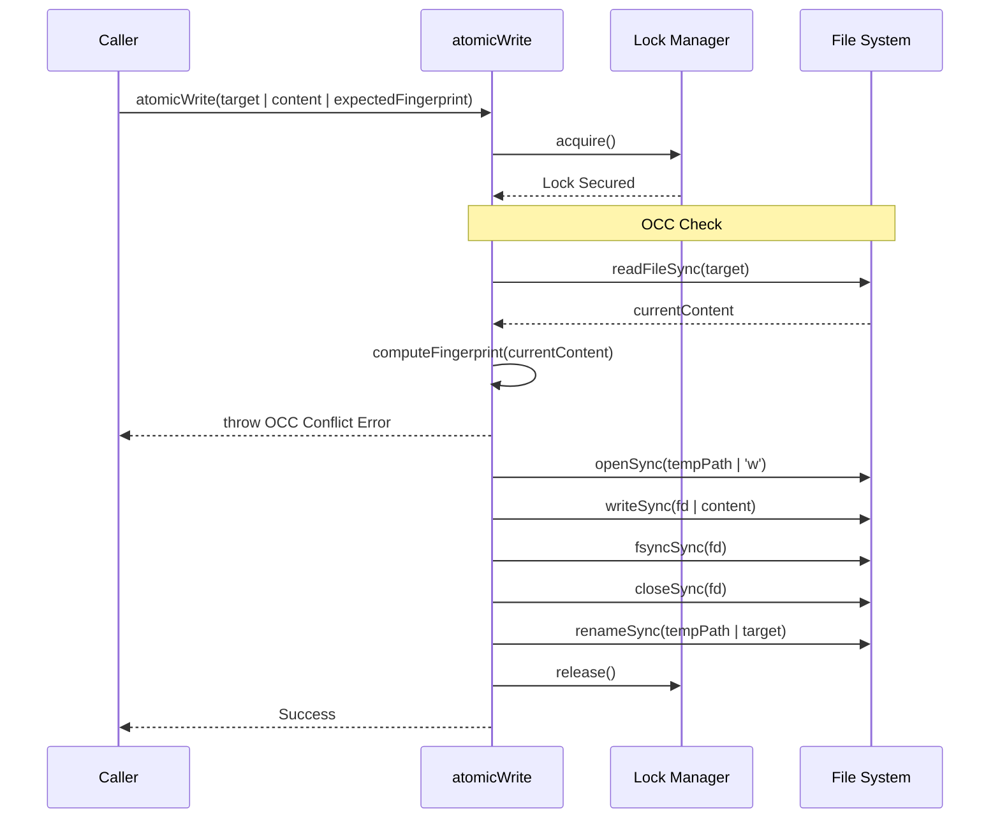
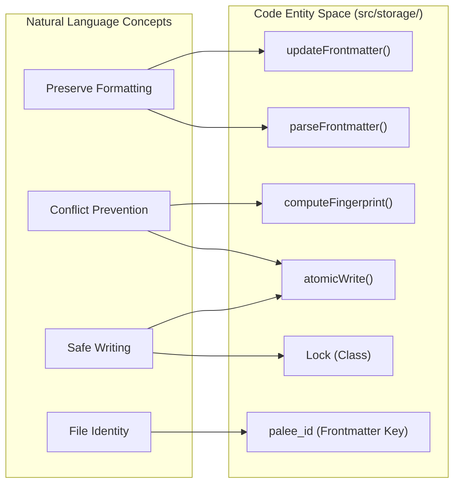

# Frontmatter Parser and Atomic Writes
Relevant source files

- [planning/storage_design.md](https://github.com/Kuldeep2822k/cli/blob/e8b70e0d/planning/storage_design.md?plain=1)
- [src/storage/atomic-write.ts](https://github.com/Kuldeep2822k/cli/blob/e8b70e0d/src/storage/atomic-write.ts)
- [src/storage/frontmatter.ts](https://github.com/Kuldeep2822k/cli/blob/e8b70e0d/src/storage/frontmatter.ts)
- [src/storage/index.ts](https://github.com/Kuldeep2822k/cli/blob/e8b70e0d/src/storage/index.ts)
- [test/storage-atomic-write.test.ts](https://github.com/Kuldeep2822k/cli/blob/e8b70e0d/test/storage-atomic-write.test.ts)
- [test/storage-cache.test.ts](https://github.com/Kuldeep2822k/cli/blob/e8b70e0d/test/storage-cache.test.ts)
- [test/storage-frontmatter.test.ts](https://github.com/Kuldeep2822k/cli/blob/e8b70e0d/test/storage-frontmatter.test.ts)

The Storage Layer of PALEE is designed with a "Source of Truth" philosophy where the Obsidian Markdown files are canonical [planning/storage_design.md#3-5](https://github.com/Kuldeep2822k/cli/blob/e8b70e0d/planning/storage_design.md?plain=1#L3-L5) This page details the technical implementation of how PALEE reads, modifies, and writes these files while ensuring data integrity, preserving user formatting, and handling concurrent access.

## Frontmatter Parser

The frontmatter parser in `src/storage/frontmatter.ts` is responsible for extracting and updating YAML metadata located at the top of Markdown files. Unlike standard YAML parsers that convert data into plain JavaScript objects (losing comments and formatting), PALEE uses a Concrete Syntax Tree (CST) preserving approach [src/storage/frontmatter.ts#5-8](https://github.com/Kuldeep2822k/cli/blob/e8b70e0d/src/storage/frontmatter.ts#L5-L8)

### Parsing Logic

The `parseFrontmatter` function uses a regular expression to separate the YAML block from the Markdown body [src/storage/frontmatter.ts#10-18](https://github.com/Kuldeep2822k/cli/blob/e8b70e0d/src/storage/frontmatter.ts#L10-L18) It then utilizes the `yaml` library's `parseDocument` to generate a document object that maintains the original file's structure [src/storage/frontmatter.ts#21-26](https://github.com/Kuldeep2822k/cli/blob/e8b70e0d/src/storage/frontmatter.ts#L21-L26)

### Preservation-Aware Updates

The `updateFrontmatter` function ensures that only PALEE-owned keys are modified while leaving user-defined keys (like `tags` or `cssclasses`) and comments untouched [src/storage/frontmatter.ts#33-57](https://github.com/Kuldeep2822k/cli/blob/e8b70e0d/src/storage/frontmatter.ts#L33-L57)

| Feature | Implementation Detail | Source |
| --- | --- | --- |
| Body Integrity | The Markdown body is preserved byte-for-byte during updates. | [src/storage/frontmatter.ts#56](https://github.com/Kuldeep2822k/cli/blob/e8b70e0d/src/storage/frontmatter.ts#L56-L56)[test/storage-frontmatter.test.ts#45-56](https://github.com/Kuldeep2822k/cli/blob/e8b70e0d/test/storage-frontmatter.test.ts#L45-L56) |
| Key Preservation | Unknown keys and reordering are prevented by mutating the CST `doc` directly. | [src/storage/frontmatter.ts#50-53](https://github.com/Kuldeep2822k/cli/blob/e8b70e0d/src/storage/frontmatter.ts#L50-L53)[test/storage-frontmatter.test.ts#58-74](https://github.com/Kuldeep2822k/cli/blob/e8b70e0d/test/storage-frontmatter.test.ts#L58-L74) |
| Comment Safety | YAML comments are retained in the raw output. | [test/storage-frontmatter.test.ts#76-90](https://github.com/Kuldeep2822k/cli/blob/e8b70e0d/test/storage-frontmatter.test.ts#L76-L90) |
| Validation | Rejects malformed frontmatter to prevent note corruption. | [src/storage/frontmatter.ts#35-37](https://github.com/Kuldeep2822k/cli/blob/e8b70e0d/src/storage/frontmatter.ts#L35-L37) |

### Fingerprinting

To support Optimistic Concurrency Control (OCC), PALEE generates a SHA-256 fingerprint of the entire file content using the `computeFingerprint` utility [src/storage/frontmatter.ts#59-61](https://github.com/Kuldeep2822k/cli/blob/e8b70e0d/src/storage/frontmatter.ts#L59-L61)

Sources: [src/storage/frontmatter.ts#1-67](https://github.com/Kuldeep2822k/cli/blob/e8b70e0d/src/storage/frontmatter.ts#L1-L67)[test/storage-frontmatter.test.ts#1-151](https://github.com/Kuldeep2822k/cli/blob/e8b70e0d/test/storage-frontmatter.test.ts#L1-L151)[planning/storage_design.md#7-36](https://github.com/Kuldeep2822k/cli/blob/e8b70e0d/planning/storage_design.md?plain=1#L7-L36)

---

## Atomic Write Protocol

The `atomicWrite` function in `src/storage/atomic-write.ts` provides a high-integrity write mechanism that prevents partial file writes and detects external modifications [src/storage/atomic-write.ts#22](https://github.com/Kuldeep2822k/cli/blob/e8b70e0d/src/storage/atomic-write.ts#L22-L22)

### Conflict Detection (OCC)

PALEE implements an Optimistic Concurrency Control protocol. Before writing, the system compares the `expectedFingerprint` (provided by the caller based on a previous read) with the current content on disk [src/storage/atomic-write.ts#31-38](https://github.com/Kuldeep2822k/cli/blob/e8b70e0d/src/storage/atomic-write.ts#L31-L38) If they differ, the write is aborted with an `OCC conflict` error to prevent overwriting changes made by another process or the user in Obsidian [src/storage/atomic-write.ts#35-37](https://github.com/Kuldeep2822k/cli/blob/e8b70e0d/src/storage/atomic-write.ts#L35-L37)

### Atomic Replacement

To avoid file corruption during system crashes or power failures, PALEE never writes directly to the target file. Instead, it follows a multi-step replacement sequence:

1. Lock Acquisition: Acquires an exclusive lock for the target path [src/storage/atomic-write.ts#27](https://github.com/Kuldeep2822k/cli/blob/e8b70e0d/src/storage/atomic-write.ts#L27-L27)
2. Temp File: Writes content to a temporary file named `[target].tmp.[pid]`[src/storage/atomic-write.ts#40-47](https://github.com/Kuldeep2822k/cli/blob/e8b70e0d/src/storage/atomic-write.ts#L40-L47)
3. Flush: Executes `fsyncSync` to ensure data is physically persisted to the storage medium [src/storage/atomic-write.ts#48](https://github.com/Kuldeep2822k/cli/blob/e8b70e0d/src/storage/atomic-write.ts#L48-L48)
4. Rename: Atomically renames the temporary file to the target path [src/storage/atomic-write.ts#55](https://github.com/Kuldeep2822k/cli/blob/e8b70e0d/src/storage/atomic-write.ts#L55-L55)

### Windows Retry Logic

On Windows, filesystems often throw `EPERM` or `EBUSY` errors if another process (like an indexer or anti-virus) is briefly accessing the file. `atomicWrite` includes a retry loop with exponential backoff and jitter [src/storage/atomic-write.ts#10-20](https://github.com/Kuldeep2822k/cli/blob/e8b70e0d/src/storage/atomic-write.ts#L10-L20) It attempts the write up to 5 times before failing [src/storage/atomic-write.ts#42-67](https://github.com/Kuldeep2822k/cli/blob/e8b70e0d/src/storage/atomic-write.ts#L42-L67)

### Data Flow: Atomic Write Sequence

Sources: [src/storage/atomic-write.ts#1-82](https://github.com/Kuldeep2822k/cli/blob/e8b70e0d/src/storage/atomic-write.ts#L1-L82)[test/storage-atomic-write.test.ts#1-123](https://github.com/Kuldeep2822k/cli/blob/e8b70e0d/test/storage-atomic-write.test.ts#L1-L123)[planning/storage_design.md#37-74](https://github.com/Kuldeep2822k/cli/blob/e8b70e0d/planning/storage_design.md?plain=1#L37-L74)

---

## Code Entity Map

The following diagram bridges the functional requirements of the storage layer to the specific classes and functions implemented in the codebase.

### Storage Entity Mapping

Sources: [src/storage/frontmatter.ts#10](https://github.com/Kuldeep2822k/cli/blob/e8b70e0d/src/storage/frontmatter.ts#L10-L10)[src/storage/frontmatter.ts#33](https://github.com/Kuldeep2822k/cli/blob/e8b70e0d/src/storage/frontmatter.ts#L33-L33)[src/storage/frontmatter.ts#59](https://github.com/Kuldeep2822k/cli/blob/e8b70e0d/src/storage/frontmatter.ts#L59-L59)[src/storage/atomic-write.ts#22](https://github.com/Kuldeep2822k/cli/blob/e8b70e0d/src/storage/atomic-write.ts#L22-L22)[src/storage/lock.ts#8](https://github.com/Kuldeep2822k/cli/blob/e8b70e0d/src/storage/lock.ts#L8-L8)[planning/storage_design.md#21-33](https://github.com/Kuldeep2822k/cli/blob/e8b70e0d/planning/storage_design.md?plain=1#L21-L33)

### Atomic Write Logic Association

| System Name | Code Identifier | Role |
| --- | --- | --- |
| OCC Protocol | `expectedFingerprint` | Validates file state hasn't changed since last read [src/storage/atomic-write.ts#22](https://github.com/Kuldeep2822k/cli/blob/e8b70e0d/src/storage/atomic-write.ts#L22-L22) |
| CST Parser | `parseDocument` | YAML parser that maintains node positions and comments [src/storage/frontmatter.ts#21](https://github.com/Kuldeep2822k/cli/blob/e8b70e0d/src/storage/frontmatter.ts#L21-L21) |
| Safe Temp Path | `tempPath` | Constructed using `process.pid` to avoid collisions [src/storage/atomic-write.ts#40](https://github.com/Kuldeep2822k/cli/blob/e8b70e0d/src/storage/atomic-write.ts#L40-L40) |
| Backoff Strategy | `WINDOWS_RETRY_MULTIPLIER` | Factor for exponential delay between Windows retries [src/storage/atomic-write.ts#12](https://github.com/Kuldeep2822k/cli/blob/e8b70e0d/src/storage/atomic-write.ts#L12-L12) |
| Integrity Hash | `crypto.createHash('sha256')` | Algorithm used for fingerprints and lock IDs [src/storage/frontmatter.ts#60](https://github.com/Kuldeep2822k/cli/blob/e8b70e0d/src/storage/frontmatter.ts#L60-L60) |

Sources: [src/storage/frontmatter.ts#1-67](https://github.com/Kuldeep2822k/cli/blob/e8b70e0d/src/storage/frontmatter.ts#L1-L67)[src/storage/atomic-write.ts#1-82](https://github.com/Kuldeep2822k/cli/blob/e8b70e0d/src/storage/atomic-write.ts#L1-L82)