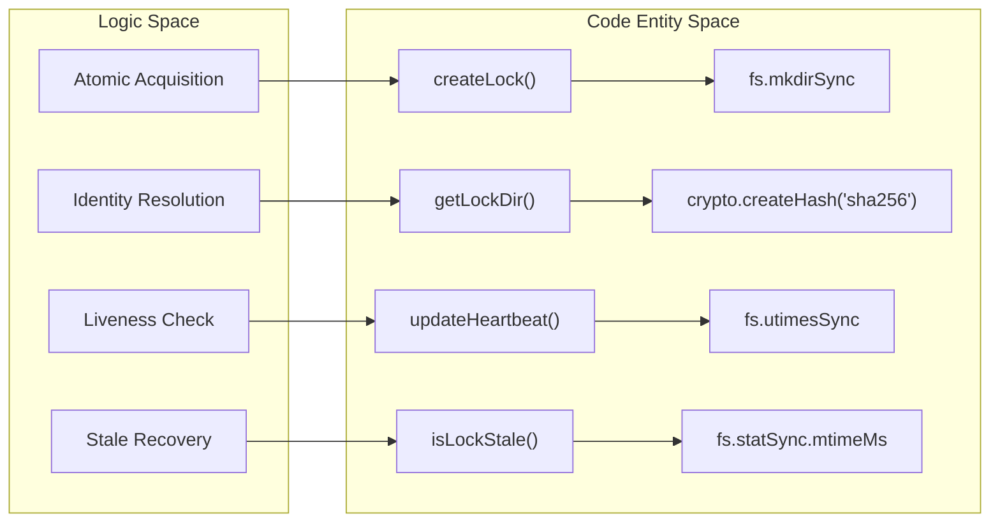

# File Locking
<details>
<summary><b>Relevant Source Files</b></summary>

- [src/storage/lock.ts](https://github.com/Kuldeep2822k/cli/blob/main/src/storage/lock.ts)
- [test/storage-lock.test.ts](https://github.com/Kuldeep2822k/cli/blob/main/test/storage-lock.test.ts)

</details>

The `palee` CLI implements a robust file locking mechanism to prevent race conditions during concurrent vault access. It utilizes atomic directory creation and a heartbeat system to ensure that only one process can modify a specific resource at a time, while providing mechanisms to recover from crashed processes.

## Overview

Locking is handled by the `Lock` class in `src/storage/lock.ts`. It manages the lifecycle of a lock, from acquisition and heartbeat maintenance to release and stale lock recovery. The system is designed to be platform-aware, adjusting timeouts based on the underlying operating system's filesystem behavior.

### Lock Identity and Path Hashing

Locks are not stored alongside the target files but in a centralized directory: `.palee/locks/`. To ensure that the same file always maps to the same lock directory regardless of relative pathing or symlinks, the system:

1. Resolves the absolute path of the target file using `fs.realpathSync`[src/storage/lock.ts#32-47](https://github.com/Kuldeep2822k/cli/blob/main/src/storage/lock.ts#L32-L47)
2. Calculates a SHA-256 hash of the path relative to the vault root [src/storage/lock.ts#49-50](https://github.com/Kuldeep2822k/cli/blob/main/src/storage/lock.ts#L49-L50)
3. Creates a lock directory named `{hash}.lockdir`[src/storage/lock.ts#53](https://github.com/Kuldeep2822k/cli/blob/main/src/storage/lock.ts#L53-L53)

### Implementation Space Mapping

The following diagram maps the logical locking concepts to the specific code entities in `src/storage/lock.ts`.

Locking System Entity Map



Sources:[src/storage/lock.ts#31-54](https://github.com/Kuldeep2822k/cli/blob/main/src/storage/lock.ts#L31-L54)[src/storage/lock.ts#56-60](https://github.com/Kuldeep2822k/cli/blob/main/src/storage/lock.ts#L56-L60)[src/storage/lock.ts#75-91](https://github.com/Kuldeep2822k/cli/blob/main/src/storage/lock.ts#L75-L91)[src/storage/lock.ts#187-197](https://github.com/Kuldeep2822k/cli/blob/main/src/storage/lock.ts#L187-L197)

---

## Lock Acquisition Protocol

Acquisition uses `fs.mkdirSync` as an atomic primitive. Because directory creation is atomic at the OS level, it serves as a "test-and-set" operation [src/storage/lock.ts#75-78](https://github.com/Kuldeep2822k/cli/blob/main/src/storage/lock.ts#L75-L78)

### Acquisition Flow

1. Directory Creation: Attempt to create `{hash}.lockdir`.
2. Success: Write a session-specific JSON file (e.g., `L-20231027T103000-abcd.json`) containing the PID, hostname, and timestamp [src/storage/lock.ts#63-71](https://github.com/Kuldeep2822k/cli/blob/main/src/storage/lock.ts#L63-L71)
3. Failure (EEXIST): If the directory exists, the process inspects the contents for stale locks [src/storage/lock.ts#93-121](https://github.com/Kuldeep2822k/cli/blob/main/src/storage/lock.ts#L93-L121)

Lock Acquisition Data Flow

```mermaid
sequenceDiagram
    participant P as Process
    participant FS as Filesystem
    participant LD as Lock Directory (.lockdir)

    P->>FS: mkdirSync(lockDir)
    alt Acquisition Succeeded
        P->>LD: writeFileSync(sessionID.json, LockData)
        Note over P: Lock Acquired (Heartbeat Active)
    else Collision / EEXIST (Contended)
        P->>LD: readdirSync() &rarr; check stale mtime
        alt Lock is Stale (Windows &gt;60s / POSIX &gt;120s)
            P->>LD: renameSync(file, file.quarantine)
            P->>LD: unlinkSync(quarantine)
            P->>FS: rmdirSync(lockDir)
            Note over P: Stale Reclaimed &rarr; Retry
        else Lock is Active
            Note over P: Throw ECONFLICT (Exit Code 4)
        end
    end
```

Sources:[src/storage/lock.ts#75-184](https://github.com/Kuldeep2822k/cli/blob/main/src/storage/lock.ts#L75-L184)

---

## Heartbeat and Timeouts

To prevent a process from holding a lock indefinitely after a crash, the owner must "check in" periodically.

### Heartbeat Mechanism

Once a lock is acquired, the `Lock` class starts a timer that calls `updateHeartbeat` every 15 seconds (`HEARTBEAT_INTERVAL`) [src/storage/lock.ts#13](https://github.com/Kuldeep2822k/cli/blob/main/src/storage/lock.ts#L13-L13) This function uses `fs.utimesSync` to update the access and modification times of the session JSON file without rewriting the content [src/storage/lock.ts#187-197](https://github.com/Kuldeep2822k/cli/blob/main/src/storage/lock.ts#L187-L197)

### Platform-Specific Stale Timeouts

The system accounts for different filesystem latencies and clock skews by varying the stale threshold:

- Windows: 60 seconds [src/storage/lock.ts#14](https://github.com/Kuldeep2822k/cli/blob/main/src/storage/lock.ts#L14-L14)
- Other (POSIX): 120 seconds [src/storage/lock.ts#15](https://github.com/Kuldeep2822k/cli/blob/main/src/storage/lock.ts#L15-L15)

A lock is considered stale if `Date.now() - mtime > STALE_TIMEOUT`[src/storage/lock.ts#56-60](https://github.com/Kuldeep2822k/cli/blob/main/src/storage/lock.ts#L56-L60)

Sources:[src/storage/lock.ts#13-17](https://github.com/Kuldeep2822k/cli/blob/main/src/storage/lock.ts#L13-L17)[src/storage/lock.ts#56-60](https://github.com/Kuldeep2822k/cli/blob/main/src/storage/lock.ts#L56-L60)[src/storage/lock.ts#187-197](https://github.com/Kuldeep2822k/cli/blob/main/src/storage/lock.ts#L187-L197)

---

## Stale Lock Recovery

When a process encounters an existing lock directory, it attempts to recover it if the lock is stale. This process uses a Quarantine-Rename strategy to avoid race conditions between two processes trying to clean up the same stale lock.

### The Quarantine Pattern

1. Rename: The process renames the stale `.json` file to `.json.quarantine`. This acts as an atomic test-and-set [src/storage/lock.ts#154-158](https://github.com/Kuldeep2822k/cli/blob/main/src/storage/lock.ts#L154-L158)
2. Verify: It checks the `mtime` of the quarantined file. If the `mtime` was updated just before the rename, it means the original owner is actually still alive; the process restores the file and aborts recovery [src/storage/lock.ts#159-165](https://github.com/Kuldeep2822k/cli/blob/main/src/storage/lock.ts#L159-L165)
3. Cleanup: If verified stale, the quarantined file is unlinked, and the process attempts to `rmdirSync` the lock directory [src/storage/lock.ts#161-178](https://github.com/Kuldeep2822k/cli/blob/main/src/storage/lock.ts#L161-L178)

### Stale Recovery Logic

| Step | Action | Failure Handling |
| --- | --- | --- |
| 1 | `readdirSync(lockDir)` | If `ENOENT`, someone else cleaned it; retry loop [src/storage/lock.ts#98](https://github.com/Kuldeep2822k/cli/blob/main/src/storage/lock.ts#L98-L98) |
| 2 | Filter `activeFiles` | If no JSON files but directory is < 5s old, throw `ECONFLICT` (incoming process) [src/storage/lock.ts#130-143](https://github.com/Kuldeep2822k/cli/blob/main/src/storage/lock.ts#L130-L143) |
| 3 | `renameSync` to `.quarantine` | If it fails, the file was already moved/deleted; continue [src/storage/lock.ts#166](https://github.com/Kuldeep2822k/cli/blob/main/src/storage/lock.ts#L166-L166) |
| 4 | `rmdirSync(lockDir)` | If `ENOTEMPTY`, a new process won the lock; retry loop [src/storage/lock.ts#174-175](https://github.com/Kuldeep2822k/cli/blob/main/src/storage/lock.ts#L174-L175) |

Sources:[src/storage/lock.ts#93-183](https://github.com/Kuldeep2822k/cli/blob/main/src/storage/lock.ts#L93-L183)

---

## Data Structures

### LockData

The metadata stored within the session JSON file.

```
interface LockData {
  lock_id: string;    // Format: L-YYYYMMDDTHHMMSS-xxxx
  target: string;     // Absolute path of the locked file
  pid: number;        // Process ID of the owner
  hostname: string;   // Hostname for multi-machine vault sync safety
  created_at: string; // ISO timestamp
}
```

Sources:[src/storage/lock.ts#25-29](https://github.com/Kuldeep2822k/cli/blob/main/src/storage/lock.ts#L25-L29)[src/storage/lock.ts#63-71](https://github.com/Kuldeep2822k/cli/blob/main/src/storage/lock.ts#L63-L71)[src/types.ts](https://github.com/Kuldeep2822k/cli/blob/main/src/types.ts) (Note: LockData definition implied by usage in `lock.ts`).

---

## Summary of Key Functions

| Function | Role | Key Logic |
| --- | --- | --- |
| `getLockDir` | Path resolution | Resolves `realpathSync` to handle symlinks and computes SHA-256 hash [src/storage/lock.ts#31-54](https://github.com/Kuldeep2822k/cli/blob/main/src/storage/lock.ts#L31-L54) |
| `createLock` | Atomic acquisition | The main loop using `mkdirSync` and stale recovery logic [src/storage/lock.ts#62-185](https://github.com/Kuldeep2822k/cli/blob/main/src/storage/lock.ts#L62-L185) |
| `updateHeartbeat` | Liveness | Uses `fs.utimesSync` to touch the session file [src/storage/lock.ts#187-197](https://github.com/Kuldeep2822k/cli/blob/main/src/storage/lock.ts#L187-L197) |
| `releaseLock` | Cleanup | Deletes the session file and attempts to remove the directory [src/storage/lock.ts#199-210](https://github.com/Kuldeep2822k/cli/blob/main/src/storage/lock.ts#L199-L210) |

Sources:[src/storage/lock.ts#31-210](https://github.com/Kuldeep2822k/cli/blob/main/src/storage/lock.ts#L31-L210)