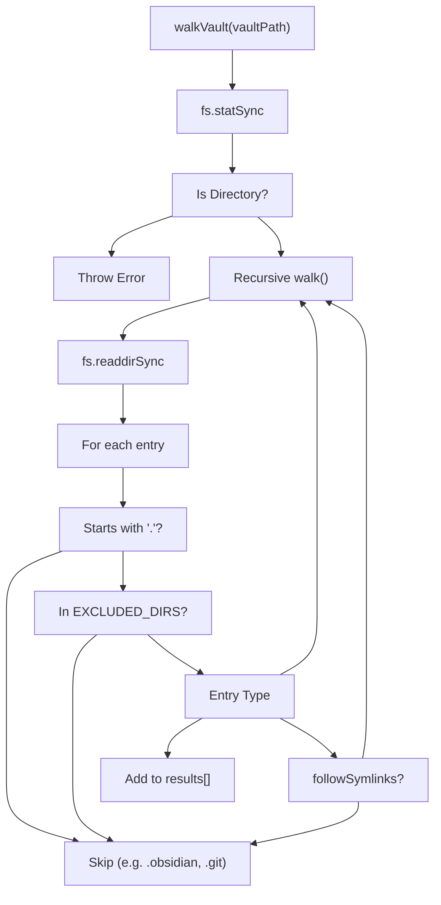
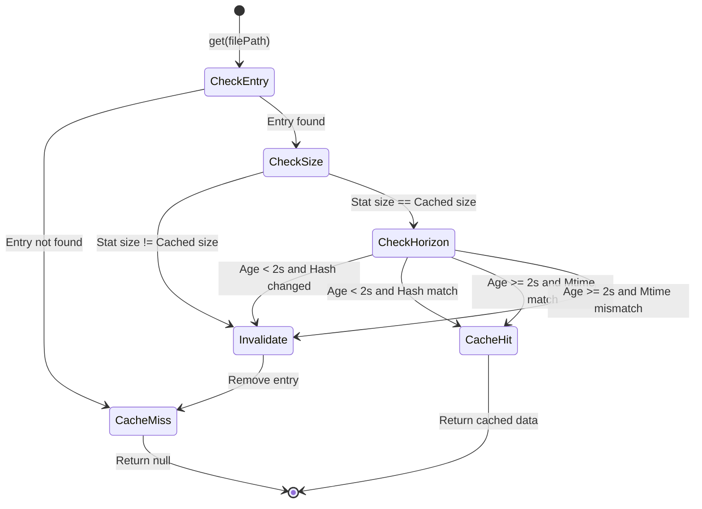

# Vault Walker and File Cache
Relevant source files

- [src/storage/cache.ts](https://github.com/Kuldeep2822k/cli/blob/main/src/storage/cache.ts)
- [src/storage/index.ts](https://github.com/Kuldeep2822k/cli/blob/main/src/storage/index.ts)
- [src/storage/memory.ts](https://github.com/Kuldeep2822k/cli/blob/main/src/storage/memory.ts)
- [src/storage/vault-walker.ts](https://github.com/Kuldeep2822k/cli/blob/main/src/storage/vault-walker.ts)
- [test/storage-atomic-write.test.ts](https://github.com/Kuldeep2822k/cli/blob/main/test/storage-atomic-write.test.ts)
- [test/storage-cache.test.ts](https://github.com/Kuldeep2822k/cli/blob/main/test/storage-cache.test.ts)
- [test/storage-frontmatter.test.ts](https://github.com/Kuldeep2822k/cli/blob/main/test/storage-frontmatter.test.ts)
- [test/storage-memory.test.ts](https://github.com/Kuldeep2822k/cli/blob/main/test/storage-memory.test.ts)
- [test/storage-walker.test.ts](https://github.com/Kuldeep2822k/cli/blob/main/test/storage-walker.test.ts)

The storage subsystem relies on efficient discovery of Markdown files and a robust caching mechanism to ensure performance during large-scale vault operations. The `Vault Walker` provides a filtered recursive traversal of the Obsidian vault, while the `File Cache` implements a validation logic designed to handle rapid edit cycles without sacrificing data integrity.

## Vault Walker

The `walkVault` function in `src/storage/vault-walker.ts` is responsible for traversing the file system and collecting absolute paths to Markdown files [src/storage/vault-walker.ts#14](https://github.com/Kuldeep2822k/cli/blob/main/src/storage/vault-walker.ts#L14-L14) It implements strict filtering to ignore non-content directories and system metadata.

### Traversal and Filtering Rules

The walker enforces the following constraints during traversal:

- Markdown Only: Only files ending in `.md` are collected [src/storage/vault-walker.ts#85-87](https://github.com/Kuldeep2822k/cli/blob/main/src/storage/vault-walker.ts#L85-L87)
- Excluded Directories: Specifically ignores `node_modules`[src/storage/vault-walker.ts#10-12](https://github.com/Kuldeep2822k/cli/blob/main/src/storage/vault-walker.ts#L10-L12)
- Hidden Directories: Any directory starting with a dot (`.`) is skipped, which effectively excludes `.obsidian`, `.trash`, and `.git`[src/storage/vault-walker.ts#74-76](https://github.com/Kuldeep2822k/cli/blob/main/src/storage/vault-walker.ts#L74-L76)
- Symlinks: By default, symbolic links are skipped to prevent circular references or escaping the vault, unless explicitly enabled via `WalkOptions`[src/storage/vault-walker.ts#15](https://github.com/Kuldeep2822k/cli/blob/main/src/storage/vault-walker.ts#L15-L15)[src/storage/vault-walker.ts#59-62](https://github.com/Kuldeep2822k/cli/blob/main/src/storage/vault-walker.ts#L59-L62)
- Permissions: If a directory cannot be read due to permission errors, it is skipped silently [src/storage/vault-walker.ts#48-51](https://github.com/Kuldeep2822k/cli/blob/main/src/storage/vault-walker.ts#L48-L51)

### Discovery Logic Flow

The following diagram illustrates how `walkVault` filters system entities into valid `Topic` file paths.

Vault Discovery Flow

Sources: [src/storage/vault-walker.ts#14-93](https://github.com/Kuldeep2822k/cli/blob/main/src/storage/vault-walker.ts#L14-L93)[test/storage-walker.test.ts#41-82](https://github.com/Kuldeep2822k/cli/blob/main/test/storage-walker.test.ts#L41-L82)

---

## File Cache

The `FileCache` class in `src/storage/cache.ts` provides an in-memory store for parsed file data (such as `FrontmatterResult`). It is designed to minimize expensive I/O and SHA-256 fingerprinting operations while remaining safe against external file modifications.

### The Unsettled Horizon

A key feature of the cache is the `UNSETTLED_HORIZON`, set to 2000ms (2 seconds) [src/storage/cache.ts#10](https://github.com/Kuldeep2822k/cli/blob/main/src/storage/cache.ts#L10-L10) This constant addresses the "rapid-edit cycle" problem where a file might be modified multiple times in quick succession.

- Inside Horizon (< 2s since mtime): The cache does not trust the file's `mtime`. It forces a re-read of the file and re-computes the SHA-256 fingerprint to verify if the content has actually changed [src/storage/cache.ts#37-47](https://github.com/Kuldeep2822k/cli/blob/main/src/storage/cache.ts#L37-L47)
- Outside Horizon (> 2s since mtime): If the `mtime` matches the cached value, it is considered a "stable hit" and the data is returned immediately without further I/O [src/storage/cache.ts#56-59](https://github.com/Kuldeep2822k/cli/blob/main/src/storage/cache.ts#L56-L59)

### Cache Validation Logic

When `FileCache.get(filePath)` is called, the following validation sequence occurs:

1. Size Check: If `fs.statSync(filePath).size` differs from the cached size, the entry is immediately invalidated [src/storage/cache.ts#30-33](https://github.com/Kuldeep2822k/cli/blob/main/src/storage/cache.ts#L30-L33)
2. Horizon Check: Determines if the file is "freshly modified" or "settled" [src/storage/cache.ts#37](https://github.com/Kuldeep2822k/cli/blob/main/src/storage/cache.ts#L37-L37)
3. Fingerprint Check: Uses `computeFingerprint` from `src/storage/frontmatter.ts` to detect content-level changes if `mtime` is unreliable [src/storage/cache.ts#42](https://github.com/Kuldeep2822k/cli/blob/main/src/storage/cache.ts#L42-L42)[src/storage/cache.ts#63](https://github.com/Kuldeep2822k/cli/blob/main/src/storage/cache.ts#L63-L63)

### Cache State Machine

The diagram below maps the `FileCache` logic to the internal state transitions and filesystem checks.

FileCache Validation Logic

Sources: [src/storage/cache.ts#13-80](https://github.com/Kuldeep2822k/cli/blob/main/src/storage/cache.ts#L13-L80)[test/storage-cache.test.ts#44-88](https://github.com/Kuldeep2822k/cli/blob/main/test/storage-cache.test.ts#L44-L88)

### Key Methods

| Method | Description |
| --- | --- |
| `get(filePath)` | Retrieves data if valid; performs size, mtime, and fingerprint checks [src/storage/cache.ts#20-80](https://github.com/Kuldeep2822k/cli/blob/main/src/storage/cache.ts#L20-L80) |
| `set(filePath, data, fingerprint)` | Stores data alongside filesystem stats (`mtime`, `size`) [src/storage/cache.ts#82-95](https://github.com/Kuldeep2822k/cli/blob/main/src/storage/cache.ts#L82-L95) |
| `invalidate(filePath)` | Manually removes a specific file from the cache [src/storage/cache.ts#97-99](https://github.com/Kuldeep2822k/cli/blob/main/src/storage/cache.ts#L97-L99) |
| `clear()` | Flushes all entries from the cache [src/storage/cache.ts#101-103](https://github.com/Kuldeep2822k/cli/blob/main/src/storage/cache.ts#L101-L103) |

Sources: [src/storage/cache.ts#13-104](https://github.com/Kuldeep2822k/cli/blob/main/src/storage/cache.ts#L13-L104)