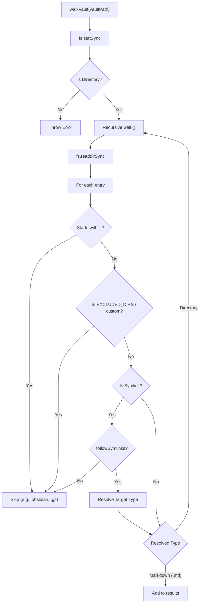
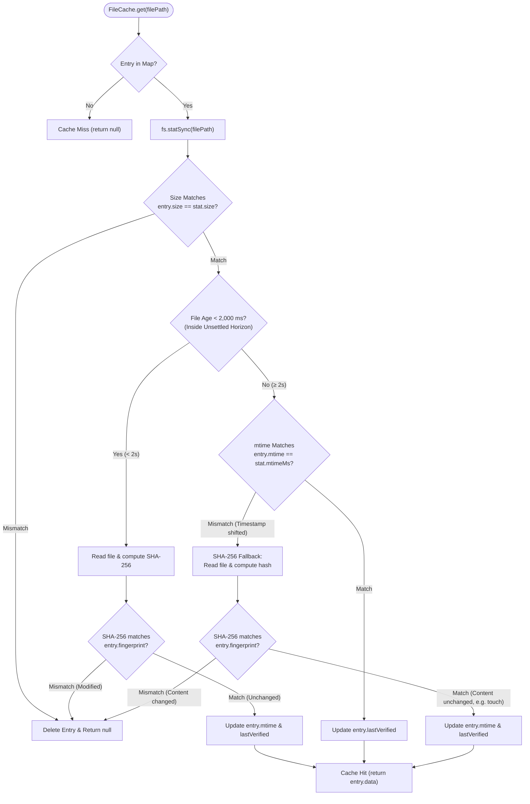

# Vault Walker and File Cache

<b>Relevant Source Files</b>

- [src/storage/vault-walker.ts](https://github.com/Kuldeep2822k/cli/blob/main/src/storage/vault-walker.ts)
- [src/storage/cache.ts](https://github.com/Kuldeep2822k/cli/blob/main/src/storage/cache.ts)
- [test/storage-walker.test.ts](https://github.com/Kuldeep2822k/cli/blob/main/test/storage-walker.test.ts)
- [test/storage-cache.test.ts](https://github.com/Kuldeep2822k/cli/blob/main/test/storage-cache.test.ts)

The storage subsystem relies on efficient discovery of Markdown files and a robust caching mechanism to ensure performance during large-scale vault operations. The `Vault Walker` provides a filtered recursive traversal of the Obsidian vault, while the `File Cache` implements validation logic designed to handle rapid edit cycles without sacrificing data integrity.

## Vault Walker

The `walkVault` function in `src/storage/vault-walker.ts` traverses the file system and collects absolute paths to Markdown files, applying strict filtering rules:

- **Markdown Only**: Only files ending in `.md` are collected.
- **Excluded Directories**: Specifically ignores `node_modules` and any custom directories configured via `WalkOptions.excludeDirs` (e.g. `_templates`, `archive`).
- **Hidden Directories**: Any directory starting with a dot (`.`) is skipped, effectively excluding `.obsidian`, `.trash`, and `.git`.
- **Symlinks**: By default, symbolic links are skipped to prevent circular references or escaping the vault, unless explicitly enabled via `WalkOptions.followSymlinks`.
- **Permissions**: If a directory cannot be read due to permission errors (`EACCES`/`EPERM`), it is skipped safely.

### Discovery Logic Flow

Sources: [src/storage/vault-walker.ts#14-120](https://github.com/Kuldeep2822k/cli/blob/main/src/storage/vault-walker.ts#L14-L120)[test/storage-walker.test.ts#41-133](https://github.com/Kuldeep2822k/cli/blob/main/test/storage-walker.test.ts#L41-L133)

---

## File Cache

The `FileCache` class in `src/storage/cache.ts` provides an in-memory store for parsed file data (such as `FrontmatterResult`). It is designed to minimize expensive disk I/O and SHA-256 fingerprinting operations while remaining safe against external file modifications.

### The Unsettled Horizon & SHA-256 Fallback

A central feature of the cache is the `UNSETTLED_HORIZON`, set to 2,000 ms (2 seconds) [src/storage/cache.ts#16](https://github.com/Kuldeep2822k/cli/blob/main/src/storage/cache.ts#L16-L16). This constant addresses the "rapid-edit cycle" and filesystem timestamp granularity issues where files might be modified multiple times in quick succession.

- **Inside Horizon (`< 2,000 ms` since `mtime`)**: The cache treats recent `mtime` values as volatile. It bypasses timestamp trust and forces a file re-read and SHA-256 hash recomputation (`computeFingerprint(content)`). If the digest matches `entry.fingerprint`, `entry.mtime` and `entry.lastVerified` are updated and cached data is returned; otherwise, the entry is evicted and `null` is returned.
- **Outside Horizon (`>= 2,000 ms` since `mtime`)**:
  - **`mtime` Match**: If `stat.mtimeMs === entry.mtime`, the file is settled and unchanged. PALEE executes a fast $O(1)$ cache hit, updating `entry.lastVerified` and returning `entry.data` without reading file contents.
  - **`mtime` Mismatch (SHA-256 Fallback)**: If `mtime` has changed outside the horizon (for example, when a file's timestamp is updated by a `touch` command, backup tool, or cloud sync without modifying note contents), `FileCache` initiates a SHA-256 fallback check. It re-reads the file and hashes its content:
    - If the SHA-256 hash matches `entry.fingerprint`, the content is confirmed identical. The cache updates `entry.mtime = stat.mtimeMs` and `entry.lastVerified = now`, preserving the cache entry and returning `entry.data`.
    - If the SHA-256 hash differs, the content has genuinely changed. The stale entry is deleted from the cache and `null` is returned.

### Cache Validation Logic

When `FileCache.get(filePath)` is called, the following validation sequence occurs:

1. **Existence & Size Verification**: If the file is not in the cache or `fs.statSync(filePath).size` differs from `entry.size`, the entry is immediately evicted (`this.cache.delete(filePath)`) and `null` is returned [src/storage/cache.ts#56-60](https://github.com/Kuldeep2822k/cli/blob/main/src/storage/cache.ts#L56-L60).
2. **Horizon Check**: Evaluates whether `(Date.now() - mtime) < UNSETTLED_HORIZON` [src/storage/cache.ts#63-80](https://github.com/Kuldeep2822k/cli/blob/main/src/storage/cache.ts#L63-L80).
3. **Fingerprint Verification**: Uses `computeFingerprint` from `src/storage/frontmatter.ts` for mandatory verification inside the horizon and as a fallback on `mtime` shifts outside the horizon [src/storage/cache.ts#69-74](https://github.com/Kuldeep2822k/cli/blob/main/src/storage/cache.ts#L69-L74)[src/storage/cache.ts#89-95](https://github.com/Kuldeep2822k/cli/blob/main/src/storage/cache.ts#L89-L95).

### Cache Validation Flowchart

Sources: [src/storage/cache.ts#16-107](https://github.com/Kuldeep2822k/cli/blob/main/src/storage/cache.ts#L16-L107)[test/storage-cache.test.ts#24-88](https://github.com/Kuldeep2822k/cli/blob/main/test/storage-cache.test.ts#L24-L88)

### Key Methods

| Method | Description | Source |
| --- | --- | --- |
| `get(filePath)` | Retrieves data if valid; performs size, horizon, mtime, and SHA-256 fallback checks | [src/storage/cache.ts#47-107](https://github.com/Kuldeep2822k/cli/blob/main/src/storage/cache.ts#L47-L107) |
| `set(filePath, data, fingerprint)` | Stores parsed data alongside filesystem stats (`mtime`, `size`, `lastVerified`) | [src/storage/cache.ts#116-129](https://github.com/Kuldeep2822k/cli/blob/main/src/storage/cache.ts#L116-L129) |
| `invalidate(filePath)` | Manually evicts a specific file entry from the cache | [src/storage/cache.ts#136-138](https://github.com/Kuldeep2822k/cli/blob/main/src/storage/cache.ts#L136-L138) |
| `clear()` | Flushes all entries from the in-memory cache | [src/storage/cache.ts#143-145](https://github.com/Kuldeep2822k/cli/blob/main/src/storage/cache.ts#L143-L145) |

Sources: [src/storage/cache.ts#1-149](https://github.com/Kuldeep2822k/cli/blob/main/src/storage/cache.ts#L1-L149)
