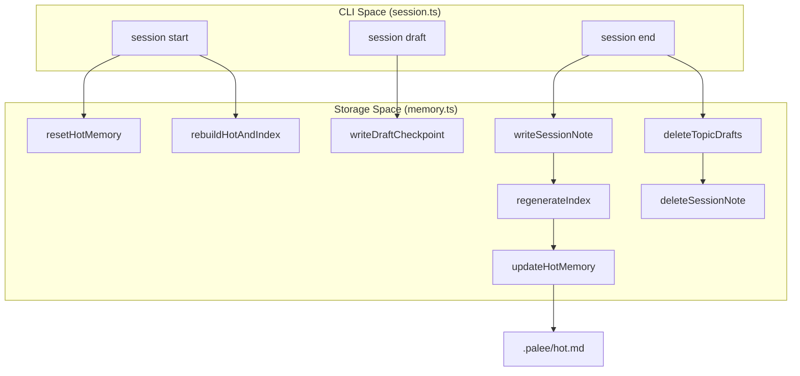
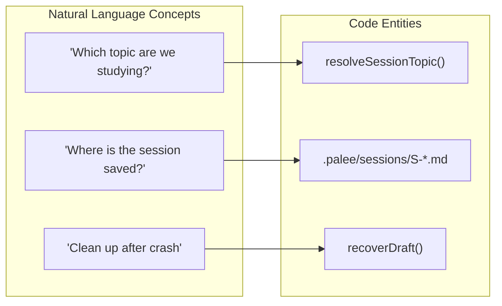

# Session Memory Storage

<b>Relevant Source Files</b>

- [planning/memory_design.md](https://github.com/Kuldeep2822k/cli/blob/main/planning/memory_design.md?plain=1)
- [src/cli/session.ts](https://github.com/Kuldeep2822k/cli/blob/main/src/cli/session.ts)
- [src/storage/cache.ts](https://github.com/Kuldeep2822k/cli/blob/main/src/storage/cache.ts)
- [src/storage/memory.ts](https://github.com/Kuldeep2822k/cli/blob/main/src/storage/memory.ts)
- [test/session-cli.test.ts](https://github.com/Kuldeep2822k/cli/blob/main/test/session-cli.test.ts)
- [test/storage-memory.test.ts](https://github.com/Kuldeep2822k/cli/blob/main/test/storage-memory.test.ts)

The Session Memory Storage system manages the persistence of learning sessions, working memory, and draft recovery within the `.palee/` directory of an Obsidian vault. It ensures learning continuity by providing the AI with a concise "hot" context while maintaining a durable, human-readable history of all sessions.

## Storage Layout and Schema

All session-related data is stored in a hidden `.palee/` directory at the vault root. This directory contains canonical session records and derived views.

| File/Directory | Role | Description |
| --- | --- | --- |
| `hot.md` | Working Memory | A derived view containing the most recent context, capped at 250 words. |
| `sessions/` | Canonical History | Directory containing durable Markdown notes for every completed session. |
| `index.md` | Session Index | A derived list of all sessions for human browsing and internal navigation. |

### ID Generation

The system uses unique, immutable identifiers for sessions and drafts to prevent collisions and ensure stable references.

- **Session ID (`S-*)**: Generated using `generateSessionId`with the format`S-YYYYMMDDTHHMMSS-xxxx`(where`xxxx` is a 2-byte hex random suffix) [src/storage/memory.ts#31-36](https://github.com/Kuldeep2822k/cli/blob/main/src/storage/memory.ts#L31-L36)
- **Draft ID (`DRAFT-S-*)**: Generated using `generateDraftId`with the format`DRAFT-S-xxxxxxxx`(where`xxxxxxxx` is a 4-byte hex random suffix) [src/storage/memory.ts#38-41](https://github.com/Kuldeep2822k/cli/blob/main/src/storage/memory.ts#L38-L41)

### Hot Memory Contract & Duration Tracking

`hot.md` acts as a singleton (`H-active`) that summarizes the current state of learning [planning/memory_design.md#32-38](https://github.com/Kuldeep2822k/cli/blob/main/planning/memory_design.md?plain=1#L32-L38):

- **Word Cap**: The human-readable body is strictly capped at 250 words via `truncateWords` to keep AI prompts efficient [src/storage/memory.ts#22-24](https://github.com/Kuldeep2822k/cli/blob/main/src/storage/memory.ts#L22-L24).
- **Frontmatter**: Includes `palee_schema: 1`, `memory_id: "H-active"`, `active_topic`, `started_at` (ISO timestamp of active study initiation), `last_session`, and `updated_at` (date only: `YYYY-MM-DD`) [src/storage/memory.ts#194-210](https://github.com/Kuldeep2822k/cli/blob/main/src/storage/memory.ts#L194-L210).
- **Safe Reset (`resetHotMemory`)**: Safely unlinks `hot.md` during reinitialization or corrupt state recovery [src/storage/memory.ts#228-239](https://github.com/Kuldeep2822k/cli/blob/main/src/storage/memory.ts#L228-L239).

Sources: [src/storage/memory.ts#1-239](https://github.com/Kuldeep2822k/cli/blob/main/src/storage/memory.ts#L1-L239)[planning/memory_design.md#9-64](https://github.com/Kuldeep2822k/cli/blob/main/planning/memory_design.md?plain=1#L9-L64)

---

## Data Flow: Session Lifecycle

The following diagram maps the CLI actions to the underlying storage implementation functions.

### Session State Transitions

Sources: [src/cli/session.ts#60-275](https://github.com/Kuldeep2822k/cli/blob/main/src/cli/session.ts#L60-L275)[src/storage/memory.ts#72-557](https://github.com/Kuldeep2822k/cli/blob/main/src/storage/memory.ts#L72-L557)

---

## Implementation Details

### Derived View Regeneration

`rebuildHotAndIndex` is the primary maintenance function. It scans the `sessions/` directory, identifies the most recent completed session, and triggers a refresh of both `hot.md` and `index.md` [src/storage/memory.ts#328-375](https://github.com/Kuldeep2822k/cli/blob/main/src/storage/memory.ts#L328-L375):

1. **Scanning**: Reads all `S-*.md` files in `.palee/sessions/` [src/storage/memory.ts#338-341](https://github.com/Kuldeep2822k/cli/blob/main/src/storage/memory.ts#L338-L341).
2. **Validation**: Skips zero-byte files and safely parses frontmatter to ensure session integrity [src/storage/memory.ts#344-363](https://github.com/Kuldeep2822k/cli/blob/main/src/storage/memory.ts#L344-L363).
3. **Sorting**: Sessions are sorted newest-first based on `started_at` [src/storage/memory.ts#298](https://github.com/Kuldeep2822k/cli/blob/main/src/storage/memory.ts#L298).
4. **Indexing**: `regenerateIndex` creates a Markdown list with Obsidian-style links (e.g., `[[S-20260808T180000-a1b2]] - Topic: T-01 (2026-08-08)`) [src/storage/memory.ts#305-309](https://github.com/Kuldeep2822k/cli/blob/main/src/storage/memory.ts#L305-L309).

### Draft Checkpoints & Storage Boundary Functions

During a session, the system captures progress using `writeDraftCheckpoint` [src/storage/memory.ts#386-412](https://github.com/Kuldeep2822k/cli/blob/main/src/storage/memory.ts#L386-L412). The storage layer provides dedicated helpers:

- **`getTopicDrafts(vaultPath, topicId)`**: Returns array of matching active drafts with their paths, `started_at` timestamps, and body text.
- **`deleteTopicDrafts(vaultPath, topicId)`**: Discovers and deletes all drafts matching a given topic.
- **`deleteSessionNote(vaultPath, targetPath)`**: Safely deletes a session or draft note with strict directory boundary validation preventing unlinks outside `.palee/sessions/`.

The `recoverDraft` function handles four distinct actions [src/storage/memory.ts#437-482](https://github.com/Kuldeep2822k/cli/blob/main/src/storage/memory.ts#L437-L482):

| Action | Logic |
| --- | --- |
| `resume` | Retains the draft checkpoint note for continued study. |
| `save` | Converts the draft into a completed session note via `writeSessionNote`, computes elapsed `duration_minutes`, deletes the draft via `deleteSessionNote`, and refreshes views via `rebuildHotAndIndex`. |
| `discard` | Permanently and safely deletes the draft file via `deleteSessionNote`. |
| `ignore` | Leaves the draft file in place without taking action. |

Sources: [src/storage/memory.ts#378-558](https://github.com/Kuldeep2822k/cli/blob/main/src/storage/memory.ts#L378-L558)[src/cli/session.ts#96-112](https://github.com/Kuldeep2822k/cli/blob/main/src/cli/session.ts#L96-L112)

---

## Topic Resolution Logic

When starting or ending a session, the system must determine the `active_topic`. The `resolveSessionTopic` function follows a specific precedence [src/cli/session.ts#23-53](https://github.com/Kuldeep2822k/cli/blob/main/src/cli/session.ts#L23-L53):

1. Explicit Flag: If `--topic <id>` is provided, it is used immediately [src/cli/session.ts#24-30](https://github.com/Kuldeep2822k/cli/blob/main/src/cli/session.ts#L24-L30)
2. Hot Memory: If no flag is provided, the system parses `.palee/hot.md` and looks for the `active_topic` key in the frontmatter [src/cli/session.ts#33-46](https://github.com/Kuldeep2822k/cli/blob/main/src/cli/session.ts#L33-L46)
3. None: If the value is `(none)` or missing, the session proceeds without a specific topic context [src/cli/session.ts#43-52](https://github.com/Kuldeep2822k/cli/blob/main/src/cli/session.ts#L43-L52)

### Natural Language to Code Mapping

Sources: [src/cli/session.ts#23-53](https://github.com/Kuldeep2822k/cli/blob/main/src/cli/session.ts#L23-L53)[src/storage/memory.ts#72-328](https://github.com/Kuldeep2822k/cli/blob/main/src/storage/memory.ts#L72-L328)