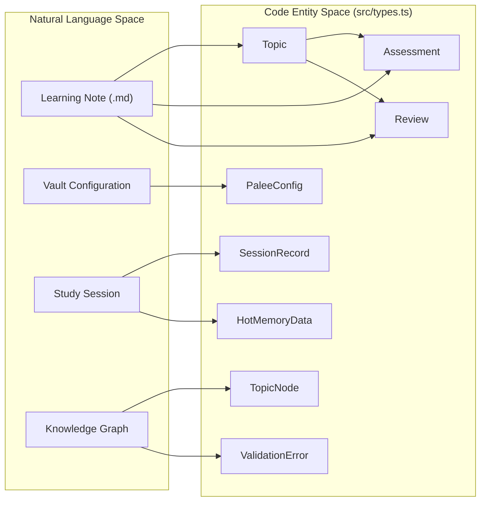
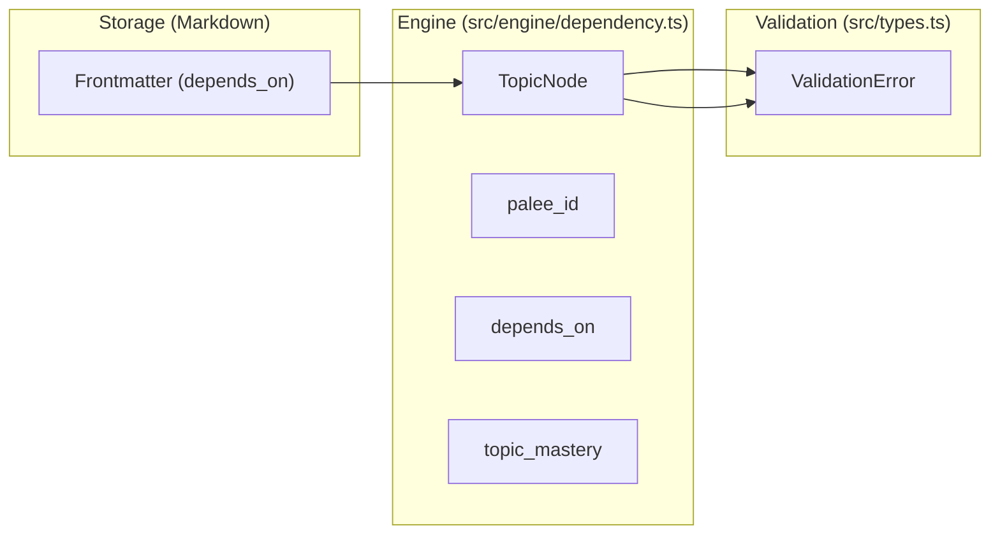

# Data Model and Types
Relevant source files

- [src/cli/adopt.ts](https://github.com/Kuldeep2822k/cli/blob/main/src/cli/adopt.ts)
- [src/index.ts](https://github.com/Kuldeep2822k/cli/blob/main/src/index.ts)
- [src/types.ts](https://github.com/Kuldeep2822k/cli/blob/main/src/types.ts)
- [test/types-difficulty.test.ts](https://github.com/Kuldeep2822k/cli/blob/main/test/types-difficulty.test.ts)

This section serves as a technical reference for the TypeScript interfaces and type definitions that form the backbone of the PALEE system. All core types are defined in [src/types.ts](https://github.com/Kuldeep2822k/cli/blob/main/src/types.ts).

The data model is designed to be serialized into Markdown frontmatter or JSON files, providing a bridge between the "Natural Language Space" (Markdown notes) and the "Code Entity Space" (the Engine Core).

### System Data Mapping

The following diagram illustrates how high-level system concepts map to specific code entities within the `src/types.ts` file.

Conceptual to Code Entity Mapping

Sources: [src/types.ts#3-164](https://github.com/Kuldeep2822k/cli/blob/main/src/types.ts#L3-L164)

---

### Core Learning Schema

The learning model is centered around the `Topic` interface, which represents the state of a single note within the Obsidian vault.

- Topic: The primary unit of learning, containing metadata, mastery status, and scheduling data [src/types.ts#49-59](https://github.com/Kuldeep2822k/cli/blob/main/src/types.ts#L49-L59).
- Assessment: A four-pillar model (Conceptual, Practical, Debug, Feynman) used to track mastery levels [src/types.ts#3-9](https://github.com/Kuldeep2822k/cli/blob/main/src/types.ts#L3-L9).
- Review: Contains the Spaced Repetition System (SRS) state, including ease factor and next due date [src/types.ts#11-19](https://github.com/Kuldeep2822k/cli/blob/main/src/types.ts#L11-L19).

For details on how these fields are used in the SRS algorithm and frontmatter, see [Topic and Assessment Schema](./05-1-topic-and-assessment-schema.md).

Sources: [src/types.ts#3-59](https://github.com/Kuldeep2822k/cli/blob/main/src/types.ts#L3-L59)

---

### Difficulty Normalization

PALEE uses a strict `Difficulty` union type: `'beginner' | 'intermediate' | 'advanced'` [src/types.ts#21](https://github.com/Kuldeep2822k/cli/blob/main/src/types.ts#L21). To handle varied user input from the CLI or Markdown frontmatter, the system provides a `normalizeDifficulty` utility.

| Input Type | Value | Result |
| --- | --- | --- |
| String | "beginner", "BEGINNER", " beginner " | `'beginner'` |
| Numeric | `1` or `"1"` | `'beginner'` |
| Numeric | `2`, `3` or `"2"`, `"3"` | `'intermediate'` |
| Numeric | `4`, `5` or `"4"`, `"5"` | `'advanced'` |
| Fallback | `null`, `undefined`, "expert" | `'intermediate'` |

Sources: [src/types.ts#29-47](https://github.com/Kuldeep2822k/cli/blob/main/src/types.ts#L29-L47)[test/types-difficulty.test.ts#14-50](https://github.com/Kuldeep2822k/cli/blob/main/test/types-difficulty.test.ts#L14-L50)

---

### Session and Memory Types

Session management tracks active learning periods and persists "hot" working memory to bridge sessions.

- SessionRecord: Records the lifecycle of a learning session (start, end, status) [src/types.ts#86-93](https://github.com/Kuldeep2822k/cli/blob/main/src/types.ts#L86-L93).
- HotMemoryData: Represents the state stored in `.palee/hot.md`, tracking the current `active_topic` and `last_session` [src/types.ts#78-84](https://github.com/Kuldeep2822k/cli/blob/main/src/types.ts#L78-L84).
- LockData: Used by the locking mechanism to prevent concurrent vault modifications, tracking `pid` and `hostname` [src/types.ts#112-118](https://github.com/Kuldeep2822k/cli/blob/main/src/types.ts#L112-L118).

Sources: [src/types.ts#78-118](https://github.com/Kuldeep2822k/cli/blob/main/src/types.ts#L78-L118)

---

### Infrastructure and CLI Types

These types support the internal workings of the storage layer and the command-line interface.

- PaleeConfig: Defines the user's local environment settings, such as `vaultPath` and AI preferences [src/types.ts#104-108](https://github.com/Kuldeep2822k/cli/blob/main/src/types.ts#L104-L108).
- CacheEntry: The schema for the file system cache, including `mtime` and `fingerprint` for validation [src/types.ts#122-128](https://github.com/Kuldeep2822k/cli/blob/main/src/types.ts#L122-L128).
- ValidationResult: The output of vault integrity checks, listing `ValidationError` types like `cycle` or `missing_dependency` [src/types.ts#142-155](https://github.com/Kuldeep2822k/cli/blob/main/src/types.ts#L142-L155).
- CLI Options: Specific interfaces for command arguments, such as `AdoptOptions`, `NextOptions`, and `PlanOptions` [src/types.ts#168-206](https://github.com/Kuldeep2822k/cli/blob/main/src/types.ts#L168-L206).

For details on configuration paths and CLI flags, see [Configuration and CLI Option Types](./05-2-configuration-and-cli-option-types.md).

Sources: [src/types.ts#104-206](https://github.com/Kuldeep2822k/cli/blob/main/src/types.ts#L104-L206)

---

### Dependency Graph Model

The dependency engine uses the `TopicNode` interface to build a Directed Acyclic Graph (DAG) of the vault's topics.

Graph Data Flow

Sources: [src/types.ts#142-164](https://github.com/Kuldeep2822k/cli/blob/main/src/types.ts#L142-L164)