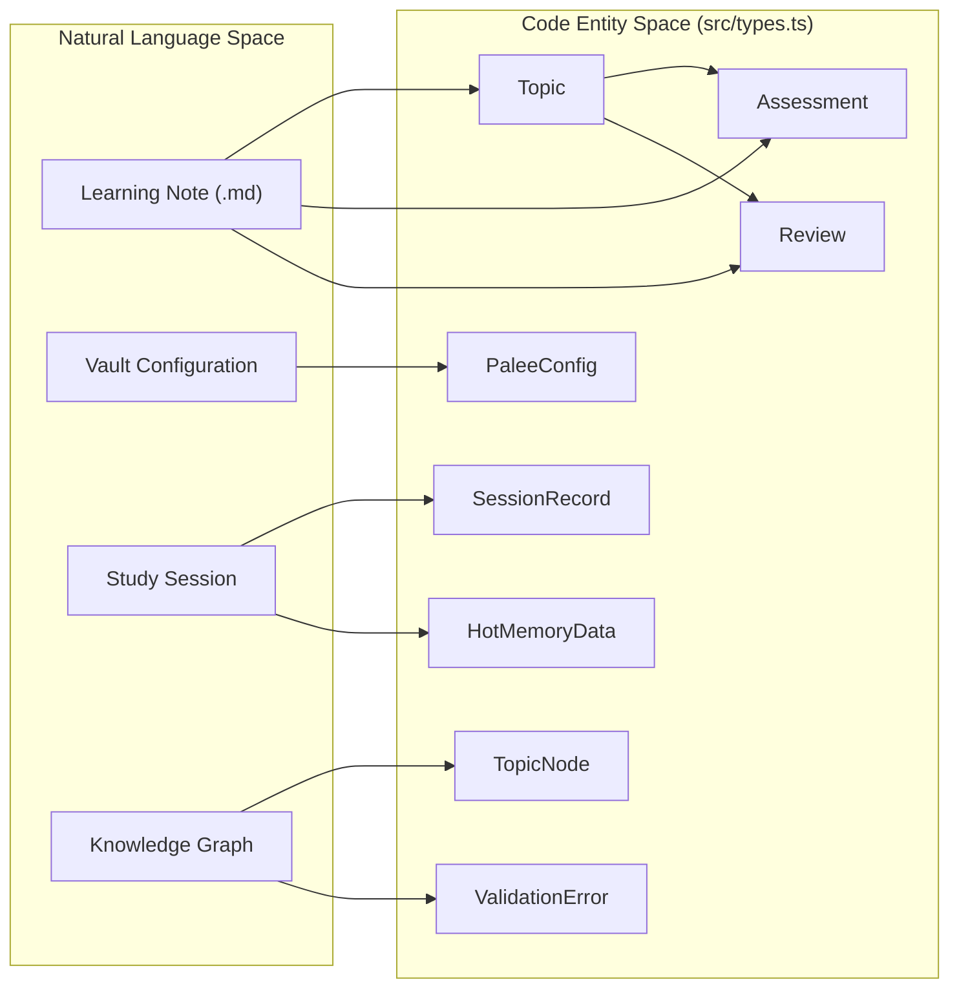
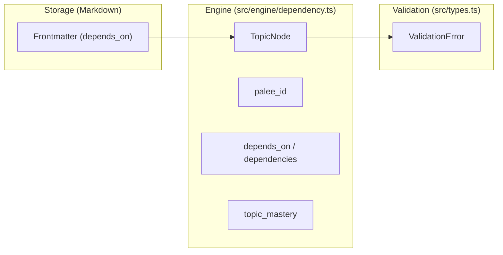

# Data Model and Types
<details>
<summary><b>Relevant Source Files</b></summary>

- [src/cli/adopt.ts](https://github.com/Kuldeep2822k/cli/blob/main/src/cli/adopt.ts)
- [src/index.ts](https://github.com/Kuldeep2822k/cli/blob/main/src/index.ts)
- [src/types.ts](https://github.com/Kuldeep2822k/cli/blob/main/src/types.ts)
- [test/types-difficulty.test.ts](https://github.com/Kuldeep2822k/cli/blob/main/test/types-difficulty.test.ts)

</details>

This section serves as a technical reference for the TypeScript interfaces and type definitions that form the backbone of the PALEE system. All core types are defined in [src/types.ts](https://github.com/Kuldeep2822k/cli/blob/main/src/types.ts).

The data model is designed to be serialized into Markdown frontmatter or JSON files, providing a bridge between the "Natural Language Space" (Markdown notes) and the "Code Entity Space" (the Engine Core).

### System Data Mapping

The following diagram illustrates how high-level system concepts map to specific code entities within the `src/types.ts` file.

Conceptual to Code Entity Mapping



Sources: [src/types.ts#17-389](https://github.com/Kuldeep2822k/cli/blob/main/src/types.ts#L17-L389)

---

### Core Learning Schema

The learning model is centered around the `Topic` interface, which represents the state of a single note within the Obsidian vault.

- **`Topic`**: The primary unit of learning, containing metadata, mastery status, and scheduling data [src/types.ts#104-125](https://github.com/Kuldeep2822k/cli/blob/main/src/types.ts#L104-L125).
- **`Assessment`**: A four-pillar model (Conceptual, Practical, Debug, Feynman) used to track mastery levels [src/types.ts#17-28](https://github.com/Kuldeep2822k/cli/blob/main/src/types.ts#L17-L28).
- **`Review`**: Contains the Spaced Repetition System (SRS) state, including ease factor, repetition count, lapses, and next due date [src/types.ts#38-53](https://github.com/Kuldeep2822k/cli/blob/main/src/types.ts#L38-L53).
- **`Difficulty`**: Union type `'beginner' | 'intermediate' | 'advanced'` [src/types.ts#58](https://github.com/Kuldeep2822k/cli/blob/main/src/types.ts#L58).

For details on how these fields are used in the SRS algorithm and frontmatter, see [Topic and Assessment Schema](./05-1-topic-and-assessment-schema.md).

Sources: [src/types.ts#17-125](https://github.com/Kuldeep2822k/cli/blob/main/src/types.ts#L17-L125)

---

### Difficulty Normalization

PALEE uses a strict `Difficulty` union type: `'beginner' | 'intermediate' | 'advanced'` [src/types.ts#21](https://github.com/Kuldeep2822k/cli/blob/main/src/types.ts#L21). To handle varied user input from the CLI or Markdown frontmatter, the system provides a `normalizeDifficulty` utility.

| Input Type | Value | Result |
| --- | --- | --- |
| String | "beginner", "BEGINNER", " beginner " | `'beginner'` |
| Numeric | `1` or `"1"` | `'beginner'` |
| Numeric | `2`, `3` or `"2"`, `"3"` | `'intermediate'` |
| Numeric | `4`, `5` or `"4"`, `"5"` | `'advanced'` |
| Fallback | `null`, `undefined`, "expert" | `'intermediate'` |

Sources: [src/types.ts#29-47](https://github.com/Kuldeep2822k/cli/blob/main/src/types.ts#L29-L47)[test/types-difficulty.test.ts#14-50](https://github.com/Kuldeep2822k/cli/blob/main/test/types-difficulty.test.ts#L14-L50)

---

### Session and Memory Types

Session management tracks active learning periods, maintains crash-resilient session draft checkpoints, and persists hot working memory to bridge study sessions.

#### Discriminated Union Session Types

In PALEE, learning sessions exist in two distinct lifecycle states represented as TypeScript discriminated unions in `src/types.ts`:

1. **Runtime Snapshot (`Session = CompletedSession | DraftSession`)**:
   - `CompletedSession`: Represents a concluded study session with recorded duration and timestamps.
   - `DraftSession`: Represents an active, in-progress checkpoint before the user finishes or saves their study session.
2. **Persistent Storage Record (`SessionRecord = CompletedSessionRecord | DraftSessionRecord`)**:
   - `CompletedSessionRecord`: Frontmatter schema serialized into permanent session notes (`.palee/sessions/S-*.md`).
   - `DraftSessionRecord`: Frontmatter schema serialized into temporary session draft files (`.palee/sessions/DRAFT-*.md`).

```typescript
// Base shared metadata
export interface BaseSession {
  palee_schema: number;
  session_id: string;   // e.g. 'S-20260830T012000-A1B2' or 'DRAFT-S-*'
  topic_id: string;     // target topic palee_id
  started_at: string;   // ISO 8601 timestamp
}

// Completed session: ended_at is a non-null ISO 8601 string
export interface CompletedSession extends BaseSession {
  status: 'completed';
  ended_at: string;
}

// Draft session: ended_at is strictly null
export interface DraftSession extends BaseSession {
  status: 'draft';
  ended_at: null;
}

export type Session = CompletedSession | DraftSession;
```

#### Discriminator & Typing Contract

| Type Interface | Discriminator (`status`) | `ended_at` Contract | `session_id` Pattern | Purpose |
| --- | --- | --- | --- | --- |
| `CompletedSession` / `CompletedSessionRecord` | `'completed'` | `string` (ISO 8601 timestamp) | `S-YYYYMMDDTHHMMSS-XXXX` | Persisted, finalized learning session record |
| `DraftSession` / `DraftSessionRecord` | `'draft'` | `null` (strictly null) | `DRAFT-S-YYYYMMDDTHHMMSS-XXXX` | Live checkpoint for recovery during interrupted CLI sessions |

#### Type Narrowing Invariant

Because `status` acts as the discriminant field, TypeScript automatically narrows the type of `ended_at` and associated properties:

```typescript
function formatSessionSummary(session: Session): string {
  if (session.status === 'completed') {
    // TypeScript knows session is CompletedSession: ended_at is string
    return `Session ${session.session_id} finished at ${session.ended_at}`;
  }
  // TypeScript knows session is DraftSession: ended_at is null
  return `Draft ${session.session_id} in progress (started ${session.started_at})`;
}
```

#### Memory and Synchronization Types

- **`DraftRecoveryAction`**: Union of user choices when resuming or processing an unfinished draft session (`'resume' | 'save' | 'discard' | 'ignore'`) [src/types.ts#231](https://github.com/Kuldeep2822k/cli/blob/main/src/types.ts#L231).
- **`HotMemoryData`**: Represents the runtime state stored in `.palee/hot.md`, caching `memory_id`, `active_topic`, `last_session`, and `updated_at` [src/types.ts#182-193](https://github.com/Kuldeep2822k/cli/blob/main/src/types.ts#L182-L193).
- **`LockData`**: Payload written into `.palee/locks/<hash>.lockdir/<lock_id>.json` containing `lock_id`, `target`, `pid`, `hostname`, and `created_at` [src/types.ts#255-266](https://github.com/Kuldeep2822k/cli/blob/main/src/types.ts#L255-L266).

Sources: [src/types.ts#141-231](https://github.com/Kuldeep2822k/cli/blob/main/src/types.ts#L141-L231)[src/storage/memory.ts#1-214](https://github.com/Kuldeep2822k/cli/blob/main/src/storage/memory.ts#L1-L214)

---

### Infrastructure and CLI Types

These types support the internal workings of the storage layer and the command-line interface.

- **`PaleeConfig`**: Defines user environment settings in `~/.palee/config.json`, including `vaultPath`, `aiProvider`, and `model` [src/types.ts#238-245](https://github.com/Kuldeep2822k/cli/blob/main/src/types.ts#L238-L245).
- **`CacheEntry<T>`**: Generic schema for in-memory file cache entries tracking `mtime`, `size`, `fingerprint`, `data`, and `lastVerified` [src/types.ts#275-286](https://github.com/Kuldeep2822k/cli/blob/main/src/types.ts#L275-L286).
- **`FrontmatterResult`**: Result object from CST parsing holding `frontmatter`, `body`, `raw`, `doc`, and optional `error` [src/types.ts#293-305](https://github.com/Kuldeep2822k/cli/blob/main/src/types.ts#L293-L305).
- **`ValidationError` & `ValidationResult`**: Vault integrity error representations (`duplicate_id`, `missing_dependency`, `cycle`) and aggregated validation status [src/types.ts#311-336](https://github.com/Kuldeep2822k/cli/blob/main/src/types.ts#L311-L336).
- **CLI Options**: Specific argument interfaces including `AdoptOptions`, `NextOptions`, `PlanOptions`, `DashboardOptions`, `ProgressOptions`, `ValidateOptions`, `SessionOptions`, and `RoadmapOptions` [src/types.ts#396-484](https://github.com/Kuldeep2822k/cli/blob/main/src/types.ts#L396-L484).

For details on configuration paths and CLI flags, see [Configuration and CLI Option Types](./05-2-configuration-and-cli-option-types.md).

Sources: [src/types.ts#234-484](https://github.com/Kuldeep2822k/cli/blob/main/src/types.ts#L234-L484)

---

### Dependency Graph Model

The dependency engine uses the `TopicNode` interface to build a Directed Acyclic Graph (DAG) of the vault's topics.

Graph Data Flow



Sources: [src/types.ts#343-389](https://github.com/Kuldeep2822k/cli/blob/main/src/types.ts#L343-L389)