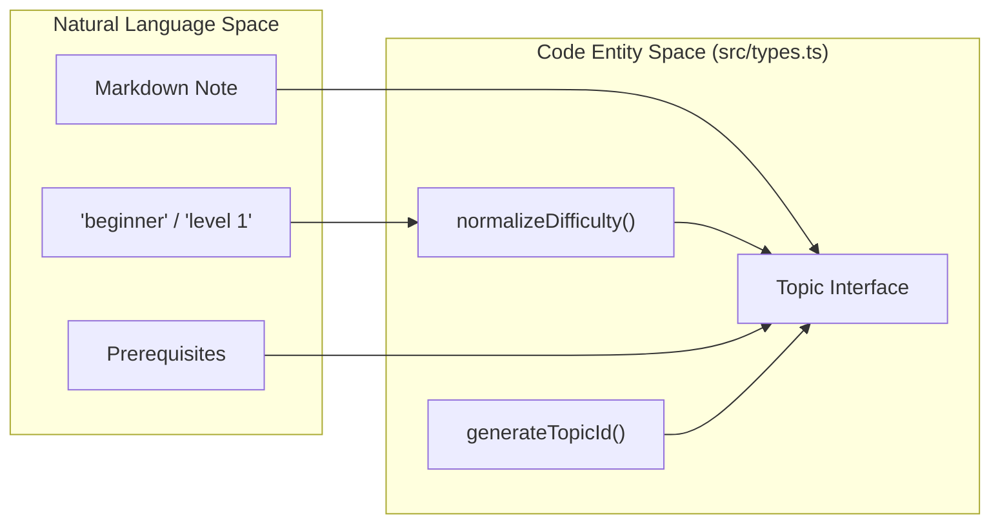
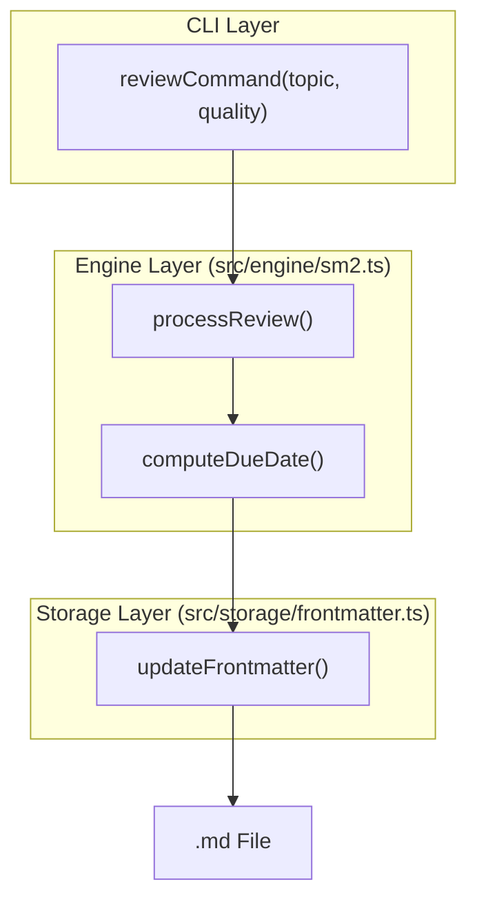

# Topic and Assessment Schema
<details>
<summary><b>Relevant Source Files</b></summary>

- [examples/Docker Fundamentals.md](https://github.com/Kuldeep2822k/cli/blob/main/examples/Docker%20Fundamentals.md?plain=1)
- [examples/Docker Networking.md](https://github.com/Kuldeep2822k/cli/blob/main/examples/Docker%20Networking.md?plain=1)
- [examples/Docker Volumes.md](https://github.com/Kuldeep2822k/cli/blob/main/examples/Docker%20Volumes.md?plain=1)
- [src/cli/adopt.ts](https://github.com/Kuldeep2822k/cli/blob/main/src/cli/adopt.ts)
- [src/cli/config.ts](https://github.com/Kuldeep2822k/cli/blob/main/src/cli/config.ts)
- [src/cli/review.ts](https://github.com/Kuldeep2822k/cli/blob/main/src/cli/review.ts)
- [src/types.ts](https://github.com/Kuldeep2822k/cli/blob/main/src/types.ts)
- [test/cli-commands.test.ts](https://github.com/Kuldeep2822k/cli/blob/main/test/cli-commands.test.ts)
- [test/types-difficulty.test.ts](https://github.com/Kuldeep2822k/cli/blob/main/test/types-difficulty.test.ts)

</details>

The PALEE system utilizes a structured data model to track learning progress, mastery levels, and spaced-repetition schedules for individual topics within a Markdown-based vault. This data is primarily stored as YAML frontmatter within each topic's Markdown file.

## 1. The Topic Interface

The `Topic` interface is the central entity in the system, representing a single unit of learning. It encapsulates metadata, pedagogical configuration, and nested objects for mastery and scheduling.

### Key Attributes

- `palee_schema`: An integer versioning the metadata structure (currently `1`) [src/types.ts#50](https://github.com/Kuldeep2822k/cli/blob/main/src/types.ts#L50-L50)
- `palee_id`: A unique identifier generated during adoption, typically following the pattern `T-YYYYMMDDTHHMMSS-xxxx`[src/cli/adopt.ts#13-18](https://github.com/Kuldeep2822k/cli/blob/main/src/cli/adopt.ts#L13-L18)
- `status`: Tracks the learning lifecycle (`not_started`, `learning`, `paused`, `archived`) [src/types.ts#54](https://github.com/Kuldeep2822k/cli/blob/main/src/types.ts#L54-L54)
- `difficulty`: A normalized categorization of the topic's complexity [src/types.ts#55](https://github.com/Kuldeep2822k/cli/blob/main/src/types.ts#L55-L55)
- `dependencies`: An array of `palee_id` strings representing prerequisite topics [src/types.ts#56](https://github.com/Kuldeep2822k/cli/blob/main/src/types.ts#L56-L56)

### Topic Data Flow

The following diagram illustrates how natural language concepts map to the `Topic` code entity during the `adopt` process.

Natural Language to Code Entity: Topic Adoption



Sources:[src/types.ts#49-59](https://github.com/Kuldeep2822k/cli/blob/main/src/types.ts#L49-L59)[src/cli/adopt.ts#13-18](https://github.com/Kuldeep2822k/cli/blob/main/src/cli/adopt.ts#L13-L18)[src/cli/adopt.ts#53-62](https://github.com/Kuldeep2822k/cli/blob/main/src/cli/adopt.ts#L53-L62)

---

## 2. Four-Pillar Assessment Model

```text
topic_mastery = round((conceptual + practical + debug + 2 * feynman) / 5, 4)
```

Feynman technique evaluation carries double weighting (40%) to prioritize true conceptual articulation.

| Field | Type | Description |
| --- | --- | --- |
| `conceptual` | `number` | Understanding of theoretical principles (0.0 to 1.0). |
| `practical` | `number` | Ability to apply knowledge in a hands-on context (0.0 to 1.0). |
| `debug` | `number` | Proficiency in identifying and fixing errors in the topic area (0.0 to 1.0). |
| `feynman` | `number` | Ability to explain the topic simply to others (0.0 to 1.0, 40% weight). |
| `assessed_at` | `string \| null` | ISO timestamp of the last assessment update. |

Sources:[src/types.ts#3-9](https://github.com/Kuldeep2822k/cli/blob/main/src/types.ts#L3-L9)[planning/invariants.md#33](https://github.com/Kuldeep2822k/cli/blob/main/planning/invariants.md?plain=1#L33)[examples/Docker Fundamentals.md#9-12](https://github.com/Kuldeep2822k/cli/blob/main/examples/Docker%20Fundamentals.md?plain=1#L9-L12)

---

## 3. Review (SRS) State

The `Review` object stores the Spaced Repetition System (SRS) state, implementing the SM-2 algorithm logic. Unlike the assessment pillars, these fields are updated via the `palee review` command.

### SRS Fields

- `ease_factor`: The multiplier for the next interval (default `2.5`, minimum `1.3`) [src/types.ts#14](https://github.com/Kuldeep2822k/cli/blob/main/src/types.ts#L14-L14)
- `interval_days`: The number of days until the next review [src/types.ts#12](https://github.com/Kuldeep2822k/cli/blob/main/src/types.ts#L12-L12)
- `repetition`: Count of consecutive successful reviews [src/types.ts#13](https://github.com/Kuldeep2822k/cli/blob/main/src/types.ts#L13-L13)
- `lapses`: Count of failed reviews (quality < 3) on learned topics [src/types.ts#15](https://github.com/Kuldeep2822k/cli/blob/main/src/types.ts#L15-L15)
- `last_quality`: The most recent recall quality rating (0–5) [src/types.ts#16](https://github.com/Kuldeep2822k/cli/blob/main/src/types.ts#L16-L16)
- `last_reviewed_at`: A date-only string (`YYYY-MM-DD`) recording when the topic was last reviewed [src/types.ts#17](https://github.com/Kuldeep2822k/cli/blob/main/src/types.ts#L17-L17)
- `due_at`: A date-only string (`YYYY-MM-DD`) indicating when the topic is next due for review [src/types.ts#18](https://github.com/Kuldeep2822k/cli/blob/main/src/types.ts#L18-L18)

Review State Transition Logic



Sources:[src/cli/review.ts#73-88](https://github.com/Kuldeep2822k/cli/blob/main/src/cli/review.ts#L73-L88)[src/engine/sm2.ts#80-82](https://github.com/Kuldeep2822k/cli/blob/main/src/engine/sm2.ts#L80-L82)[src/types.ts#11-19](https://github.com/Kuldeep2822k/cli/blob/main/src/types.ts#L11-L19)

---

## 4. Difficulty Normalization

The system provides a robust `normalizeDifficulty` function to handle varied user inputs from the CLI or roadmap imports, ensuring the internal `Difficulty` type remains consistent.

| Input Type | Input Value | Resulting `Difficulty` |
| --- | --- | --- |
| String | "beginner", "BEGINNER", " 1 " | `beginner` |
| String | "intermediate", "2", "3" | `intermediate` |
| String | "advanced", "4", "5" | `advanced` |
| Number | `<= 1` | `beginner` |
| Number | `2` or `3` | `intermediate` |
| Number | `>= 4` | `advanced` |
| Unknown | `null`, `undefined`, "expert" | `intermediate` (Fallback) |

Sources:[src/types.ts#29-47](https://github.com/Kuldeep2822k/cli/blob/main/src/types.ts#L29-L47)[test/types-difficulty.test.ts#14-50](https://github.com/Kuldeep2822k/cli/blob/main/test/types-difficulty.test.ts#L14-L50)

---

## 5. Frontmatter Mapping

When a file is adopted or updated, the `paleeData` record is serialized into the Markdown frontmatter. The `palee adopt` command initializes these values to their defaults.

```
// Initial state during adoption
const paleeData: Record<string, unknown> = {
  palee_id: topicId,      // Generated T-ID
  palee_schema: 1,
  difficulty,             // User provided or 'intermediate'
  depends_on: dependsOn,  // Array of T-IDs
  topic_mastery: 0.0,
  conceptual: 0.0,
  practical: 0.0,
  debug: 0.0,
  feynman: 0.0,
  assessed_at: null,
  ease_factor: 2.5,
  interval_days: 1,
  repetition: 0,
  lapses: 0,
  last_quality: null,
  last_reviewed_at: null,
  due_at: null,
};
```

Sources:[src/cli/adopt.ts#68-86](https://github.com/Kuldeep2822k/cli/blob/main/src/cli/adopt.ts#L68-L86)[examples/Docker Fundamentals.md#1-20](https://github.com/Kuldeep2822k/cli/blob/main/examples/Docker%20Fundamentals.md?plain=1#L1-L20)