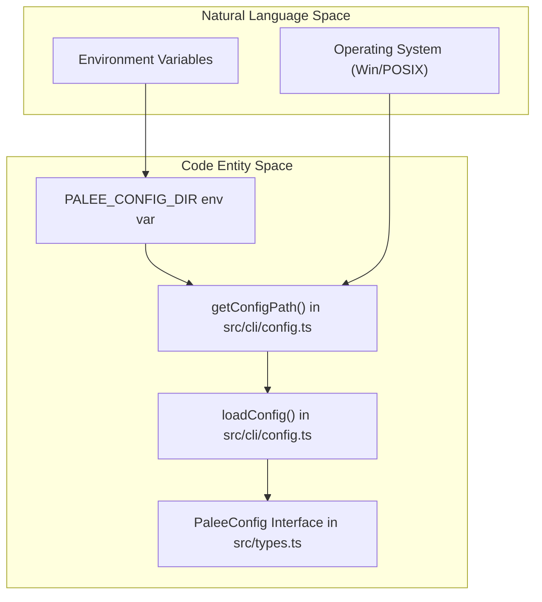
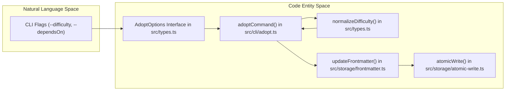

# Configuration and CLI Option Types
Relevant source files

- [src/cli/adopt.ts](https://github.com/Kuldeep2822k/cli/blob/e8b70e0d/src/cli/adopt.ts)
- [src/cli/config.ts](https://github.com/Kuldeep2822k/cli/blob/e8b70e0d/src/cli/config.ts)
- [src/cli/review.ts](https://github.com/Kuldeep2822k/cli/blob/e8b70e0d/src/cli/review.ts)
- [src/types.ts](https://github.com/Kuldeep2822k/cli/blob/e8b70e0d/src/types.ts)
- [test/cli-commands.test.ts](https://github.com/Kuldeep2822k/cli/blob/e8b70e0d/test/cli-commands.test.ts)
- [test/types-difficulty.test.ts](https://github.com/Kuldeep2822k/cli/blob/e8b70e0d/test/types-difficulty.test.ts)

This page details the technical implementation of the PALEE configuration system and the TypeScript interfaces governing CLI command options. The configuration system manages persistent settings such as the vault location and AI preferences, while the CLI option types ensure type-safe interaction between the command-line interface and the engine core.

## Configuration System

PALEE uses a JSON-based configuration file to store user preferences. The configuration is managed via the `PaleeConfig` interface and accessed through platform-specific paths.

### PaleeConfig Interface

The `PaleeConfig` interface defines the core settings required for PALEE to operate [src/types.ts#104-108](https://github.com/Kuldeep2822k/cli/blob/e8b70e0d/src/types.ts#L104-L108)

| Property | Type | Description |
| --- | --- | --- |
| `vaultPath` | `string` (optional) | The absolute path to the Obsidian vault containing the Markdown notes. |
| `aiProvider` | `string` (optional) | The LLM provider for AI-assisted features (e.g., "openai", "anthropic"). |
| `model` | `string` (optional) | The specific model identifier to use for AI tasks. |

### Config File Resolution

The location of `config.json` is determined by the `getConfigPath` function [src/cli/config.ts#11-25](https://github.com/Kuldeep2822k/cli/blob/e8b70e0d/src/cli/config.ts#L11-L25) which follows platform-specific conventions:

1. Environment Override: If the `PALEE_CONFIG_DIR` environment variable is set, the config is stored in `${PALEE_CONFIG_DIR}/config.json`[src/cli/config.ts#12-14](https://github.com/Kuldeep2822k/cli/blob/e8b70e0d/src/cli/config.ts#L12-L14) This is primarily used for test isolation [test/cli-commands.test.ts#27](https://github.com/Kuldeep2822k/cli/blob/e8b70e0d/test/cli-commands.test.ts#L27-L27)
2. Windows: `%LOCALAPPDATA%\palee\config.json`[src/cli/config.ts#16-21](https://github.com/Kuldeep2822k/cli/blob/e8b70e0d/src/cli/config.ts#L16-L21)
3. POSIX (Linux/macOS): `~/.config/palee/config.json`[src/cli/config.ts#23](https://github.com/Kuldeep2822k/cli/blob/e8b70e0d/src/cli/config.ts#L23-L23)

### Configuration Flow

The `loadConfig` function reads the JSON file and returns a `PaleeConfig` object. If the file does not exist (`ENOENT`), it returns an empty object [src/cli/config.ts#27-39](https://github.com/Kuldeep2822k/cli/blob/e8b70e0d/src/cli/config.ts#L27-L39) The `saveConfig` function ensures the directory exists before writing the updated configuration back to disk [src/cli/config.ts#41-50](https://github.com/Kuldeep2822k/cli/blob/e8b70e0d/src/cli/config.ts#L41-L50)

Sources:

- [src/types.ts#104-108](https://github.com/Kuldeep2822k/cli/blob/e8b70e0d/src/types.ts#L104-L108)
- [src/cli/config.ts#11-50](https://github.com/Kuldeep2822k/cli/blob/e8b70e0d/src/cli/config.ts#L11-L50)
- [test/cli-commands.test.ts#23-35](https://github.com/Kuldeep2822k/cli/blob/e8b70e0d/test/cli-commands.test.ts#L23-L35)

## Difficulty Normalization

The `Difficulty` type is a union of `'beginner'`, `'intermediate'`, and `'advanced'`[src/types.ts#21](https://github.com/Kuldeep2822k/cli/blob/e8b70e0d/src/types.ts#L21-L21) Because users may provide difficulty levels as numbers (1-5) or varied strings, the system employs a `normalizeDifficulty` function [src/types.ts#29-47](https://github.com/Kuldeep2822k/cli/blob/e8b70e0d/src/types.ts#L29-L47)

### Mapping Logic

- Numbers: 1 maps to `beginner`; 2-3 maps to `intermediate`; 4-5 maps to `advanced`[src/types.ts#41-45](https://github.com/Kuldeep2822k/cli/blob/e8b70e0d/src/types.ts#L41-L45)
- Strings: Case-insensitive matching for canonical names. Stringified numbers are parsed and mapped using the number logic [src/types.ts#30-40](https://github.com/Kuldeep2822k/cli/blob/e8b70e0d/src/types.ts#L30-L40)
- Fallback: Defaults to `intermediate` for null, undefined, or invalid inputs [src/types.ts#46](https://github.com/Kuldeep2822k/cli/blob/e8b70e0d/src/types.ts#L46-L46)

Sources:

- [src/types.ts#21-47](https://github.com/Kuldeep2822k/cli/blob/e8b70e0d/src/types.ts#L21-L47)
- [test/types-difficulty.test.ts#5-50](https://github.com/Kuldeep2822k/cli/blob/e8b70e0d/test/types-difficulty.test.ts#L5-L50)

## CLI Option Interfaces

Each CLI command has a corresponding TypeScript interface that defines its accepted flags and arguments. This ensures that the command handlers receive correctly typed data from the CLI entry point.

### Command Option Summary

| Interface | Command | Properties |
| --- | --- | --- |
| `AdoptOptions` | `palee adopt` | `difficulty` (Difficulty), `dependsOn` (string) [src/types.ts#168-171](https://github.com/Kuldeep2822k/cli/blob/e8b70e0d/src/types.ts#L168-L171) |
| `NextOptions` | `palee next` | `all` (boolean), `json` (boolean) [src/types.ts#173-176](https://github.com/Kuldeep2822k/cli/blob/e8b70e0d/src/types.ts#L173-L176) |
| `PlanOptions` | `palee plan` | `json` (boolean) [src/types.ts#178-180](https://github.com/Kuldeep2822k/cli/blob/e8b70e0d/src/types.ts#L178-L180) |
| `ProgressOptions` | `palee progress` | `topic` (string), `json` (boolean) [src/types.ts#186-189](https://github.com/Kuldeep2822k/cli/blob/e8b70e0d/src/types.ts#L186-L189) |
| `ValidateOptions` | `palee validate` | `fix` (boolean), `json` (boolean) [src/types.ts#191-194](https://github.com/Kuldeep2822k/cli/blob/e8b70e0d/src/types.ts#L191-L194) |
| `RoadmapOptions` | `palee roadmap` | `from` (string), `yes` (boolean) [src/types.ts#202-205](https://github.com/Kuldeep2822k/cli/blob/e8b70e0d/src/types.ts#L202-L205) |
| `SessionOptions` | `palee session` | `interactive` (boolean), `topic` (string), `json` (boolean) [src/types.ts#196-200](https://github.com/Kuldeep2822k/cli/blob/e8b70e0d/src/types.ts#L196-L200) |

### Implementation Detail: Adopt Command

The `adoptCommand` utilizes `AdoptOptions` to initialize a note's frontmatter. It validates that the difficulty provided matches valid inputs (beginner, intermediate, advanced, or 1-5) before calling `normalizeDifficulty`[src/cli/adopt.ts#53-62](https://github.com/Kuldeep2822k/cli/blob/e8b70e0d/src/cli/adopt.ts#L53-L62)

Sources:

- [src/types.ts#166-206](https://github.com/Kuldeep2822k/cli/blob/e8b70e0d/src/types.ts#L166-L206)
- [src/cli/adopt.ts#20-107](https://github.com/Kuldeep2822k/cli/blob/e8b70e0d/src/cli/adopt.ts#L20-L107)

## Data Flow Diagrams

### Configuration and File Resolution

This diagram bridges the natural language concept of "Platform Specific Config" to the code entities responsible for resolving paths and loading data.

Sources:

- [src/cli/config.ts#11-39](https://github.com/Kuldeep2822k/cli/blob/e8b70e0d/src/cli/config.ts#L11-L39)
- [src/types.ts#104-108](https://github.com/Kuldeep2822k/cli/blob/e8b70e0d/src/types.ts#L104-L108)

### Command Option Processing

This diagram illustrates how CLI inputs are transformed into typed options and then into vault modifications, using the `adopt` command as an example.

Sources:

- [src/types.ts#168-171](https://github.com/Kuldeep2822k/cli/blob/e8b70e0d/src/types.ts#L168-L171)
- [src/cli/adopt.ts#53-91](https://github.com/Kuldeep2822k/cli/blob/e8b70e0d/src/cli/adopt.ts#L53-L91)
- [src/storage/frontmatter.ts#88](https://github.com/Kuldeep2822k/cli/blob/e8b70e0d/src/storage/frontmatter.ts#L88-L88)
- [src/storage/atomic-write.ts#91](https://github.com/Kuldeep2822k/cli/blob/e8b70e0d/src/storage/atomic-write.ts#L91-L91)