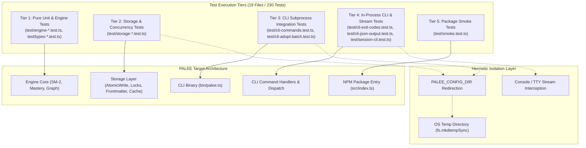

# Testing
<details>
<summary><b>Relevant Source Files</b></summary>

- [planning/invariants.md](https://github.com/Kuldeep2822k/cli/blob/main/planning/invariants.md?plain=1)
- [src/cli/adopt.ts](https://github.com/Kuldeep2822k/cli/blob/main/src/cli/adopt.ts)
- [src/cli/config.ts](https://github.com/Kuldeep2822k/cli/blob/main/src/cli/config.ts)
- [src/cli/review.ts](https://github.com/Kuldeep2822k/cli/blob/main/src/cli/review.ts)
- [src/engine/dependency.ts](https://github.com/Kuldeep2822k/cli/blob/main/src/engine/dependency.ts)
- [src/engine/mastery.ts](https://github.com/Kuldeep2822k/cli/blob/main/src/engine/mastery.ts)
- [src/engine/sm2.ts](https://github.com/Kuldeep2822k/cli/blob/main/src/engine/sm2.ts)
- [src/storage/atomic-write.ts](https://github.com/Kuldeep2822k/cli/blob/main/src/storage/atomic-write.ts)
- [src/storage/cache.ts](https://github.com/Kuldeep2822k/cli/blob/main/src/storage/cache.ts)
- [src/storage/frontmatter.ts](https://github.com/Kuldeep2822k/cli/blob/main/src/storage/frontmatter.ts)
- [src/storage/loader.ts](https://github.com/Kuldeep2822k/cli/blob/main/src/storage/loader.ts)
- [src/storage/lock.ts](https://github.com/Kuldeep2822k/cli/blob/main/src/storage/lock.ts)
- [src/storage/memory.ts](https://github.com/Kuldeep2822k/cli/blob/main/src/storage/memory.ts)
- [src/storage/pattern-matcher.ts](https://github.com/Kuldeep2822k/cli/blob/main/src/storage/pattern-matcher.ts)
- [src/storage/roadmap-parser.ts](https://github.com/Kuldeep2822k/cli/blob/main/src/storage/roadmap-parser.ts)
- [src/storage/walker.ts](https://github.com/Kuldeep2822k/cli/blob/main/src/storage/walker.ts)
- [src/types.ts](https://github.com/Kuldeep2822k/cli/blob/main/src/types.ts)
- [test/cli-adopt-batch.test.ts](https://github.com/Kuldeep2822k/cli/blob/main/test/cli-adopt-batch.test.ts)
- [test/cli-commands.test.ts](https://github.com/Kuldeep2822k/cli/blob/main/test/cli-commands.test.ts)
- [test/cli-exit-codes.test.ts](https://github.com/Kuldeep2822k/cli/blob/main/test/cli-exit-codes.test.ts)
- [test/cli-json-output.test.ts](https://github.com/Kuldeep2822k/cli/blob/main/test/cli-json-output.test.ts)
- [test/engine-dependency.test.ts](https://github.com/Kuldeep2822k/cli/blob/main/test/engine-dependency.test.ts)
- [test/engine-mastery.test.ts](https://github.com/Kuldeep2822k/cli/blob/main/test/engine-mastery.test.ts)
- [test/engine-sm2.test.ts](https://github.com/Kuldeep2822k/cli/blob/main/test/engine-sm2.test.ts)
- [test/session-cli.test.ts](https://github.com/Kuldeep2822k/cli/blob/main/test/session-cli.test.ts)
- [test/smoke.test.ts](https://github.com/Kuldeep2822k/cli/blob/main/test/smoke.test.ts)
- [test/storage-atomic-write.test.ts](https://github.com/Kuldeep2822k/cli/blob/main/test/storage-atomic-write.test.ts)
- [test/storage-cache.test.ts](https://github.com/Kuldeep2822k/cli/blob/main/test/storage-cache.test.ts)
- [test/storage-frontmatter.test.ts](https://github.com/Kuldeep2822k/cli/blob/main/test/storage-frontmatter.test.ts)
- [test/storage-loader.test.ts](https://github.com/Kuldeep2822k/cli/blob/main/test/storage-loader.test.ts)
- [test/storage-lock.test.ts](https://github.com/Kuldeep2822k/cli/blob/main/test/storage-lock.test.ts)
- [test/storage-memory.test.ts](https://github.com/Kuldeep2822k/cli/blob/main/test/storage-memory.test.ts)
- [test/storage-pattern-matcher.test.ts](https://github.com/Kuldeep2822k/cli/blob/main/test/storage-pattern-matcher.test.ts)
- [test/storage-roadmap-parser.test.ts](https://github.com/Kuldeep2822k/cli/blob/main/test/storage-roadmap-parser.test.ts)
- [test/storage-walker.test.ts](https://github.com/Kuldeep2822k/cli/blob/main/test/storage-walker.test.ts)
- [test/types-difficulty.test.ts](https://github.com/Kuldeep2822k/cli/blob/main/test/types-difficulty.test.ts)

</details>

PALEE utilizes a robust, zero-external-framework testing strategy centered around the Node.js native test runner (`node:test`) and assertion library (`node:assert`), ensuring maximum execution speed, deterministic concurrency, and minimal dependencies. The test suite spans 19 active TypeScript test files containing 230 passing test assertions across 31 test suites.

## Master Test Suite Catalog

The table below catalogs all 19 test files in the `test/` directory, mapped across their architectural layers, test counts, and verified invariants:

| # | Test File Path | Top-Level Suite / Describe | Test Count | Layer / Scope | Primary Coverage & Invariants |
|---|---|---|:---:|---|---|
| **1** | `test/cli-adopt-batch.test.ts` | `CLI Adopt Batch Integration Tests` | 9 | CLI Integration | Batch note adoption (`--all`, directory targets, `--dry-run`, `--tag`, `--include`, `--exclude`, `-y`), non-interactive exit code 2, vault escape exit code 2, note title fallback extraction (frontmatter $\rightarrow$ H1 $\rightarrow$ filename), idempotent skipping. |
| **2** | `test/cli-commands.test.ts` | `CLI Commands` | 19 | CLI Integration | End-to-end command pipeline (`config`, `adopt`, `roadmap`, `review`, `plan`, `progress`, `dashboard`, `session`), Markdown frontmatter preservation, lock conflict exit code 4, OCC collision detection, date string handling. |
| **3** | `test/cli-exit-codes.test.ts` | `CLI Command In-Process Exit Codes & Coverage` | 32 | CLI Core / Process | In-process handler invocation verifying deterministic exit codes: 0 (success), 2 (usage/validation), 3 (schema/cycle error), 4 (concurrency conflict), 5 (unhandled runtime exception). |
| **4** | `test/cli-json-output.test.ts` | `CLI Machine-Readable --json Output (Invariant #45)` | 22 | CLI JSON Contracts | Machine-readable `--json` contract testing across all commands; empty vault defaults (nulls/empty lists); populated vault schemas; stderr error JSON; automatic non-TTY auto-JSON activation when `stdout.isTTY === false`. |
| **5** | `test/engine-dependency.test.ts` | `Dependency Graph` | 8 | Engine Core | Pure graph algorithms: 3-color DFS cycle detection (`detectCycle`), frontier readiness filtering (`getReadyTopics`), missing dependency validation (`validateDependencyGraph`), `dependencies` vs `depends_on` alias support. |
| **6** | `test/engine-mastery.test.ts` | `Mastery Engine & Threshold` | 11 | Engine Core | 4-Pillar Pedagogical Mastery formula $(c + p + d + 2f) / 5$, `MASTERY_THRESHOLD = 0.70`, 40% Feynman weight, score normalization/clamping $[0.0, 1.0]$, 4-decimal rounding. |
| **7** | `test/engine-sm2.test.ts` | `SM-2 Algorithm` | 15 | Engine Core | SuperMemo SM-2 interval progression (1 $\rightarrow$ 6 $\rightarrow$ $I \times EF$), quality rating bounds $[0, 5]$, ease factor clamping ($\ge 1.30$), lapse tracking, and local calendar due date arithmetic. |
| **8** | `test/session-cli.test.ts` | `Session CLI In-Process Coverage` | 8 | CLI Session | In-process session CLI dispatch and active topic resolution (`resolveSessionTopic`), fallback from explicit argument to `.palee/hot.md` frontmatter, draft lifecycle (`start`, `draft`, `end`, `list`), unknown action exit code 2. |
| **9** | `test/smoke.test.ts` | *(Top-level tests)* | 2 | Package / Smoke | Package entry point verification (`src/index.ts`), module export integrity, semantic version parity between code and `package.json`. |
| **10** | `test/storage-atomic-write.test.ts` | `Atomic Write` | 10 | Storage Layer | `atomicWrite` temp-file flush (`.tmp.*`), atomic `renameSync`, SHA-256 Optimistic Concurrency Control (OCC), `ECONFLICT` error codes, `isConflictError` helper, no orphaned temp files on failure. |
| **11** | `test/storage-cache.test.ts` | `File Cache` | 9 | Storage Layer | In-memory `FileCache`, 2000ms `UNSETTLED_HORIZON` rapid edit window, size mismatch invalidation, SHA-256 fingerprint fallback within horizon, mtime check outside horizon, cache deletion safety. |
| **12** | `test/storage-frontmatter.test.ts` | `Frontmatter Parser`, `Frontmatter Updater`, `Fingerprinting` | 11 | Storage Layer | `parseFrontmatter`, `updateFrontmatter`, and `computeFingerprint`. Preserves Markdown body byte-for-byte, preserves unknown YAML keys and comments via YAML CST Document API, SHA-256 hashing. |
| **13** | `test/storage-loader.test.ts` | `Storage Topic Loader` | 5 | Storage Layer | `loadTopics` vault loader: frontmatter extraction, string score parsing & clamping, NaN/non-finite counter fallbacks, filename title fallback, dependency alias normalization, pre-scanned file list optimization. |
| **14** | `test/storage-lock.test.ts` | `File Locking` | 11 | Storage Layer | `Lock` class mutex via atomic lockdirs (`.palee/locks/<hash>.lockdir`), 15s heartbeat `utimesSync`, platform-specific stale lock takeover (60s Windows, 120s POSIX), symlink canonicalization, `ECONFLICT` errors. |
| **15** | `test/storage-memory.test.ts` | `Memory System` | 10 | Storage Layer | Working memory system: session ID generation (`S-YYYYMMDDTHHMMSS-xxxx`), draft checkpoints (`DRAFT-S-xxxxxxxx`), word truncation (`MAX_HOT_WORDS = 250`), `hot.md` update, `index.md` regeneration, draft recovery. |
| **16** | `test/storage-pattern-matcher.test.ts` | `Pattern and Glob Matcher`, `Frontmatter Tag Matcher`, `Pattern Validation` | 14 | Storage / Utilities | Glob wildcard matching (`*`, `**/*.md`, `?`, `[...]`), Windows backslash normalization, Obsidian frontmatter tag hierarchy extraction (prefix, infix, suffix), comma-separated pattern lists. |
| **17** | `test/storage-roadmap-parser.test.ts` | `Roadmap Multi-Format Parser` | 8 | Storage Layer | Multi-format curriculum parsing: pure YAML files, Markdown frontmatter blocks, and embedded Markdown ```` ```yaml ```` codeblocks; schema and syntax error handling. |
| **18** | `test/storage-walker.test.ts` | `Vault Walker` | 11 | Storage Layer | Recursive vault traversal (`walkVault`): `.md` discovery, directory exclusions (`.obsidian`, `.trash`, `.git`, `node_modules`, `.*`), non-markdown filtering, symlink skip behavior, absolute path resolution. |
| **19** | `test/types-difficulty.test.ts` | `Difficulty Enum & Types` | 9 | Data Model / Types | `Difficulty` enum (`beginner`, `intermediate`, `advanced`), `normalizeDifficulty` coercion (case-insensitive, 1–5 scale, fallback), `TopicNode` alias compatibility, discriminated union `Session = CompletedSession | DraftSession`. |

**Grand Totals**: 19 test files, 31 test suites (`describe` blocks), 230 passing test assertions.

---

## Test Stack and Tooling

The testing environment is built on high-performance native tooling:

- **Test Runner**: Node.js native `node:test` module, providing a fast, built-in execution environment without the runtime overhead or configuration weight of Jest, Mocha, or Vitest.
- **Assertion Library**: Node.js native `node:assert/strict` and `node:assert` (`assert.strictEqual`, `assert.deepStrictEqual`, `assert.throws`, `assert.rejects`, `assert.match`).
- **Execution Engine**: `tsx` (`node --import tsx --test "test/**/*.test.ts"`), executing TypeScript tests directly from source without intermediate compilation steps.
- **Coverage Tooling**: `c8` (`npm run test:coverage`), generating detailed text and `lcov` coverage reports mapped back to original TypeScript source lines.
- **Hermetic Test Isolation**: All filesystem-touching tests redirect state by setting `process.env.PALEE_CONFIG_DIR` to a temporary directory created with `fs.mkdtempSync(path.join(os.tmpdir(), 'palee-test-'))`.

---

## Test Isolation and Environment

To prevent tests from interfering with a user's actual PALEE installation or system configuration, all tests adhere to strict environment isolation protocols.

### CLI Test Lifecycle

CLI and integration tests follow a deterministic setup and teardown lifecycle:

1. **Setup (`before` / `beforeEach`)**: Create a unique temporary directory using `fs.mkdtempSync(path.join(os.tmpdir(), 'palee-test-'))`.
2. **Environment Redirection**: Set `process.env.PALEE_CONFIG_DIR` to this temporary directory to isolate `config.json` and internal vault metadata (`.palee/`).
3. **Execution**: Run commands via `execFile` / `execSync` in subprocess integration tests, or invoke command handler functions directly with stream interception in in-process tests.
4. **Teardown (`after` / `afterEach`)**: Recursively remove the temporary directory (`fs.rmSync(tempDir, { recursive: true, force: true })`) and restore `process.env` and global console streams.

---

## Invariant Testing Strategy

The codebase is tested against the formal "Blueprint of Invariants" defined in `planning/invariants.md`. These invariants represent the foundational guarantees of PALEE:

- **Byte-for-byte Body Preservation**: Updating note frontmatter must never alter the user's Markdown note body.
- **Optimistic Concurrency Control (OCC)**: Mismatched SHA-256 fingerprints between read and write phases must abort writes with exit code 4 (`ECONFLICT`).
- **SM-2 Bounds**: The ease factor must never drop below `1.30`, and quality ratings $< 3$ must reset intervals to 1 day.
- **4-Pillar Pedagogical Mastery**: Weighted calculation $(c + p + d + 2f) / 5$ with 40% Feynman weight, requiring $\ge 0.70$ for dependency unlocking.
- **Vault Sandbox Safety**: Any attempt to adopt, read, or write files escaping the vault boundary must exit with code 2.

---

## Testing Architecture

The following diagram illustrates how the four test tiers interact with PALEE's subsystems:



---

## Developer Test Boilerplates

To facilitate writing new tests that conform to PALEE's architectural conventions, three copy-pasteable boilerplates are provided:

### 1. Pure Unit Test Boilerplate (`node:test` & `node:assert/strict`)

Use this template for testing algorithmic functions, math logic, graph traversal, and pure data transformers:

```typescript
import { describe, test } from 'node:test';
import assert from 'node:assert/strict';
import { computeTopicMastery, MASTERY_THRESHOLD } from '../src/engine/mastery';

describe('Engine Subsystem Unit Tests', () => {
  test('computes expected mastery score for balanced inputs', () => {
    // Conceptual=0.8, Practical=0.8, Debug=0.8, Feynman=0.8 -> 0.80
    const score = computeTopicMastery(0.8, 0.8, 0.8, 0.8);
    assert.strictEqual(score, 0.8);
    assert.ok(score >= MASTERY_THRESHOLD);
  });

  test('gracefully clamps boundary conditions and handles invalid input', () => {
    // Clamping: -1.0 -> 0.0, 2.0 -> 1.0, NaN -> 0.0, Feynman 0.5 (weight 2)
    // Formula: (0.0 + 1.0 + 0.0 + 2 * 0.5) / 5 = 2.0 / 5 = 0.4
    const score = computeTopicMastery(-1.0, 2.0, NaN, 0.5);
    assert.strictEqual(score, 0.4);
  });
});
```

### 2. CLI Subprocess Integration Test Boilerplate (`child_process.execFile`)

Use this template for end-to-end command execution verifying CLI flag parsing, exit codes, and disk state changes:

```typescript
import { describe, test, before, after } from 'node:test';
import assert from 'node:assert/strict';
import fs from 'node:fs';
import path from 'node:path';
import os from 'node:os';
import { execFileSync } from 'node:child_process';
import { parseFrontmatter } from '../src/storage/frontmatter';

describe('CLI Subprocess Integration Tests', () => {
  let tempDir: string;
  let vaultDir: string;

  before(() => {
    // 1. Create hermetic temp root & vault
    tempDir = fs.mkdtempSync(path.join(os.tmpdir(), 'palee-custom-test-'));
    vaultDir = path.join(tempDir, 'vault');
    fs.mkdirSync(vaultDir, { recursive: true });

    // 2. Point CLI to isolated test environment
    runCLI(['config', 'set-vault', vaultDir]);
  });

  after(() => {
    // 3. Clean up all filesystem resources
    fs.rmSync(tempDir, { recursive: true, force: true });
  });

  function runCLI(args: string[]): { status: number; stdout: string; stderr: string } {
    try {
      const stdout = execFileSync(
        process.execPath,
        ['--import', 'tsx', path.resolve(__dirname, '../bin/palee.ts'), ...args],
        {
          cwd: path.resolve(__dirname, '..'),
          env: { ...process.env, PALEE_CONFIG_DIR: tempDir },
          encoding: 'utf8',
          stdio: ['pipe', 'pipe', 'pipe'],
        }
      );
      return { status: 0, stdout, stderr: '' };
    } catch (e: any) {
      return { status: e.status ?? 1, stdout: e.stdout?.toString() || '', stderr: e.stderr?.toString() || '' };
    }
  }

  test('creates topic note and verifies frontmatter persistence', () => {
    const notePath = path.join(vaultDir, 'my-topic.md');
    fs.writeFileSync(notePath, '# My Topic Note\nContent goes here.');

    const result = runCLI(['adopt', 'my-topic.md', '--difficulty', 'beginner', '--yes']);
    assert.strictEqual(result.status, 0, `CLI failed: ${result.stderr}`);

    const parsed = parseFrontmatter(fs.readFileSync(notePath, 'utf8'));
    assert.ok(parsed.frontmatter?.palee_id);
    assert.strictEqual(parsed.frontmatter?.difficulty, 'beginner');
  });
});
```

### 3. Stream & TTY Mocking Test Boilerplate (`process.stdout.isTTY = false`)

Use this template for in-process testing of command outputs, non-TTY auto-JSON detection, and exit code propagation:

```typescript
import { describe, test, beforeEach, afterEach } from 'node:test';
import assert from 'node:assert/strict';
import fs from 'node:fs';
import path from 'node:path';
import os from 'node:os';
import { nextCommand } from '../src/cli/next';
import { saveConfig } from '../src/cli/config';

describe('CLI In-Process Stream & Non-TTY Auto-JSON Tests', () => {
  let tmpDir: string;
  let loggedOutputs: string[] = [];
  let loggedErrors: string[] = [];
  const originalLog = console.log;
  const originalError = console.error;
  const originalIsTTY = process.stdout.isTTY;

  beforeEach(() => {
    tmpDir = fs.mkdtempSync(path.join(os.tmpdir(), 'palee-inproc-test-'));
    process.env.PALEE_CONFIG_DIR = tmpDir;
    saveConfig({ vaultPath: tmpDir });

    loggedOutputs = [];
    loggedErrors = [];
    console.log = (...args: unknown[]) => loggedOutputs.push(args.map(String).join(' '));
    console.error = (...args: unknown[]) => loggedErrors.push(args.map(String).join(' '));
    process.exitCode = undefined;
  });

  afterEach(() => {
    console.log = originalLog;
    console.error = originalError;
    process.stdout.isTTY = originalIsTTY;
    process.exitCode = undefined;
    delete process.env.PALEE_CONFIG_DIR;
    fs.rmSync(tmpDir, { recursive: true, force: true });
  });

  test('non-TTY environment automatically triggers JSON output', async () => {
    // Simulate non-interactive piped environment (e.g. palee next | jq)
    process.stdout.isTTY = false;

    await nextCommand({});
    assert.strictEqual(process.exitCode, undefined);

    const lastOutput = loggedOutputs[loggedOutputs.length - 1];
    const parsed = JSON.parse(lastOutput);
    assert.strictEqual(parsed.total_topics, 0);
    assert.strictEqual(parsed.next, null);
  });
});
```

---

## Detailed Test Documentation

For comprehensive breakdown of each test file and coverage specifics, consult:

- [Unit Tests](./06-1-unit-tests.md) — Detailed analysis of pure engine, storage, and type tests.
- [Integration and Smoke Tests](./06-2-integration-and-smoke-tests.md) — Detailed analysis of CLI integration, in-process stream mocking, and smoke suites.

### Summary of Test Utilities

| Utility | Purpose | Code Reference |
| --- | --- | --- |
| `runCLI` | Subprocess execution helper passing isolated `PALEE_CONFIG_DIR` environment variables. | `test/cli-commands.test.ts`, `test/cli-adopt-batch.test.ts` |
| `getLastParsedJson` | Captures and parses stdout JSON for machine-readable output contract validation. | `test/cli-json-output.test.ts` |
| `computeFingerprint` | Computes SHA-256 file hashes in test assertions to verify OCC concurrency integrity. | `test/storage-atomic-write.test.ts`, `test/storage-frontmatter.test.ts` |
| `UNSETTLED_HORIZON` | 2000ms threshold constant tested for cache invalidation during rapid file edits. | `test/storage-cache.test.ts` |
| `resolveSessionTopic` | Resolves active topic for session actions, verifying fallback chains. | `test/session-cli.test.ts` |