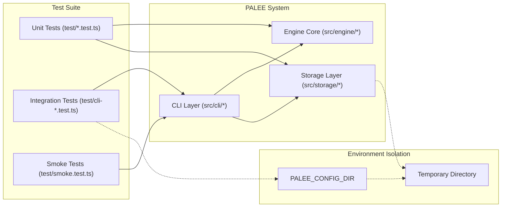

# Testing
Relevant source files

- [planning/invariants.md](https://github.com/Kuldeep2822k/cli/blob/main/planning/invariants.md?plain=1)
- [src/cli/config.ts](https://github.com/Kuldeep2822k/cli/blob/main/src/cli/config.ts)
- [src/cli/review.ts](https://github.com/Kuldeep2822k/cli/blob/main/src/cli/review.ts)
- [src/storage/index.ts](https://github.com/Kuldeep2822k/cli/blob/main/src/storage/index.ts)
- [test/cli-commands.test.ts](https://github.com/Kuldeep2822k/cli/blob/main/test/cli-commands.test.ts)
- [test/cli-json-output.test.ts](https://github.com/Kuldeep2822k/cli/blob/main/test/cli-json-output.test.ts)
- [test/storage-atomic-write.test.ts](https://github.com/Kuldeep2822k/cli/blob/main/test/storage-atomic-write.test.ts)
- [test/storage-cache.test.ts](https://github.com/Kuldeep2822k/cli/blob/main/test/storage-cache.test.ts)
- [test/storage-frontmatter.test.ts](https://github.com/Kuldeep2822k/cli/blob/main/test/storage-frontmatter.test.ts)

PALEE utilizes a robust testing strategy centered around the Node.js native test runner, ensuring high performance and minimal external dependencies. The suite is designed to verify the core scheduling engine, storage integrity, and CLI behavior against a set of formal [Unit Tests](./06-1-unit-tests.md).

### Test Stack and Tooling

The testing environment is built on three primary pillars:

- Test Runner: Node.js native `node:test` module, providing a fast, built-in execution environment without the overhead of Jest or Mocha [test/cli-commands.test.ts#1-2](https://github.com/Kuldeep2822k/cli/blob/main/test/cli-commands.test.ts#L1-L2)
- Execution: `tsx` (TypeScript Execute) is used to run tests directly from source, eliminating the need for a separate build step during development.
- Coverage: `c8` is employed to track code coverage, ensuring that critical paths in the SM-2 engine and storage layer are thoroughly exercised.

### Test Isolation and Environment

To prevent tests from interfering with a user's actual PALEE installation, all tests use the `PALEE_CONFIG_DIR` environment variable to redirect configuration and data storage to temporary directories [test/cli-commands.test.ts#27](https://github.com/Kuldeep2822k/cli/blob/main/test/cli-commands.test.ts#L27-L27)

#### CLI Test Lifecycle

CLI and integration tests follow a strict setup/teardown pattern:

1. Setup: Create a unique temporary directory using `fs.mkdtempSync`[test/cli-commands.test.ts#14](https://github.com/Kuldeep2822k/cli/blob/main/test/cli-commands.test.ts#L14-L14)
2. Configuration: Set `PALEE_CONFIG_DIR` to this temporary path to isolate `config.json` and the `.palee/` internal directory [test/cli-json-output.test.ts#28](https://github.com/Kuldeep2822k/cli/blob/main/test/cli-json-output.test.ts#L28-L28)
3. Execution: Run commands via `execSync` or direct function calls [test/cli-commands.test.ts#25](https://github.com/Kuldeep2822k/cli/blob/main/test/cli-commands.test.ts#L25-L25)
4. Teardown: Recursively remove the temporary directory to ensure a clean state for subsequent runs [test/cli-commands.test.ts#20](https://github.com/Kuldeep2822k/cli/blob/main/test/cli-commands.test.ts#L20-L20)

### Invariant Testing Strategy

The codebase is tested against a "Blueprint of Invariants" defined in the planning documentation [planning/invariants.md#1-3](https://github.com/Kuldeep2822k/cli/blob/main/planning/invariants.md?plain=1#L1-L3) These invariants represent the "laws" of the system that must never be broken, such as:

- Byte-for-byte Body Preservation: Updating frontmatter must not alter the Markdown body [planning/invariants.md#7-8](https://github.com/Kuldeep2822k/cli/blob/main/planning/invariants.md?plain=1#L7-L8)
- OCC Conflict Detection: A changed file fingerprint must trigger an Optimistic Concurrency Control failure [planning/invariants.md#9](https://github.com/Kuldeep2822k/cli/blob/main/planning/invariants.md?plain=1#L9-L9)
- SM-2 Bounds: The `ease_factor` must never drop below 1.30 [planning/invariants.md#23](https://github.com/Kuldeep2822k/cli/blob/main/planning/invariants.md?plain=1#L23-L23)

### Testing Architecture

The following diagram illustrates how the test suite interacts with the system layers:

Test Interaction Map

Sources: [test/cli-commands.test.ts#10-35](https://github.com/Kuldeep2822k/cli/blob/main/test/cli-commands.test.ts#L10-L35)[test/cli-json-output.test.ts#23-54](https://github.com/Kuldeep2822k/cli/blob/main/test/cli-json-output.test.ts#L23-L54)[planning/invariants.md#5-45](https://github.com/Kuldeep2822k/cli/blob/main/planning/invariants.md?plain=1#L5-L45)

---

### Test Categories

#### [Unit Tests](./06-1-unit-tests.md)

Unit tests focus on individual modules in isolation. They verify the mathematical correctness of the SM-2 algorithm in `src/engine/sm2.ts`, the Dependency Graph logic in `src/engine/dependency.ts`, and the utility functions in the storage layer like Frontmatter Parsing and File Caching.

For details on unit testing logic and coverage, see [Unit Tests](./06-1-unit-tests.md).

#### [Integration and Smoke Tests](./06-2-integration-and-smoke-tests.md)

Integration tests exercise the full CLI pipeline. They verify that commands like `palee adopt`, `palee review`, and `palee roadmap` correctly modify the filesystem and maintain vault integrity. The Smoke Test ensures that the final bundled binary functions correctly across different platforms.

For details on end-to-end command testing, see [Integration and Smoke Tests](./06-2-integration-and-smoke-tests.md).

### Summary of Test Utilities

| Utility | Purpose | Code Reference |
| --- | --- | --- |
| `runCLI` | Helper to execute the CLI in a subprocess with isolated environment variables. | [test/cli-commands.test.ts#23-35](https://github.com/Kuldeep2822k/cli/blob/main/test/cli-commands.test.ts#L23-L35) |
| `getLastParsedJson` | Captures and parses stdout for machine-readable output validation. | [test/cli-json-output.test.ts#56-60](https://github.com/Kuldeep2822k/cli/blob/main/test/cli-json-output.test.ts#L56-L60) |
| `computeFingerprint` | Used in tests to verify that content has or hasn't changed (OCC). | [test/storage-atomic-write.test.ts#35](https://github.com/Kuldeep2822k/cli/blob/main/test/storage-atomic-write.test.ts#L35-L35) |
| `UNSETTLED_HORIZON` | Constant (2000ms) used to test cache invalidation during rapid edits. | [test/storage-cache.test.ts#24-26](https://github.com/Kuldeep2822k/cli/blob/main/test/storage-cache.test.ts#L24-L26) |

Sources: [test/cli-commands.test.ts#23-35](https://github.com/Kuldeep2822k/cli/blob/main/test/cli-commands.test.ts#L23-L35)[test/cli-json-output.test.ts#56-60](https://github.com/Kuldeep2822k/cli/blob/main/test/cli-json-output.test.ts#L56-L60)[test/storage-atomic-write.test.ts#35](https://github.com/Kuldeep2822k/cli/blob/main/test/storage-atomic-write.test.ts#L35-L35)[test/storage-cache.test.ts#24-26](https://github.com/Kuldeep2822k/cli/blob/main/test/storage-cache.test.ts#L24-L26)