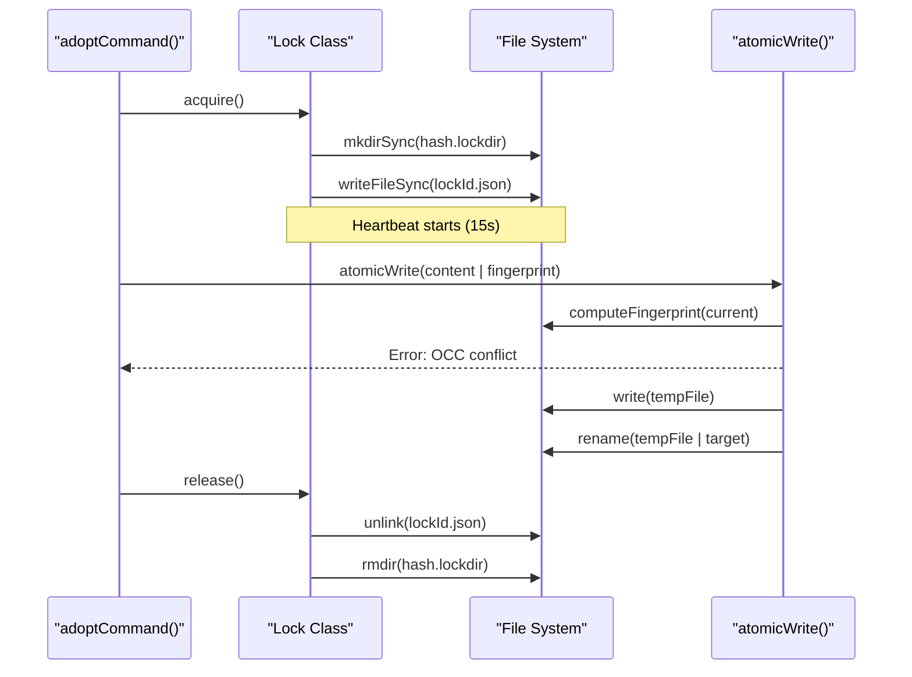

# Unit Tests
Relevant source files

- [src/cli/adopt.ts](https://github.com/Kuldeep2822k/cli/blob/e8b70e0d/src/cli/adopt.ts)
- [src/engine/dependency.ts](https://github.com/Kuldeep2822k/cli/blob/e8b70e0d/src/engine/dependency.ts)
- [src/engine/index.ts](https://github.com/Kuldeep2822k/cli/blob/e8b70e0d/src/engine/index.ts)
- [src/engine/sm2.ts](https://github.com/Kuldeep2822k/cli/blob/e8b70e0d/src/engine/sm2.ts)
- [src/storage/index.ts](https://github.com/Kuldeep2822k/cli/blob/e8b70e0d/src/storage/index.ts)
- [src/storage/lock.ts](https://github.com/Kuldeep2822k/cli/blob/e8b70e0d/src/storage/lock.ts)
- [src/types.ts](https://github.com/Kuldeep2822k/cli/blob/e8b70e0d/src/types.ts)
- [test/engine-dependency.test.ts](https://github.com/Kuldeep2822k/cli/blob/e8b70e0d/test/engine-dependency.test.ts)
- [test/engine-sm2.test.ts](https://github.com/Kuldeep2822k/cli/blob/e8b70e0d/test/engine-sm2.test.ts)
- [test/storage-atomic-write.test.ts](https://github.com/Kuldeep2822k/cli/blob/e8b70e0d/test/storage-atomic-write.test.ts)
- [test/storage-cache.test.ts](https://github.com/Kuldeep2822k/cli/blob/e8b70e0d/test/storage-cache.test.ts)
- [test/storage-frontmatter.test.ts](https://github.com/Kuldeep2822k/cli/blob/e8b70e0d/test/storage-frontmatter.test.ts)
- [test/storage-lock.test.ts](https://github.com/Kuldeep2822k/cli/blob/e8b70e0d/test/storage-lock.test.ts)
- [test/types-difficulty.test.ts](https://github.com/Kuldeep2822k/cli/blob/e8b70e0d/test/types-difficulty.test.ts)

The PALEE unit test suite ensures the integrity of core algorithms, storage safety protocols, and utility functions. Tests are executed using the native Node.js test runner and `tsx` for TypeScript execution. The suite focuses on verifying deterministic logic in the engine and defensive I/O patterns in the storage layer.

## Engine Core Tests

Engine tests verify the scheduling logic and dependency graph integrity. These tests operate on pure data structures, ensuring the logic remains decoupled from the file system.

### SM-2 Algorithm

Tests in `test/engine-sm2.test.ts` verify the `processReview` function [src/engine/sm2.ts#36-101](https://github.com/Kuldeep2822k/cli/blob/e8b70e0d/src/engine/sm2.ts#L36-L101) ensuring it adheres to the SM-2 specification:

- State Transitions: Validates that quality ratings < 3 reset `repetition` to 0 and `interval_days` to 1 [test/engine-sm2.test.ts#42-49](https://github.com/Kuldeep2822k/cli/blob/e8b70e0d/test/engine-sm2.test.ts#L42-L49)
- Interval Progression: Verifies the sequence of intervals (1 day for first review, 6 days for second, and $interval \times EF$ thereafter) [test/engine-sm2.test.ts#51-76](https://github.com/Kuldeep2822k/cli/blob/e8b70e0d/test/engine-sm2.test.ts#L51-L76)
- Clamping and Rounding: Ensures `ease_factor` never drops below 1.3 [test/engine-sm2.test.ts#78-85](https://github.com/Kuldeep2822k/cli/blob/e8b70e0d/test/engine-sm2.test.ts#L78-L85) and is rounded to 4 decimal places [test/engine-sm2.test.ts#87-94](https://github.com/Kuldeep2822k/cli/blob/e8b70e0d/test/engine-sm2.test.ts#L87-L94)
- Date Arithmetic: Validates `computeDueDate`[src/engine/sm2.ts#121-126](https://github.com/Kuldeep2822k/cli/blob/e8b70e0d/src/engine/sm2.ts#L121-L126) handles calendar days correctly [test/engine-sm2.test.ts#129-134](https://github.com/Kuldeep2822k/cli/blob/e8b70e0d/test/engine-sm2.test.ts#L129-L134)

### Dependency Graph

Tests in `test/engine-dependency.test.ts` exercise the `Dependency Graph Engine`[src/engine/dependency.ts#2-4](https://github.com/Kuldeep2822k/cli/blob/e8b70e0d/src/engine/dependency.ts#L2-L4):

- Cycle Detection: Verifies that `detectCycle`[src/engine/dependency.ts#10-47](https://github.com/Kuldeep2822k/cli/blob/e8b70e0d/src/engine/dependency.ts#L10-L47) correctly identifies simple (A->B->A) and complex (A->B->C->A) circular dependencies [test/engine-dependency.test.ts#13-35](https://github.com/Kuldeep2822k/cli/blob/e8b70e0d/test/engine-dependency.test.ts#L13-L35)
- Readiness Filtering: Validates `getReadyTopics`[src/engine/dependency.ts#67-83](https://github.com/Kuldeep2822k/cli/blob/e8b70e0d/src/engine/dependency.ts#L67-L83) only returns topics whose dependencies meet the mastery threshold (default 0.7) [test/engine-dependency.test.ts#50-63](https://github.com/Kuldeep2822k/cli/blob/e8b70e0d/test/engine-dependency.test.ts#L50-L63)
- Validation Errors: Ensures `validateDependencyGraph`[src/engine/dependency.ts#85-117](https://github.com/Kuldeep2822k/cli/blob/e8b70e0d/src/engine/dependency.ts#L85-L117) reports `missing_dependency` when a `palee_id` referenced in `depends_on` does not exist in the vault [test/engine-dependency.test.ts#65-75](https://github.com/Kuldeep2822k/cli/blob/e8b70e0d/test/engine-dependency.test.ts#L65-L75)

Logic Flow: Dependency Validation

Sources:[src/engine/sm2.ts#36-135](https://github.com/Kuldeep2822k/cli/blob/e8b70e0d/src/engine/sm2.ts#L36-L135)[src/engine/dependency.ts#10-123](https://github.com/Kuldeep2822k/cli/blob/e8b70e0d/src/engine/dependency.ts#L10-L123)[test/engine-sm2.test.ts#5-135](https://github.com/Kuldeep2822k/cli/blob/e8b70e0d/test/engine-sm2.test.ts#L5-L135)[test/engine-dependency.test.ts#10-100](https://github.com/Kuldeep2822k/cli/blob/e8b70e0d/test/engine-dependency.test.ts#L10-L100)

---

## Storage Utility Tests

Storage tests verify the "File-Safety Contract," focusing on concurrency control and data integrity during vault modifications.

### File Locking and Recovery

The `Lock` class [src/storage/lock.ts#8-11](https://github.com/Kuldeep2822k/cli/blob/e8b70e0d/src/storage/lock.ts#L8-L11) is tested in `test/storage-lock.test.ts` to ensure exclusive access to vault resources:

- Atomic Acquisition: Confirms that `mkdirSync` provides mutual exclusion [src/storage/lock.ts#77-88](https://github.com/Kuldeep2822k/cli/blob/e8b70e0d/src/storage/lock.ts#L77-L88) and that concurrent attempts result in an `ECONFLICT` error [test/storage-lock.test.ts#145-164](https://github.com/Kuldeep2822k/cli/blob/e8b70e0d/test/storage-lock.test.ts#L145-L164)
- Stale Recovery: Simulates a crashed process by manually aging a lock's `mtime`. Tests verify that a new process can take over a stale lock after the platform-specific timeout (60s Windows / 120s Other) [test/storage-lock.test.ts#101-126](https://github.com/Kuldeep2822k/cli/blob/e8b70e0d/test/storage-lock.test.ts#L101-L126)
- Heartbeat: Validates that `updateHeartbeat`[src/storage/lock.ts#187-197](https://github.com/Kuldeep2822k/cli/blob/e8b70e0d/src/storage/lock.ts#L187-L197) refreshes the file `mtime` using `utimesSync` to prevent the lock from becoming stale during long operations [test/storage-lock.test.ts#79-99](https://github.com/Kuldeep2822k/cli/blob/e8b70e0d/test/storage-lock.test.ts#L79-L99)

### Atomic Writes and OCC

Tests in `test/storage-atomic-write.test.ts` verify the `atomicWrite` function [src/storage/atomic-write.ts](https://github.com/Kuldeep2822k/cli/blob/e8b70e0d/src/storage/atomic-write.ts):

- Optimistic Concurrency Control (OCC): Verifies that providing a stale `fingerprint` (SHA-256 of the original content) causes the write to fail, preventing overwriting external changes [test/storage-atomic-write.test.ts#32-49](https://github.com/Kuldeep2822k/cli/blob/e8b70e0d/test/storage-atomic-write.test.ts#L32-L49)
- Atomicity: Ensures that failures (like OCC conflicts) leave the target file untouched and clean up temporary `.tmp` files [test/storage-atomic-write.test.ts#63-99](https://github.com/Kuldeep2822k/cli/blob/e8b70e0d/test/storage-atomic-write.test.ts#L63-L99)

System Interaction: Lock and Write

Sources:[src/storage/lock.ts#13-203](https://github.com/Kuldeep2822k/cli/blob/e8b70e0d/src/storage/lock.ts#L13-L203)[src/storage/atomic-write.ts#1-50](https://github.com/Kuldeep2822k/cli/blob/e8b70e0d/src/storage/atomic-write.ts#L1-L50)[test/storage-lock.test.ts#40-192](https://github.com/Kuldeep2822k/cli/blob/e8b70e0d/test/storage-lock.test.ts#L40-L192)[test/storage-atomic-write.test.ts#23-120](https://github.com/Kuldeep2822k/cli/blob/e8b70e0d/test/storage-atomic-write.test.ts#L23-L120)

---

## Type and Utility Tests

### Difficulty Normalization

The `normalizeDifficulty` function [src/types.ts#29-47](https://github.com/Kuldeep2822k/cli/blob/e8b70e0d/src/types.ts#L29-L47) is critical for ensuring consistent data in frontmatter regardless of user input format. Tests in `test/types-difficulty.test.ts` cover:

- String Mapping: Normalizes "BEGINNER", "  Advanced  ", and "intermediate" to their canonical lowercase forms [test/types-difficulty.test.ts#14-24](https://github.com/Kuldeep2822k/cli/blob/e8b70e0d/test/types-difficulty.test.ts#L14-L24)
- Numeric Coercion: Maps 1-5 scales (often used in CLI flags) to the three-tier enum: 1 $\rightarrow$ `beginner`, 2-3 $\rightarrow$ `intermediate`, 4-5 $\rightarrow$ `advanced`[test/types-difficulty.test.ts#26-41](https://github.com/Kuldeep2822k/cli/blob/e8b70e0d/test/types-difficulty.test.ts#L26-L41)
- Fallbacks: Ensures invalid types (null, empty strings, unknown words) safely default to `intermediate`[test/types-difficulty.test.ts#43-50](https://github.com/Kuldeep2822k/cli/blob/e8b70e0d/test/types-difficulty.test.ts#L43-L50)

### Cache Unsettled Horizon

Tests for `FileCache`[src/storage/cache.ts#10](https://github.com/Kuldeep2822k/cli/blob/e8b70e0d/src/storage/cache.ts#L10-L10) (referenced in `test/storage-cache.test.ts`) verify the `UNSETTLED_HORIZON`. This mechanism prevents caching files that were modified within the last 2 seconds, ensuring that rapid-fire CLI commands do not read stale data while the OS file system buffers are still flushing.

Code Entity Association

| System Component | Code Entity | Test File |
| --- | --- | --- |
| SM-2 Algorithm | `processReview` | `test/engine-sm2.test.ts` |
| Cycle Detection | `detectCycle` | `test/engine-dependency.test.ts` |
| Locking | `Lock` class | `test/storage-lock.test.ts` |
| Atomic Write | `atomicWrite` | `test/storage-atomic-write.test.ts` |
| Difficulty Logic | `normalizeDifficulty` | `test/types-difficulty.test.ts` |
| Frontmatter | `parseFrontmatter` | `test/storage-frontmatter.test.ts` |

Sources:[src/types.ts#21-47](https://github.com/Kuldeep2822k/cli/blob/e8b70e0d/src/types.ts#L21-L47)[src/cli/adopt.ts#53-62](https://github.com/Kuldeep2822k/cli/blob/e8b70e0d/src/cli/adopt.ts#L53-L62)[test/types-difficulty.test.ts#5-80](https://github.com/Kuldeep2822k/cli/blob/e8b70e0d/test/types-difficulty.test.ts#L5-L80)[src/storage/index.ts#10-46](https://github.com/Kuldeep2822k/cli/blob/e8b70e0d/src/storage/index.ts#L10-L46)