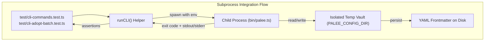

# Integration and Smoke Tests
<details>
<summary><b>Relevant Source Files</b></summary>

- [src/cli/adopt.ts](https://github.com/Kuldeep2822k/cli/blob/main/src/cli/adopt.ts)
- [src/cli/config.ts](https://github.com/Kuldeep2822k/cli/blob/main/src/cli/config.ts)
- [src/cli/dashboard.ts](https://github.com/Kuldeep2822k/cli/blob/main/src/cli/dashboard.ts)
- [src/cli/next.ts](https://github.com/Kuldeep2822k/cli/blob/main/src/cli/next.ts)
- [src/cli/plan.ts](https://github.com/Kuldeep2822k/cli/blob/main/src/cli/plan.ts)
- [src/cli/progress.ts](https://github.com/Kuldeep2822k/cli/blob/main/src/cli/progress.ts)
- [src/cli/review.ts](https://github.com/Kuldeep2822k/cli/blob/main/src/cli/review.ts)
- [src/cli/roadmap.ts](https://github.com/Kuldeep2822k/cli/blob/main/src/cli/roadmap.ts)
- [src/cli/session.ts](https://github.com/Kuldeep2822k/cli/blob/main/src/cli/session.ts)
- [src/index.ts](https://github.com/Kuldeep2822k/cli/blob/main/src/index.ts)
- [src/types.ts](https://github.com/Kuldeep2822k/cli/blob/main/src/types.ts)
- [test/cli-adopt-batch.test.ts](https://github.com/Kuldeep2822k/cli/blob/main/test/cli-adopt-batch.test.ts)
- [test/cli-commands.test.ts](https://github.com/Kuldeep2822k/cli/blob/main/test/cli-commands.test.ts)
- [test/cli-exit-codes.test.ts](https://github.com/Kuldeep2822k/cli/blob/main/test/cli-exit-codes.test.ts)
- [test/cli-json-output.test.ts](https://github.com/Kuldeep2822k/cli/blob/main/test/cli-json-output.test.ts)
- [test/session-cli.test.ts](https://github.com/Kuldeep2822k/cli/blob/main/test/session-cli.test.ts)
- [test/smoke.test.ts](https://github.com/Kuldeep2822k/cli/blob/main/test/smoke.test.ts)

</details>

Integration and smoke tests in PALEE ensure that the CLI commands, storage layer, engine algorithms, and process contracts function seamlessly as an integrated system. The suite is partitioned into **Subprocess Integration Tests** (executing the compiled or `tsx`-bootstrapped binary against isolated vault fixtures), **In-Process Stream Mocking Tests** (verifying exit codes and JSON contracts under intercepted standard I/O), and **Package Smoke Tests** (verifying distribution bundle exports).

---

## 1. CLI Subprocess Integration Tests

Subprocess integration tests spawn real child processes executing `bin/palee.ts` in isolated OS temporary directories. They verify end-to-end command execution, flag handling, environment variable redirection, and disk mutation.

### Command Pipeline Suite (`test/cli-commands.test.ts`)

Tests in `test/cli-commands.test.ts` (19 tests) exercise complete multi-command workflows:

- **Configuration Management**: Verifies `palee config set-vault <path>` creates `.palee/config.json` and updates the active vault path.
- **Topic Adoption & State Preservation**: Confirms `palee adopt` initializes note frontmatter (`palee_id`, `topic_mastery`, `due_at`, `repetition`), and subsequent `palee roadmap` imports never overwrite existing progress.
- **Review Progression**: Validates that `palee review <id> <score>` calculates new SM-2 intervals, advances due dates, updates mastery scores, and logs session history.
- **Vault Boundary Security**: Enforces sandbox isolation by verifying that attempting to access notes outside the vault via `../` path traversal exits with code 2.
- **Concurrency & OCC Conflicts**: Simulates concurrent modification collisions and asserts that mismatched fingerprints abort with exit code 4.

### Batch Adoption Suite (`test/cli-adopt-batch.test.ts`)

Tests in `test/cli-adopt-batch.test.ts` (9 tests) verify multi-note batch onboarding:

- **Directory Scoping & Recursive Discovery**: Verifies adopting entire directories (`palee adopt src/notes/`) or vaults (`palee adopt --all`).
- **Dry-Run Mode**: Asserts that `palee adopt --dry-run` reports planned adoptions without modifying any files on disk.
- **Safety Prompts & Non-Interactive Invariance**: Confirms that running batch adoption without `-y` / `--yes` in non-interactive environments aborts cleanly with exit code 2.
- **Pattern & Tag Filtering**: Validates `--tag <tag>`, `--include <glob>`, and `--exclude <glob>` filtering options.
- **Title Fallback Resolution**: Verifies title extraction hierarchy (frontmatter `title` $\rightarrow$ H1 header $\rightarrow$ filename).
- **Idempotency**: Asserts that already-adopted notes are detected and skipped without error or duplicate ID generation.



---

## 2. In-Process CLI & Stream Mocking Tests

In-process tests import command handlers directly (`adoptCommand`, `reviewCommand`, `nextCommand`, `sessionCommand`, etc.) and intercept `console.log`, `console.error`, and `process.exitCode`. This approach enables rapid, deterministic verification of output schemas, error channels, and exit code contracts.

### Deterministic Exit Code Matrix (`test/cli-exit-codes.test.ts`)

Tests in `test/cli-exit-codes.test.ts` (32 tests) systematically verify the 0–5 exit code contract across all commands:

| Exit Code | Classification | Trigger Scenarios Tested |
|:---:|---|---|
| **0** | Success | Command executed successfully and desired state achieved. |
| **2** | Usage / Validation Error | Missing required arguments, invalid flag combinations, batch adoption without `-y` in non-interactive shell, path traversal outside vault. |
| **3** | Schema / Graph Error | Unparseable YAML frontmatter, malformed roadmap files, circular dependency cycles detected in topic graph. |
| **4** | Concurrency Conflict | Optimistic Concurrency Control (OCC) fingerprint mismatch, active file lock collision. |
| **5** | Internal Runtime Error | Unexpected runtime exceptions, I/O filesystem permission errors. |

### Machine-Readable JSON Output (`test/cli-json-output.test.ts`)

Tests in `test/cli-json-output.test.ts` (22 tests) enforce Invariant #45 across all 11 CLI commands:

- **Schema Stability**: Verifies that every command supporting `--json` emits valid, parseable JSON conforming to documented TypeScript interfaces.
- **Empty State Resilience**: Ensures that uninitialized or empty vaults return structured JSON (with `null` fields or `[]` arrays) rather than crashing.
- **Error JSON Formatting**: Validates that errors under `--json` emit a structured payload `{ "error": "description" }` to stderr with appropriate exit codes.
- **Non-TTY Auto-JSON Detection**: Simulates piped environments (`process.stdout.isTTY = false`) and confirms that PALEE automatically activates JSON streaming without requiring the explicit `--json` flag.

### In-Process Session CLI Dispatch (`test/session-cli.test.ts`)

Tests in `test/session-cli.test.ts` (8 tests) exercise the active session command layer:

- **Topic Resolution Fallback**: Tests `resolveSessionTopic` resolution hierarchy: explicit CLI argument $\rightarrow$ `.palee/hot.md` active topic frontmatter $\rightarrow$ clean exit code 2 on failure.
- **Session Lifecycle**: Verifies `start`, `draft`, `end`, and `list` subcommands.
- **Unknown Action Handling**: Asserts that unmapped session actions set `process.exitCode = 2` with informative diagnostic messages.

```mermaid
flowchart TD
    subgraph InProcess ["In-Process Stream & Exit Code Interception"]
        InProcTest["test/cli-exit-codes.test.ts<br/>test/cli-json-output.test.ts<br/>test/session-cli.test.ts"]
        ConsoleLog["console.log Interceptor"]
        ConsoleErr["console.error Interceptor"]
        ExitCode["process.exitCode Tracker"]
        Handler["Command Handler (e.g. nextCommand)"]
    end

    InProcTest -->|mock streams| ConsoleLog
    InProcTest -->|mock streams| ConsoleErr
    InProcTest -->|invoke handler| Handler
    Handler -->|structured json| ConsoleLog
    Handler -->|error payload| ConsoleErr
    Handler -->|set exit code (0-5)| ExitCode
    ConsoleLog -->|parse JSON| InProcTest
    ExitCode -->|assert code| InProcTest
```

---

## 3. Package Smoke Tests

### Build & Export Parity (`test/smoke.test.ts`)

Tests in `test/smoke.test.ts` (2 tests) provide lightweight sanity verification for package artifacts:

- **Module Loading**: Confirms that the top-level package export (`src/index.ts`) loads cleanly without syntax or import errors.
- **Version Parity**: Asserts that the exported `version` constant strictly matches the `version` field defined in `package.json`.

---

## Master Command Integration Matrix

| Command | Subprocess Tests (`cli-commands`, `cli-adopt-batch`) | In-Process Exit Codes (`cli-exit-codes`) | JSON Contract Tests (`cli-json-output`) |
|---|:---:|:---:|:---:|
| `palee config` | ✅ | ✅ (Codes 0, 2) | ✅ (`config --json`) |
| `palee adopt` | ✅ | ✅ (Codes 0, 2, 4) | ✅ (`adopt --json`) |
| `palee roadmap` | ✅ | ✅ (Codes 0, 2, 3, 4) | ✅ (`roadmap --json`) |
| `palee review` | ✅ | ✅ (Codes 0, 2, 4) | ✅ (`review --json`) |
| `palee next` | ✅ | ✅ (Codes 0, 2) | ✅ (`next --json`) |
| `palee plan` | ✅ | ✅ (Codes 0, 2) | ✅ (`plan --json`) |
| `palee progress`| ✅ | ✅ (Codes 0, 2) | ✅ (`progress --json`) |
| `palee dashboard`| ✅ | ✅ (Codes 0, 2) | ✅ (`dashboard --json`) |
| `palee session` | ✅ | ✅ (Codes 0, 2) | ✅ (`session --json`) |
| `palee verify`  | ✅ | ✅ (Codes 0, 2, 3) | ✅ (`verify --json`) |
| `palee doctor`  | ✅ | ✅ (Codes 0, 2) | ✅ (`doctor --json`) |