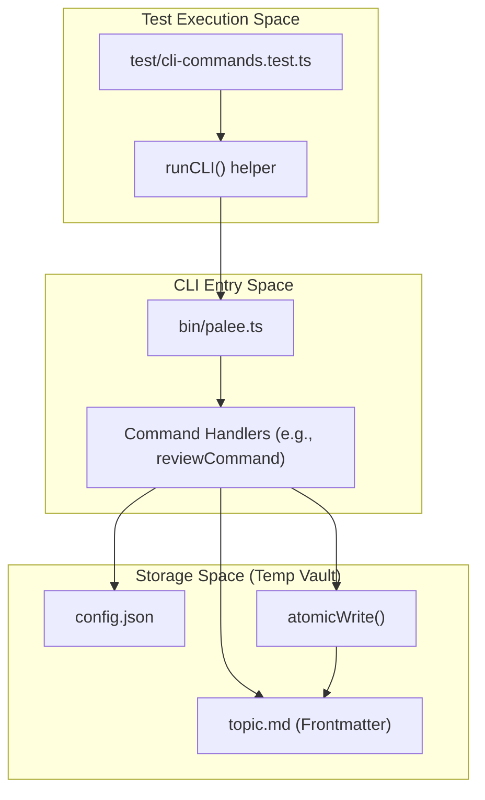
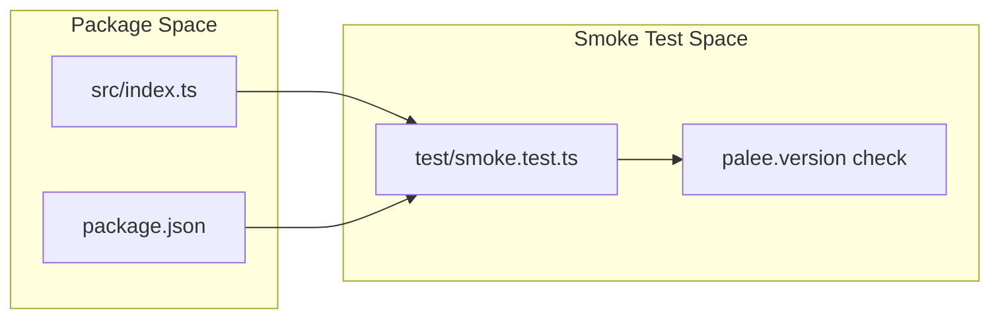

# Integration and Smoke Tests
Relevant source files

- [src/cli/config.ts](https://github.com/Kuldeep2822k/cli/blob/e8b70e0d/src/cli/config.ts)
- [src/cli/review.ts](https://github.com/Kuldeep2822k/cli/blob/e8b70e0d/src/cli/review.ts)
- [test/cli-commands.test.ts](https://github.com/Kuldeep2822k/cli/blob/e8b70e0d/test/cli-commands.test.ts)
- [test/cli-json-output.test.ts](https://github.com/Kuldeep2822k/cli/blob/e8b70e0d/test/cli-json-output.test.ts)
- [test/smoke.test.ts](https://github.com/Kuldeep2822k/cli/blob/e8b70e0d/test/smoke.test.ts)

Integration and smoke tests in PALEE ensure that the CLI commands, storage layer, and engine core function correctly as a unified system. These tests exercise full command pipelines against temporary file system fixtures, verifying end-to-end behavior, data persistence, and machine-readable output contracts.

## Integration Test Infrastructure

Integration tests use the native Node.js test runner and `tsx` to execute the CLI entry point (`bin/palee.ts`) in a controlled environment. Isolation is achieved by overriding the `PALEE_CONFIG_DIR` environment variable, which redirects configuration and vault discovery to a temporary directory.

### Test Fixture Lifecycle

The `test/cli-commands.test.ts` suite implements a standard setup and teardown pattern to ensure test hermeticity:

1. Setup (`before`): Creates a unique temporary directory using `fs.mkdtempSync` and initializes a `vault` subdirectory within it [test/cli-commands.test.ts#13-17](https://github.com/Kuldeep2822k/cli/blob/e8b70e0d/test/cli-commands.test.ts#L13-L17)
2. Execution (`runCLI`): A helper function wraps `execSync` to invoke the CLI. It passes `PALEE_CONFIG_DIR` in the environment to prevent the tests from affecting the developer's actual PALEE configuration [test/cli-commands.test.ts#23-35](https://github.com/Kuldeep2822k/cli/blob/e8b70e0d/test/cli-commands.test.ts#L23-L35)
3. Teardown (`after`): Recursively removes the temporary directory and all generated artifacts [test/cli-commands.test.ts#19-21](https://github.com/Kuldeep2822k/cli/blob/e8b70e0d/test/cli-commands.test.ts#L19-L21)

### Data Flow: CLI Integration

The following diagram illustrates how the integration tests bridge the gap between high-level command execution and the underlying storage entities.

CLI Command Integration Flow

Sources:[test/cli-commands.test.ts#23-35](https://github.com/Kuldeep2822k/cli/blob/e8b70e0d/test/cli-commands.test.ts#L23-L35)[src/cli/review.ts#90-93](https://github.com/Kuldeep2822k/cli/blob/e8b70e0d/src/cli/review.ts#L90-L93)[src/cli/config.ts#12-25](https://github.com/Kuldeep2822k/cli/blob/e8b70e0d/src/cli/config.ts#L12-L25)

---

## Command Pipeline Verification

Integration tests verify specific business logic invariants across multiple command calls.

### Topic Lifecycle and State Preservation

Tests verify that `palee adopt` correctly initializes frontmatter and that subsequent `palee roadmap` imports do not overwrite user-generated progress data (e.g., mastery scores or SM-2 intervals) [test/cli-commands.test.ts#51-64](https://github.com/Kuldeep2822k/cli/blob/e8b70e0d/test/cli-commands.test.ts#L51-L64)[test/cli-commands.test.ts#136-142](https://github.com/Kuldeep2822k/cli/blob/e8b70e0d/test/cli-commands.test.ts#L136-L142)

### Security and Path Validation

Integration tests enforce the "Vault Safety Contract" by attempting to access files outside the vault boundaries. For example, `palee adopt` and `palee roadmap` are tested to ensure they reject paths that escape the vault via `../` traversal [test/cli-commands.test.ts#66-72](https://github.com/Kuldeep2822k/cli/blob/e8b70e0d/test/cli-commands.test.ts#L66-L72)[test/cli-commands.test.ts#101-104](https://github.com/Kuldeep2822k/cli/blob/e8b70e0d/test/cli-commands.test.ts#L101-L104)

### SM-2 Update Logic

The `review` command is tested to ensure that providing a quality score (0-5) correctly updates the `due_at` and `ease_factor` fields in the Markdown frontmatter while leaving assessment pillars (conceptual, practical, etc.) untouched [test/cli-commands.test.ts#144-164](https://github.com/Kuldeep2822k/cli/blob/e8b70e0d/test/cli-commands.test.ts#L144-L164)

| Test Case | Command | Input | Expected Outcome |
| --- | --- | --- | --- |
| Vault Setup | `config set-vault` | Valid Dir | Exit 0, `config.json` updated |
| Vault Security | `adopt` | `../secret.md` | Exit 2, Stderr "escapes vault" |
| Review Logic | `review` | `ID 4` | `due_at` updated, `repetition` incremented |
| Empty State | `dashboard` | Empty Vault | Onboarding guidance displayed |

Sources:[test/cli-commands.test.ts#37-41](https://github.com/Kuldeep2822k/cli/blob/e8b70e0d/test/cli-commands.test.ts#L37-L41)[test/cli-commands.test.ts#69-72](https://github.com/Kuldeep2822k/cli/blob/e8b70e0d/test/cli-commands.test.ts#L69-L72)[test/cli-commands.test.ts#146-164](https://github.com/Kuldeep2822k/cli/blob/e8b70e0d/test/cli-commands.test.ts#L146-L164)[test/cli-commands.test.ts#180-186](https://github.com/Kuldeep2822k/cli/blob/e8b70e0d/test/cli-commands.test.ts#L180-L186)

---

## Machine-Readable Output Tests

The `test/cli-json-output.test.ts` suite ensures that all commands supporting the `--json` flag adhere to a stable schema. This is critical for external integrations (e.g., Obsidian plugins or shell scripts).

### Mocking Console Output

Unlike the main integration tests that use `execSync`, the JSON tests import command handlers directly and mock `console.log` and `console.error` to capture and parse the output buffer [test/cli-json-output.test.ts#31-38](https://github.com/Kuldeep2822k/cli/blob/e8b70e0d/test/cli-json-output.test.ts#L31-L38)

### JSON Schema Invariants

- Empty Vaults: Commands like `next --json` or `plan --json` must return valid JSON structures with nulls or empty arrays rather than failing [test/cli-json-output.test.ts#87-110](https://github.com/Kuldeep2822k/cli/blob/e8b70e0d/test/cli-json-output.test.ts#L87-L110)
- Error Handling: If a vault is not configured, the command must emit a JSON object containing an `error` key and exit with code 2 [test/cli-json-output.test.ts#69-75](https://github.com/Kuldeep2822k/cli/blob/e8b70e0d/test/cli-json-output.test.ts#L69-L75)
- Data Integrity: Fields like `topic_mastery` are verified to be numbers (not strings) and dates are verified to be ISO strings [test/cli-json-output.test.ts#191-199](https://github.com/Kuldeep2822k/cli/blob/e8b70e0d/test/cli-json-output.test.ts#L191-L199)

Sources:[test/cli-json-output.test.ts#56-66](https://github.com/Kuldeep2822k/cli/blob/e8b70e0d/test/cli-json-output.test.ts#L56-L66)[test/cli-json-output.test.ts#87-93](https://github.com/Kuldeep2822k/cli/blob/e8b70e0d/test/cli-json-output.test.ts#L87-L93)

---

## Smoke Tests

Smoke tests in `test/smoke.test.ts` provide a lightweight verification that the project's build artifacts are valid and the package structure is correct.

Build Artifact Verification

### Key Verifications

- Module Loading: Ensures that the `palee` module can be imported without syntax errors [test/smoke.test.ts#7-8](https://github.com/Kuldeep2822k/cli/blob/e8b70e0d/test/smoke.test.ts#L7-L8)
- Version Consistency: Verifies that the exported `version` string from the source code matches the version defined in `package.json`[test/smoke.test.ts#13-16](https://github.com/Kuldeep2822k/cli/blob/e8b70e0d/test/smoke.test.ts#L13-L16)

Sources:[test/smoke.test.ts#7-11](https://github.com/Kuldeep2822k/cli/blob/e8b70e0d/test/smoke.test.ts#L7-L11)[test/smoke.test.ts#13-16](https://github.com/Kuldeep2822k/cli/blob/e8b70e0d/test/smoke.test.ts#L13-L16)