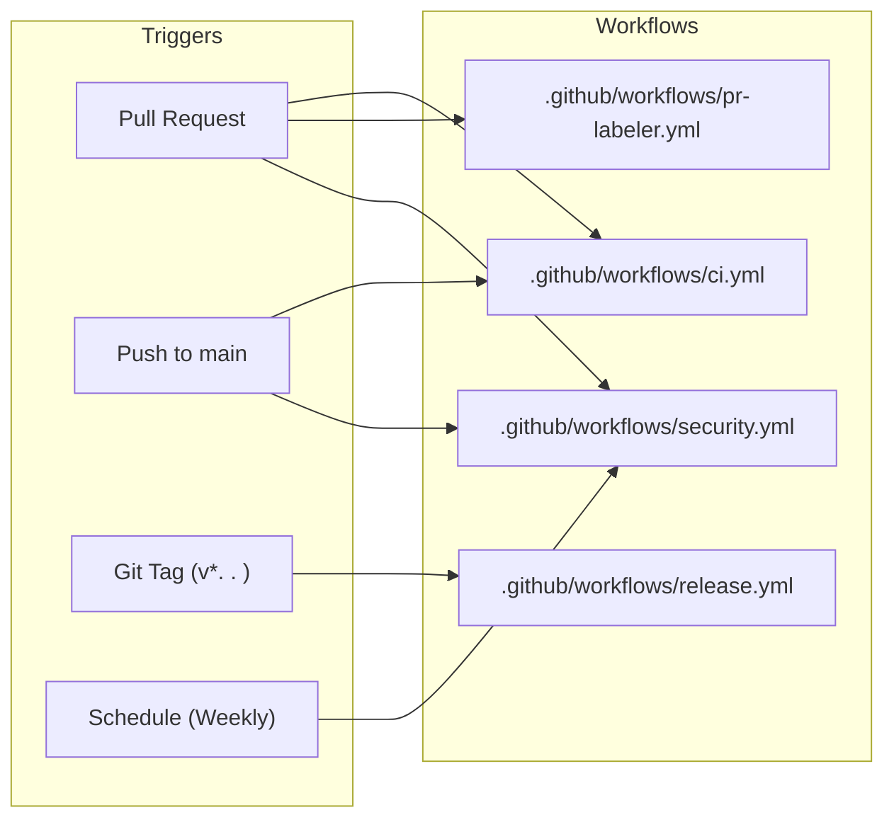
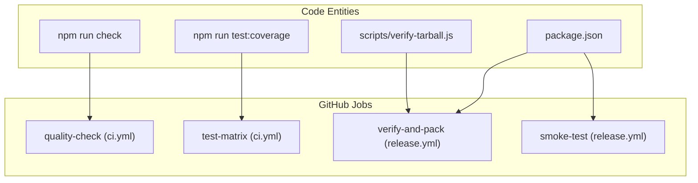

# CI/CD and Release Pipeline
Relevant source files

- [.c8rc.json](https://github.com/Kuldeep2822k/cli/blob/e8b70e0d/.c8rc.json)
- [.github/labeler.yml](https://github.com/Kuldeep2822k/cli/blob/e8b70e0d/.github/labeler.yml)
- [.github/labels.yml](https://github.com/Kuldeep2822k/cli/blob/e8b70e0d/.github/labels.yml)
- [.github/workflows/ci.yml](https://github.com/Kuldeep2822k/cli/blob/e8b70e0d/.github/workflows/ci.yml)
- [.github/workflows/pr-labeler.yml](https://github.com/Kuldeep2822k/cli/blob/e8b70e0d/.github/workflows/pr-labeler.yml)
- [.github/workflows/release.yml](https://github.com/Kuldeep2822k/cli/blob/e8b70e0d/.github/workflows/release.yml)
- [.github/workflows/security.yml](https://github.com/Kuldeep2822k/cli/blob/e8b70e0d/.github/workflows/security.yml)
- [.github/workflows/sync-labels.yml](https://github.com/Kuldeep2822k/cli/blob/e8b70e0d/.github/workflows/sync-labels.yml)
- [LICENSE](https://github.com/Kuldeep2822k/cli/blob/e8b70e0d/LICENSE)
- [eslint.config.mjs](https://github.com/Kuldeep2822k/cli/blob/e8b70e0d/eslint.config.mjs)

This section provides a high-level overview of the automated workflows that govern the PALEE codebase. The project utilizes GitHub Actions to enforce code quality, manage repository organization, ensure security invariants, and orchestrate multi-platform releases to the NPM registry.

## Pipeline Architecture

The automation strategy is divided into three primary phases: Continuous Integration (quality and correctness), Security & Maintenance (auditing and labeling), and Continuous Delivery (versioning and distribution).

### Workflow Orchestration

The following diagram illustrates the relationship between repository events and the resulting GitHub Action workflows.

Workflow Event Mapping

Sources:

- [.github/workflows/ci.yml#3-10](https://github.com/Kuldeep2822k/cli/blob/e8b70e0d/.github/workflows/ci.yml#L3-L10)
- [.github/workflows/release.yml#3-7](https://github.com/Kuldeep2822k/cli/blob/e8b70e0d/.github/workflows/release.yml#L3-L7)
- [.github/workflows/security.yml#3-13](https://github.com/Kuldeep2822k/cli/blob/e8b70e0d/.github/workflows/security.yml#L3-L13)
- [.github/workflows/pr-labeler.yml#3-5](https://github.com/Kuldeep2822k/cli/blob/e8b70e0d/.github/workflows/pr-labeler.yml#L3-L5)

---

## Continuous Integration (CI)

The CI pipeline is designed to be fast and comprehensive, running on every Pull Request and push to the `main` branch. It utilizes a test matrix to ensure compatibility across Node.js versions (22.x, 24.x) and Operating Systems (Ubuntu, Windows, macOS).

Key responsibilities include:

- Static Analysis: Execution of `npm run check` which combines ESLint for linting and `tsc` for strict type checking [.github/workflows/ci.yml#33-34](https://github.com/Kuldeep2822k/cli/blob/e8b70e0d/.github/workflows/ci.yml#L33-L34)
- Testing & Coverage: Running the full invariant test suite with `c8` for coverage reporting [.github/workflows/ci.yml#65-66](https://github.com/Kuldeep2822k/cli/blob/e8b70e0d/.github/workflows/ci.yml#L65-L66)
- Smoke Installation: Building a production tarball and performing a global `npm install` to verify the CLI binary (`palee`) functions correctly in a clean environment [.github/workflows/ci.yml#75-131](https://github.com/Kuldeep2822k/cli/blob/e8b70e0d/.github/workflows/ci.yml#L75-L131)

For detailed information on the CI configuration and coverage thresholds, see [Continuous Integration](./07-1-continuous-integration.md).

Sources:

- [.github/workflows/ci.yml#17-144](https://github.com/Kuldeep2822k/cli/blob/e8b70e0d/.github/workflows/ci.yml#L17-L144)
- [.c8rc.json#1-13](https://github.com/Kuldeep2822k/cli/blob/e8b70e0d/.c8rc.json#L1-L13)
- [eslint.config.mjs#1-30](https://github.com/Kuldeep2822k/cli/blob/e8b70e0d/eslint.config.mjs#L1-L30)

---

## Release and NPM Publishing

The release pipeline is a strictly controlled, idempotent process triggered by Git tags. It enforces a "Build Once, Deploy Everywhere" philosophy by packing the library into a tarball and promoting that specific artifact through verification steps.

### Release Safety Checks

The pipeline implements several guardrails to prevent broken releases:

1. Version Consistency: The Git tag must exactly match the version defined in `package.json`[.github/workflows/release.yml#30-38](https://github.com/Kuldeep2822k/cli/blob/e8b70e0d/.github/workflows/release.yml#L30-L38)
2. Artifact Validation: The `scripts/verify-tarball.js` script is executed against the generated `.tgz` to ensure no critical files (like `dist/`) are missing [.github/workflows/release.yml#67-68](https://github.com/Kuldeep2822k/cli/blob/e8b70e0d/.github/workflows/release.yml#L67-L68)
3. Idempotency: Before publishing, the workflow checks the NPM registry via `npm view` to see if the version already exists, preventing failed "already published" errors [.github/workflows/release.yml#100-109](https://github.com/Kuldeep2822k/cli/blob/e8b70e0d/.github/workflows/release.yml#L100-L109)
4. Windows Smoke Test: After publishing, the workflow waits for registry propagation and attempts a global install on a Windows runner to verify cross-platform binary availability [.github/workflows/release.yml#140-179](https://github.com/Kuldeep2822k/cli/blob/e8b70e0d/.github/workflows/release.yml#L140-L179)

For a deep dive into the publishing logic and artifact verification, see [Release Workflow and NPM Publishing](./07-2-release-workflow-and-npm-publishing.md).

Sources:

- [.github/workflows/release.yml#1-179](https://github.com/Kuldeep2822k/cli/blob/e8b70e0d/.github/workflows/release.yml#L1-L179)

---

## Security and Governance

PALEE maintains strict security invariants, particularly regarding native dependencies.

### Native Module Guardrail

A custom security job in `security.yml` scans the production dependency tree to ensure zero native binaries or toolchains (e.g., `node-gyp`, `napi-rs`) are included [.github/workflows/security.yml#46-101](https://github.com/Kuldeep2822k/cli/blob/e8b70e0d/.github/workflows/security.yml#L46-L101) This preserves the project's goal of being a lightweight, pure-JS/TS CLI tool.

### Repository Management

- Label Synchronization: The project uses a declarative `labels.yml` file to manage GitHub labels, synchronized via `sync-labels.yml`[.github/workflows/sync-labels.yml#1-30](https://github.com/Kuldeep2822k/cli/blob/e8b70e0d/.github/workflows/sync-labels.yml#L1-L30)
- Automated Labeling: Pull Requests are automatically categorized (e.g., `core`, `tests`, `build`) based on the file paths modified, using the `actions/labeler`[.github/workflows/pr-labeler.yml#1-19](https://github.com/Kuldeep2822k/cli/blob/e8b70e0d/.github/workflows/pr-labeler.yml#L1-L19)

Sources:

- [.github/workflows/security.yml#21-101](https://github.com/Kuldeep2822k/cli/blob/e8b70e0d/.github/workflows/security.yml#L21-L101)
- [.github/labels.yml#1-79](https://github.com/Kuldeep2822k/cli/blob/e8b70e0d/.github/labels.yml#L1-L79)
- [.github/labeler.yml#1-38](https://github.com/Kuldeep2822k/cli/blob/e8b70e0d/.github/labeler.yml#L1-L38)

---

## Code-to-Workflow Mapping

This diagram maps specific codebase entities (scripts and config files) to the high-level workflow jobs that consume them.

Entity Relationship Diagram

Sources:

- [.github/workflows/ci.yml#34-66](https://github.com/Kuldeep2822k/cli/blob/e8b70e0d/.github/workflows/ci.yml#L34-L66)
- [.github/workflows/release.yml#34-68](https://github.com/Kuldeep2822k/cli/blob/e8b70e0d/.github/workflows/release.yml#L34-L68)
- [.github/workflows/release.yml#169-170](https://github.com/Kuldeep2822k/cli/blob/e8b70e0d/.github/workflows/release.yml#L169-L170)