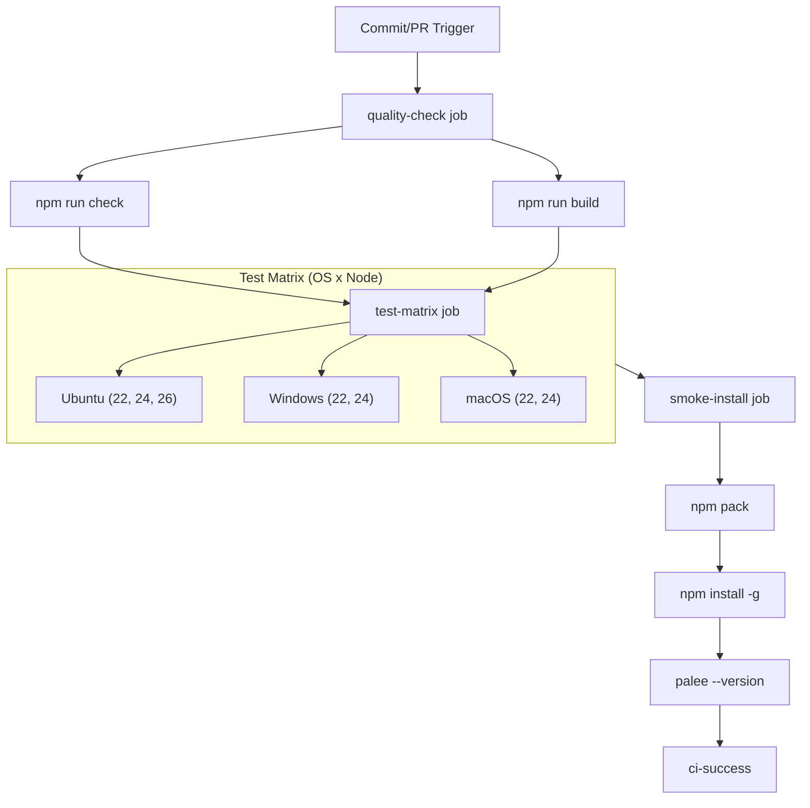
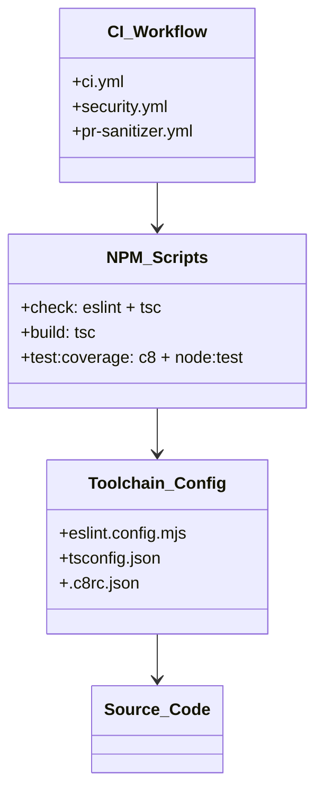

# Continuous Integration
Relevant source files

- [.c8rc.json](https://github.com/Kuldeep2822k/cli/blob/main/.c8rc.json)
- [.github/PULL_REQUEST_TEMPLATE.md](https://github.com/Kuldeep2822k/cli/blob/main/.github/PULL_REQUEST_TEMPLATE.md?plain=1)
- [.github/dependabot.yml](https://github.com/Kuldeep2822k/cli/blob/main/.github/dependabot.yml)
- [.github/labeler.yml](https://github.com/Kuldeep2822k/cli/blob/main/.github/labeler.yml)
- [.github/labels.yml](https://github.com/Kuldeep2822k/cli/blob/main/.github/labels.yml)
- [.github/workflows/ci.yml](https://github.com/Kuldeep2822k/cli/blob/main/.github/workflows/ci.yml)
- [.github/workflows/pr-labeler.yml](https://github.com/Kuldeep2822k/cli/blob/main/.github/workflows/pr-labeler.yml)
- [.github/workflows/pr-sanitizer.yml](https://github.com/Kuldeep2822k/cli/blob/main/.github/workflows/pr-sanitizer.yml)
- [.github/workflows/security.yml](https://github.com/Kuldeep2822k/cli/blob/main/.github/workflows/security.yml)
- [.github/workflows/sync-labels.yml](https://github.com/Kuldeep2822k/cli/blob/main/.github/workflows/sync-labels.yml)
- [LICENSE](https://github.com/Kuldeep2822k/cli/blob/main/LICENSE)
- [eslint.config.mjs](https://github.com/Kuldeep2822k/cli/blob/main/eslint.config.mjs)

The PALEE Continuous Integration (CI) infrastructure ensures code quality, cross-platform compatibility, and security through automated workflows. The pipeline validates every commit and Pull Request (PR) against strict linting rules, type checks, unit tests, and smoke tests across Linux, Windows, and macOS.

## CI Workflow Implementation

The primary CI pipeline is defined in `.github/workflows/ci.yml` and is triggered on pushes and pull requests to the `main` branch [.github/workflows/ci.yml#3-10](https://github.com/Kuldeep2822k/cli/blob/main/.github/workflows/ci.yml#L3-L10) It utilizes a concurrency group to cancel in-progress runs for the same PR, optimizing resource usage [.github/workflows/ci.yml#12-14](https://github.com/Kuldeep2822k/cli/blob/main/.github/workflows/ci.yml#L12-L14)

### 1. Quality Check Job

This job performs static analysis and build verification on `ubuntu-latest` using Node.js 24.x [.github/workflows/ci.yml#17-27](https://github.com/Kuldeep2822k/cli/blob/main/.github/workflows/ci.yml#L17-L27)

- Lint & Typecheck: Executes `npm run check`, which combines ESLint rules and TypeScript strict type checking [.github/workflows/ci.yml#33-34](https://github.com/Kuldeep2822k/cli/blob/main/.github/workflows/ci.yml#L33-L34)
- Production Build: Runs `npm run build` to ensure the project can be bundled without errors [.github/workflows/ci.yml#36-37](https://github.com/Kuldeep2822k/cli/blob/main/.github/workflows/ci.yml#L36-L37)

### 2. Test Matrix Job

To ensure the CLI remains stable across environments, the `test-matrix` job runs the unit and invariant test suites across multiple operating systems and Node.js versions [.github/workflows/ci.yml#39-49](https://github.com/Kuldeep2822k/cli/blob/main/.github/workflows/ci.yml#L39-L49)

| Environment | Versions | Condition |
| --- | --- | --- |
| Ubuntu | 22.x, 24.x, 26.x | 26.x excluded on PRs |
| Windows | 22.x, 24.x |  |
| macOS | 22.x, 24.x | Excluded on PRs |

- Coverage: Tests are executed via `npm run test:coverage`[.github/workflows/ci.yml#65-66](https://github.com/Kuldeep2822k/cli/blob/main/.github/workflows/ci.yml#L65-L66)
- PR Coverage Guard: For PRs on Ubuntu/Node 24.x, the `diff-cover` tool ensures that new or changed code maintains at least 50% coverage relative to `origin/main`[.github/workflows/ci.yml#68-73](https://github.com/Kuldeep2822k/cli/blob/main/.github/workflows/ci.yml#L68-L73)

### 3. Global Smoke Test

The `smoke-install` job verifies the integrity of the NPM package by simulating a global installation [.github/workflows/ci.yml#75-81](https://github.com/Kuldeep2822k/cli/blob/main/.github/workflows/ci.yml#L75-L81)

1. Pack: Creates a `.tgz` tarball using `npm pack`[.github/workflows/ci.yml#97-109](https://github.com/Kuldeep2822k/cli/blob/main/.github/workflows/ci.yml#L97-L109)
2. Verify: Runs `scripts/verify-tarball.js` to assert the contents of the package [.github/workflows/ci.yml#111-113](https://github.com/Kuldeep2822k/cli/blob/main/.github/workflows/ci.yml#L111-L113)
3. Install: Installs the CLI globally from the local tarball [.github/workflows/ci.yml#115-116](https://github.com/Kuldeep2822k/cli/blob/main/.github/workflows/ci.yml#L115-L116)
4. Version Match: Compares `palee --version` output against the `package.json` version [.github/workflows/ci.yml#118-127](https://github.com/Kuldeep2822k/cli/blob/main/.github/workflows/ci.yml#L118-L127)

### Data Flow: CI Pipeline Execution

The following diagram illustrates the progression of a commit through the CI pipeline.

CI Pipeline Logic Flow

Sources:[.github/workflows/ci.yml#16-144](https://github.com/Kuldeep2822k/cli/blob/main/.github/workflows/ci.yml#L16-L144)

## PR Automation and Hygiene

### Labeling and Sanitization

The repository uses automated labeling to categorize changes and enforce contribution standards.

- PR Sanitizer: Validates that PR titles follow the Conventional Commits specification (e.g., `feat:`, `fix:`, `chore:`) [.github/workflows/pr-sanitizer.yml#12-36](https://github.com/Kuldeep2822k/cli/blob/main/.github/workflows/pr-sanitizer.yml#L12-L36)
- PR Labeler: Automatically assigns labels based on the file paths modified (e.g., `core` for `src/**/*`, `tests` for `test/**/*`) [.github/workflows/pr-labeler.yml#1-19](https://github.com/Kuldeep2822k/cli/blob/main/.github/workflows/pr-labeler.yml#L1-L19)[.github/labeler.yml#1-38](https://github.com/Kuldeep2822k/cli/blob/main/.github/labeler.yml#L1-L38)
- Label Sync: The `sync-labels.yml` workflow ensures the repository's label set matches the definitions in `.github/labels.yml`[.github/workflows/sync-labels.yml#1-30](https://github.com/Kuldeep2822k/cli/blob/main/.github/workflows/sync-labels.yml#L1-L30)

### Dependabot Configuration

Dependabot is configured to perform weekly updates for both `npm` dependencies and `github-actions`[.github/dependabot.yml#1-43](https://github.com/Kuldeep2822k/cli/blob/main/.github/dependabot.yml#L1-L43) It groups production and development updates to minimize PR noise and applies the `dependencies` or `ci` labels automatically [.github/dependabot.yml#21-32](https://github.com/Kuldeep2822k/cli/blob/main/.github/dependabot.yml#L21-L32)

Sources:[.github/workflows/pr-sanitizer.yml#1-36](https://github.com/Kuldeep2822k/cli/blob/main/.github/workflows/pr-sanitizer.yml#L1-L36)[.github/workflows/pr-labeler.yml#1-19](https://github.com/Kuldeep2822k/cli/blob/main/.github/workflows/pr-labeler.yml#L1-L19)[.github/labeler.yml#1-38](https://github.com/Kuldeep2822k/cli/blob/main/.github/labeler.yml#L1-L38)[.github/dependabot.yml#1-43](https://github.com/Kuldeep2822k/cli/blob/main/.github/dependabot.yml#L1-L43)

## Security and Invariants

### Supply-Chain Security & 40-Character Commit SHA Pinning

To safeguard against supply-chain poisoning and mutable tag hijacking (where a compromised repository tag like `@v4` or `@v7` delivers malicious payloads), all PALEE GitHub Actions workflows strictly enforce **full 40-character commit SHA pinning** with descriptive inline semantic version comments.

#### Master Workflow Pinning Audit

| Workflow File | Action Name | Pinned Commit SHA (40-char) | Comment Tag | Purpose |
|---|---|---|---|---|
| `.github/workflows/ci.yml` | `actions/checkout` | `3d3c42e5aac5ba805825da76410c181273ba90b1` | `# v7.0.1` | Hermetic code checkout |
| `.github/workflows/ci.yml` | `actions/setup-node` | `820762786026740c76f36085b0efc47a31fe5020` | `# v7.0.0` | Node.js runtime initialization |
| `.github/workflows/deploy-docs.yml` | `actions/checkout` | `3d3c42e5aac5ba805825da76410c181273ba90b1` | `# v7.0.1` | Docs source checkout |
| `.github/workflows/deploy-docs.yml` | `actions/setup-node` | `820762786026740c76f36085b0efc47a31fe5020` | `# v7.0.0` | Docs build Node setup |
| `.github/workflows/deploy-docs.yml` | `actions/configure-pages` | `983d7736d9b0ae728b81ab479565c72886d7745b` | `# v5.0.0` | GitHub Pages configuration |
| `.github/workflows/deploy-docs.yml` | `actions/upload-pages-artifact` | `fc324d3547104276b827a68afc52ff2a11cc49c9` | `# v5.0.0` | VitePress HTML artifact upload |
| `.github/workflows/deploy-docs.yml` | `actions/deploy-pages` | `d6db90164ac5ed86f2b6aed7e0febac5b3c0c03e` | `# v4.0.5` | Pages deployment |
| `.github/workflows/release.yml` | `actions/checkout` | `3d3c42e5aac5ba805825da76410c181273ba90b1` | `# v7.0.1` | Release checkout |
| `.github/workflows/release.yml` | `actions/setup-node` | `820762786026740c76f36085b0efc47a31fe5020` | `# v7.0.0` | NPM pack & publish Node setup |
| `.github/workflows/release.yml` | `actions/upload-artifact` | `043fb46d1a93c77aae656e7c1c64a875d1fc6a0a` | `# v7.0.1` | Stash release tarball |
| `.github/workflows/release.yml` | `actions/download-artifact` | `3e5f45b2cfb9172054b4087a40e8e0b5a5461e7c` | `# v8.0.1` | Fetch verified tarball |
| `.github/workflows/release.yml` | `softprops/action-gh-release` | `3d0d9888cb7fd7b750713d6e236d1fcb99157228` | `# v3.0.2` | Publish GitHub release & assets |
| `.github/workflows/security.yml` | `actions/checkout` | `3d3c42e5aac5ba805825da76410c181273ba90b1` | `# v7.0.1` | Security scanner checkout |
| `.github/workflows/security.yml` | `actions/setup-node` | `820762786026740c76f36085b0efc47a31fe5020` | `# v7.0.0` | Security scanner Node setup |
| `.github/workflows/pr-labeler.yml` | `actions/labeler` | `8558be74a3edee8416ec1b285b0266ef6101c13d` | `# v5.0.0` | PR categorization |
| `.github/workflows/sync-labels.yml` | `actions/checkout` | `3d3c42e5aac5ba805825da76410c181273ba90b1` | `# v7.0.1` | Label sync checkout |
| `.github/workflows/sync-labels.yml` | `crazy-max/ghaction-github-labeler` | `de749f56396740be8be9ec88cb7ef31e405a3064` | `# v5.2.0` | Sync labels from YAML |

#### Dependabot Automated Maintenance

As configured in `.github/dependabot.yml` (`package-ecosystem: "github-actions"`), Dependabot automatically scans for new action releases weekly. When an upstream action publishes an update, Dependabot generates a Pull Request updating the 40-character commit SHA while preserving the human-readable `# vX.Y.Z` inline version comment.

### Native Module Guardrail

A critical security invariant in PALEE is the exclusion of native binaries from the production dependency tree to ensure cross-platform portability and reduce attack surface. The `security.yml` workflow enforces this via a custom script [.github/workflows/security.yml#46-101](https://github.com/Kuldeep2822k/cli/blob/main/.github/workflows/security.yml#L46-L101)

- Banned Toolchains: Detects packages like `node-gyp`, `napi-rs`, or `prebuild-install`[.github/workflows/security.yml#53-56](https://github.com/Kuldeep2822k/cli/blob/main/.github/workflows/security.yml#L53-L56)
- Banned Extensions: Scans `node_modules` for `.node`, `.so`, `.dylib`, `.dll`, and `.exe` files [.github/workflows/security.yml#57-98](https://github.com/Kuldeep2822k/cli/blob/main/.github/workflows/security.yml#L57-L98)

### Vulnerability Auditing

- Production Audit: Triggered on every PR to check for high-severity vulnerabilities in production dependencies using `npm audit --omit=dev`[.github/workflows/security.yml#38-40](https://github.com/Kuldeep2822k/cli/blob/main/.github/workflows/security.yml#L38-L40)
- Full Audit: A weekly scheduled scan covering both production and development dependencies [.github/workflows/security.yml#42-44](https://github.com/Kuldeep2822k/cli/blob/main/.github/workflows/security.yml#L42-L44)

Sources:[.github/workflows/security.yml#1-101](https://github.com/Kuldeep2822k/cli/blob/main/.github/workflows/security.yml#L1-L101)

## Toolchain Setup

### ESLint and TypeScript

The project uses `typescript-eslint` for static analysis. The configuration in `eslint.config.mjs` applies recommended rules while providing specific overrides for the CLI environment [.eslint.config.mjs#4-30](https://github.com/Kuldeep2822k/cli/blob/main/.eslint.config.mjs#L4-L30)

- Global Variables: Defines `process`, `require`, and `setTimeout` as available globals for the Node.js runtime [.eslint.config.mjs#12-19](https://github.com/Kuldeep2822k/cli/blob/main/.eslint.config.mjs#L12-L19)
- Rule Overrides: Relaxes certain rules like `@typescript-eslint/no-explicit-any` and `no-unused-vars` to facilitate rapid development in specific contexts, though the PR template encourages zero `any` casts in `src/`[.eslint.config.mjs#21-28](https://github.com/Kuldeep2822k/cli/blob/main/.eslint.config.mjs#L21-L28)[.github/PULL_REQUEST_TEMPLATE.md#18](https://github.com/Kuldeep2822k/cli/blob/main/.github/PULL_REQUEST_TEMPLATE.md?plain=1#L18-L18)

### Coverage Configuration

Code coverage is managed by `c8` with thresholds defined in `.c8rc.json`[.c8rc.json#1-12](https://github.com/Kuldeep2822k/cli/blob/main/.c8rc.json#L1-L12)

- Inclusions: Targets all `.ts` files within the `src` directory [.c8rc.json#3-4](https://github.com/Kuldeep2822k/cli/blob/main/.c8rc.json#L3-L4)
- Thresholds: Enforces a minimum of 60% line/statement coverage and 75% function coverage [.c8rc.json#8-11](https://github.com/Kuldeep2822k/cli/blob/main/.c8rc.json#L8-L11)

Toolchain Entity Mapping

Sources:[eslint.config.mjs#1-30](https://github.com/Kuldeep2822k/cli/blob/main/eslint.config.mjs#L1-L30)[.c8rc.json#1-12](https://github.com/Kuldeep2822k/cli/blob/main/.c8rc.json#L1-L12)[.github/PULL_REQUEST_TEMPLATE.md#13-19](https://github.com/Kuldeep2822k/cli/blob/main/.github/PULL_REQUEST_TEMPLATE.md?plain=1#L13-L19)