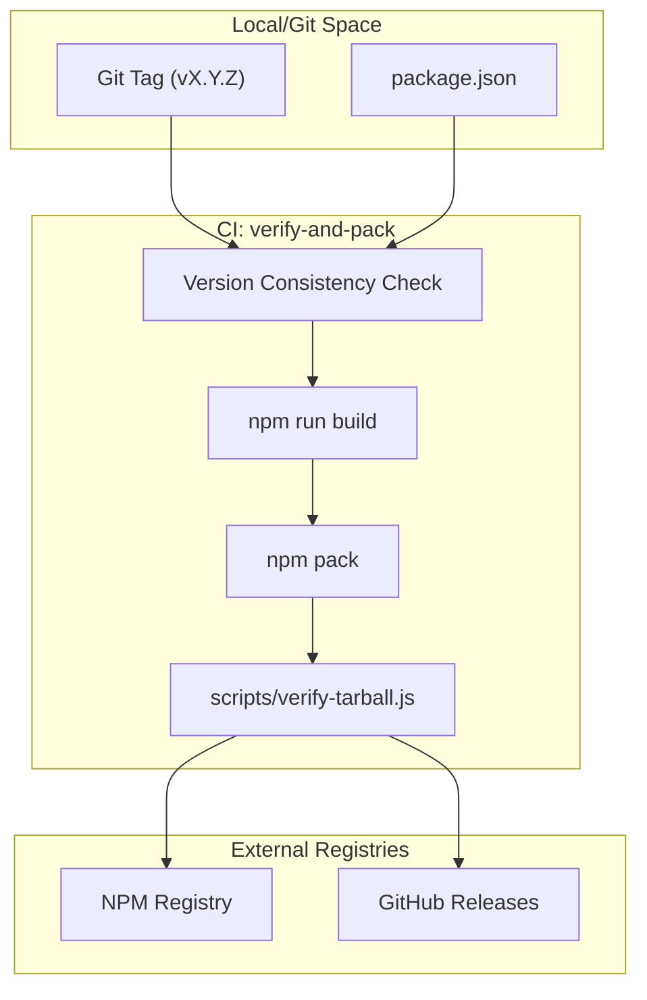
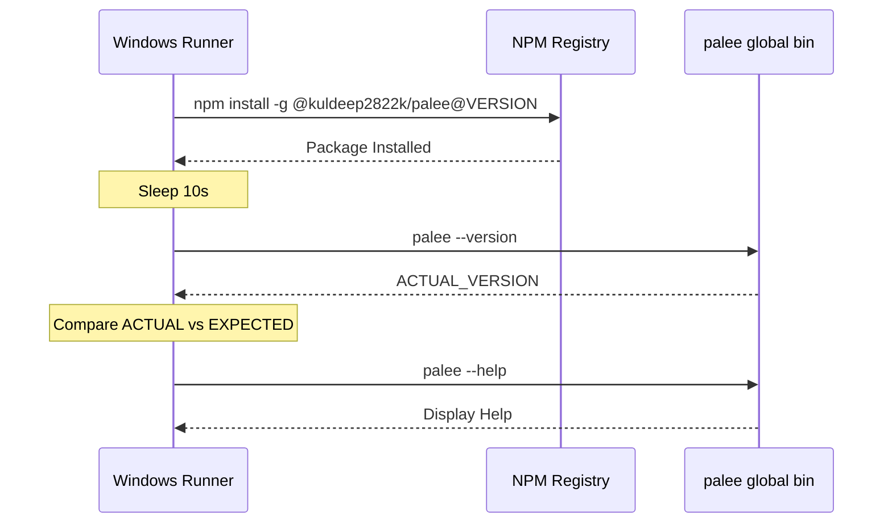

# Release Workflow and NPM Publishing
Relevant source files

- [.github/workflows/release.yml](https://github.com/Kuldeep2822k/cli/blob/main/.github/workflows/release.yml)
- [.npmignore](https://github.com/Kuldeep2822k/cli/blob/main/.npmignore)
- [package-lock.json](https://github.com/Kuldeep2822k/cli/blob/main/package-lock.json)
- [scripts/verify-tarball.js](https://github.com/Kuldeep2822k/cli/blob/main/scripts/verify-tarball.js)

The PALEE release pipeline is a highly automated, multi-stage workflow designed to ensure that every version published to the NPM registry is verified, consistent, and functional across platforms. The process is primarily driven by GitHub Actions and triggered by versioned Git tags.

## Release Pipeline Architecture

The workflow is defined in `.github/workflows/release.yml` and consists of four distinct jobs that enforce strict quality gates before a package is made public.

### Workflow Trigger and Concurrency

The pipeline is triggered by the push of a tag matching the `v*.*.*` pattern or via manual `workflow_dispatch`[.github/workflows/release.yml#3-7](https://github.com/Kuldeep2822k/cli/blob/main/.github/workflows/release.yml#L3-L7) To prevent race conditions during publishing, it uses a concurrency group `release-production` with `cancel-in-progress: false`[.github/workflows/release.yml#9-11](https://github.com/Kuldeep2822k/cli/blob/main/.github/workflows/release.yml#L9-L11)

### Release Data Flow and Code Entities

The following diagram illustrates how the release workflow interacts with codebase entities and external registries.

"Release Process Data Flow"

Sources: [.github/workflows/release.yml#14-116](https://github.com/Kuldeep2822k/cli/blob/main/.github/workflows/release.yml#L14-L116)[scripts/verify-tarball.js#1-30](https://github.com/Kuldeep2822k/cli/blob/main/scripts/verify-tarball.js#L1-L30)

## Job Details and Implementation

### 1. Verify, Build & Pack (`verify-and-pack`)

This job prepares the distribution artifact. It performs three critical validation steps:

- Version Consistency Check: It extracts the version from the Git tag and compares it against the `version` field in `package.json`. If they do not match, the pipeline fails immediately [.github/workflows/release.yml#30-38](https://github.com/Kuldeep2822k/cli/blob/main/.github/workflows/release.yml#L30-L38)
- Quality Gates: It executes `npm run check` (Lint/Typecheck) and `npm run test:coverage` (Unit/Invariant tests) to ensure the code is stable [.github/workflows/release.yml#43-47](https://github.com/Kuldeep2822k/cli/blob/main/.github/workflows/release.yml#L43-L47)
- Artifact Validation: After running `npm pack`, it invokes a custom validation script, `scripts/verify-tarball.js`[.github/workflows/release.yml#67-68](https://github.com/Kuldeep2822k/cli/blob/main/.github/workflows/release.yml#L67-L68)

#### `verify-tarball.js` Implementation

The validation script ensures the tarball contains only necessary production files and excludes source code or internal configuration [scripts/verify-tarball.js#15-29](https://github.com/Kuldeep2822k/cli/blob/main/scripts/verify-tarball.js#L15-L29)

| Category | Files/Directories |
| --- | --- |
| Required | `package.json`, `dist/`, `README.md`, `LICENSE`, `dist/bin/palee.js`[scripts/verify-tarball.js#6-14](https://github.com/Kuldeep2822k/cli/blob/main/scripts/verify-tarball.js#L6-L14) |
| Forbidden | `src/`, `test/`, `.github/`, `planning/`, `coverage/`[scripts/verify-tarball.js#15](https://github.com/Kuldeep2822k/cli/blob/main/scripts/verify-tarball.js#L15-L15) |

Sources: [.github/workflows/release.yml#14-75](https://github.com/Kuldeep2822k/cli/blob/main/.github/workflows/release.yml#L14-L75)[scripts/verify-tarball.js#1-31](https://github.com/Kuldeep2822k/cli/blob/main/scripts/verify-tarball.js#L1-L31)

### 2. Idempotent NPM Publishing (`publish-npm`)

The publishing job uses the `npm-release` environment and requires `id-token: write` for OIDC-based authentication [.github/workflows/release.yml#79-83](https://github.com/Kuldeep2822k/cli/blob/main/.github/workflows/release.yml#L79-L83)

To ensure the pipeline is idempotent (safe to re-run), it performs a pre-check using `npm view`. It queries the registry for the specific version being released; if the version already exists, the publish step is skipped to avoid "cannot modify existing version" errors [.github/workflows/release.yml#100-112](https://github.com/Kuldeep2822k/cli/blob/main/.github/workflows/release.yml#L100-L112)

Sources: [.github/workflows/release.yml#76-116](https://github.com/Kuldeep2822k/cli/blob/main/.github/workflows/release.yml#L76-L116)

### 3. GitHub Release Creation (`github-release`)

Once the NPM publish is successful, the workflow creates a GitHub Release using `softprops/action-gh-release`. This step:

- Generates automatic release notes based on commit history [.github/workflows/release.yml#135](https://github.com/Kuldeep2822k/cli/blob/main/.github/workflows/release.yml#L135-L135)
- Attaches the verified `.tgz` tarball as a release asset [.github/workflows/release.yml#138](https://github.com/Kuldeep2822k/cli/blob/main/.github/workflows/release.yml#L138-L138)

Sources: [.github/workflows/release.yml#117-139](https://github.com/Kuldeep2822k/cli/blob/main/.github/workflows/release.yml#L117-L139)

### 4. Post-Release Smoke Test (`smoke-test`)

The final job runs on `windows-latest` to verify the package's behavior in a non-POSIX environment.

Because the NPM registry often has a slight propagation delay (replication lag), the smoke test implements a retry loop. It attempts to install the package globally up to 12 times, waiting 10 seconds between each attempt [.github/workflows/release.yml#150-165](https://github.com/Kuldeep2822k/cli/blob/main/.github/workflows/release.yml#L150-L165)

After installation, it verifies:

1. Binary Availability: Running `palee --version`[.github/workflows/release.yml#170](https://github.com/Kuldeep2822k/cli/blob/main/.github/workflows/release.yml#L170-L170)
2. Version Accuracy: The CLI output must exactly match the release version [.github/workflows/release.yml#171-174](https://github.com/Kuldeep2822k/cli/blob/main/.github/workflows/release.yml#L171-L174)
3. Command Execution: Running `palee --help` to ensure dependencies like `commander` are correctly resolved [.github/workflows/release.yml#178](https://github.com/Kuldeep2822k/cli/blob/main/.github/workflows/release.yml#L178-L178)

"Smoke Test Execution Flow"

Sources: [.github/workflows/release.yml#140-179](https://github.com/Kuldeep2822k/cli/blob/main/.github/workflows/release.yml#L140-L179)

## Distribution Configuration

The package distribution is controlled by two files that define what enters the NPM ecosystem:

- `package.json`: Defines the entry points for the compiled code. The `bin` field maps the `palee` command to `dist/bin/palee.js`[package-lock.json#15-17](https://github.com/Kuldeep2822k/cli/blob/main/package-lock.json#L15-L17)
- `.npmignore`: Explicitly excludes development artifacts, such as `src/`, `test/`, and `planning/` documentation, to keep the installation footprint small [.npmignore#1-25](https://github.com/Kuldeep2822k/cli/blob/main/.npmignore#L1-L25)

Sources: [package-lock.json#1-34](https://github.com/Kuldeep2822k/cli/blob/main/package-lock.json#L1-L34)[.npmignore#1-25](https://github.com/Kuldeep2822k/cli/blob/main/.npmignore#L1-L25)