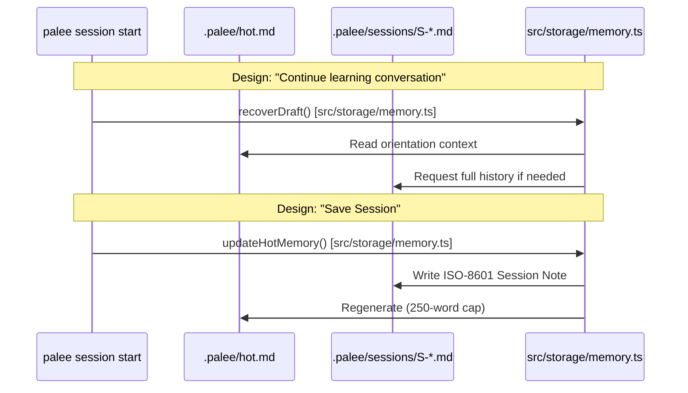

# 8. Planning and Design Documents
Relevant source files

- [planning/PHASE_1_CHECKLIST.md](https://github.com/Kuldeep2822k/cli/blob/main/planning/PHASE_1_CHECKLIST.md?plain=1)
- [planning/PHASE_1_ISSUES.md](https://github.com/Kuldeep2822k/cli/blob/main/planning/PHASE_1_ISSUES.md?plain=1)
- [planning/PHASE_2_GAPS.md](https://github.com/Kuldeep2822k/cli/blob/main/planning/PHASE_2_GAPS.md?plain=1)
- [planning/TRIGGER_TRACKER.md](https://github.com/Kuldeep2822k/cli/blob/main/planning/TRIGGER_TRACKER.md?plain=1)
- [planning/VALIDATION_FRAMEWORK_VERDICT.md](https://github.com/Kuldeep2822k/cli/blob/main/planning/VALIDATION_FRAMEWORK_VERDICT.md?plain=1)
- [planning/ai_module_design.md](https://github.com/Kuldeep2822k/cli/blob/main/planning/ai_module_design.md?plain=1)
- [planning/cicd_dependency_management_proposal.md](https://github.com/Kuldeep2822k/cli/blob/main/planning/cicd_dependency_management_proposal.md?plain=1)
- [planning/example_workflows.md](https://github.com/Kuldeep2822k/cli/blob/main/planning/example_workflows.md?plain=1)
- [planning/invariants.md](https://github.com/Kuldeep2822k/cli/blob/main/planning/invariants.md?plain=1)
- [planning/memory_design.md](https://github.com/Kuldeep2822k/cli/blob/main/planning/memory_design.md?plain=1)
- [planning/palee_cli_spec.md](https://github.com/Kuldeep2822k/cli/blob/main/planning/palee_cli_spec.md?plain=1)
- [planning/roadmap_design.md](https://github.com/Kuldeep2822k/cli/blob/main/planning/roadmap_design.md?plain=1)
- [planning/storage_design.md](https://github.com/Kuldeep2822k/cli/blob/main/planning/storage_design.md?plain=1)

This section serves as a central index for the `planning/` directory, containing the foundational specifications, design proposals, and roadmaps that guide the PALEE codebase. These documents capture the architectural decisions, system invariants, and the multi-phase execution strategy used to build the engine.

## 8.1 Phase 1 Specification and Invariants

Phase 1 focuses on the deterministic core of PALEE: the storage layer, the SM-2 scheduling engine, and basic CLI management. The design ensures that PALEE can safely operate on an Obsidian vault as a source of truth without corrupting user data.

### Core Specifications

- Problem Statement & Architecture: The system follows a three-layer architecture (Storage → Engine Core → CLI) designed to maintain a deterministic learning loop [planning/palee_cli_spec.md](https://github.com/Kuldeep2822k/cli/blob/main/planning/palee_cli_spec.md?plain=1)
- Storage Invariants: The system guarantees that updating a PALEE field preserves the Markdown body byte-for-byte [planning/invariants.md#7-8](https://github.com/Kuldeep2822k/cli/blob/main/planning/invariants.md?plain=1#L7-L8) It uses an atomic write protocol (temp file → fsync → rename) to prevent data loss [planning/storage_design.md#39-52](https://github.com/Kuldeep2822k/cli/blob/main/planning/storage_design.md?plain=1#L39-L52)
- SM-2 Algorithm: Scheduling follows the SM-2 logic where `ease_factor` is capped at a minimum of 1.30 [planning/invariants.md#23](https://github.com/Kuldeep2822k/cli/blob/main/planning/invariants.md?plain=1#L23-L23) and intervals progress through a `1, 6, round(prev * EF)` sequence [planning/invariants.md#26](https://github.com/Kuldeep2822k/cli/blob/main/planning/invariants.md?plain=1#L26-L26)

### Implementation Tracking

The implementation was managed through a gate-controlled checklist, ensuring Gate 0 (Setup) through Gate 5 (Packaging) met all acceptance criteria before proceeding [planning/PHASE_1_CHECKLIST.md](https://github.com/Kuldeep2822k/cli/blob/main/planning/PHASE_1_CHECKLIST.md?plain=1) Current execution is driven by a Trigger Tracker, which prioritizes tasks from Invariant Violations (Trigger 1) to Spikes/Research (Trigger 5) [planning/TRIGGER_TRACKER.md#8-16](https://github.com/Kuldeep2822k/cli/blob/main/planning/TRIGGER_TRACKER.md?plain=1#L8-L16)

For details, see [Phase 1 Specification and Invariants](./08-1-phase-1-specification-and-invariants.md)

---

## 8.2 Future: AI Module and Phase 2 Design

Phase 2 introduces the "Personal Active Learning" aspect via Large Language Models (LLMs). This layer provides intelligent tutoring, Feynman-style assessments, and automated roadmap generation.

### AI Tutoring & Sessions

- Feynman Testing: The `palee test` command will use AI to conduct conceptual probes and grade responses across four dimensions: conceptual, practical, debug, and feynman [planning/ai_module_design.md#88-102](https://github.com/Kuldeep2822k/cli/blob/main/planning/ai_module_design.md?plain=1#L88-L102)
- Session Continuity: PALEE uses a "Hot Memory" system (`hot.md`) limited to 250 words to provide the AI with immediate context of the learner's current position without exceeding token limits [planning/memory_design.md#41-43](https://github.com/Kuldeep2822k/cli/blob/main/planning/memory_design.md?plain=1#L41-L43)
- Tool-Calling Loop: The AI interacts with the engine through a read-only tool interface, ensuring the LLM cannot mutate the vault without explicit learner confirmation [planning/ai_module_design.md#64-80](https://github.com/Kuldeep2822k/cli/blob/main/planning/ai_module_design.md?plain=1#L64-L80)

### Roadmap Generation

Future iterations will support guided interviews to generate personalized learning paths. This mode will collect learner goals, constraints, and time availability to propose a Topic DAG (Directed Acyclic Graph) [planning/roadmap_design.md#15-30](https://github.com/Kuldeep2822k/cli/blob/main/planning/roadmap_design.md?plain=1#L15-L30)

For details, see [Future: AI Module and Phase 2 Design](./08-2-future-ai-module-and-phase-2-design.md)

---

## System Integration Diagrams

### From Requirements to Code Entities

The following diagram maps high-level planning concepts to the specific TypeScript entities and storage files that implement them.

#### Planning to Entity Mapping

```mermaid
%%{init: {
  'theme': 'base',
  'themeVariables': {
    'background': '#000000',
    'primaryColor': '#000000',
    'primaryTextColor': '#e0e0e0',
    'primaryBorderColor': '#2d3139',
    'lineColor': '#5a606b',
    'secondaryColor': '#000000',
    'tertiaryColor': '#000000',
    'clusterBkg': '#0a0b0d',
    'clusterBorder': '#1e2128',
    'titleColor': '#8b949e',
    'edgeLabelBackground': '#000000',
    'fontFamily': 'Inter, system-ui, sans-serif'
  }
}}%%
flowchart TD
    subgraph PlanSpace ["Planning Specifications (planning/)"]
        P_Inv["invariants.md (SM-2 & OCC Rules)"]
        P_Stor["storage_design.md (Atomic Write & Locks)"]
        P_Mem["memory_design.md (Session & Hot Memory)"]
        P_Road["roadmap_design.md (DAG & Import)"]
    end

    subgraph CodeSpace ["Engine & Storage Implementation (src/)"]
        C_SM2["SM-2 Engine (src/engine/sm2.ts)"]
        C_Atom["Atomic Write (src/storage/atomic-write.ts)"]
        C_Lock["Lock Class (src/storage/lock.ts)"]
        C_Mem["Memory Manager (src/storage/memory.ts)"]
        C_DAG["Dependency Graph (src/engine/dependency.ts)"]
    end

    subgraph VaultSpace ["Vault Artifacts (Obsidian)"]
        V_Note["Topic Frontmatter (.md)"]
        V_Lock[".palee/locks/"]
        V_Hot[".palee/hot.md"]
        V_Sess[".palee/sessions/S-*.md"]
    end

    P_Inv --> C_SM2
    P_Inv --> C_Atom
    P_Stor --> C_Atom
    P_Stor --> C_Lock
    P_Mem --> C_Mem
    P_Road --> C_DAG

    C_SM2 --> V_Note
    C_Atom --> V_Note
    C_Lock --> V_Lock
    C_Mem --> V_Hot
    C_Mem --> V_Sess
    C_DAG --> V_Note

    style PlanSpace fill:#08090b,stroke:#1e2128,stroke-width:1px,color:#8b949e
    style CodeSpace fill:#08090b,stroke:#1e2128,stroke-width:1px,color:#8b949e
    style VaultSpace fill:#08090b,stroke:#1e2128,stroke-width:1px,color:#8b949e

    style P_Inv fill:#000000,stroke:#2d3139,stroke-width:1px,color:#ffffff
    style P_Stor fill:#000000,stroke:#2d3139,stroke-width:1px,color:#ffffff
    style P_Mem fill:#000000,stroke:#2d3139,stroke-width:1px,color:#ffffff
    style P_Road fill:#000000,stroke:#2d3139,stroke-width:1px,color:#ffffff

    style C_SM2 fill:#000000,stroke:#2d3139,stroke-width:1px,color:#ffffff
    style C_Atom fill:#000000,stroke:#2d3139,stroke-width:1px,color:#ffffff
    style C_Lock fill:#000000,stroke:#2d3139,stroke-width:1px,color:#ffffff
    style C_Mem fill:#000000,stroke:#2d3139,stroke-width:1px,color:#ffffff
    style C_DAG fill:#000000,stroke:#2d3139,stroke-width:1px,color:#ffffff

    style V_Note fill:#000000,stroke:#2d3139,stroke-width:1px,color:#ffffff
    style V_Lock fill:#000000,stroke:#2d3139,stroke-width:1px,color:#ffffff
    style V_Hot fill:#000000,stroke:#2d3139,stroke-width:1px,color:#ffffff
    style V_Sess fill:#000000,stroke:#2d3139,stroke-width:1px,color:#ffffff
```

Sources:[planning/invariants.md](https://github.com/Kuldeep2822k/cli/blob/main/planning/invariants.md?plain=1)[planning/storage_design.md](https://github.com/Kuldeep2822k/cli/blob/main/planning/storage_design.md?plain=1)[src/types.ts](https://github.com/Kuldeep2822k/cli/blob/main/src/types.ts)

### Storage & Memory Lifecycle

This diagram bridges the design intent for session continuity with the actual file-system structure managed by the `Storage` layer.

Session Lifecycle Mapping

Sources:[planning/memory_design.md#91-100](https://github.com/Kuldeep2822k/cli/blob/main/planning/memory_design.md?plain=1#L91-L100)[planning/ai_module_design.md#7-8](https://github.com/Kuldeep2822k/cli/blob/main/planning/ai_module_design.md?plain=1#L7-L8)[src/storage/memory.ts](https://github.com/Kuldeep2822k/cli/blob/main/src/storage/memory.ts)

## Planning Resource Matrix

| Document | Purpose | Key Symbols / Concepts |
| --- | --- | --- |
| `invariants.md` | Success Criteria | `ease_factor >= 1.3`, `OCC conflict`, `Heartbeat` |
| `storage_design.md` | Data Integrity | `Atomic Write`, `Fingerprint`, `Lock Heartbeat` |
| `ai_module_design.md` | AI Integration | `Tool-Calling Loop`, `Assessment Proposal` |
| `memory_design.md` | Continuity | `hot.md`, `DRAFT-S-*`, `250-word cap` |
| `roadmap_design.md` | Curriculum | `Topic DAG`, `R-` prefix, `Guided Interview` |
| `PHASE_1_ISSUES.md` | Bug Tracking | `Topic Resolution`, `Difficulty Mismatch` |

Sources:[planning/invariants.md](https://github.com/Kuldeep2822k/cli/blob/main/planning/invariants.md?plain=1)[planning/storage_design.md](https://github.com/Kuldeep2822k/cli/blob/main/planning/storage_design.md?plain=1)[planning/ai_module_design.md](https://github.com/Kuldeep2822k/cli/blob/main/planning/ai_module_design.md?plain=1)[planning/memory_design.md](https://github.com/Kuldeep2822k/cli/blob/main/planning/memory_design.md?plain=1)[planning/roadmap_design.md](https://github.com/Kuldeep2822k/cli/blob/main/planning/roadmap_design.md?plain=1)[planning/PHASE_1_ISSUES.md](https://github.com/Kuldeep2822k/cli/blob/main/planning/PHASE_1_ISSUES.md?plain=1)