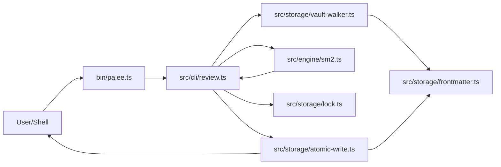
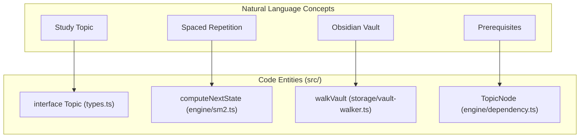

# Phase 1 Specification and Invariants
Relevant source files

- [README.md](https://github.com/Kuldeep2822k/cli/blob/main/README.md?plain=1)
- [planning/PHASE_1_CHECKLIST.md](https://github.com/Kuldeep2822k/cli/blob/main/planning/PHASE_1_CHECKLIST.md?plain=1)
- [planning/PHASE_1_ISSUES.md](https://github.com/Kuldeep2822k/cli/blob/main/planning/PHASE_1_ISSUES.md?plain=1)
- [planning/PHASE_2_GAPS.md](https://github.com/Kuldeep2822k/cli/blob/main/planning/PHASE_2_GAPS.md?plain=1)
- [planning/invariants.md](https://github.com/Kuldeep2822k/cli/blob/main/planning/invariants.md?plain=1)
- [planning/palee_cli_spec.md](https://github.com/Kuldeep2822k/cli/blob/main/planning/palee_cli_spec.md?plain=1)

This page summarizes the foundational specifications, architectural requirements, and safety invariants established for Phase 1 of the PALEE (Personal Active Learning & Evaluation Engine) CLI. Phase 1 focuses on a deterministic, AI-free core that handles storage, spaced repetition, and dependency management with high reliability.

## 1. Solution Architecture

PALEE is designed with a strict separation of concerns, ensuring that the engine remains deterministic and reliable even when AI features are added in later phases [planning/palee_cli_spec.md#20-22](https://github.com/Kuldeep2822k/cli/blob/main/planning/palee_cli_spec.md?plain=1#L20-L22)

### 1.1 Architectural Layers

| Layer | Responsibility | Key Files |
| --- | --- | --- |
| Storage | Obsidian vault as source of truth, atomic writes, and locking. | `src/storage/` |
| Engine Core | Pure library for SM-2, mastery, and dependency graphs. | `src/engine/` |
| Tool Interface | Validated mutation contract for state changes. | `src/types.ts` |
| CLI Layer | Deterministic commands (e.g., `next`, `plan`, `review`). | `src/cli/`, `bin/palee.ts` |

Sources: [planning/palee_cli_spec.md#23-84](https://github.com/Kuldeep2822k/cli/blob/main/planning/palee_cli_spec.md?plain=1#L23-L84)

### 1.2 Data Flow: Command Execution

The following diagram illustrates how a deterministic command (like `palee review`) flows through the system entities.

CLI to Storage Data Flow

Sources: [planning/palee_cli_spec.md#50-83](https://github.com/Kuldeep2822k/cli/blob/main/planning/palee_cli_spec.md?plain=1#L50-L83)[planning/palee_cli_spec.md#139-147](https://github.com/Kuldeep2822k/cli/blob/main/planning/palee_cli_spec.md?plain=1#L139-L147)[planning/invariants.md#5-18](https://github.com/Kuldeep2822k/cli/blob/main/planning/invariants.md?plain=1#L5-L18)

---

## 2. System Invariants

Invariants are non-negotiable rules that the codebase must satisfy to ensure data integrity and algorithmic correctness.

### 2.1 Storage Invariants

- Frontmatter Preservation: Updating a PALEE field must preserve the Markdown body byte-for-byte [planning/invariants.md#7-8](https://github.com/Kuldeep2822k/cli/blob/main/planning/invariants.md?plain=1#L7-L8)
- Optimistic Concurrency Control (OCC): Any change in file fingerprint during an operation must trigger a conflict (Exit Code 4) and abort the write [planning/invariants.md#9-10](https://github.com/Kuldeep2822k/cli/blob/main/planning/invariants.md?plain=1#L9-L10)
- Atomic Writes: Temporary files and renames are used to prevent file truncation during failures [planning/invariants.md#14](https://github.com/Kuldeep2822k/cli/blob/main/planning/invariants.md?plain=1#L14-L14)
- Locking: Locks become stale after 60s on Windows and 120s elsewhere; heartbeats occur every 15s [planning/invariants.md#11](https://github.com/Kuldeep2822k/cli/blob/main/planning/invariants.md?plain=1#L11-L11)

### 2.2 SM-2 and Mastery Invariants

- SM-2 Bounds: The `ease_factor` must never drop below `1.30`[planning/invariants.md#23](https://github.com/Kuldeep2822k/cli/blob/main/planning/invariants.md?plain=1#L23-L23)
- Interval Logic: A `quality < 3` result resets repetition to 0 and interval to 1 [planning/invariants.md#25](https://github.com/Kuldeep2822k/cli/blob/main/planning/invariants.md?plain=1#L25-L25)
- Mastery Calculation: `topic_mastery` is calculated as `round((conceptual + practical + debug + (feynman * 2)) / 5, 4)`[planning/invariants.md#33](https://github.com/Kuldeep2822k/cli/blob/main/planning/invariants.md?plain=1#L33-L33)

Sources: [planning/invariants.md#5-39](https://github.com/Kuldeep2822k/cli/blob/main/planning/invariants.md?plain=1#L5-L39)[planning/palee_cli_spec.md#149-160](https://github.com/Kuldeep2822k/cli/blob/main/planning/palee_cli_spec.md?plain=1#L149-L160)

---

## 3. Command Contracts

Phase 1 implements a set of deterministic commands designed for both human use and machine integration via the `--json` flag.

| Command | Purpose | Output/Contract |
| --- | --- | --- |
| `adopt` | Injects `palee_id` and schema into a note. | Adds `palee_schema: 1`[planning/palee_cli_spec.md#122-125](https://github.com/Kuldeep2822k/cli/blob/main/planning/palee_cli_spec.md?plain=1#L122-L125) |
| `next` | Suggests the next topic based on due date and dependencies. | Supports `--json` for automation [planning/PHASE_1_ISSUES.md#10-12](https://github.com/Kuldeep2822k/cli/blob/main/planning/PHASE_1_ISSUES.md?plain=1#L10-L12) |
| `plan` | Generates an ordered study session. | Respects `depends_on` graph [planning/palee_cli_spec.md#70](https://github.com/Kuldeep2822k/cli/blob/main/planning/palee_cli_spec.md?plain=1#L70-L70) |
| `validate` | Checks for cycles and missing dependencies. | Reports exact cycle paths [planning/invariants.md#37](https://github.com/Kuldeep2822k/cli/blob/main/planning/invariants.md?plain=1#L37-L37) |

### Topic Identification Logic

The system uses a stable `palee_id` as the primary identifier. In Phase 1, resolution uses substring matching, with a more robust resolution engine (ID > Title > Slug) scheduled for Phase 2 [planning/PHASE_1_ISSUES.md#16-20](https://github.com/Kuldeep2822k/cli/blob/main/planning/PHASE_1_ISSUES.md?plain=1#L16-L20)

Entity Mapping: Natural Language to Code

Sources: [src/types.ts](https://github.com/Kuldeep2822k/cli/blob/main/src/types.ts)[src/engine/sm2.ts](https://github.com/Kuldeep2822k/cli/blob/main/src/engine/sm2.ts)[src/engine/dependency.ts](https://github.com/Kuldeep2822k/cli/blob/main/src/engine/dependency.ts)[src/storage/vault-walker.ts](https://github.com/Kuldeep2822k/cli/blob/main/src/storage/vault-walker.ts)

---

## 4. Phase 1 Completion Status

All Phase 1 gates have been verified as of August 2026.

### Resolved Issues & Implemented Features

- JSON Support: Implemented across all reading commands (`next`, `plan`, `progress`, `dashboard`, `validate`, `session list`) [planning/PHASE_1_ISSUES.md#7-13](https://github.com/Kuldeep2822k/cli/blob/main/planning/PHASE_1_ISSUES.md?plain=1#L7-L13)
- Batch Adoption: Fully implemented in `palee adopt` with `--all`, `--include`, `--exclude`, `--tag`, and `--dry-run` [src/cli/adopt.ts](https://github.com/Kuldeep2822k/cli/blob/main/src/cli/adopt.ts)
- Markdown Roadmap Import: Supports importing from `.md` files containing YAML frontmatter or YAML code fences [src/storage/roadmap-parser.ts](https://github.com/Kuldeep2822k/cli/blob/main/src/storage/roadmap-parser.ts)
- Difficulty Normalization: A runtime helper now maps numeric (1-5) and string inputs to the `Difficulty` enum [planning/PHASE_1_ISSUES.md#39-44](https://github.com/Kuldeep2822k/cli/blob/main/planning/PHASE_1_ISSUES.md?plain=1#L39-L44)
- Empty States: Actionable onboarding guidance replaces empty terminal dumps [planning/PHASE_1_ISSUES.md#24-29](https://github.com/Kuldeep2822k/cli/blob/main/planning/PHASE_1_ISSUES.md?plain=1#L24-L29)

### Known Gaps (Phase 2)

- AI Integration: `test` and `tutor` commands remain stubs until Phase 2 AI module implementation [planning/PHASE_2_GAPS.md#112-128](https://github.com/Kuldeep2822k/cli/blob/main/planning/PHASE_2_GAPS.md?plain=1#L112-L128)
- Transactional Auto-Fix: `validate --fix` remains a future enhancement [planning/PHASE_1_ISSUES.md#64-67](https://github.com/Kuldeep2822k/cli/blob/main/planning/PHASE_1_ISSUES.md?plain=1#L64-L67)

Sources: [planning/PHASE_1_CHECKLIST.md#114-123](https://github.com/Kuldeep2822k/cli/blob/main/planning/PHASE_1_CHECKLIST.md?plain=1#L114-L123)[planning/PHASE_1_ISSUES.md#71-83](https://github.com/Kuldeep2822k/cli/blob/main/planning/PHASE_1_ISSUES.md?plain=1#L71-L83)[planning/PHASE_2_GAPS.md#1-160](https://github.com/Kuldeep2822k/cli/blob/main/planning/PHASE_2_GAPS.md?plain=1#L1-L160)