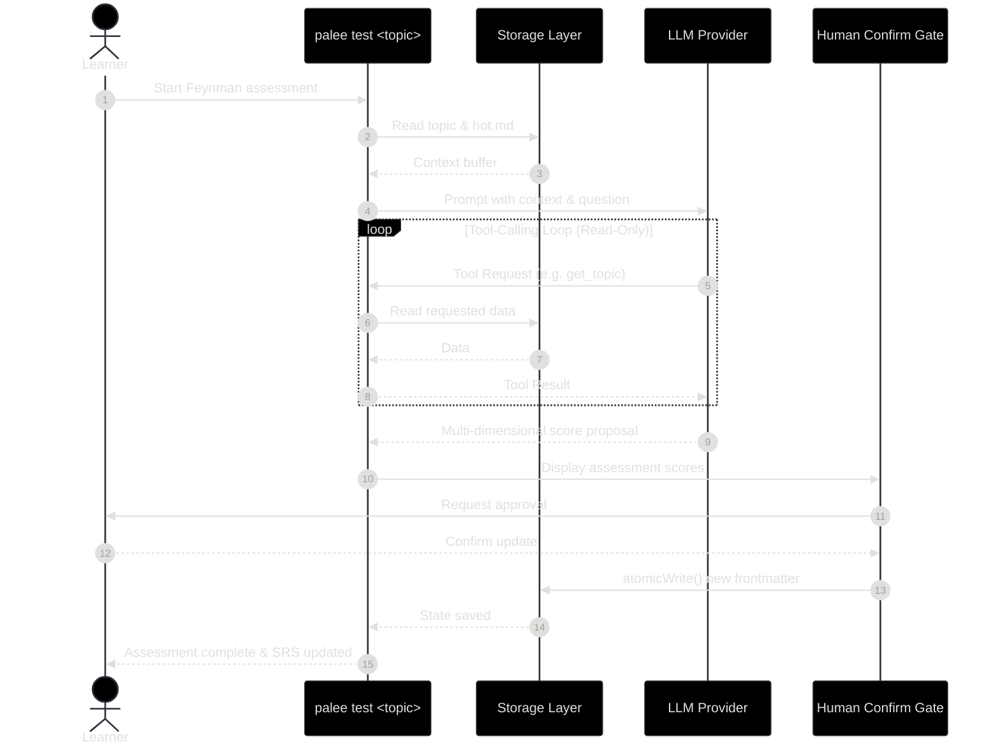
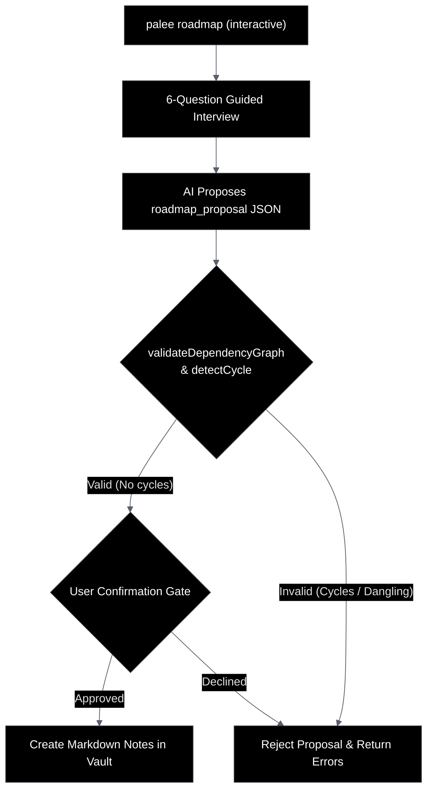

# Future: AI Module and Phase 2 Design
Relevant source files

- [agent.md](https://github.com/Kuldeep2822k/cli/blob/main/agent.md?plain=1)
- [planning/PHASE_1_ISSUES.md](https://github.com/Kuldeep2822k/cli/blob/main/planning/PHASE_1_ISSUES.md?plain=1)
- [planning/PHASE_2_GAPS.md](https://github.com/Kuldeep2822k/cli/blob/main/planning/PHASE_2_GAPS.md?plain=1)
- [planning/ai_module_design.md](https://github.com/Kuldeep2822k/cli/blob/main/planning/ai_module_design.md?plain=1)
- [planning/roadmap_design.md](https://github.com/Kuldeep2822k/cli/blob/main/planning/roadmap_design.md?plain=1)

This page outlines the planned evolution of PALEE (Personal Active Learning & Evaluation Engine) beyond its core deterministic features. It details the AI tutoring architecture, the transition to guided learning flows, and the resolution of architectural gaps identified during Phase 1.

## AI Module Architecture

The AI module is designed as an intelligent layer above the Engine Core. It utilizes Large Language Models (LLMs) to facilitate Feynman-style testing and interactive tutoring while maintaining strict separation between AI-generated proposals and the deterministic vault state [planning/ai_module_design.md#3-9](https://github.com/Kuldeep2822k/cli/blob/main/planning/ai_module_design.md?plain=1#L3-L9)

### Interaction Flow

The system employs a tool-calling loop where the LLM can request context but cannot directly mutate the vault. All changes proposed by the AI must pass through a validation and user-confirmation gate [planning/ai_module_design.md#64-80](https://github.com/Kuldeep2822k/cli/blob/main/planning/ai_module_design.md?plain=1#L64-L80)

#### AI Interaction Diagram

Sources:[planning/ai_module_design.md#11-41](https://github.com/Kuldeep2822k/cli/blob/main/planning/ai_module_design.md?plain=1#L11-L41)[planning/ai_module_design.md#88-118](https://github.com/Kuldeep2822k/cli/blob/main/planning/ai_module_design.md?plain=1#L88-L118)

---

## AI Configuration and Session Continuity

### Provider Configuration

AI capabilities require a configured provider. Credentials and endpoints are stored in platform-specific configuration directories [planning/ai_module_design.md#45-55](https://github.com/Kuldeep2822k/cli/blob/main/planning/ai_module_design.md?plain=1#L45-L55):

- Unix/macOS: `~/.config/palee/ai_provider.json`
- Windows: `%LOCALAPPDATA%\palee\ai_provider.json`

The configuration includes `base_url`, `api_key`, and `model`[planning/ai_module_design.md#48-50](https://github.com/Kuldeep2822k/cli/blob/main/planning/ai_module_design.md?plain=1#L48-L50)

### Session Memory (`hot.md`)

To maintain continuity without exceeding LLM context limits, PALEE uses `hot.md` as a working memory buffer.

- Initial Context: The AI receives `hot.md` (active topic, last session ID, unresolved confusion) [planning/ai_module_design.md#136-149](https://github.com/Kuldeep2822k/cli/blob/main/planning/ai_module_design.md?plain=1#L136-L149)
- History Retrieval: Full session records from `.palee/sessions/S-*.md` are only fetched via the `get_session` tool when explicitly required [planning/ai_module_design.md#151-167](https://github.com/Kuldeep2822k/cli/blob/main/planning/ai_module_design.md?plain=1#L151-L167)
- Context Bounding: Dialogue turns exceeding a count of four are summarized to prevent unbounded token growth [planning/ai_module_design.md#78-82](https://github.com/Kuldeep2822k/cli/blob/main/planning/ai_module_design.md?plain=1#L78-L82)

Sources:[planning/ai_module_design.md#45-82](https://github.com/Kuldeep2822k/cli/blob/main/planning/ai_module_design.md?plain=1#L45-L82)[src/storage/memory.ts#4-10](https://github.com/Kuldeep2822k/cli/blob/main/src/storage/memory.ts#L4-L10)

---

## Feynman-Style Testing (`palee test`)

The `palee test <topic>` command (Phase 2) implements the Feynman technique:

1. Context Loading: The engine reads the target topic note as the primary study material [planning/PHASE_2_GAPS.md#139-140](https://github.com/Kuldeep2822k/cli/blob/main/planning/PHASE_2_GAPS.md?plain=1#L139-L140)
2. Interactive Dialogue: The AI asks conceptual questions; the user explains in their own words [planning/PHASE_2_GAPS.md#140-141](https://github.com/Kuldeep2822k/cli/blob/main/planning/PHASE_2_GAPS.md?plain=1#L140-L141)
3. Multi-Dimensional Grading: The AI produces an `assessment_proposal` object containing scores for `conceptual`, `practical`, `debug`, and `feynman` pillars [planning/ai_module_design.md#88-102](https://github.com/Kuldeep2822k/cli/blob/main/planning/ai_module_design.md?plain=1#L88-L102)
4. Persistence: Scores are written to the topic's frontmatter (`assessment`), updating `topic_mastery`. Spaced-repetition recall scheduling (`due_at`) remains independently driven by user review records [planning/palee_cli_spec.md#190-196](https://github.com/Kuldeep2822k/cli/blob/main/planning/palee_cli_spec.md?plain=1#L190-L196)

Sources:[planning/PHASE_2_GAPS.md#112-146](https://github.com/Kuldeep2822k/cli/blob/main/planning/PHASE_2_GAPS.md?plain=1#L112-L146)[planning/ai_module_design.md#88-116](https://github.com/Kuldeep2822k/cli/blob/main/planning/ai_module_design.md?plain=1#L88-L116)

---

## Guided Roadmap Generation

While Phase 1 supports deterministic YAML/Markdown roadmap imports, Phase 2 introduces a guided interview mode via `palee roadmap`[planning/roadmap_design.md#15-19](https://github.com/Kuldeep2822k/cli/blob/main/planning/roadmap_design.md?plain=1#L15-L19)

### The Interview Flow

If no `--from` source is provided, the CLI initiates a 6-question interview covering [planning/roadmap_design.md#23-30](https://github.com/Kuldeep2822k/cli/blob/main/planning/roadmap_design.md?plain=1#L23-L30):

- Learning goals and current level.
- Availability (hours/week) and target dates.
- Preferred practice styles and technology constraints.

### Proposal Validation

The AI-generated roadmap must adhere to the `roadmap_proposal` schema, including `roadmap_id`, a unique `topic_id` list, and estimated effort [planning/roadmap_design.md#38-66](https://github.com/Kuldeep2822k/cli/blob/main/planning/roadmap_design.md?plain=1#L38-L66) The engine validates this for cycles and dangling dependencies before the user is asked to confirm the import [planning/roadmap_design.md#68-80](https://github.com/Kuldeep2822k/cli/blob/main/planning/roadmap_design.md?plain=1#L68-L80)

#### Roadmap Data Flow

Sources:[planning/roadmap_design.md#3-80](https://github.com/Kuldeep2822k/cli/blob/main/planning/roadmap_design.md?plain=1#L3-L80)[src/engine/dependency.ts#25-35](https://github.com/Kuldeep2822k/cli/blob/main/src/engine/dependency.ts#L25-L35)

---

## Phase 2 Gaps and Refinements

Based on `PHASE_2_GAPS.md`, the remaining CLI and AI enhancements are scheduled as follows:

| Feature | Status | Description | Target Component |
| --- | --- | --- | --- |
| Markdown Roadmaps | **Completed** | Support roadmap definitions inside `.md` files using frontmatter or YAML fences [src/storage/roadmap-parser.ts](https://github.com/Kuldeep2822k/cli/blob/main/src/storage/roadmap-parser.ts) | `roadmap.ts` |
| Batch Adopt | **Completed** | `palee adopt --all` (plus `--include`, `--exclude`, `--tag`) to scan and adopt untracked notes [src/cli/adopt.ts](https://github.com/Kuldeep2822k/cli/blob/main/src/cli/adopt.ts) | `adopt.ts` |
| Auto-ID Generation | Planned | Generate `T-` prefixed IDs from filenames (e.g., `Docker.md` -> `T-docker`) [planning/PHASE_2_GAPS.md#91-102](https://github.com/Kuldeep2822k/cli/blob/main/planning/PHASE_2_GAPS.md?plain=1#L91-L102) | `src/types.ts` |
| Topic Resolution | Planned | Advanced matching: exact ID → title → slug → token distance [planning/PHASE_1_ISSUES.md#16-20](https://github.com/Kuldeep2822k/cli/blob/main/planning/PHASE_1_ISSUES.md?plain=1#L16-L20) | `src/engine/index.ts` |
| Transactional Fixes | Planned | Implementation of `validate --fix` to resolve broken dependencies or missing fields [planning/PHASE_1_ISSUES.md#64-67](https://github.com/Kuldeep2822k/cli/blob/main/planning/PHASE_1_ISSUES.md?plain=1#L64-L67) | `validate.ts` |

Sources:[planning/PHASE_2_GAPS.md#1-110](https://github.com/Kuldeep2822k/cli/blob/main/planning/PHASE_2_GAPS.md?plain=1#L1-L110)[planning/PHASE_1_ISSUES.md#1-83](https://github.com/Kuldeep2822k/cli/blob/main/planning/PHASE_1_ISSUES.md?plain=1#L1-L83)