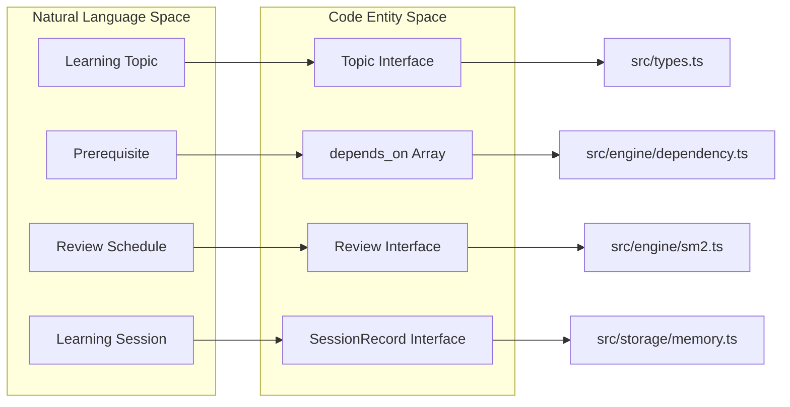
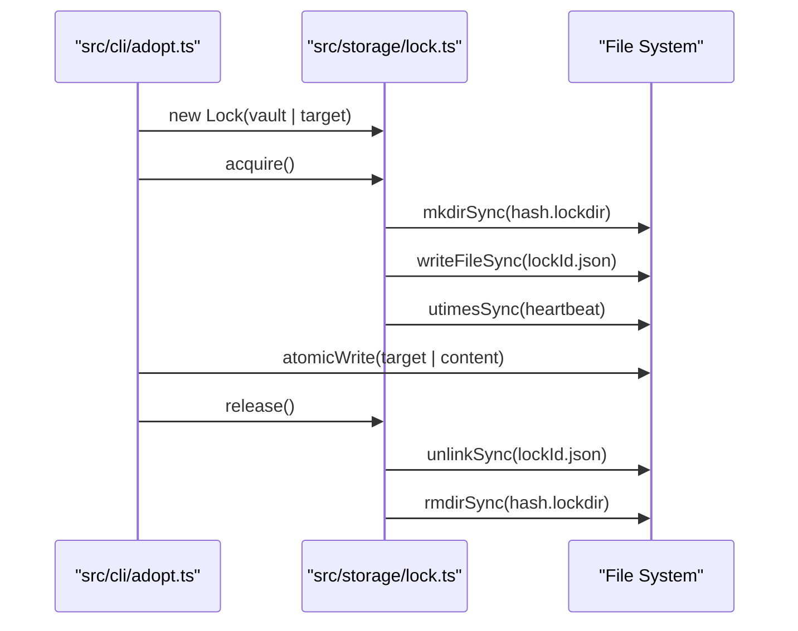
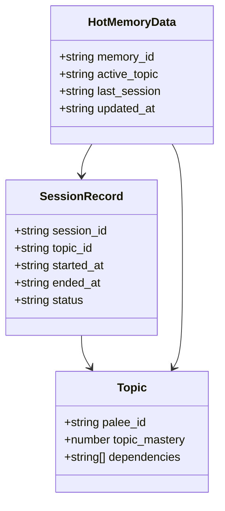

# Glossary
Relevant source files

- [package.json](https://github.com/Kuldeep2822k/cli/blob/main/package.json)
- [planning/memory_design.md](https://github.com/Kuldeep2822k/cli/blob/main/planning/memory_design.md?plain=1)
- [planning/storage_design.md](https://github.com/Kuldeep2822k/cli/blob/main/planning/storage_design.md?plain=1)
- [src/cli/adopt.ts](https://github.com/Kuldeep2822k/cli/blob/main/src/cli/adopt.ts)
- [src/cli/dashboard.ts](https://github.com/Kuldeep2822k/cli/blob/main/src/cli/dashboard.ts)
- [src/cli/session.ts](https://github.com/Kuldeep2822k/cli/blob/main/src/cli/session.ts)
- [src/engine/dependency.ts](https://github.com/Kuldeep2822k/cli/blob/main/src/engine/dependency.ts)
- [src/engine/sm2.ts](https://github.com/Kuldeep2822k/cli/blob/main/src/engine/sm2.ts)
- [src/storage/lock.ts](https://github.com/Kuldeep2822k/cli/blob/main/src/storage/lock.ts)
- [src/types.ts](https://github.com/Kuldeep2822k/cli/blob/main/src/types.ts)
- [test/session-cli.test.ts](https://github.com/Kuldeep2822k/cli/blob/main/test/session-cli.test.ts)
- [test/storage-lock.test.ts](https://github.com/Kuldeep2822k/cli/blob/main/test/storage-lock.test.ts)
- [test/types-difficulty.test.ts](https://github.com/Kuldeep2822k/cli/blob/main/test/types-difficulty.test.ts)

This page defines the codebase-specific terms, abbreviations, and domain concepts used throughout the PALEE system. It serves as a technical reference for engineers to map conceptual terminology to specific implementation details in the source code.

## Core Domain Concepts

### Spaced Repetition (SRS)

The learning methodology used to optimize long-term retention. PALEE implements the SM-2 (SuperMemo-2) algorithm to calculate the optimal interval for reviewing topics.

- Ease Factor (EF): A multiplier (default `2.5`) that determines how quickly the interval between reviews grows. It is updated based on the quality of the user's performance [src/engine/sm2.ts#43-46](https://github.com/Kuldeep2822k/cli/blob/main/src/engine/sm2.ts#L43-L46) The minimum allowed value is `1.3`[src/engine/sm2.ts#49-51](https://github.com/Kuldeep2822k/cli/blob/main/src/engine/sm2.ts#L49-L51)
- Interval: The number of days until the next review. Initial intervals are `1` and `6` days for the first two successful repetitions [src/engine/sm2.ts#76-79](https://github.com/Kuldeep2822k/cli/blob/main/src/engine/sm2.ts#L76-L79)
- Quality (0–5): A rating provided by the user or AI to assess performance. Ratings `< 3` are considered lapses and reset the repetition count [src/engine/sm2.ts#65-71](https://github.com/Kuldeep2822k/cli/blob/main/src/engine/sm2.ts#L65-L71)

### Topic

The fundamental unit of learning in PALEE. A topic is a Markdown file within the user's Obsidian vault that has been "adopted" by injecting specific YAML frontmatter [src/cli/adopt.ts#68-86](https://github.com/Kuldeep2822k/cli/blob/main/src/cli/adopt.ts#L68-L86)

- Mastery: A numerical value (0.0 to 1.0) representing the learner's proficiency. A topic is considered "mastered" at a threshold of `0.7`[src/engine/dependency.ts#49-59](https://github.com/Kuldeep2822k/cli/blob/main/src/engine/dependency.ts#L49-L59)
- Difficulty: A categorical classification (`beginner`, `intermediate`, `advanced`). The system provides a normalization utility to convert various inputs (numeric or string) into these canonical types [src/types.ts#29-47](https://github.com/Kuldeep2822k/cli/blob/main/src/types.ts#L29-L47)

### Dependency Graph

A Directed Acyclic Graph (DAG) where nodes are Topics and edges are `depends_on` relationships.

- Ready Topic: A topic that has not yet been mastered but whose dependencies all meet the mastery threshold [src/engine/dependency.ts#67-83](https://github.com/Kuldeep2822k/cli/blob/main/src/engine/dependency.ts#L67-L83)
- Cycle Detection: A DFS-based check to ensure no circular dependencies exist, which would prevent a topic from ever becoming "ready" [src/engine/dependency.ts#10-47](https://github.com/Kuldeep2822k/cli/blob/main/src/engine/dependency.ts#L10-L47)

Entity Mapping: Natural Language to Code

Sources: [src/types.ts#49-59](https://github.com/Kuldeep2822k/cli/blob/main/src/types.ts#L49-L59)[src/engine/sm2.ts#36-101](https://github.com/Kuldeep2822k/cli/blob/main/src/engine/sm2.ts#L36-L101)[src/engine/dependency.ts#85-117](https://github.com/Kuldeep2822k/cli/blob/main/src/engine/dependency.ts#L85-L117)[src/cli/adopt.ts#13-18](https://github.com/Kuldeep2822k/cli/blob/main/src/cli/adopt.ts#L13-L18)

---

## Storage & Persistence

### Atomic Write

A file-writing strategy that prevents data corruption by writing to a temporary file first and then renaming it to the target destination. This is combined with Optimistic Concurrency Control (OCC) using SHA-256 fingerprints [src/cli/adopt.ts#89-91](https://github.com/Kuldeep2822k/cli/blob/main/src/cli/adopt.ts#L89-L91)

### File Locking

A mechanism to prevent multiple processes from modifying the same vault file simultaneously. PALEE uses directory-based locking (`.lockdir`) which is atomic across platforms [src/storage/lock.ts#10-11](https://github.com/Kuldeep2822k/cli/blob/main/src/storage/lock.ts#L10-L11)

- Heartbeat: A background process that updates the lock file's `mtime` every 15 seconds to signal the process is still alive [src/storage/lock.ts#13](https://github.com/Kuldeep2822k/cli/blob/main/src/storage/lock.ts#L13-L13)
- Stale Lock: A lock whose heartbeat has not been updated for a timeout period (60s on Windows, 120s elsewhere). Stale locks can be "taken over" by new processes [src/storage/lock.ts#14-17](https://github.com/Kuldeep2822k/cli/blob/main/src/storage/lock.ts#L14-L17)

### Vault Walker

A utility that recursively traverses the filesystem to find Markdown files, while respecting exclusion rules for hidden directories (e.g., `.git`, `.obsidian`) [src/cli/dashboard.ts#31-36](https://github.com/Kuldeep2822k/cli/blob/main/src/cli/dashboard.ts#L31-L36)

Data Flow: Persistence and Locking

Sources: [src/storage/lock.ts#25-54](https://github.com/Kuldeep2822k/cli/blob/main/src/storage/lock.ts#L25-L54)[src/storage/lock.ts#187-198](https://github.com/Kuldeep2822k/cli/blob/main/src/storage/lock.ts#L187-L198)[src/cli/adopt.ts#88-91](https://github.com/Kuldeep2822k/cli/blob/main/src/cli/adopt.ts#L88-L91)

---

## Session Management

### Hot Memory (`hot.md`)

A compact file (`.palee/hot.md`) representing the active working memory for the current or next session. It is limited to a 250-word body to keep LLM context windows small [planning/memory_design.md#41-42](https://github.com/Kuldeep2822k/cli/blob/main/planning/memory_design.md?plain=1#L41-L42)

### Session Record

A durable Markdown file stored in `.palee/sessions/` that logs the start/end times and topics covered in a specific learning interval [src/types.ts#86-93](https://github.com/Kuldeep2822k/cli/blob/main/src/types.ts#L86-L93)

### Draft Checkpoint

An unconfirmed session record (prefixed with `DRAFT-S-`) created during an active session. If the CLI crashes, these are used for recovery [src/cli/session.ts#143-149](https://github.com/Kuldeep2822k/cli/blob/main/src/cli/session.ts#L143-L149)

### Recovery Actions

When an unconfirmed draft is detected at session start, the user can choose:

- Resume: Continue the session from the draft state.
- Save: Finalize the draft as a completed session.
- Discard: Delete the draft.
- Ignore: Leave the draft for later resolution [src/cli/session.ts#84-93](https://github.com/Kuldeep2822k/cli/blob/main/src/cli/session.ts#L84-L93)

Entity Relationship: Session Storage

Sources: [src/types.ts#78-93](https://github.com/Kuldeep2822k/cli/blob/main/src/types.ts#L78-L93)[src/cli/session.ts#23-53](https://github.com/Kuldeep2822k/cli/blob/main/src/cli/session.ts#L23-L53)[planning/memory_design.md#11-26](https://github.com/Kuldeep2822k/cli/blob/main/planning/memory_design.md?plain=1#L11-L26)

---

## Technical Abbreviations

| Abbreviation | Full Term | Context |
| --- | --- | --- |
| OCC | Optimistic Concurrency Control | Used in `atomicWrite` to prevent overwriting manual edits [src/cli/adopt.ts#89-91](https://github.com/Kuldeep2822k/cli/blob/main/src/cli/adopt.ts#L89-L91) |
| TOCTOU | Time-of-check to time-of-use | A race condition PALEE avoids by using atomic `mkdir` for locking [src/storage/lock.ts#10-11](https://github.com/Kuldeep2822k/cli/blob/main/src/storage/lock.ts#L10-L11) |
| CST | Concrete Syntax Tree | Used by the `yaml` library to preserve comments and formatting during frontmatter updates [src/storage/frontmatter.ts](https://github.com/Kuldeep2822k/cli/blob/main/src/storage/frontmatter.ts) |
| DFS | Depth-First Search | The algorithm used for cycle detection in the dependency graph [src/engine/dependency.ts#15-39](https://github.com/Kuldeep2822k/cli/blob/main/src/engine/dependency.ts#L15-L39) |

Sources: [src/storage/lock.ts#10-11](https://github.com/Kuldeep2822k/cli/blob/main/src/storage/lock.ts#L10-L11)[src/engine/dependency.ts#10-47](https://github.com/Kuldeep2822k/cli/blob/main/src/engine/dependency.ts#L10-L47)