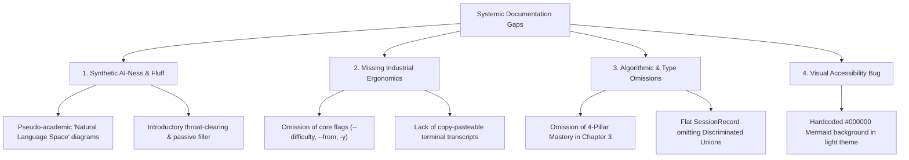
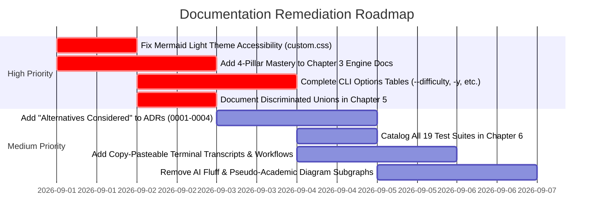

# PALEE Documentation Comprehensive Audit Report

**Date**: 2026-08-30  
**Scope**: All 35 documentation files in `docs/`, ADR suite, and VitePress theme configuration  
**Auditors**: 12 Parallel Autonomous Specialized Documentation Agents  
**Mode**: Strictly Read-Only Audit (Zero source modifications)

---

## 1. Executive Summary & Systemic Patterns

An exhaustive, multi-axis technical audit was conducted across the entire PALEE documentation suite against top-tier industry engineering standards (Stripe, Vercel, Rust, Docker CLI, and MADR).

Across all 12 specialized agents, four major systemic themes emerged:



---

## 2. Master Audit Findings Matrix

| # | Chapter / Scope | Target Files | Key Issues Identified | Severity |
| :--- | :--- | :--- | :--- | :--- |
| **1** | **Chapter 1 & Home** | `index.md`, `01-0`, `01-1`, `01-2` | Header clutter, missing code fence syntax tags, AI throat-clearing, hardcoded GitHub URLs. | Medium |
| **2** | **CLI Topic Commands** | `02-0`, `02-1` | Missing `--difficulty` and `--depends-on` in tables, pseudo-theoretical subgraphs, missing per-command exit codes (1–4). | High |
| **3** | **Review & Sessions** | `02-2`, `02-3`, `02-4` | Missing end-to-end morning review flow, missing full `--json` schemas, missing non-TTY auto-JSON documentation. | Medium |
| **4** | **Engine Core** | `03-0`, `03-1`, `03-2` | Complete omission of `mastery.ts` / 4-pillar formula in Ch 3, backward control-flow arrows in diagrams. | High |
| **5** | **Storage & Concurrency** | `04-0`, `04-1`, `04-2` | Broken sequence diagram flow in OCC, stale line links, missing CST newline stripping mechanics. | High |
| **6** | **Vault & Caching** | `04-3`, `04-4` | Incorrect mtime fallback logic in flowchart, raw HTML entity escapes in diagrams, omission of `.palee/` in ignore list. | Medium |
| **7** | **Data Models & Types** | `05-0`, `05-1`, `05-2` | Missing discriminated union types for sessions, incomplete `AdoptOptions`, ISO-8601 vs Date-only contradiction. | High |
| **8** | **Testing & QA** | `06-0`, `06-1`, `06-2` | 10 active test suites omitted from docs, missing `afterEach` reset hygiene, missing copy-pasteable test templates. | Medium |
| **9** | **CI/CD & Release** | `07-0`, `07-1`, `07-2` | Omitted SHA pinning security documentation, OIDC vs NPM_TOKEN mismatch, omitted tarball assertion files. | Medium |
| **10** | **Architecture Specs** | `08-0`, `08-1`, `08-2` | Shipped Phase 1 work listed in Phase 2 gaps table, phantom stubs mentioned, omitted invariant rules. | Medium |
| **11** | **ADR Suite** | `docs/adr/*.md` | Missing Alternatives Considered across all ADRs, missing DAG and Caching ADRs, broken relative links in ADR index. | High |
| **12** | **Theme & Navigation** | `09-glossary.md`, `.vitepress/` | Hardcoded `#000000` Mermaid background breaking light theme contrast, raw link dumps in glossary, top-nav redundancy. | High |

---

## 3. Detailed Audit by Agent

### Agent 1: Tone, Readability & Getting Started
**Target Files:** `docs/index.md`, `docs/01-0-overview.md`, `docs/01-1-getting-started.md`, `docs/01-2-architecture-overview.md`

1. **AI Throat-Clearing & Filler Phrasing:**
   - `01-1-getting-started.md:L11`: *"This page provides a technical guide for installing and configuring PALEE (Personal Active Learning & Evaluation Engine)..."* — Passive AI boilerplate. Should jump straight into prerequisites and installation commands.
   - `01-0-overview.md:L122`: *"To explore the PALEE codebase and documentation, follow these paths:"* — Unnecessary framing.
   - `01-2-architecture-overview.md:L46`: *"The following diagram illustrates how high-level user actions translate into specific code entities..."*
2. **H1 Header Clutter & Glued Link Blobs:**
   - Raw `Relevant source files` lists sit immediately under `# Title` across `01-0`, `01-1`, and `01-2`, forcing readers to scroll past reference lists before reading what the page is about.
   - Links are frequently concatenated without whitespace (e.g., `[src/types.ts#1-100](...)[README.md#136-173](...)`).
3. **Code Fence Syntax Tags:**
   - `01-1-getting-started.md:L17, 35, 43, 111`: Code blocks use bare ```` ``` ```` without language specifiers (`bash`/`sh`), disabling VitePress syntax highlighting and copy buttons.
4. **Ambiguous Environment Variables:**
   - `01-1-getting-started.md:L46`: `# API Key is prompted or set via environment variables` fails to document the exact environment variable name (`PALEE_API_KEY` / `OPENAI_API_KEY`).

---

### Agent 2: CLI Core & Topic Management Ergonomics
**Target Files:** `docs/02-0-cli-commands.md`, `docs/02-1-topic-management-commands.md`

1. **Incomplete Options Reference Table:**
   - `02-1-topic-management-commands.md:L48-56`: The options table lists batch filtering flags (`--include`, `--exclude`, `--tag`, `--dry-run`), but completely omits core options `--difficulty <level>` and `--depends-on <ids>` despite showing them in ad-hoc examples.
2. **Missing Command Synopses:**
   - `palee roadmap` and `palee migrate` lack formal argument synopses (`palee roadmap --from <file> [-y]`) and non-interactive scripting examples for CI pipelines.
3. **Missing Per-Command Exit Code Documentation:**
   - While `02-0` lists general exit codes 0–5, `02-1` fails to document:
     - Exit `1`: Partial import failure in `palee roadmap` (`src/cli/roadmap.ts:267`).
     - Exit `2`: Non-TTY missing `-y`, invalid difficulty, pattern syntax errors, or vault escape (`src/cli/adopt.ts:150, 195, 392`).
     - Exit `3`: Dependency cycle/missing topics in roadmap (`src/cli/roadmap.ts:129`) or unmigrated schemas (`src/cli/migrate.ts:49`).
     - Exit `4`: OCC/atomic write conflict (`src/cli/adopt.ts:487`, `src/cli/roadmap.ts:278`).

---

### Agent 3: Review, Scheduling & Reporting Workflows
**Target Files:** `docs/02-2-review-and-scheduling-commands.md`, `docs/02-3-reporting-commands.md`, `docs/02-4-session-management-command.md`

1. **Missing End-to-End Practitioner Flows:**
   - None of the docs explain a developer's daily cadence (e.g., morning review flow: `palee next` $\rightarrow$ study $\rightarrow$ `palee review <id> <score>` $\rightarrow$ `palee plan`).
2. **Incomplete `--json` Contracts:**
   - `02-2` completely omits `--json` output contracts for `palee next` (`--all` vs single topic) and `palee plan`.
   - `02-3` and `02-4` summarize fields in bullet points rather than defining full JSON schemas (omitting `progress` fields like `global_mastery`, `active_topic_count`, `archived_topic_count`, and `by_difficulty`).
3. **Undocumented Non-TTY Auto-JSON Behavior:**
   - Docs fail to specify that piped stdout automatically triggers `--json` (Invariant #45) and that structured errors (`{"error": "..."}`) route to `stderr` with exit codes 2, 3, 4, or 5.
4. **`hot.md` & `.palee/index.md` Lifecycle Gaps:**
   - `02-4` mentions 250-word truncation without specifying the frontmatter schema (`memory_id: "H-active"`, `last_session`, `active_topic`, `updated_at`), word-boundary splitting, or trailing ellipsis (`...`) behavior.
   - Omits the exact index frontmatter (`type: "session_index"`) and reverse-chronological `- [[S-...]] - Topic: <id> (YYYY-MM-DD)` format.

---

### Agent 4: Engine Core & Algorithmic Rigor
**Target Files:** `docs/03-0-engine-core.md`, `docs/03-1-sm2-spaced-repetition-algorithm.md`, `docs/03-2-dependency-graph-engine.md`

1. **Critical Omission — 4-Pillar Mastery Engine:**
   - Chapter 3 completely ignores `src/engine/mastery.ts`. `03-0:L12-13` claims the engine consists of only *two* subsystems, omitting the official formula:
     $$\text{topic\_mastery} = \text{round}\left(\frac{c + p + d + 2f}{5}, 4\right)$$
     along with `MASTERY_THRESHOLD = 0.70`, score clamping $[0.0, 1.0]$, and exclusion of archived topics.
2. **Execution Hierarchy Inversion in Diagrams:**
   - `03-0:L88-106`: Inverts execution hierarchy by showing `areDependenciesSatisfied()` driving `getReadyTopics()`, whereas `getReadyTopics()` invokes `areDependenciesSatisfied()`.
   - `03-2:L108-125`: Flowchart renders an erroneous bidirectional infinite loop between `VDG` and `DC`.
3. **Topological Sorting Terminology:**
   - Uses "topological integrity" loosely without clarifying that PALEE computes localized frontier readiness (`getReadyTopics`) rather than a global topological sort.

---

### Agent 5: Storage Layer, Atomic Writes & Concurrency
**Target Files:** `docs/04-0-storage-layer.md`, `docs/04-1-frontmatter-parser-and-atomic-writes.md`, `docs/04-2-file-locking.md`

1. **Broken OCC Sequence Diagram Flow:**
   - `04-1:L64-85`: Sequence diagram linearly depicts `openSync(tempPath)` executing immediately after `throw OCC Conflict Error` without an `alt`/`opt` block.
2. **Shallow AST/CST Edge Cases:**
   - Fails to detail the newline delimiter mechanics (`\r?\n` stripping and reassembly in `src/storage/frontmatter.ts:31, 97`) and CRLF cross-platform implications.
3. **Conflated Lock Acquisition Diagram:**
   - `04-2:L71-86`: Successful acquisition and stale lock takeover recovery are drawn in a single linear sequence rather than branching decision paths.
4. **Stale Source Line Links:**
   - Line citations across `04-0` and `04-1` (e.g. `atomic-write.ts#22`) are desynchronized from the current source file (`atomicWrite` is at L77–159).

---

### Agent 6: Vault Traversal, Caching & Session Storage
**Target Files:** `docs/04-3-vault-walker-and-file-cache.md`, `docs/04-4-session-memory-storage.md`

1. **Cache Lifecycle Inaccuracy:**
   - `04-3:L112-115`: Flowchart states that an mtime mismatch outside the unsettled horizon immediately invalidates. In code (`src/storage/cache.ts:88-101`), it falls back to a SHA-256 fingerprint check first to prevent false cache invalidations.
2. **Vault Traversal Omissions:**
   - Fails to document that `.palee/` (session storage) is explicitly ignored.
   - `04-3:L51` contains raw unrendered HTML entity escape characters: `COLLECT["Add to results#91;#93;"]`.
3. **Scope Creep:**
   - `04-3:L136-161` covers pattern matching and tag filtering, which belongs in search/query utilities rather than walker/caching documentation.

---

### Agent 7: Data Models, Type Invariants & Schemas
**Target Files:** `docs/05-0-data-model-and-types.md`, `docs/05-1-topic-and-assessment-schema.md`, `docs/05-2-configuration-and-cli-option-types.md`

1. **Missing Discriminated Unions:**
   - `05-0:L87` presents `SessionRecord` as a flat struct, omitting the discriminated unions `Session = CompletedSession | DraftSession` keyed on `status: 'completed' | 'draft'` (`src/types.ts:141-227`).
2. **Incomplete CLI Option Interfaces:**
   - `05-2:L68` lists only 2 properties (`difficulty`, `dependsOn`) for `AdoptOptions`, dropping 7 active options (`all`, `include`, `exclude`, `tag`, `dryRun`, `verbose`, `yes`) defined in `src/types.ts:396-415`.
3. **Timestamp Format Contradiction:**
   - `05-1:L88-89` claims `last_reviewed_at` and `due_at` are date-only strings (`YYYY-MM-DD`), contradicting `src/types.ts:49-52` (ISO 8601 string) and real vault examples (`2026-08-09T13:19:21.059Z`).
4. **Tautological Descriptions:**
   - `05-2:L25` defines `model` as *"The specific model identifier to use for AI tasks"*, and `05-0:L99` defines `PaleeConfig` as *"Defines the user's local environment settings"*.

---

### Agent 8: Testing Strategy & Test Matrix
**Target Files:** `docs/06-0-testing.md`, `docs/06-1-unit-tests.md`, `docs/06-2-integration-and-smoke-tests.md`

1. **Omission of 10 Active Test Suites:**
   - Docs list only 9 test files, omitting 10 newer suites (`cli-exit-codes`, `cli-adopt-batch`, `engine-mastery`, `session-cli`, `storage-loader`, `storage-memory`, `storage-pattern-matcher`, `storage-roadmap-parser`, `storage-walker`, `types-difficulty`).
2. **Missing Test Execution Commands:**
   - Omits `npm test`, `npm run test:coverage`, and the native invocation `node --import tsx --test "test/**/*.test.ts"`.
3. **Missing Developer Test Boilerplate:**
   - Lacks copy-pasteable templates for writing new unit tests (`node:test` + `node:assert`) or integration tests with temp vault setup (`fs.mkdtempSync` + `PALEE_CONFIG_DIR`).
4. **Incomplete Mocking Documentation:**
   - `06-2:L89-91` mentions console mocking in `cli-json-output.test.ts` without demonstrating how standard streams are intercepted and restored.

---

### Agent 9: CI/CD Pipeline & Release Engineering
**Target Files:** `docs/07-0-cicd-and-release-pipeline.md`, `docs/07-1-continuous-integration.md`, `docs/07-2-release-workflow-and-npm-publishing.md`

1. **Undocumented Security Invariants:**
   - Omits the 40-character full commit SHA pinning policy enforced across all GitHub Action workflows for supply-chain security.
2. **Tarball Assertion List Mismatch:**
   - `07-2:L68-69` omits `package/dist/package.json`, `package/dist/index.js`, `package/dist/index.d.ts`, and forbidden directory `package/assets/`, all strictly verified in `scripts/verify-tarball.js`.
3. **Authentication Discrepancy:**
   - `07-2:L75` claims publishing uses OIDC `id-token: write`, whereas `.github/workflows/release.yml` authenticates via `NODE_AUTH_TOKEN: ${{ secrets.NPM_TOKEN }}`.
4. **Missing Release Recovery Runbook:**
   - No guidance for developers on remediation if an idempotent publish succeeds but the post-release Windows smoke test fails.

---

### Agent 10: Architectural Specifications & Phase Boundaries
**Target Files:** `docs/08-0-planning-and-design-documents.md`, `docs/08-1-phase-1-specification-and-invariants.md`, `docs/08-2-future-ai-module-and-phase-2-design.md`

1. **Phase Boundary Contradiction:**
   - Shipped deterministic features (`Markdown Roadmaps`, `Batch Adopt`) were listed in the Phase 2 table in `docs/08-2`, blurring the Phase 1 vs. Phase 2 boundary.
2. **Phantom Stubs:**
   - `08-1:L136` asserts that `test` and `tutor` commands exist as stubs, when no stubs exist in `src/cli/`.
3. **Missing System Invariants:**
   - Omits non-AI network isolation (no network sockets allowed in Phase 1 commands), non-TTY ANSI stripping, and the invariant that global mastery with 0 active topics returns `null` with status `no_data`.

---

### Agent 11: Architectural Decision Records (ADRs)
**Target Files:** `docs/adr/README.md`, `docs/adr/0001-*.md` through `0004-*.md`

1. **Missing "Alternatives Considered" Sections:**
   - All 4 ADRs (`0001` through `0004`) lack an `Alternatives Considered` / `Considered Options` section (e.g. why SM-2 over FSRS-4.5/Anki, why custom lockdir over `flock`/`proper-lockfile`, why CST YAML over `gray-matter`).
2. **Broken Index Links:**
   - `docs/adr/README.md:L7-10` omits `.md` extensions in relative links, breaking standard markdown file navigation.
3. **Missing Foundational ADRs:**
   - No ADRs exist for DAG Graph Traversal & Cycle Detection (`src/engine/dependency.ts`) or File Walker & Unsettled Mtime Caching (`src/storage/cache.ts`).

---

### Agent 12: Information Architecture, Navigation & Theme Accessibility
**Target Files:** `docs/09-glossary.md`, `docs/.vitepress/config.mts`, `docs/.vitepress/theme/MermaidZoom.vue`, `docs/.vitepress/theme/custom.css`

1. **Mermaid Light Theme Incompatibility:**
   - `docs/.vitepress/theme/custom.css:L24` enforces `background: #000000 !important;` globally on `.mermaid, .mermaid-diagram-card, [data-mermaid], .vp-mermaid` without scoping under `.dark`. In light theme, diagrams remain pitch-black cards with illegible text.
   - `MermaidZoom.vue:L391, 419` hardcodes dark overlays (`rgba(5, 7, 10, 0.94)`, `#0e1117`) with no light mode styling.
2. **Top Navigation Redundancy:**
   - Top nav in `.vitepress/config.mts` exposes `Architecture` as a top-level nav link when it is already a child item of `Overview`.
3. **Glossary Structural Flaws:**
   - `docs/09-glossary.md:L44, 95, 140` uses raw text lines instead of Markdown headings (`###`), breaking document outline parsing.
   - Lines 142–165 show `HotMemoryData --> SessionRecord` object associations, whereas `HotMemoryData` only stores primitive string IDs.

---

## 4. Prioritized Remediation Roadmap


