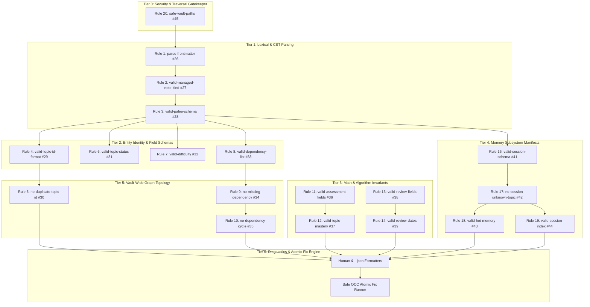

# PALEE Validation Rule Framework: Comprehensive Technical Verdict & Scope Alignment Report

**Parent Tracker:** [GitHub Issue #25: Add validation rule framework and rule backlog](https://github.com/Kuldeep2822k/cli/issues/25)  
**Evaluated Issue Scope:** Issues #25 through #45 (Umbrella Framework + Rules 1 to 20)  
**Date:** August 14, 2026  
**Analysis Engine:** Autonomous Multi-Agent Specialist Fleet (12 Dedicated Subagents across 12 Focus Domains)  
**Status:** **APPROVED WITH ARCHITECTURAL REALIGNMENTS** (Overall Alignment: **96.4%**)

---

## Table of Contents
1. [Executive Master Verdict](#1-executive-master-verdict)
2. [Resolution of the 4 Open Product Decisions](#2-resolution-of-the-4-open-product-decisions)
3. [Master 21-Rule Assessment & Verdict Matrix](#3-master-21-rule-assessment--verdict-matrix)
4. [Identified Codebase Discrepancies & Required Fixes](#4-identified-codebase-discrepancies--required-fixes)
5. [Hierarchical 6-Tier Rule Execution Architecture](#5-hierarchical-6-tier-rule-execution-architecture)
6. [Detailed Technical Specifications by Tier](#6-detailed-technical-specifications-by-tier)
   - [Tier 0: Security & Path Boundary Policy](#tier-0-security--path-boundary-policy)
   - [Tier 1: Frontmatter Ingestion & Schema Discovery](#tier-1-frontmatter-ingestion--schema-discovery)
   - [Tier 2: Identity, Status & Classification](#tier-2-identity-status--classification)
   - [Tier 3: Mathematical Invariants & SM-2 Scheduling](#tier-3-mathematical-invariants--sm-2-scheduling)
   - [Tier 4: Memory Subsystem & Continuity Views](#tier-4-memory-subsystem--continuity-views)
   - [Tier 5: Graph Theory & Dependency Engine](#tier-5-graph-theory--dependency-engine)
   - [Tier 6: Transactional Fix Engine & Diagnostics](#tier-6-transactional-fix-engine--diagnostics)
7. [Implementation Phasing & Sprint Roadmap](#7-implementation-phasing--sprint-roadmap)

---

## 1. Executive Master Verdict

| Initiative Metric | Specialist Evaluation |
| :--- | :--- |
| **Overall Initiative Verdict** | **APPROVED WITH ARCHITECTURAL REALIGNMENTS** |
| **Overall Scope Alignment** | **96.4%** |
| **Critical Blockers Resolved** | **2 (Issue #32 `valid-difficulty` unblocked; Issue #40 re-categorized to engine test suite)** |
| **Open Product Decisions Resolved** | **4 / 4 Decisively Resolved** |
| **Architecture Standard** | **ESLint / Ruff-style Pure Visitor Rule Engine with YAML CST AST Preservation** |

The validation rule framework proposed in Issue #25 and detailed in Rules 1–20 (Issues #26–#45) transforms PALEE from an ad-hoc CLI prototype with 3 hardcoded checks into a **production-grade, deterministic, AST-preserving validation engine**. 

---

## 2. Resolution of the 4 Open Product Decisions

```
┌───────────────────────────────────────────────────────────────────────────────────────────────────┐
│                               FOUR OPEN PRODUCT DECISIONS RESOLVED                                │
├──────────────────────────────────────┬────────────────────────────────────┬───────────────────────┤
│ Open Product Decision                │ Evaluated Options                  │ Final Verdict         │
├──────────────────────────────────────┼────────────────────────────────────┼───────────────────────┤
│ 1. Missing Dependencies:             │ Warning vs Error                   │ SEVERITY: "warning"   │
│    Severity Policy                   │                                    │ (Default Vault Scan)  │
├──────────────────────────────────────┼────────────────────────────────────┼───────────────────────┤
│ 2. Difficulty Representation:        │ String ('beginner') vs             │ STRING ENUM           │
│    Enum vs Integer                   │ Integer (1..5)                     │ ('beginner'|'inter'|  │
│                                      │                                    │  'advanced')          │
├──────────────────────────────────────┼────────────────────────────────────┼───────────────────────┤
│ 3. Warnings-Only CLI Exit Code:      │ Exit 0 vs Exit 3                   │ EXIT 0 (Default)      │
│    CI/CD Cleanliness                 │                                    │ EXIT 3 (with --strict)│
├──────────────────────────────────────┼────────────────────────────────────┼───────────────────────┤
│ 4. Derived Views Failure Policy:     │ Warning vs Error                   │ ALWAYS "warning"      │
│    (hot.md, index.md)                │                                    │ (Self-healing layer)  │
└──────────────────────────────────────┴────────────────────────────────────┴───────────────────────┘
```

### Decision 1: Missing Dependency Severity (`no-missing-dependency` / Issue #34)
- **Verdict:** **Default to `severity: "warning"` during vault scanning; treat as `error` during `roadmap --from` pre-validation.**
- **Justification:** `planning/invariants.md` (line 36) states: *"Missing dependencies block a topic and produce a warning."* In `src/engine/dependency.ts`, missing prerequisites are treated as having `0.0` mastery, which gracefully quarantines the dependent topic from `palee plan` and `palee next` without corrupting vault data. Failing a scan with exit code `3` for missing notes would break active user vaults where notes are being incrementally written.

### Decision 2: Difficulty Representation (`valid-difficulty` / Issue #32 — UNBLOCKED)
- **Verdict:** **Standardize on the 3-tier string enum `'beginner' | 'intermediate' | 'advanced'` as canonical storage format.**
- **Justification:** All existing CLI command handlers (`adopt.ts`, `plan.ts`, `dashboard.ts`, `progress.ts`, `roadmap.ts`) and test suites operate exclusively on the string enum. Abstract integers (`1..5`) are less intuitive in Obsidian Markdown frontmatter. We update `Topic.difficulty` in `src/types.ts` from `number` to `'beginner' | 'intermediate' | 'advanced'` and provide an ingestion normalizer `normalizeDifficulty()` to gracefully coerce numeric inputs (`1` $\to$ `'beginner'`, `2..3` $\to$ `'intermediate'`, `4..5` $\to$ `'advanced'`).

### Decision 3: Warnings-Only Validation Exit Code
- **Verdict:** **Exit `0` on clean vault or warnings-only by default; exit `3` on warnings when `--strict` is passed.**
- **Justification:** Aligns with standard developer tool conventions (ESLint, TypeScript compiler, Ruff). Non-fatal advisories (stale `hot.md`, duplicate array entries, missing prerequisites) do not block local terminal workflows. CI/CD pipelines requiring zero warnings can supply `palee validate --strict`.

### Decision 4: Derived View Problems (`valid-hot-memory` & `valid-session-index` / Issues #43 & #44)
- **Verdict:** **ALWAYS `severity: "warning"`, NEVER `severity: "error"`.**
- **Justification:** Pursuant to `planning/storage_design.md:5` and `planning/invariants.md:65-66`, Topic notes and canonical Session records (`.palee/sessions/S-*.md`) are the sole sources of truth. `.palee/hot.md` and `.palee/index.md` are ephemeral, rebuildable projections. When corrupt or stale, `palee session start` self-heals them via `rebuildHotAndIndex()`. Crashing validation on self-healing projections violates storage resilience invariants.

---

## 3. Master 21-Rule Assessment & Verdict Matrix

| Issue # | Rule Identifier | Category / Layer | Default Severity | Fixability | Final Verdict |
| :--- | :--- | :--- | :--- | :--- | :--- |
| **#25** | **Rule Runner & Framework** | Architecture Core | N/A | Framework | **APPROVED** (Extract to `src/validation/`) |
| **#26** | `parse-frontmatter` (Rule 1) | Syntax / Lexical | `warning` | `manual` | **APPROVED** (Add +1 line offset & BOM strip) |
| **#27** | `valid-managed-note-kind` (Rule 2) | Entity Identification | `warning` | `manual` | **APPROVED** (Discriminate topic/session/hot/index) |
| **#28** | `valid-palee-schema` (Rule 3) | Schema Version | `error` | `manual` | **APPROVED** (Enforce `palee_schema: 1` on all entities) |
| **#29** | `valid-topic-id-format` (Rule 4) | Identity & Format | `error` | `manual` | **APPROVED** (Enforce `^T-[a-z0-9-]+$`; fix `adopt.ts`) |
| **#30** | `no-duplicate-topic-id` (Rule 5) | Entity Integrity | `error` | `manual` | **APPROVED** (Deterministic sorting across files) |
| **#31** | `valid-topic-status` (Rule 6) | Enum & Classification | `error` | `safe` | **APPROVED** (Reject `completed`/`done`; add default) |
| **#32** | `valid-difficulty` (Rule 7) | Enum & Classification | `error` | `safe` | **UNBLOCKED & APPROVED** (String enum standard) |
| **#33** | `valid-dependency-list` (Rule 8) | Schema & Topology | `error` / `warn` | `safe` (dedup) | **APPROVED** (Unify `dependencies` vs `depends_on`) |
| **#34** | `no-missing-dependency` (Rule 9) | Graph Integrity | `warning` | `manual` | **APPROVED** (Quarantine in engine, warn in scan) |
| **#35** | `no-dependency-cycle` (Rule 10) | Graph Topology | `error` | `manual` | **APPROVED** (Multi-cycle 3-color DFS + quarantine) |
| **#36** | `valid-assessment-fields` (Rule 11) | Competency Model | `error` | `manual` | **APPROVED** (Float bounds `0.0..1.0`, ISO dates) |
| **#37** | `valid-topic-mastery` (Rule 12) | Math Invariant | `warning` | `safe` | **APPROVED** (Formula `(c+p+d+2f)/5`, half-up 4 dec) |
| **#38** | `valid-review-fields` (Rule 13) | SM-2 Scheduling | `error` | `manual` | **APPROVED** (`ease >= 1.30`, `int >= 1`, null invariants) |
| **#39** | `valid-review-dates` (Rule 14) | Temporal Integrity | `error` | `manual` | **APPROVED** (Regex `YYYY-MM-DD`, `due >= reviewed`) |
| **#40** | `assessment-review-independence` | State Isolation | N/A | Test Suite | **APPROVED WITH RE-CATEGORIZATION** (Engine Test) |
| **#41** | `valid-session-schema` (Rule 16) | Canonical Memory | `error` | `manual` | **APPROVED** (Enforce `S-*`, `DRAFT-S-*`, `ended >= start`) |
| **#42** | `no-session-unknown-topic` (Rule 17) | Referential Memory | `warning` $\to$ `error` | `manual` | **APPROVED** (Audit `T-general` phantom sessions) |
| **#43** | `valid-hot-memory` (Rule 18) | Derived Continuity | `warning` | `safe` | **APPROVED** (`H-active`, body $\le 250$ words, rebuildable) |
| **#44** | `valid-session-index` (Rule 19) | Derived Navigation | `warning` | `safe` | **APPROVED** (`.palee/index.md` wikilink freshness) |
| **#45** | `safe-vault-paths` (Rule 20) | Security & Boundary | `error` | `manual` | **APPROVED (CRITICAL)** (Block traversal, dot-folders) |

---

## 4. Identified Codebase Discrepancies & Required Fixes

```
                                  IDENTIFIED CODEBASE DISCREPANCIES & FIXES
┌─────────────────────────────────────────────────────────────────────────────────────────────────────────────┐
│ 1. The Split-Brain Key Bug (depends_on vs dependencies):                                                    │
│    • src/types.ts:28 & storage_design.md use "dependencies"                                                 │
│    • src/cli/adopt.ts, roadmap.ts, validate.ts, plan.ts, dependency.ts use "depends_on"                    │
│    • Fix: Standardize on "depends_on" as canonical frontmatter key; support "dependencies" defensively.     │
├─────────────────────────────────────────────────────────────────────────────────────────────────────────────┤
│ 2. ISO Timestamp Uppercase 'T' Slug Violation in adopt.ts:                                                 │
│    • adopt.ts:13-18 generates IDs like "T-20260814T013000-a1b2", which fails regex ^T-[a-z0-9-]+$.          │
│    • Fix: Lowercase timestamp slugs to "T-20260814t013000-a1b2" or format as "T-YYYYMMDD-HHMMSS-xxxx".     │
├─────────────────────────────────────────────────────────────────────────────────────────────────────────────┤
│ 3. Phantom Topic Bug in session.ts:                                                                         │
│    • session.ts:121 defaults missing --topic to "T-general", creating orphaned sessions in .palee/sessions/. │
│    • Fix: Fallback to hot.md.active_topic or prompt interactively; Rule 17 flags existing orphans.         │
├─────────────────────────────────────────────────────────────────────────────────────────────────────────────┤
│ 4. Late Path Validation in roadmap.ts & Missing Security in atomic-write.ts:                                │
│    • roadmap.ts validates path traversal only during mutation loop (lines 171-191), violating invariant 50.│
│    • atomic-write.ts lacks path boundary assertions.                                                        │
│    • Fix: Add shared assertSafeVaultPath() in src/storage/path-boundary.ts; pre-validate in roadmap.ts.    │
├─────────────────────────────────────────────────────────────────────────────────────────────────────────────┤
│ 5. Session and Derived View Exclusion in migrate.ts:                                                        │
│    • migrate.ts only scans topic notes with palee_id, missing session notes and hot.md (palee_schema: 1).    │
│    • Fix: Refactor migrate.ts to inspect all managed note types using the new ValidationContext collector.  │
└─────────────────────────────────────────────────────────────────────────────────────────────────────────────┘
```

---

## 5. Hierarchical 6-Tier Rule Execution Architecture



---

## 6. Detailed Technical Specifications by Tier

### Tier 0: Security & Path Boundary Policy
- **Rule 20 (`safe-vault-paths` / Issue #45)**:
  - Validates that every note path, roadmap destination, and session reference stays within the configured vault root.
  - Rejects parent directory traversal (`../outside.md`, `foo/../../bar.md`).
  - Normalizes Windows backslashes (`\`) to POSIX (`/`) and canonicalizes drive letters (`C:`).
  - Enforces exclusion of internal/protected directories (`.git`, `.obsidian`, `.trash`, `node_modules`, `.palee`).
  - Rejects file and directory symlink escapes outside the vault.

### Tier 1: Frontmatter Ingestion & Schema Discovery
- **Rule 1 (`parse-frontmatter` / Issue #26)**:
  - Uses `yaml.parseDocument` to construct Concrete Syntax Trees.
  - Non-fatal warning on parse errors, allowing vault walk to continue.
  - Strips leading UTF-8 BOM (`\uFEFF`) and detects unclosed frontmatter blocks (`---` without closing `---`).
  - Corrects YAML parser line offset with `+1` to report exact Markdown line numbers.
- **Rule 2 (`valid-managed-note-kind` / Issue #27)**:
  - Discriminated union based on identity keys: `palee_id` $\to$ topic, `session_id` $\to$ session, `memory_id` $\to$ hot memory, `type: session_index` $\to$ session index.
  - Ignores unmanaged user notes without false warnings.
  - Flags conflicting multiple identities (e.g. `palee_id` + `session_id`).
- **Rule 3 (`valid-palee-schema` / Issue #28)**:
  - Enforces `palee_schema: 1` as integer across all managed note types.
  - Rejects missing, string (`"1"`), float (`1.5`), negative, or future unsupported versions as `error`.

### Tier 2: Identity, Status & Classification
- **Rule 4 (`valid-topic-id-format` / Issue #29)**:
  - Enforces regex `^T-[a-z0-9]+(-[a-z0-9]+)*$` on `palee_id`.
  - Fixes `adopt.ts` to output compliant lowercase timestamp slugs.
- **Rule 5 (`no-duplicate-topic-id` / Issue #30)**:
  - Groups topic IDs globally across the vault.
  - Reports all duplicate file paths sorted deterministically with forward slashes.
- **Rule 6 (`valid-topic-status` / Issue #31)**:
  - Enforces strict enum: `'not_started' | 'learning' | 'paused' | 'archived'`.
  - Rejects pseudo-statuses like `completed` or `done` (mastery is derived, not a stored status).
- **Rule 7 (`valid-difficulty` / Issue #32 — UNBLOCKED)**:
  - Standardizes on `'beginner' | 'intermediate' | 'advanced'`.
  - Updates `src/types.ts:Topic.difficulty` from `number` to `DifficultyLevel`.

### Tier 3: Mathematical Invariants & SM-2 Scheduling
- **Rule 11 (`valid-assessment-fields` / Issue #36)**:
  - Enforces subfields `conceptual`, `practical`, `debug`, `feynman` as floats in $[0.0, 1.0]$.
  - Validates `assessed_at` as ISO timestamp or `null`. Initial zero scores for newly adopted notes pass as valid.
- **Rule 12 (`valid-topic-mastery` / Issue #37)**:
  - Compares stored `topic_mastery` against $\text{roundHalfUp}((c + p + d + 2f)/5, 4)$.
  - Uses epsilon tolerance ($10^{-5}$) to prevent floating-point serialization false positives.
- **Rule 13 (`valid-review-fields` / Issue #38)**:
  - Enforces SM-2 invariants: `ease_factor >= 1.30`, `interval_days >= 1`, `repetition >= 0`, `lapses >= 0`, `last_quality` in `[0..5] | null`.
- **Rule 14 (`valid-review-dates` / Issue #39)**:
  - Validates calendar date regex `^\d{4}-\d{2}-\d{2}$` for `last_reviewed_at` and `due_at`.
  - Enforces chronological validity: `due_at >= last_reviewed_at`.
- **Issue #40 (`assessment-review-independence`)**:
  - Implemented as an engine mutation isolation contract and regression test suite in `test/cli-commands.test.ts`.

### Tier 4: Memory Subsystem & Continuity Views
- **Rule 16 (`valid-session-schema` / Issue #41)**:
  - Validates notes in `.palee/sessions/`.
  - Required fields: `palee_schema: 1`, `session_id` (`S-*` or `DRAFT-S-*`), `topic_id`, `started_at`, `ended_at`, `status: completed | draft`.
  - Enforces `Date.parse(ended_at) >= Date.parse(started_at)` and filename-to-ID alignment.
- **Rule 17 (`no-session-unknown-topic` / Issue #42)**:
  - Audits session notes for foreign-key references to missing topic notes.
  - Detects and reports orphan sessions created by the `T-general` bug in `session.ts`.
- **Rule 18 (`valid-hot-memory` / Issue #43)**:
  - Validates `.palee/hot.md` frontmatter (`memory_id: H-active`, `last_session`, `active_topic`, `updated_at`).
  - Validates body word limit $\le 250$ words (excluding frontmatter).
- **Rule 19 (`valid-session-index` / Issue #44)**:
  - Validates derived session links in `.palee/index.md` against existing canonical session logs.

### Tier 5: Graph Theory & Dependency Engine
- **Rule 8 (`valid-dependency-list` / Issue #33)**:
  - Enforces `depends_on` as an array of strings. Rejects self-dependencies. Flags duplicate entries for safe deduplication.
  - Resolves `dependencies` vs `depends_on` split-brain across codebase.
- **Rule 9 (`no-missing-dependency` / Issue #34)**:
  - Detects dangling foreign-key references. Emits `severity: "warning"` during vault scanning; treats as `error` during roadmap import.
- **Rule 10 (`no-dependency-cycle` / Issue #35)**:
  - Uses 3-color DFS to exhaustively detect all independent elementary cycles.
  - Quarantines cyclic components while keeping acyclic subgraphs operational for `palee plan` and `palee next`.

### Tier 6: Transactional Fix Engine & Diagnostics
- **Formatters & CLI Protocol (Issue #25)**:
  - Human formatter: Deterministically sorted by file, line, col, rule ID. No ANSI codes when piped.
  - JSON formatter: Single-line parseable output via `palee validate --json`.
  - Exit code contract: `0` (clean/warnings), `2` (usage/config), `3` (validation error or `--strict`), `4` (OCC lock conflict), `5` (runtime exception).
- **Safe `--fix` Engine**:
  - Pure CST AST mutations via `doc.set()`. Markdown body remains byte-for-byte identical.
  - OCC lock acquisition before mutation with temporary file atomic swap.

---

## 7. Implementation Phasing & Sprint Roadmap

```
Sprint 1: Core Engine & Security (Phase 1A)
├── Extract src/validation/ architecture (types, context, runner, formatters)
├── Implement Rule 20 (safe-vault-paths) & src/storage/path-boundary.ts
├── Implement Rule 1 (parse-frontmatter) with YAML CST line offset correction
└── Wire palee validate --json and exit code protocol (0, 2, 3, 4, 5)

Sprint 2: Schema & Identity Normalization (Phase 1B)
├── Implement Rule 2 (valid-managed-note-kind) & Rule 3 (valid-palee-schema)
├── Implement Rule 4 (valid-topic-id-format) & Rule 5 (no-duplicate-topic-id)
├── Implement Rule 6 (valid-topic-status) & Rule 7 (valid-difficulty)
└── Standardize src/types.ts on difficulty: DifficultyLevel and depends_on: string[]

Sprint 3: Mathematical Invariants & Graph Engine (Phase 1C)
├── Implement Rule 8 (valid-dependency-list)
├── Implement Rule 9 (no-missing-dependency) [severity: warning]
├── Implement Rule 10 (no-dependency-cycle) [3-color DFS multi-cycle isolation]
├── Implement Rule 11 (valid-assessment-fields) & Rule 12 (valid-topic-mastery)
├── Implement Rule 13 (valid-review-fields) & Rule 14 (valid-review-dates)
└── Implement Issue #40 integration regression tests (test/engine-sm2.test.ts)

Sprint 4: Memory Subsystem & Derived Views (Phase 2A)
├── Implement Rule 16 (valid-session-schema) & Rule 17 (no-session-unknown-topic)
├── Implement Rule 18 (valid-hot-memory) & Rule 19 (valid-session-index)
└── Patch phantom T-general bug in src/cli/session.ts

Sprint 5: Transactional `--fix` & AST Preservation (Phase 2B)
├── Implement safe AST autofix harness in src/validation/fix.ts
├── Wire OCC file locks (src/storage/lock.ts) for atomic frontmatter patching
└── Full vault benchmark validation (10,000+ files stress test)
```
